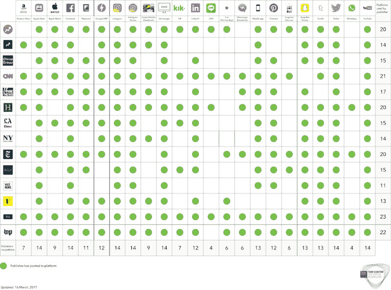
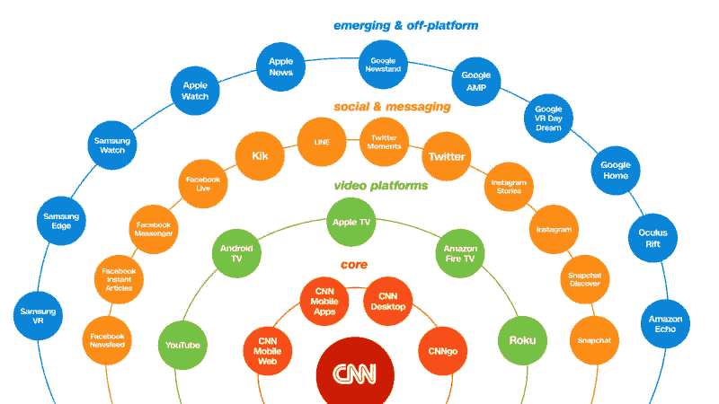
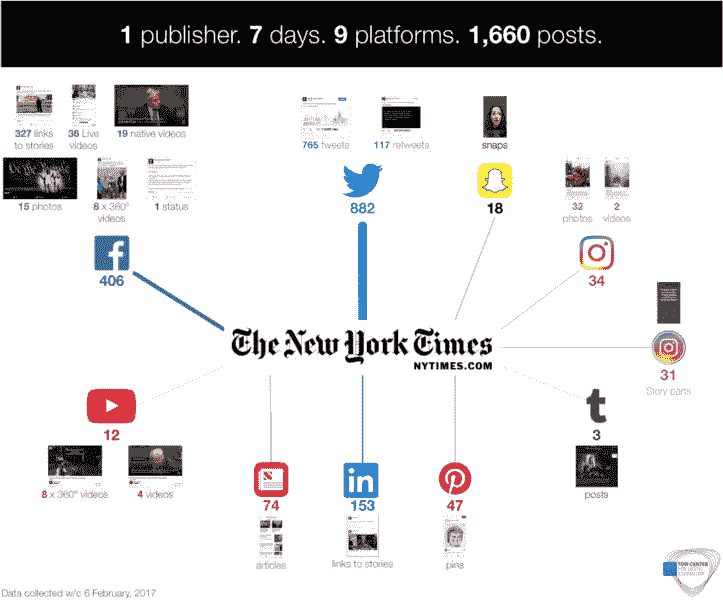
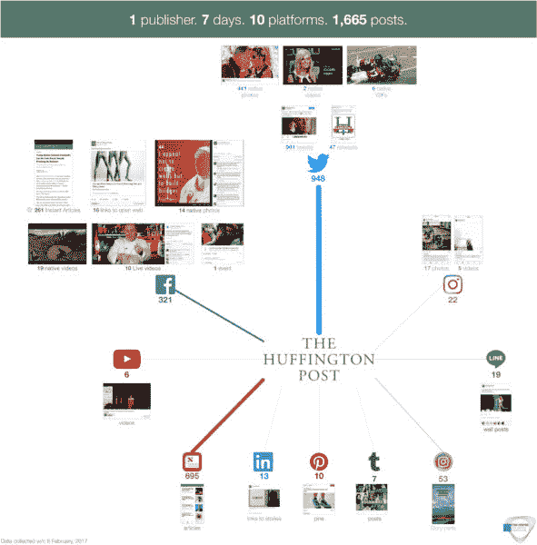
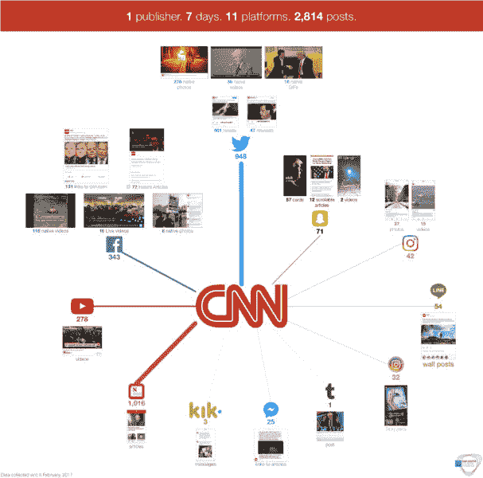
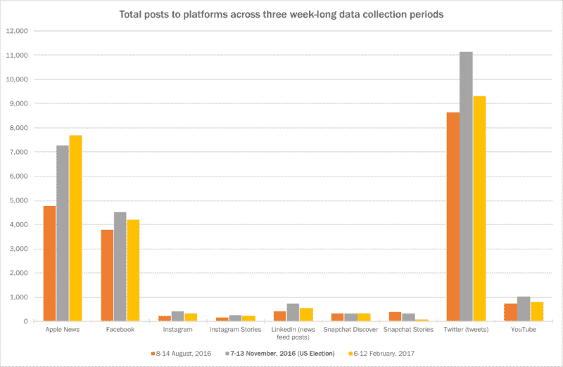
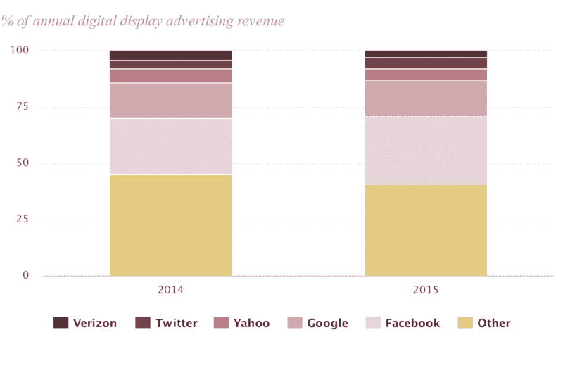
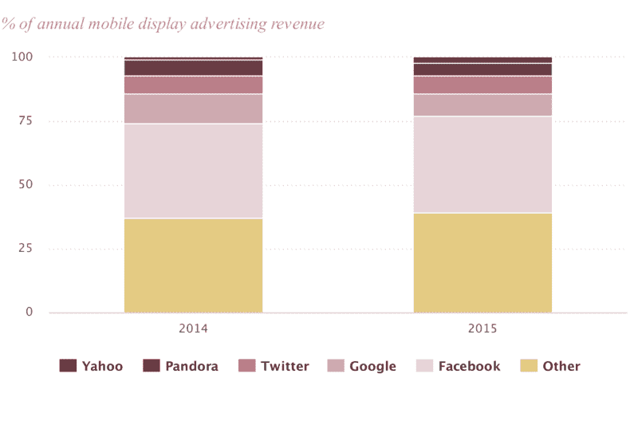
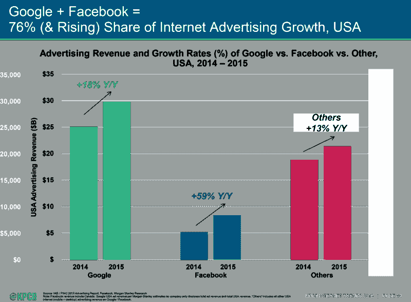

# 平台新闻:硅谷如何再造新闻业——哥伦比亚新闻评论

> 原文：<http://www.cjr.org/tow_center_reports/platform-press-how-silicon-valley-reengineered-journalism.php?utm_source=wanqu.co&utm_campaign=Wanqu+Daily&utm_medium=website>

社交媒体平台和科技公司对美国新闻业的影响甚至超过了从印刷到数字的转变。包括脸书、Snapchat、谷歌和 Twitter 在内的公司正在迅速取代传统出版商的角色，而且没有放缓的迹象，这引发了如何支撑新闻成本的严重问题。这些公司已经超越了它们作为分销渠道的角色，现在控制着观众能看到什么，谁能从他们的关注中获得报酬，甚至控制着新闻业繁荣的形式和类型。

尽管无法保证持续的投资回报，但出版商仍在继续将更多的新闻业务推向第三方平台。出版不再是某些新闻机构的核心活动。随着新闻公司放弃更多出版商的传统职能，这一趋势将继续下去。

这份报告是哥伦比亚新闻学院 Tow 数字新闻中心正在进行的一项研究的一部分，它描绘了新闻业和平台公司之间的融合。在 20 年的时间里，新闻业经历了商业和发行模式的三次重大变化:从模拟到数字的转变，社交网络的兴起，以及现在手机的主导地位。在这最后一个阶段，大型科技公司主导了注意力和广告市场，迫使新闻机构重新思考它们的流程和结构。

**调查结果**

*   技术平台在很短的时间内成为出版商，让新闻机构对自己的未来感到困惑。如果这种融合的速度继续下去，更多的新闻机构可能会停止将发布——发行、托管和货币化——作为核心活动。
*   为出版商发布产品的平台之间的竞争正帮助新闻编辑室接触到比以往任何时候都多的受众。但每个平台的优势难以评估，投资回报不足。品牌的丧失、受众数据的缺乏和广告收入的转移仍然是出版商的主要担忧。
*   社交平台的影响塑造了新闻业本身。通过向新闻机构提供特定类型内容的激励，如直播视频，或者通过设计标准来规定出版商的活动，这些平台显然是编辑性的。
*   2016 年大选的“假新闻”曝光迫使社交平台为发布决定承担更大的责任。然而，这分散了对更大问题的注意力，即社交平台的结构和经济刺激了低质量内容在高质量材料上的传播。具有较高公民价值的新闻——调查权力或触及服务不足的社区和地方社区的新闻——受到一个倾向于规模和可分享性的系统的歧视。
*   平台依靠算法来分类和定位内容。他们不想投资于人工编辑，以避免成本和人类会有偏见的看法。然而，新闻报道的细微差别需要编辑判断，因此平台需要重新考虑他们的方法。
*   平台公司需要更大的透明度和问责制。虽然新闻可能会接触到比以往任何时候都多的人，但观众第一次无法知道新闻是如何或为什么接触到他们的，收集到的关于他们的数据是如何使用的，或者他们的在线行为是如何被操纵的。出版商正在生产比以往更多的内容，却不知道它到达了谁的手中或者如何到达——他们受到算法的支配。

在选举之后，我们有一个直接的机会将对科技力量和新闻业的关注转化为行动。直到最近，平台(尤其是脸书)的默认立场一直是避免作为出版商的昂贵责任和义务。以脸书和谷歌为首的平台公司一直在积极主动地发起倡议，专注于改善新闻环境和新闻素养问题。然而，更多的结构性问题仍未得到解决。

如果新闻机构要在未来保持自主实体的地位，信息消费趋势和广告支出必须逆转，或者科技公司和广告商的财富必须大幅转移。一些出版商正在经历“特朗普冲击”，选举后订阅和捐款增加，有证据表明，大型和小众出版商都在重新努力从中介平台业务中建立受众和收入流。然而，现在判断这是系统性变化还是周期性波动还为时过早。

Sign up for CJR's <nobr>daily email</nobr>

新闻机构面临着严峻的困境。他们是否应该继续维护自己的出版基础设施这一成本高昂的业务，拥有更少的受众，但完全控制收入、品牌和受众数据？或者，他们应该放弃对用户数据和广告的控制，以换取脸书或其他平台带来的显著观众增长吗？我们描述了出版商如何通过内容分析和采访来管理这些权衡。

虽然网上错误信息的传播成为今年的一个全球故事，但我们认为它代表了关于公共领域商业化和私人控制的更广泛问题。

*[点击此处获取 PDF 格式的完整报告。](https://towcenter.org/wp-content/uploads/2017/04/The_Platform_Press_Tow_Report_2017.pdf)T3
T5】*

### 西瓜走向民主

> 他们是出版商。他们以多种方式控制观众。..他们是通向观众的大门，他们决定他们允许什么，不允许什么。这是他们的世界。
> —Kim Lau，高级副总裁&*大西洋*业务发展主管

2016 年 4 月，在旧金山一个迎风的码头上，数千名工程师和高管涌入梅森堡会议中心，参加一年一度的脸书开发者大会。在媒体电影院里，没有多余的座位。来自美国和世界各地的媒体高管挤在过道里，希望听到脸书将如何帮助他们从内容中赚钱。

在台上，BuzzFeed 的创始人乔纳·佩雷蒂(Jonah Peretti)和脸书的联合创始人兼公司产品总监克里斯·考克斯(Chris Cox)讨论了社交网络上“什么管用”的最佳例子。答案是，两名 BuzzFeed 员工在一个西瓜上绑了橡皮筋，直到它在脸书直播视频中爆炸。在巅峰时期，[西瓜实验有 807，000 名现场观众同时观看](https://www.buzzfeed.com/brendanklinkenberg/this-exploding-watermelon-was-facebook-lives-biggest-hit-to?utm_term=.ve4YNX7ew#.qyqL7zBQZ)。这被认为是出版商通过脸书创新致富的新机会。房间里的许多人可能对西瓜感同身受，因为他们的企业正被超出他们控制的外力慢慢挤压到崩溃的边缘。这些力量之一就是脸书本身。

七个月后，在脸书爆炸的不仅仅是西瓜。2016 年美国总统大选出乎意料的结果公布一周后，BuzzFeed 媒体编辑克雷格·西尔弗曼(Craig Silverman)披露了一系列故事，揭露了误导性消息在选举周期中如何在社交媒体上传播，主要是在脸书。从加利福尼亚到马其顿，大规模生产假新闻的网站层出不穷。西尔弗曼的报告表明，在 2016 年大选前的几个月里，来自自由日报等网站的帖子的赞数和分享数平均比来自 CNN 等主流新闻媒体的帖子高近 19 倍。

在这部关于新闻业正在消失的商业模式的恐怖电影中，假新闻丑闻就相当于房子里的电话铃声。人们希望社交媒体和新闻业的融合会创造出一个更好的版本或者两者的混合体；一个由有用和及时的信息组成的丰富的网络，可以被高度参与的人群容易地扩充、共享和评论。相反，两个世界最糟糕的因素结合在一起，污染了旧媒体和新媒体。

不真实、夸大和极端党派性的信息不受限制的病毒式传播，正在迫使人们就新闻机构和社交媒体平台的权利和责任展开一场早该进行的辩论。随着优秀新闻成为社交媒体的一个子集，捍卫其独立性对出版商和平台来说都是一项至关重要的任务。

2016 年底，受到脸书围绕“假新闻”的负面宣传的打击，马克·扎克伯格放弃了他的创作“只是一家技术公司”的僵硬立场，承认这是一种“新型平台”

包括苹果、谷歌、Snapchat、Twitter 以及最重要的脸书在内的科技公司已经承担了新闻机构的大部分职能，成为新闻生态系统中的关键角色，不管它们是否希望扮演这一角色。信息的分发和呈现、出版的货币化以及与受众的关系都被少数几个平台所主导。这些企业可能关心新闻业的健康，但这不是它们的核心目的。

新闻出版商正在努力理解如何与这些强大的行业新势力合作。智能手机的快速普及已经改变了媒体消费，使技术公司及其应用和操作系统成为新的信息守门人。根据 2016 年皮尤[数据](https://www.pewinternet.org/fact-sheet/mobile/)，92%的 18 至 29 岁的美国年轻人拥有智能手机，总人口的 77%拥有智能手机——高于家里有宽带连接的人数。超过 62%的美国人从某种形式的社交媒体获取新闻，脸书是主要来源。人们看屏幕的时间长度和这些公司收集的大量个人数据创造了一个全新的运营环境，新闻业现在必须在这个环境中运作。

社交媒体和搜索公司不是纯粹的中立平台，而是事实上编辑或“策划”它们所呈现的信息。平台方面已经开始认识到自己在新闻提供中的作用。但编辑判断的运用使他们的商业使命变得复杂:让尽可能多的人尽可能经常地使用他们的平台。这一发展中角色的内在矛盾导致了战略的快速转变和逆转。例如，2016 年 8 月，脸书解雇了 30 名编辑或“策展人”，以反击有关该公司不公平地编辑趋势话题以压制保守新闻媒体报道的报道。此后不久，关于“假新闻”的报道表明，该公司应该在其平台上进行更多而不是更少的直接编辑干预。

即使在上一次选举周期的“假新闻”丑闻之后，马克·扎克伯格仍坚持认为脸书“必须极其谨慎，不要成为真理的仲裁者”相反，该公司与几家事实核查和新闻机构建立了合作伙伴关系，以标记可疑的故事。它的合伙人被认为没有得到报酬。

作为民主社会中的一支独立力量，新闻业和新闻机构正处于其历史的关键时刻。通过手指滑动接触全球观众的机会就在这里，它提供了尚未完全理解的巨大新闻可能性。但是通过社交网络和移动电话的超连通性创造了一个巨大的信息市场，而新闻业只是其中的一小部分。新闻的本质没有改变；它仍然是关于报道故事和添加背景来帮助解释世界。但现在它是通过一个为规模、速度和收入而构建的系统来实现的。

这些平台的商业模式刺激了“病毒式传播”——人们想要分享的材料——这与新闻质量无关。使新闻机构能够在社交平台上触及受众的架构也不利于它们的可持续性。

准确信息的普遍获取是运转良好的民主的核心，而这种获取现在是由硅谷非常强大但基本上不负责任的技术公司塑造的。尽管信息市场仍在快速发展，但我们有机会为新闻业创造一个更强大、更透明的模式。

### 新闻业的第三次浪潮

社交媒体对新闻业的影响是行业历史上最大的剧变。

在新闻编辑室网络发展的第一阶段——大致从 1994 年商业互联网的出现延伸到 2004 年宽带的广泛使用——新闻机构主要关心的是如何将印刷产品传输到互联网上。在许多传统组织中，围绕这一转变存在很大的不确定性，但除此之外，新的数字生态系统有望建立在传统的新闻价值观和方法上，其中的金融模式支持甚至围绕自由媒体的核心问责和公民职能进行创新。

在接下来的十年里，宽带和 Web 2.0 技术的广泛应用使得在任何地方发布多媒体材料成为可能。互动新闻、文章评论、播客和众包都为新闻业提供了令人兴奋的机会。像 DC 凶杀观察这样的小网站赢得了奖项，因为他们展示了利用数据库和两个人的团队来构建和讲述故事的力量。记者们合作开发了全新的工具，比如公共文档托管网站 Document Cloud。2007 年，第一代 iPhone 发布，接触新用户的机会进一步增加。

互联网的出现，以及最初支撑互联网的开放网络原则，将控制权从少数人手中夺走，转移给了多数人。它的核心和设计是一种大众化的技术。

在此期间，美国涌现出大量新的网站和服务。从专注于全国的玩家，如赫芬顿邮报、ProPublica、Business Insider、Quartz、BuzzFeed 等，到本地创新者，如德克萨斯论坛报、Patch、 *Deseret News* 等。像 CNN、BBC、*《纽约时报》*和**《华盛顿邮报》*这样的大型传统组织处于不断变革的状态，取得了不同程度的成功。*

 *虽然这一时期经历了巨大的实验，但财务状况不容乐观。在 20 世纪的大部分时间里，新闻业一直由三个主要收入来源支撑，但都被互联网削弱了。分类广告和展示广告分别被 Craigslist 和 Google 颠覆，数字产品的订阅也很难产生。这三种趋势相互加剧:必要的数字转型和实验因依赖缓慢下降但仍很重要的印刷发行收入而停滞不前。

这不仅降低了广告商的成本和出版商的收入。它还打破了行业的垂直整合，这种整合通过特权和高成本的分销系统保证了受众的接触。在开放网络中，曾经将行业捆绑在一起的属性——相对较小且连贯的企业集团之间方法的相似性，以及该集团之外的任何人都无法生产有竞争力的产品——不再存在。

虽然这种双重转变——在新闻制作和资金方面——对老牌新闻机构具有很大的破坏性，但它也被许多人视为新闻实践中的一种积极发展。互联网的公民设计和新闻业的公民目的最终是一致的。

现在我们正在经历第三次技术变革浪潮。从台式电脑到小屏幕智能手机的转变，以及私有化移动网络的发展，将开放网络的前景封闭并货币化。为公民和记者带来希望的开放网络的原则，已经让位于由少数平台公司主导的生态系统，这些公司对我们的所见所闻有着巨大的影响。我们今天看到的互联网，主要由两三家公司控制，与蒂姆·伯纳斯·李的开放网络相去甚远。

仅在过去两年中，新闻业务与脸书、Twitter、Snapchat 和谷歌等社交平台之间的整合已经加速。在全球范围内，有超过 40 个不同的社交媒体网站和消息应用程序，新闻发布者可以通过它们接触到部分受众。脸书以前所未有的规模运作。在新闻史上，没有哪家出版商对世界新闻消费有如此大的影响力。

出版权力的重新捆绑可以说是新闻机构大规模撤资的原因。根据皮尤 2016 年的数据，威瑞森、推特、雅虎、谷歌和脸书占据了所有数字广告收入的 65%以上。 [Digital Content Next](https://digitalcontentnext.org/blog/2016/06/16/google-and-facebook-devour-the-ad-and-data-pie-scraps-for-everyone-else/) 报道称，2015 年数字广告收入增长的 90%流向了脸书和谷歌。如果没有技术公司的努力，这种变化不会鼓励人们相信平台的封闭环境有利于新闻业的长期健康发展。

这些公司对信息交流的影响往往由隐藏在视野之外的社会技术系统决定，并受到私人利益而非公共利益的驱动。

我们试图利用过去 12 个月进行的 70 多次采访以及四次为期一周的内容分析的新发现，揭示出版商与平台之间融合的动态。(有关我们方法的更多信息，请参见附录 I。)我们还主持了两次私人圆桌会议，每次都有十几名参与者:一次是关注这种关系某些方面的学者和研究人员，另一次是来自商业模式各异的新闻机构的社交媒体经理。我们将研究和本报告(以及附录中的时间表)的重点放在了新闻机构使用最多、影响最大的平台上。

假新闻、过滤泡沫、“后真相社会”以及对媒体信任度的下降正主导着公众辩论。所有这些问题都代表了一个基本问题，即我们的新闻和信息世界是如何被技术变革颠覆的。这份报告是我们对更好地理解这一变化的贡献。

* * *

#### 主要平台发布、公告和收购

*(更完整的清单见附录。)* *随着平台竞相满足尽可能多的出版商的需求，平台之间出版相关开发的频率和类型随着时间的推移而加速。平台更加明确他们与新闻的关系，正式确定他们与出版商的关系，在某些情况下，进入编辑领域。*

2004 年 2 月 2 日:脸书作为哈佛独有的社交网络发布。
**2006 年 7 月 15 日:** Twitter 以 Twttr 的身份发布。“推文”只能是 140 个字符。
**2006 年 9 月 5 日:**脸书新闻源启动，显示来自用户网络的活动。
**2009 年 5 月 1 日:**移动通讯应用 WhatsApp 发布。
**2010 年 10 月 6 日:** Instagram 作为一个基于照片的社交网络发布。
**2011 年 9 月 26 日:** Snapchat 作为一款用于消失消息的移动应用推出。
**2011 年 10 月 12 日:**苹果报刊亭，一款阅读各种出版物的 app，发布。
**2012 年 4 月 9 日:** Instagram 被脸书以 10 亿美元收购。
**2013 年 10 月 3 日:** Snapchat Stories，一个用户的朋友看到的“快照”的汇编，发布。
**2013 年 11 月 20 日:** Google Play 报刊亭，一款阅读各种出版物的 app，发布。
**2014 年 1 月 30 日:**脸书纸和脸书趋势推出。报纸是个性化新闻的一种尝试。趋势是平台热门话题的列表。
**2014 年 2 月 19 日:** WhatsApp 被脸书以 190 亿美元收购。
**2014 年 4 月 24 日:**脸书新闻专线发布。出版商可以将来自脸书的有新闻价值的内容嵌入到自己的材料中，并使用该平台进行新闻采集和讲述故事。
**2014 年 6 月 17 日:**Snapchat Our Story——一个围绕某个事件聚合了众多用户活动的公开故事——发布。
**2015 年 1 月 27 日:** Snapchat Discover 发布。选定的出版商创建了一个每日探索频道，就像一个迷你互动杂志。
**2015 年 3 月 9 日:** Twitter 收购直播视频应用 Periscope。
**2015 年 3 月 31 日:** Twitter 策展人发布。发布者可以根据标签、关键词、位置等搜索和显示推文。
**2015 年 5 月 12 日:** Facebook 即时文章发布会。如果脸书根据文章出售广告，在移动设备上在脸书内更快加载的文章提供了与出版商 70/30 的收入分成。
**2015 年 6 月 8 日:**苹果新闻公布，更换报摊 app70/30 的收入分成，如果苹果销售广告反对内容。2015 年 6 月 22 日:谷歌新闻实验室启动，支持与记者的技术合作。
**2015 年 8 月 5 日:**脸书 Live 推出视频直播。
**2015 年 9 月 23 日:**脸书 360 视频发布会。用户可以移动手机观看视频中的球形视图。
**2015 年 10 月 6 日:** Twitter Moments 发布，提供围绕热门故事的精选推文。
**2015 年 10 月 7 日:** Google AMP 宣布。加速的移动页面将允许出版商的故事更快地从移动搜索结果中加载。
**2015 年 11 月 11 日:**脸书实时通知新闻 app 发布。
**2015 年 11 月 13 日:** Snapchat 官方故事发布会，故事来自经过验证的品牌或影响者。
**2016 年 6 月 9 日:**脸书 360 摄影发布会。用户可以移动他们的手机在一张照片中获得球面视图。
**2016 年 8 月 2 日:**Snapchat Stories 克隆版 Instagram Stories 发布。
**2016 年 11 月 21 日:** Instagram 推出视频直播的 Live Stories。
**2016 年 12 月 12 日:**脸书直播 360°视频发布会，给用户一个视频直播的球形视野。
**2016 年 12 月 20 日:**脸书现场音频发布，支持新闻广播等格式。
**2017 年 1 月 11 日:**脸书新闻项目宣布与出版商就产品推出、讲故事的形式、当地新闻的推广、订阅模式、培训记者，以及与新闻素养项目和事实核查组织的合作展开合作。
**2017 年 2 月 14 日:**脸书电视台宣布:苹果电视和亚马逊 Fire 的一款应用程序，将允许人们在他们的电视上观看脸书视频。

* * *

### 平台成为出版商

在对平台和出版商之间的关系进行了一年多的研究后，很明显，没有哪个编辑部不受大型科技公司的引力影响。脸书、谷歌和其他公司做出的决定现在支配着所有新闻机构的战略，尤其是那些基于广告模式的新闻机构。平台已经在影响新闻机构在新的分布式环境中做得更好或更差。

从 2016 年春天开始，通过内容分析和超过 70 次采访的混合，Tow Center 开始跟踪出版商如何使用社交媒体发布新闻，查看出版商和平台的样本。涵盖的出版商包括传统企业、新的数字出版商和基于视频的新闻机构，业务模式多样，从订阅到基于广告和非营利。

出版商对于如何最好地利用与科技公司的关系仍感到困惑或犹豫不决。越来越多的新闻机构将投资社交平台视为可持续未来的唯一前景，无论是流量还是覆盖范围。但是算法的不透明性使得出版商很难有把握地进行规划。现在有效的不保证将来也有效。

放弃对发行的控制导致了比预期更多的权力从出版商转移到平台。世界上最有争议、最有影响力、最神秘的算法是驱动脸书新闻的算法。尽管出版商可以自由地向脸书发帖，但决定什么能到达读者手中的是算法；《纽约时报》的社交媒体编辑辛西娅·柯林斯说，“我们放弃了太多阅读内容的控制权。”

随着平台竞争的加剧——例如，脸书和 Twitter 都在寻求与出版商达成独家视频交易——以及他们的发布工具的改进，新闻机构在选择合作伙伴时变得更加挑剔。尽管出版商公开质疑将其新闻与平台整合的价值，但我们的数据显示，他们仍在专有系统或“围墙花园”内发布大量文章和视频。出版商可能想脱离这个系统，但很少有人真的这么做。

平台，尤其是脸书，在过去的六个月里戏剧性地改变了他们对新闻出版的态度。脸书以前记者坎贝尔·布朗(Campbell Brown)的身份增加了一位新闻合作伙伴的负责人，主持了一系列研讨会和黑客马拉松，重点是如何让脸书对记者更好，并参与了一项旨在提高公共领域媒体素养问题的积极计划。自选举以来(当该算法被认为(也许是错误地)传递了大量错误信息和“假新闻”，以某种方式影响了政治进程)，第三方服务(如事实核查)出现了一些投资。但目前还没有迹象表明，财富会从科技公司转移到新闻机构。我们的研究描述了四个领域的变化规模:分销和营销、主持和制作、与观众的关系以及货币化。

### 选择的世界——但这是有代价的

> 这是世界上最大的问题:脸书没有花一分钱就买下了三分之二的新媒体公司，因为他们拥有大部分手机。这对脸书很好，但对他们的平台不利。这就是我们试图进入所有平台的原因，因为如果我们能在所有平台上赚钱，那么我们就能远离脸书的遗产。
> 
> 你在给另一家公司你的命运。除非你在这些平台上，否则你就死定了，但如果你在这些平台上，那么你就赚不到钱，所以这就是问题所在，这将是媒体未来最大的挑战。"
> 
> *—*—*—*[*S*](https://adage.com/article/media/candid-shane-smith-sizes-vice-media-industry/304112/)[*哈恩史密斯*](https://adage.com/article/media/candid-shane-smith-sizes-vice-media-industry/304112/) [*副*](https://adage.com/article/media/candid-shane-smith-sizes-vice-media-industry/304112/) 创始人

观众已经转向移动和社交网络，新闻机构别无选择，只能跟随。了解如何接触受众，如何留住他们，以及如何将每篇新闻穿过不同网站和应用程序的复杂迷宫，从根本上改变了新闻编辑室的运作方式。

这张图表展示了出版商正在处理的第三方选项的数量。虽然从平台的角度来看，它可能不像看起来那么有竞争力和多样化，但脸书、Instagram 和 WhatsApp 都是脸书所有的公司。这些选项代表了一系列吸引受众的新机会。或者从另一个角度来看，它们显示了“新闻业在一个图表中的所有错误”，正如信息技术时事通讯的创始人杰西卡·莱辛在推特上说的那样:

我们样本中的 14 家不同的新闻机构如何使用 21 种不同的技术平台。

脸书和谷歌是目前最重要的新闻流量外部推荐网站。根据出版行业监测机构 Parse.ly 的数据，截至 2016 年底，脸书占出版商网站推荐流量的 45%，谷歌占 31%。

CNN 数字版主编梅雷迪思·阿特莉分享了下面的图表，从中可以看出这对出版商来说是什么样的，并影响他们的编辑决策。

她的观点是向出版商展示可供选择的复杂性。图表的中心是 CNN，内圈是新闻网络以数字方式发布的众多不同品牌和专有平台——移动网络、移动应用、桌面和 CNNgo。除此之外，还有一层新的视频平台——YouTube、Android TV、Apple TV、亚马逊 FireTV 和 Roku。然后是社交和消息层——脸书直播、Facebook 即时文章、Facebook Messenger、脸书新闻订阅、Instagram、Twitter、LINE、Kik 和 Snapchat。然后是外环的“新兴和平台外”服务，这延伸了社交平台的概念:虚拟现实、苹果和三星手表、亚马逊 Echo 和谷歌 AMP。

在每一个彩色圆圈的下面，都有一系列不同的决定，关于发布什么，何时发布，以及如何发布。“有时这只是一个人工作的一部分，有时是整个团队，”Artley 说，他有一个超过 50 人的全球团队，致力于为分布式平台编写故事。我们的目标是成为移动视频新闻的第一名——一切都围绕着这个目标。"

组织编辑产品图表。CNN 数码公司提供。

对于新闻机构来说，平衡社会化分发的机会与投资专有平台是一个关键的战略问题。“你必须双管齐下，”纽约时报的首席执行官马克·汤普森说，纽约时报已经把它的可持续性建立在拥有大量潜在订户的基础上。为了培养忠实的读者，*时报*在办公桌上安插他们所谓的成长编辑，并在社交平台上喷洒*时报*的链接。就连 BuzzFeed 也调整了路线，在 2016 年重新推出了主页。BuzzFeed 最初的前提是，它将依靠社交生活，不会花太多时间担心自己网站的展示。总编辑本恩·史密斯在 2017 年的假新闻专题讨论会上说，与预期相反，“主页流量持续上升，因为人们喜欢他们看到的东西，喜欢我们的品牌，并进入主页。”

然而，许多新闻机构的内容有很大一部分是为了在包括苹果新闻、Facebook Instant Articles、Instagram 和 Snapchat 在内的平台上进行本地消费而设计的，而不是将受众重新吸引到出版商的网站上。原生出版产品，包括 Google AMP pages、Facebook Instant Articles、Twitter Moments、Apple News、Snapchat Discover、Instagram Stories，这意味着读者可能会在谷歌上看到来自**经济学家*的一篇报道，而无需接触*经济学家*自己的应用程序或网站。*

 *这张图表显示了发布到社交应用原生页面的文章总数，与社交媒体上链接到其主页的文章数量进行了比较。

*从 2017 年 2 月 6 日开始的一周，我们样本中的 14 个发布者发布的本地(驻留在平台上)和网络(促使受众返回网站)帖子的总数。有关出版商的完整列表，请参见附录 I。*

虽然出版商都需要在广泛的平台上存在，但他们如何分发内容，特别是以原生内容的形式“赠送”给平台的数量，却有很大差异。

例如，比较一下二月份一周内的纽约时报、赫芬顿邮报和 CNN。这一周，这三家出版商都活跃在 10 个不同的平台上。在此期间，《赫芬顿邮报》和《T2 时报》跨平台发布了几乎相同数量的帖子(分别为 1655 条和 1673 条)。

纽约时报在 2017 年 2 月 6 日星期一开始的一周内在平台上发布的帖子。

《赫芬顿邮报》在 2017 年 2 月 6 日周一开始的一周内在平台上发布的帖子。

然而，他们对本地内容和网络内容的使用有很大的不同。原生内容是指完全托管在 Snapchat Discover 或苹果新闻(Apple News)等第三方平台上的内容，而网络内容则是指发布到媒体上的链接，将读者发送到原创者自己的网站。《赫芬顿邮报》三分之二的帖子(66%)是原生格式，包括苹果新闻上的 695 篇文章和 305 篇原生脸书内容(即时文章、直播视频等)。这些脸书本地帖子也占《赫芬顿邮报》脸书帖子总数的 98%。相比之下，跨平台发布的*乘以*的帖子中只有 16%是本地的；剩下的 84%是为了让观众回到 nytimes.com，在那里他们可以免费阅读少量的《T2 时报》新闻，然后才需要付费订阅。自从放弃即时文章后，当时《T4 时报》的 406 篇脸书帖子中只有 79 篇(19%)是该平台上的。只有 74 篇文章发布在苹果新闻上，这是我们在四轮季度数据收集中记录的最低数量。

第三种方法可见于 CNN，它在不同平台上发布了大量的帖子。虽然本地内容的比例(59%)与《赫芬顿邮报》大致相当，但 CNN 战略的突出之处是各种平台上发布的大量帖子。总共 2811 篇文章(比《赫芬顿邮报》和《纽约时报》都高出约 40%)包括 1016 篇关于苹果新闻的文章、948 条推文和 278 个 YouTube 视频。CNN 吸引年轻观众的共同努力也体现在 Snapchat Discover 频道上，在该频道上，我们看到了从 cnn.com 的滚动文章转向更小尺寸的新闻卡片，以及其对聊天应用程序 LINE 的持续承诺。

CNN 在 2017 年 2 月 6 日周一开始的一周内在平台上发布的帖子。

在极端情况下，强调分发的策略产生了 NowThis News，这是一个视频新闻服务，它告诉读者(在其登陆页面上)没有主页:“主页。甚至这个词听起来也很古老。我们将新闻发布到您的社交订阅源中。”平台的拥抱是由出版商的商业模式决定的，在 NowThis 的例子中，是广告和规模。

平台战略因新闻机构的商业模式而异。费城移动新闻平台 Billy Penn 的创始人兼首席执行官吉姆·布雷迪(Jim Brady)表示，当谈到即时文章时，“我可以比那些收入取决于页面浏览量的人更不可知论。”非营利新闻组织马歇尔计划的前执行主编加布·丹斯说，他们的资源集中在“影响”上，因为这是资助者关心的。此外，在与 NPR 尝试在平台上本地托管音频失败后，engagement 的高级编辑赖特·布莱恩(Wright Bryan)离开时想知道，“音频真的适合像脸书这样的格式吗？”

尽管总体而言，商业模式如何塑造平台战略是显而易见的，但也有例外，比如 Vice，它就像现在这个新闻一样，依赖于广告和规模:

> 我认为这是因为人们一直在争论这样一个问题:“你需要控制什么，不需要控制什么？”孤注一掷，仅仅依靠这个平台来全方位支持你的整个生态系统，是一场大赌博。
> 
> Vice 商业战略和发展主管斯特林·普罗夫 SVP

随着时间的推移，我们也看到了显著不同的使用模式。下图显示了截至 2017 年 2 月，一些主要参与者在脸书的即时文章上做了什么:

*Proportion of Facebook links posted as Instant Articles, during the week commencing Monday, February 6, 2017.*

*   《华盛顿邮报》(Washington Post)(96%)、赫芬顿邮报(Huffington Post)(94%)、Vox (92%)、福克斯新闻频道(91%)、BuzzFeed News (90%)和 BuzzFeed (85%)已经完全接受了 Instant。(*《华盛顿邮报》*并不奇怪；it [早在 2015 年 9 月就决定全力以赴做即时文章](https://www.theverge.com/2015/9/22/9373559/washington-post-facebook-instant-articles)。)
*   依靠订阅的《华尔街日报》以即时文章的形式发布了一小部分链接(3%)。
*   《纽约时报》、芝加哥论坛报、*洛杉机时报*和 Vice News 都没有使用即时文章。*《纽约每日新闻》* (20%)和美国有线电视新闻网(35%)正在走中间路线。

但是对于规模较小的本地出版商来说，选择——使用哪些平台，以及在这些平台上走多远——感觉像是一种奢侈。“我们正在将我们的核心竞争力外包给第三方。大卫·斯科克是一位数字媒体高管，他曾为《波士顿环球报》、《T2 星报》和《多伦多星报》等媒体工作过。“我觉得我们好像是这些平台之间战争的附带受害者。他们会给一些出版商一个机会，但不会给其他人。他们会给一些人优惠的价格和待遇，而不给其他人。他们已经在挑选赢家了。”

以 Snapchat 为例:Snapchat Discover 只对有限数量的发行商开放。平台决定向谁提供合同，出版商必须承诺履行条款。Discover 是资源最密集的社交平台，由十几个人组成的编辑部团队提供服务，他们制作和重新设计故事以适应平台。对于一个小型网站来说，曾经是一个健康规模的团队，现在正在为一个社交应用程序管理原创和改编新闻的混合。许多出版物没有合适的品牌来吸引 Snapchat，也没有满足其需求的资源。总的来说，当涉及到平台分发时，资源是小型新闻编辑室关心的问题。“他们对我们的宣传是，(使用这些工具)完全免费，”一位当地出版商谈到即时文章时表示。但是它不是免费的，因为它需要工作人员的时间来完成。

尽管如此，当一个平台引入一种新的格式，出版商往往会很快采用它。当我们在 2016 年 8 月收集数据时，Instagram Stories 才成立一周，但许多出版商已经表现出使用它的意愿。在我们分析的那一周，我们记录了五个账户中的 151 个故事。(尤其是美国有线电视新闻网(CNN)在报道里约奥运会时大量使用了这个词。)在选举周期间，这一数字从 8 个账户跃升至 253 个故事，在我们 2 月份的收集中仅略微下降至 228 个故事。

对于新闻机构和记者个人来说，这些平台能够高效地接触到更多、更有针对性的受众，这是最大的好处。秤让人上瘾。脸书每月有 18.6 亿活跃用户，Twitter 有 3.13 亿，WhatsApp 有 12 亿，Snapchat 每天有 1.6 亿活跃用户，平台的连接能力只会越来越强。创新现在出现在 Instagram 等服务上，在那里有无缝的机会为出版物创造新的分支或垂直市场。

Billy Penn 是一家服务于费城的本地移动第一网站，这种类型的企业如果没有新的分销结构就不会存在。虽然它的收入主要来自活动，因此它不像脸书那样依赖广告收入平台，但它仍然依赖脸书来接触这些活动的受众。“作为一个追求 18 至 34 名观众的网站，并说我们将坐在这些外部平台的旁边——这就像在圣彼得堡(佛罗里达州)开了一家餐馆，但没有为早鸟特价开放，”比利潘的吉姆·布雷迪说，他是数字出版的资深人士。“我们很乐意将这个品牌归入脸书，如果这有助于我们面对更多的人。”

布雷迪对品牌和影响力之间权衡的乐观态度触及了许多人焦虑的主要根源。皮尤发现，只有 56%点击过链接的在线新闻消费者能回忆起新闻来源(2016 年)。美国新闻学会的[媒体洞察项目](https://www.mediainsight.org/PDFs/Trust%20Social%20Media%20Experiments%202017/MediaInsight_Social%20Media%20Final.pdf) (2017)发现，在脸书，只有十分之二的人能回忆起消息来源，而分享者则更受信任。“如果我们在这里是为了打造品牌，但没有人认识到这一点，如果我们的品牌与 Snapchat 品牌相关，那么。..也许不值得，”一位杂志出版商说。

另一位接受我们采访的当地出版商指出，在一个更大的新闻环境中，他们的当地读者感到疏远:

> 我认为，当我们的内容从我们自己网站的上下文中删除，并放置在不同的显示中，如脸书，很自然地会认为新的主机会失去一些品牌。我们现在必须更加努力地建立品牌认知度和忠诚度。

现在，规模就是一切，从喜欢和分享的数量到最终的影响力；社交平台已经为内容创造了公平的竞争环境，将可分享性置于一切之上。在脸书出现之前，新闻编辑室一直在追逐流量和份额，它们自己在定义塑造当前生态系统的指标方面发挥了重要作用。许多让假新闻像病毒一样传播的技巧都直接来自小报或黄色新闻的历史剧本。受欢迎的项目通常有标题，承诺比文章提供的更多，耸人听闻或激进的观点，吸引注意力并引发争议，或无休止地重复已经流行的故事。

> 我们正在讲述其他媒体没有讲述的故事，这在病毒式新闻的世界里几乎对我们不利。当谈到脸书和 Twitter 目前呈现趋势内容和突发新闻的方式时，这不是关于没有人知道的故事。是关于每个人都有的故事。
> 
> —德莱尼·西蒙斯，WNYC 数字内容和社交总监

早在 2013 年，AllThingsD 的记者 Mike Isaac 写了一篇名为“脸书想成为一家报纸，脸书用户有他们自己的想法”的文章，展示了马克·扎克伯格和脸书首席产品官克里斯·考克斯对该平台和新闻订阅的愿景，即它将成为“有用”的典范。然而，事实是，用户想看的是猫视频、模因和笑话——他们并不认为脸书是“有用的”

正如艾萨克当时指出的那样:“这两种 Facebooks 之间的差距——一种是它的管理者希望看到的，另一种是它的用户喜欢的。..—开始变得清晰可见。今年早些时候，脸书用户拒绝了扎克伯格大张旗鼓宣布的重新设计。现在，脸书正在调整其算法，以强调它认为读者应该看到的内容，这将推低一些目前流行的内容。哪个版本的脸书会胜出？”

### 在别人的土地上建造你的房子

> 当你在一个新的平台上发布时，你会接触到新的受众，他们可能在某些方面与你的典型读者群不同。对我们来说，重要的是问自己如何保持真实，保持我们的声音，以便在这个平台上以一种有意义的方式发布。
> 
> ——卡拉·扎诺尼，*华尔街日报*受众发展部新兴媒体执行编辑

在任何智能的新出版格式和工具出现之前，新闻业在社交网络结构中的整合就已经开始了。2009 年，脸书推出了一个插件选项，在其平台上托管来自网站的评论，缓解了新闻机构处理昂贵而困难的评论审核业务的需要。采纳了脸书托管他们评论的想法的出版商们松了一口气，并为他们发现回报最少的部分——读者互动——被交给一个专家托管社区而感到高兴。但这也意味着社交对话的形式受到脸书规则的控制——实名制，当然还有脸书的个人资料。

2011 年，脸书允许出版商推出“社交阅读器”应用，包括《华盛顿邮报》和《T2 卫报》在内的多家出版物都采用了这种应用。《社交阅读器》是即时文章的先驱，因为它在脸书的一个应用程序中托管了新闻，并为特色文章带来了巨大的流量。然而，有两个问题困扰着这项实验:流量模式不可预测——这是新闻订阅算法问题的早期表现——它通过在社交图中显示人们正在阅读的内容来吓唬用户。

从那以后，平台一直在开发更多的工具，将出版商的内容转移到他们的网站上。社交平台更擅长托管社交内容和对话，这并不奇怪；毕竟这是他们的核心业务。虽然新闻公司十年来一直试图将社区和参与更新到他们的整体网站中，但社交媒体的出发点是，创造的环境是为每个人服务的，允许每个人发布内容。

帮助出版商在特定平台上制作素材的工具——如脸书直播视频、Instagram Stories、Snapchat Discover 和 Twitter Moments——有双重目的，既允许记者和新闻机构直接在平台上制作故事，又允许平台激励他们主持的新闻报道的类型和格式。视频是一种更昂贵的广告媒体，脸书已经优先考虑它。当脸书推出面向出版商的直播视频产品时，它采取了不同寻常的举措，向每家出版商支付高达 500 万美元的使用费。

广告市场的需求推动了出版商制作某些类型的内容。对于广告商来说，视频和图像比文字更有力量。马克·扎克伯格在 2015 年表示，脸书上的许多内容，“再过五年，将会是视频。”这是广告平台经济现实的反映。

出版商面临的问题还是制作成本。制作视频比制作文本更困难，成本也更高。但脸书已经明确表示，中插式广告将播放 90 秒，推动出版商转向更长的视频，并表示更长的视频将被算法优先考虑。而且，与即时新闻不同，脸书总是从视频广告收入中提成。

我们采访的所有出版商都将资源分配和在第三方平台上创作作品视为日常现实。

在我们最近三个数据收集阶段(2016 年和 2017 年)在主要平台上发布的帖子总数。

虽然新闻机构的内部技术团队一度在自己的平台上开发格式和产品，但他们现在可能也在关注如何开发与第三方平台集成的产品。

平台公司非常清楚，他们相信，仅仅通过规模和专业知识，他们就能创造出比出版商好得多的出版工具和环境。虚拟现实，像亚马逊的 Alexa 这样的人工智能应用，以及谷歌的 Home，augmented reality，都很难在单个新闻编辑室内开发。

但是这些新工具带来了新的成本。根据我们的采访，新闻组织结构、工作流程和资源分配越来越受平台的支配。在出版商曾经拥有社交媒体经理的地方，越来越多的员工专门负责管理特定平台，为这些特定平台创建内容，并管理随之而来的关系，这些团队越来越成为新闻编辑室的核心。《纽约时报》的辛西娅·科林斯开玩笑地将《即时通讯》早期与脸书的定期会面称为“我们共同的国情会议”

虽然平台可能对新闻编辑室的编辑选择没有发言权，但在托管它们的工作时，它们无疑会影响这些选择。发行商做出的一些调整是次要的，更多的是服务于平台上的用户行为，而不是平台本身。例如，人们屏蔽了脸书上的视频，于是出版商转向了屏幕文本格式。其他的，比如 Snapchat，需要一种迷你的新闻编辑室。但是在某些情况下，我们的研究显示了更直接的影响。在一个案例中，Snapchat 评论一个出版物的标志；在另一篇文章中，它强调了出版商应该关注的内容类型。

出版商正在对每个故事进行微调，以实现更好的拟合或在每个社交媒体上的更好表现。这不可避免地改变了新闻本身的表述和基调。出版商可能会说，指标只是绩效的一个指标，一个新闻机构的核心价值不是由它们塑造的。然而，观众策略师和社交平台编辑在决定委托哪些故事方面的核心作用正在增加。一个出版商说，如果他们的观众团队认为一个故事不会表演，它可能不会被分配。

在其他情况下，平台构建新产品的方式变得更具编辑性。Twitter 有一个策展人团队，他们将故事的片段打包成瞬间。这代表了社交平台的一种编辑形式。Snapchat 为圣贝纳迪诺枪击事件创造了一个故事。脸书雇佣编辑来策划其趋势部分。YouTube 和 Instagram 与个人合作，帮助他们为平台制作内容。每个平台公司中不断增长的合作伙伴团队都与新闻机构中的编辑和社交团队保持联系。

“新闻编辑室和外部企业之间的关系是全新的。特别是在新闻编辑室，与外界讨论什么样的内容组合在哪个平台上表现良好，并在有人以某种方式指导我们的限制下工作，这对我们来说是一种新的体验，*华尔街日报*的受众发展新兴媒体执行编辑卡拉·扎诺尼说。

### 到底是谁的观众？

> 作为我们的观众，我们需要什么？我们如何将它货币化？当我们去找广告商，他们说，‘我们真的很想知道你们网站上有什么。’。..就好像，你对人们如何消费内容有什么了解吗？
> 
> *—杂志出版商*

随着托管、分发和货币化都被移交给平台，他们获得的关键优势是获取关于受众的数据。数十亿活跃用户都在公司的专有系统中留下了数据痕迹。每当用户使用脸书非常高效的通用登录登录网站时，就会收集到更多的用户数据。脸书可以跟踪其网站内外的用户，这种大型数据集的匹配使大公司能够进行更精细的定位，因此可能从广告商那里获得更高的收入。这些数据有助于平台配置产品和算法，即时适应用户行为。

在脸书上购买广告或推广社论文章的过程是一样的:作为广告商，你被要求根据位置、个人资料信息，甚至是脸书从直接输入和更广泛的用户行为中收集的从属关系，创建目标人群。一旦设置了受众参数，帖子或广告将针对选定的个人。只要材料符合脸书的使用条款，几乎任何东西都可以通过付费来推广，而且经常如此。

理解这些个人资料信息——围绕平台用户行为的数据积累——本质上是脸书和其他社交平台解释其与用户关系的方式，对于理解社交媒体的业务引擎至关重要。当脸书说它倾听了用户的声音时，它不仅仅是通过调查倾听了用户的声音。它也从数据中解读行为。

当 Tow Center 在 2015 年 11 月举办了一场以硅谷和新闻业之间的关系为主题的会议时，当时负责推出即时文章的脸书高管迈克尔·雷克肖(Michael Reckhow)将脸书用户称为读者，他说“我们认为我们的读者是我们希望提供重大新闻的客户。”《纽约时报》的首席执行官马克·汤普森称《T2 时报》在脸书的读者为《T4 时报》的读者。与新闻品牌的关系如何发展——无论我们讨论的是脸书用户阅读《纽约时报》还是《脸书时报》的读者——都至关重要。

在过去的一年里，我们监测和采访的所有商店的最大变化是承认它们的品牌和目的地很重要。美国大选后,《纽约时报》、*、《华盛顿邮报》*,甚至非营利组织 ProPublica 的订阅和捐赠都出现了激增。这种与读者建立直接关系的想法对所有订阅或会员业务都至关重要，随着不景气的广告推动出版商进入直接付费模式，这种关系的所有权至关重要。在许多情况下，数据是“关系”的代理

华尔街日报公司的卡拉·扎诺尼说，成功“取决于平台的性质，以及你作为出版商与受众互动并建立超越平台的长期关系的能力。”但是，在一个平台上发展新的受众，并制定如何向这些受众进行营销和赚钱的战略，提出了“谁拥有与用户的关系”的问题，*《纽约时报》*的 Cynthia Collins 说，以及“谁控制着这种关系和数据？”

此外，获取数据对于出版商衡量其分销战略的成功以及评估其与平台的关系至关重要。平台提供了潜在性能的承诺，而不是保证，但出版商从来没有一个清晰的画面。在我们的采访中，数据访问和清晰度是出版商反复关注的问题。

Mashable 的首席数据科学家海尔·奥武苏表示，这给资源充足的新闻编辑室带来了限制，无法正确测试即时文章的性能。他说，有一个“技术障碍，无法确定到底有多大的上升或下降空间”。“脸书可以保留所有的信息。因此，从数据角度来看，我们评估长期价值的能力被脸书明确封锁了。”

多年来，新闻出版商淹没在客户数据中，但没有能力或动机去想象他们会用这些数据做什么。随着数据科学成为成功出版不可或缺的一部分，媒体公司意识到他们失去了像金钱一样有价值的东西。植根于使用数据来构建、推出、提炼和货币化产品的平台，凭借其庞大的规模，在构建过程中总是会拥有巨大的优势。正如一位恼火的出版高管所说:“他们比我们更了解我们的读者——并且可以用我们无法做到的方式将读者卖给广告商。”这些平台当然会认为用户首先是他们的。

### 跟着钱走

> 从根本上说，问题不在于脸书或谷歌，而在于互联网。..纠结于如果没有脸书和谷歌，事情会怎么样，这是没有意义的。人们普遍希望，由大量独立用户产生的数字广告收入将足以支付高质量的新闻报道，但这种希望始终是虚幻的。广告收入主要流向那些控制平台的人。在印刷和电视领域，一直是新闻出版商，但在数字领域，平台是技术性的:搜索、社交网络和设备。数字广告是一种有用的补充收入来源，但为了成功维持高质量的新闻编辑室，出版商需要吸引付费客户。
> 
> ——马克·汤普森，纽约时报公司总裁兼首席执行官

对于那些期待新的整合关系和社交平台发布来增加收入的人来说，2016 年是令人失望的一年。我们采访的新闻机构认为，在不同平台上打造新闻的投资回报目标很难定义，而且在最近的采访中，货币回报很低。

为了理解这种氛围，我们需要理解在线广告快速变化的本质。

#### 脸书和谷歌的数字广告激增

过去 10 年，广告技术(adtech)已经将权力从出版商转移到广告商手中。Adtech 泛指一套数字工具，它让广告商拥有比以前更多的受众和更有针对性的受众。

谷歌通过建立一个端到端的软件栈来主导数字广告市场，该软件栈提供广告商(从主要品牌到当地餐馆)向目标群体投放广告所需的所有服务。这一系统远比出版商以往提供的系统更高效(广告商不需要通过销售人员谈判和购买广告)，更有针对性(看到广告的人群中没有猜测)，并且更具可扩展性(市场规模比任何一家出版商所能提供的都要大得多)。通过这样做，谷歌取代了新闻业的核心收入来源。此外，通过占领快速增长的数字广告市场的大部分，他们成为世界上最赚钱的媒体公司。

脸书比谷歌更晚进入广告领域，但谷歌主导了网络广告，而脸书专注于移动广告。广告商面临的问题是，用于跟踪用户在互联网上移动的 cookies 不能很好地在桌面和移动设备之间转换。因为用户经常通过他们的设备登录脸书，他们的脸书 ID 能够比 cookies 更有效地跟踪他们的行为。除了能够更有效地跟踪用户，脸书在广告方面的另一个优势是它拥有 19 亿用户的生活和行为数据。不仅包括用户自愿分享的数据，还包括通过观察他们在平台上的行为以及最终在互联网上的行为而收集的数据。有了这些数据，广告就可以瞄准特定的用户群，并直接插入他们的新闻提要中。

2014 年和 2015 年年度数字显示广告收入的百分比。来源:皮尤。

2014 年和 2015 年年度移动显示广告收入的百分比。来源:皮尤。

这种广告模式的颠覆对出版商产生了严重的财务影响，也是许多人愿意考虑即时文章等平台产品的部分原因，这些产品不仅可以接触到新用户，还能带来新的广告机会。

出版商再也不能声称他们的人口访问的特权，也不能达到他们夸大的发行量。在互联网上，广告技术公司知道谁在浏览体育版，谁在阅读深度报道，它可以直接向这些人投放广告。在数字广告中，广告显示在哪里并不重要，重要的是谁能看到它。

因为互联网上有如此多的内容，而广告技术软件又如此高效，所以每次展示的价值非常低(不到 1 美分，而且呈下降趋势)。作为回应，广告技术网络的参与门槛非常低，谷歌和脸书对谁可以参与他们的广告产品和新闻产品(如广告所针对的即时文章)几乎没有限制。这就导致了规模占主导地位的环境。这种对规模的需求甚至推动新闻出版商创造病毒式和点击诱饵式的内容。虽然 BuzzFeed 产生了出色的新闻作品，但推动其收入的是病毒式内容，许多传统出版商模仿了 BuzzFeed 的一些做法。

2016 年数字广告收入飙升。根据国际广告局的数据，第三季度，数字广告收入比 2015 年同期增长了 20%，预计 2016 年的总收入将超过 700 亿美元。在同一时期，花在印刷广告上的钱大幅下降——对大多数出版商来说超过 8%，这是自 2009 年以来印刷广告的最大降幅。大型新闻出版商，甚至像纽约时报、T2 和华尔街日报这样拥有健康的数字订户数量的出版商，也发现自己在重组和裁员。有线电视频道之外的新闻出版商面临的问题是数字广告收入增长不够快。

谷歌和脸书相对于市场其他公司的广告收入和增长率。来源:KPCB 互联网趋势。

决心通过自己的网站而不是平台来赚钱的出版商面临着一个越来越大的威胁:广告拦截器。在手机上，出版商传统上在其网站上发布的数据密集型侵入性广告不仅变得更加烦躁，而且实际上耗费了用户的时间和金钱——通过咀嚼手机的数据计划。2015 年，苹果在其应用商店中推出广告屏蔽软件，震惊了出版界。似乎就连移动广告的最低收入也会被扼杀。

由于广告拦截和无限量的可用库存，原生广告已成为数字环境中大多数出版商唯一适用的广告形式。这使得 Vox 和 BuzzFeed 等组织能够颠覆传统的代理业务，因为他们对如何通过社交媒体接触消费者的理解远比大多数创意机构更为娴熟。此外，他们的社交流量的足迹使原生广告能够沿着与他们的编辑列表、测验、热门话题和故事相同的路径传播。在众多出版商的请求下，在 Instant 推出近一年后，以及向所有出版商开放前一周，Instant 增加了将品牌内容作为 Instant 文章发布的功能。

一家杂志出版商谈到这种广告形式的重要性时说，“他们很大程度上控制了盈利部分，虽然允许我们在他们的平台上做品牌和原生内容符合他们的利益。..他们可以在一夜之间改变整个行业。”

#### 平台机遇

随着广告市场对出版商来说变得越来越困难，他们开始寻求平台来获得更大的收入来源。在平台上赚钱可能意味着几件事。首先，在广告业，这意味着向广告商出售在社交媒体上表现良好的专业知识和内容。换句话说，平台为媒体公司提供了扰乱广告代理的机会。BuzzFeed 是这种方法最明显的代表。它的垂直生活方式，如广受欢迎的美食频道 Tasty，实际上都是原生广告。但是，在社交网站上起作用的语言和表达方式是从许多编辑内容的实验中学来的(比如，炸掉一个西瓜这种扣人心弦的事情)。

随着平台也能够更有效地销售广告，收入分成有了新的选择。例如在 Google AMP 上——Google 的快速加载移动页面产品——出版商保留所有收入。在 Facebook Instant Articles 上，脸书出售的广告收入是 30%，除非出版商自己出售广告，在这种情况下，收入是 100%。Snapchat 与出版商达成预付收入协议，尽管这些协议的条款似乎并不一致或标准化。或许平台机遇中最引人注目的是脸书直接鼓励出版商使用其大肆宣传的脸书视频直播产品。在这里，脸书向少数出版商支付制作视频的费用，并向每家新闻机构支付高达 500 万美元。该实验于 2016 年底结束，脸书表示将不再直接向视频直播制片人支付费用。

许多出版商认为，利用社交平台的更大影响力来帮助推动用户和读者“沿着漏斗向下”成为出版商自己网站的订户，是获得持久收入的机会。例如，我们注意到，在 iOS10 允许新闻机构整合订阅后，苹果新闻的使用量大幅上升。

### 出版商:太少，太慢

[代表数字出版商的机构 Digital Content Next](https://digitalcontentnext.org/wp-content/uploads/2017/01/DCN-Distributed-Content-Revenue-Benchmark-Report-2017.pdf) 在 2017 年初公布的一项调查显示，出版商平均从原生平台实验中获得 770 万美元，占其总收入的 14%。在两年的时间里，收入从零增长到 14%表明，如果以合理的速度增长，这可能成为新闻机构收入的一个非常重要的部分。然而，这些收入并没有计入可能非常可观的额外成本，尤其是制作 Snapchat Discover 频道或大量脸书直播视频的成本。

在科技公司发布的所有帮助新闻机构通过其技术发布的产品中，最受期待的是 Facebook Instant Articles。到 2016 年底，在我们的采访中，许多出版商对即时文章的投资回报感到失望，一些出版商，如*纽约时报*，完全放弃了它们。

《大西洋月刊》高级副总裁兼业务发展负责人 Kim Lau 说:“我还是和以前一样。”她描述了自己的希望，即一年多的即时通讯文章会让人们对其价值有所了解:“我们没有理由相信即时通讯对我们不利，但我们也没有理由说它是积极的”(尽管她对最近宣布的脸书新闻项目更乐观)。她补充说，“我放弃的一部分是做再循环努力的能力。..尝试让读者注册其他东西，卖给他们订阅。”

在与新闻出版商建立关系的过程中，最大的争议领域是投资回报，这并不奇怪。出版业的受访者仍然不清楚，与他们分享收入的努力是否值得失去对品牌、受众数据和关系的控制的长期权衡。

出版商可以从使用社交平台中获得一系列好处，但这些好处因平台而异，这使得采用战略方法变得更加复杂。正如一位当地出版商所说，“有时，对一个平台优化的东西与对另一个平台优化的东西相抵触。”我们的研究表明，随着多元化方法的增加，我们正在目睹新闻编辑室单一社交媒体策略的终结。例如，在我们的采访中，很明显，出版商认为 Snapchat 是一种资源密集型的方式，可以建立一个年轻受众认可的品牌，而即时文章是一种容易接触到更广泛受众的方式，但无法盈利。

《芝加哥论坛报》的前社交媒体编辑惠特尼·道恩·卡尔森(Whitney Dawn Carlson)谈到了新闻机构不仅要定义投资回报，还要就投资回报达成一致。“这是建立社区，这就是社交媒体。高层人士就是不明白，因为(一些平台)没有带来浏览量和资金，”他补充说，“这是一种非常印刷的心态。”

尽管制作高质量新闻供发行的成本削减了出版商的平台利润，但虚假或误导性内容的分销商可以在几秒钟内产生的故事中赚取数万美元。从好的方面来说，这意味着人类感兴趣的故事，或者现在更常见的动物感兴趣的故事。但在另一端，这意味着故事可以通过利用恐惧或党派忠诚，夸大甚至捏造效果来获得成功。杰斯汀·科勒(Jestin Coler)是两个孩子的父亲，40 岁，住在加州，他建立了 Disinfomedia.com 公司，作为一个空壳公司，通过这个空壳公司扩散虚假新闻网站，比如 Denverguardian.com。一开始是一名注册的民主党人用完全捏造的故事来揭露和“渗透右翼的回音室”,结果同样的虚假故事像野火一样蔓延。党派团体认为这些故事是真的，他们不在乎这些故事是真是假，而科勒可以在一个月内赚取 1 万至 3 万美元的广告收入。

YouTube 和脸书等平台的机制和架构为这类廉价制作的内容提供了丰富的温床。脸书和谷歌都表示担心，有多少无用的自动或故意编造的内容是由随机的个人产生的，因为这些内容附有经济激励。但是，鼓励低质量、耸人听闻或编造的页面的金融系统，就像鼓励严肃报道一样，不可避免地会发现自己被前者淹没。

#### 出版商的困境

所有平台内市场的不透明性，不可靠的指标，以及补偿规则可能在没有警告的情况下随时改变的可能性，都是出版商积极投资寻找远离技术玩家的收入的原因。然而，我们没有看到许多出版商明确表达的从平台上更加独立的愿望，这种愿望通过从社交分发中大规模撤回他们的文章来体现。有一丝额外收入的可能性，例如通过苹果新闻，但事实恰恰相反。

对于 BuzzFeed 或 NowThis News 等公司来说，没有退出平台分销模式的可能性，尤其是因为它与它们的商业模式密切相关。依靠社交媒体关系的价值生存或死亡的公司几乎和那些媒体表现不佳的公司一样脆弱。激励措施的引入和撤销，以及分销如何继续发挥作用的不确定性，使得这些组织能够影响平台决策变得尤为重要。

对于如何实现某种程度的平静，私下里表达了两种观点:第一种观点是采取更加协调的谈判方式；第二，平台自身的竞争将证明对新闻机构来说是富有成效的。但是最受欢迎的内容往往不是最贵的。在这种环境下，严肃的新闻机构只有一条路可走，那就是尝试直接从读者那里增加订阅量或费用。原生广告模式可能适用于一些出版商，一些商业网站，如 Quartz，相信他们可以在不依赖广告收入平台的情况下保持盈利(Quartz 不在即时文章上)。

三层支持模式——广告、订阅和非盈利——的发展使得高质量的新闻业越来越依赖非广告模式。

有些事件表明，钟摆至少暂时摆回了希望重新定义和巩固其出版地位的新闻机构:对许多人来说，会员和订阅服务的激增既是一条通往偿付能力和独立性的道路。美国新闻业中的优秀品牌，如纽约时报、T2、华盛顿邮报、纽约客、BuzzFeed，甚至 CNN(尽管有很多人可能不愿意在这一部分包括有线新闻)，在维护他们自己的观众关系和在一个分散的市场中保持他们的品牌意识方面做得更好。他们还可以投资于技术和专业知识，以制作更好的广告产品，并跟上平台发展的步伐。很少有出版商拥有这样的资源。

移动网络围墙花园的“付费游戏”性质使得数字初创企业更难以“传统”方式开展业务，包括作家、编辑、技术人员和商业人员。正如经验丰富的创新者如 Axios 的迈克·艾伦和吉姆·范德黑所展示的那样，建立一个新的出版企业并非不可能。新模式仍有可能建立基本不受平台影响的基础业务。硅谷只订阅时事通讯《信息》(The Information)、精简版时事通讯服务 TinyLetter 或 Gimlet Media 等播客业务都是创新业务的边缘例子，这些创新业务正在创造不受社交平台控制的产品。许多人看到了市场的分化，一部分企业能够扩大规模，另一部分企业规模足够小，可以在利基市场经营。

### 平台可以修复吗？

数字广告收入令人失望，促使平台和出版商重新思考它们与订阅和会员付费的关系。社交平台和谷歌架构在某种程度上是基于免费或廉价的信息流，没有订阅或付费墙的阻碍。然而，随着市场上越来越多的证据表明订户愿意为数字订阅向新闻机构付费，这种态度正在改变。即使在像谷歌这样对订阅感到厌恶的公司内部，人们也承认开发订阅产品可能是新闻提供商获得足够收入的唯一途径。

从高度动态的发行世界向更加可控的环境转变是平台和出版商的趋势。snapchat 240 亿美元的 IPO 本质上是支持一种更传统的媒体模式，对某些格式的访问非常有限，这是一个更线性的广告平台，通过确保所有东西一旦发布就消失得无影无踪来降低发布风险。

Snapchat 的模式尚未被证明是一种可持续的商业模式，它尚未显示出盈利，但它指出了一种更清晰的方式，即平台可以在出版品牌中挑选赢家，只允许那些它喜欢的品牌进入其封闭的独家平台，决定出版频率并设定绩效目标。实际上，Snapchat Discover 将与发布相关的权力完全置于自己的控制之下。

2017 年初，脸书宣布将重新调整即时文章的工作方式，以便向出版商提供更多收入。在本文发表时，还没有多少关于这可能会是什么样子的细节。

当脸书在 2015 年推出 Instant Articles 时，当时的产品经理 Michael Reckhow 描述了出版商与脸书合作的一种乌托邦式的方式——卸下广告销售和制作工具的成本，只专注于编辑。需要自给自足的出版商正在考虑如何削减成本和重组他们的新闻编辑室。如果财政激励足够充分，脸书可能会看到他们出版产品的野心实现得更快。

在对平台高管的采访中，人们一次又一次地对如何提升更好的新闻业表现出真正的热情。抛开不确定性不谈，出版商在我们的采访中积极评价新的讲故事机会，以及接触新观众或以新方式吸引现有观众的能力。

这些平台还改变了新闻编辑室对其作品的看法，尽管存在问题，但这并不总是一个不受欢迎的变化:

> 谷歌和脸书的改变有一个好处，那就是他们迫使每个人开始考虑速度，而这是以前没有人考虑过的。页面性能和用户体验正成为出版商考虑增加和展示内容的核心方式的基本组成部分，而几年前，我们很少谈论用户，以及我们希望他们考虑他们的需求与我们的需求之间的差异。
> 
> ——Kim Lau，*大西洋*

在研究开始时，有一种谨慎的乐观态度，如果脸书真的能更有效地销售广告，那将是受欢迎的。

但也有一种强烈的脱节感。出版商对受众向更大的平台转移感到焦虑，因为更大的平台能更有效地提供各种各样的东西。

毕竟，新闻业的一个元素是报道，这些平台没有做，也说他们永远不会做。社交平台极大地帮助了记者获得资源。2016 年竞选中一些最有效的报道来自记者，如《华盛顿邮报》的大卫·法伦霍尔德，他能够利用他的社交粉丝帮助他调查唐纳德·特朗普基金会资金的使用情况，或者是 BuzzFeed 的媒体编辑克雷格·西尔弗曼，他发现了假新闻的盛行，并因此改变了政治议程。

但是良好的报告目前在许多平台上没有算法特权。不在脸书，不在 YouTube，不在 Instagram，甚至不在 Twitter——尽管它的开放环境确实允许它在知情的群体中得到提升。如果 2016 年的政治事件以及当时和随后对这些问题的报道证明了什么的话，那就是它们证明了平台未能“编辑”自己可能会导致广泛的损害。平台公司不从事出版业务的貌似合理的否认已经结束了。

这种关系的演变指向了新闻机构的一个关键问题。出版将继续是支撑新闻业的核心活动，还是会随着时间的推移，更全面地转移到技术和托管公司的结构中？

完全有可能的是，作为一家新闻机构，它的意义可能会越来越多地被定义为脱离货币化、托管甚至格式开发的术语，而是以围绕报道的语气、内容和社区来表达。

目前的担忧是，对于新闻业的其他行业来说，这将是不可能的，任何为市场的每个部分提供至少一些持久和有用的新闻的可持续性水平，特别是在较小的市场中，都将萎缩或灭亡。在中小型本地市场，这种情况已经发生。

如果新闻机构向社交平台提供的材料的货币化情况没有改善，这将加剧地方和区域一级可持续新闻报道的危机。如果平台的工具和设计既没有商业目的，也没有公民目的，这是一种必然性而不是可能性。然而，万一平台真的在自己的生态系统内为新闻业创造了一个真正可行的经济模式，那又会怎样呢？从经济上来说，独立变得更加困难，但可能仍然是一个公民问题。

### 脸书和 2016 年大选:哪里出了问题

> 对我们中的大多数人来说，退回到自己的泡泡中变得更加安全，无论是在我们的社区、大学校园、宗教场所，还是特别是我们的社交媒体，周围都是和我们长相相似、政治观点相同、从不挑战我们假设的人。赤裸裸的党派之争的兴起，日益加剧的经济和地区分层，我们的媒体分裂成一个迎合各种口味的渠道——所有这些都让这种大排序看起来很自然，甚至是不可避免的。越来越多的时候，我们在自己的泡泡中变得如此安全，以至于我们开始只接受符合我们观点的信息，不管它是真是假，而不是把我们的观点建立在现有证据的基础上。
> 
> *—巴拉克·奥巴马，2017 年 1 月 10 日。*

### 不平凡的一天

1 月 10 日晚 9 点，巴拉克·奥巴马总统在芝加哥的麦考密克广场发表了他的告别演说。他在唐纳德·特朗普(Donald Trump)就职前 10 天的最后一次总统演讲中向美国人民发出了警告:美国民主本身正受到经济不平等、种族分裂以及不那么微妙地令人想起大选的分裂和自我强化的媒体崛起的威胁。奥巴马认为，问题在于我们在信息孤岛中变得越来越安全，彼此之间被相互竞争的“事实”所隔离。

仅在美国东部时间下午 5 点 20 分的几个小时前，BuzzFeed 公布了一份关于当选总统特朗普在俄罗斯的财务和性行为的未经证实的谣言档案。这份由前英国情报人员克里斯托弗·斯蒂尔编辑的文件已经在记者中流传了几个月，这些记者无法证实这一说法。当天早些时候，美国有线电视新闻网(CNN)报道称，奥巴马总统和当选总统特朗普都得到了这份档案的简报。BuzzFeed 公布了整份文件，理由是人们有权自己判断文件的内容。

BuzzFeed 新闻主编本恩·史密斯[后来出现在 CNN 节目](https://transcripts.cnn.com/TRANSCRIPTS/1701/15/rs.01.html) [*可靠消息来源*](https://transcripts.cnn.com/TRANSCRIPTS/1701/15/rs.01.html) 中，与主持人布莱恩·斯特尔特进行了一场激烈的辩论，辩论的焦点是 CNN 提及档案的存在与 BuzzFeed 公布文件本身之间的区别。他们争论的核心是对新闻的不同看法。正如斯特尔特总结的那样，传统上，新闻机构的出发点是，被报道的文件一般不应与公众分享，而新媒体的出发点是这样一个问题:为什么不？

第二天早上，唐纳德·特朗普(Donald Trump)在当选总统后的第一次新闻发布会上，大部分时间都在驳斥俄罗斯档案的内容，并削弱了揭露这一事件的新闻报道。他称 CNN 为“假新闻”，将档案的公布与纳粹德国可能发生的事情相提并论，并表示 BuzzFeed 是“一堆失败的垃圾”，将“承受”公布的后果。

同一天早上，脸书宣布了脸书新闻项目。这项三管齐下的倡议指出，该公司将致力于为出版商构建更好的工具，以帮助支持他们的商业模式；向记者提供培训课程；并为其他人启动一个媒体素养项目。这一声明是对出版商对 Facebook 即时文章回报不佳的日益不满的快速回应，也是对脸书和“假新闻”之间密切联系的公开回应，这种联系是由对该主题的报道指出的。该公告还推出了与第三方事实检查员的新合作伙伴关系，用户可以更容易地标记帖子。

这 24 小时的时间说明了选举前几年媒体和政治是如何变化的。自 2008 年大选以来，一个明显的右翼媒体网络已经成长起来，由相对较新的媒体组成。他们的部分议程是诋毁主流媒体，并开发一个替代叙事，脸书是一个重要的传播媒介。川普的竞选活动与这种模式相一致，在脸书上投入巨资以放大其信息。

选举结果在整个脸书引起反响，并导致其对新闻业协会的态度发生重大转变。为了鼓励新闻企业更充分地利用脸书作为分销渠道，脸书反过来也向其他所有人开放了出版工具。虽然关于脸书的错误信息的迅速传播肯定是选举期间的一个独立问题，但它也表明了脸书核心的经济模式和自动化系统所导致的一个更大的结构性问题。

正是对该平台如何货币化以及信息如何在其上传播和过滤的一系列迭代，澄清了当今新闻业面临的挑战——最终，创建了一个加剧 2016 年选举周期期间虚假信息传播的系统。

#### 从朋友和家人到病毒式新闻

BuzzFeed 的 Alex Kantrowitz 撰写的关于“假新闻”现象的第一篇报道在脸书疯传几天后，马克·扎克伯格在 8 月底重申，脸书是一个平台，而不是出版商。“不，我们是一家技术公司，不是媒体公司，”他在去意大利见教皇的途中告诉一群意大利学生。“我们制造工具，但不生产任何内容。”

然而，脸书无疑是世界上最大的出版公司。该平台拥有 19 亿活跃用户和 2 万亿可搜索帖子，接触的人数超过历史上任何媒体组织。皮尤(2016)最近的一项研究发现，67%的美国成年人活跃在脸书上，47%的美国人在该平台上获取新闻。这是一个惊人的数字，大大盖过了其他社交媒体平台；第二大最受欢迎的平台是 Twitter，16%的美国人使用它，只有 9%的人从它那里获取新闻。Twitter 的影响力远不止这些数字——所有媒体都嵌入并放大了来自唐纳德·特朗普(Donald Trump)的推文——但拥有观众的是脸书。正如 T2《纽约时报》的大卫·卡尔研究员约翰·赫尔曼和 T4 指出的那样，脸书“不仅在美国互联网用户中变得无处不在；它以前所未有的方式集中了在线新闻消费。”

与传统媒体的高度相比，这也是值得注意的。例如，在 1980 年，42%的美国人收看美国广播公司、全国广播公司和哥伦比亚广播公司的晚间新闻，只有 356 万美国人每天从当时最大的报纸出版公司甘尼特公司得到一份报纸。

但脸书在新闻生态系统中心的角色是一个新现象。就在奥巴马竞选连任之际，脸书在新闻业扮演了一个非常不同的角色。

2012 年 11 月，一张巴拉克和米歇尔·奥巴马拥抱在一起的照片，加上文字“又是四年”，成为历史上分享量最大的推文，Kantrowitz [在 BuzzFeed 上报道](https://www.buzzfeed.com/alexkantrowitz/2016-election-blew-up-in-facebooks-face?utm_term=.gk4rOYyG16#.lmez1odRG5)。

虽然 Twitter 比脸书小得多——2012 年，它只有 2 亿用户，而脸书有 10.6 亿用户——但它正在成为一个威胁；不是为了整体影响力，而是为了推动定期用户访问所需的即时分享类型。Twitter 的转发功能使得一些内容比在脸书传播要容易得多，在那时，内容需要人工转发。虽然脸书有固定用户，但他们中的大多数人只是使用这项服务来问候家人和朋友。

八天后，脸书[推出了](https://www.buzzfeed.com/alexkantrowitz/2016-election-blew-up-in-facebooks-face?utm_term=.gk4rOYyG16#.lmez1odRG5)它相当于转发:分享按钮。这一功能允许用户轻松地向他们的追随者传播帖子，将同一帖子推送给越来越多的受众。2013 年，脸书增加了标签，2014 年 1 月，增加了“趋势”部分，在新闻提要旁边列出了最受欢迎的话题。

正如坎特罗威茨[总结](https://www.buzzfeed.com/alexkantrowitz/2016-election-blew-up-in-facebooks-face?utm_term=.gk4rOYyG16#.lmez1odRG5)的那样，“增加一系列类似 Twitter 的功能给了脸书快速传播即时内容的新能力。脸书仍然没有 Twitter 的实时更新快，但也没必要如此。它的速度足够快，与 Twitter 的 2.5 亿用户相比，它的 10 亿月活跃用户在很大程度上弥补了它的不足。

与此同时，脸书正在试验其新闻馈送算法。因为算法决定了每个用户看到的内容，所以可以调整算法以反映用户数据或行为。例如，正如通信和媒体学者尼科尔·b·埃里森(Nicole B. Ellison)和丹娜·博伊德(danah boyd)所主张的那样，该平台可以确定你的哪些“朋友”对你来说是最重要的，并优先考虑来自这些用户子集的帖子。2011 年，脸书增加了对某些用户/页面隐藏帖子的功能，这为算法提供了关于每个用户希望看到的信息类型的更多信息。根据一项由脸书员工进行的名为“接触关于脸书的意识形态多样化的新闻和观点”(2015)的[研究](https://science.sciencemag.org/content/348/6239/1130)，这些个人选择的个人偏好对算法向每个用户显示什么内容具有最大的权重。脸书还颇具争议地[对用户对不同类型内容的情感反应进行了](https://www.theatlantic.com/technology/archive/2014/06/everything-we-know-about-facebooks-secret-mood-manipulation-experiment/373648/)实验，理论上允许他们优先考虑让用户“开心”的信息最简单的形式是，这些数据点有助于根据每个用户的偏好定制新闻提要。

其结果是，当出版商向脸书发布一篇新闻时，除非它为曝光付费，否则它不知道它是否会出现在追随者的订阅中。在脸书信息系统中，对新闻发行的控制被交给了算法。新闻订阅算法决定了用户打开脸书时首先看到的内容。为了优化体验和最大化新闻订阅源的商业价值，这个等式不断迭代。向读者展示他们最有可能同意的材料，因为喜欢和分享是广告市场的货币。其次，为了鼓励出版商分享内容，脸书开发了新的工具来帮助新闻的创作和发行，并制定了相应的财务激励措施。

当然，这是对传统媒体局限性的一种改进。观众不再需要依赖数量有限的资源来过滤和捆绑他们所有的媒体内容。在 2014 年 11 月的一次问答中，扎克伯格[声称](https://www.businessinsider.com/mark-zuckerberg-wants-to-build-a-perfect-personalized-newspaper-2014-11)脸书的目标是“为世界上的每个人打造完美的个性化报纸”。我们试图将它个性化，向您展示您最感兴趣的内容。”他认为，这是必要的，因为用户越来越多地接触到大量的故事，而他们只能消费其中的一小部分。他继续说道，“对于他们(用户)所看到的内容，竞争更加激烈，所以实际上只有最高质量的内容才能通过。”当算法确定什么内容是高质量的，脸书就成了观众的门户。

然而，直接的后果不是一份个性化的报纸，而是一个寻求利用脸书内容病毒式传播潜力的公司家庭手工业的出现。脸书已经能够将其惊人的活跃用户数量转化为广告收入，尤其是在移动领域。正如 Tim Wu 在*The Attention Merchants*(2016)中记录的那样，新的程序化广告技术允许对受众进行微观定位，从而推动大型平台公司的收入增长。

任何合法或不合法的内容发布者都可以利用这种算法来增加内容传播的几率。通过创建直接针对特定群体的内容，加上诱人甚至淫秽的标题，任何人都可以创建被广泛分享的文章，不管它们链接到什么。虽然有些人，如 Upworthy，试图利用脸书算法让积极的信息像病毒一样传播，但其他人受益于传播错误信息、阴谋论和恶作剧的能力，正如 Craig Silverman 在 BuzzFeed 上广泛记录的那样。

对脸书来说，设计病毒式传播内容的能力——通过合法的宣传和新闻机构以及更有问题的内容农场——成为一个越来越大的问题——click bait 让用户感到沮丧，过多的错误信息开始影响用户在脸书看到的信息的质量。克雷格·西尔弗曼(Craig Silverman)在 Tow Center 的报告《谎言、该死的谎言和病毒式内容》(2015 年)中指出，主流新闻机构在传播虚假或误导性的故事方面也是有罪的，并且往往未能纠正它们，因为它们在追逐点击量:“在线媒体不是作为准确信息的来源，而是经常推广错误信息，试图推动流量和社会参与。结果是谎言比真相传播得更远，而新闻机构在这方面发挥了强大的作用。”

2015 年 1 月，[脸书对这些问题做出了回应](https://newsroom.fb.com/news/2015/01/news-feed-fyi-showing-fewer-hoaxes/),宣布“如果一篇文章的链接被很多人举报为恶作剧或选择删除，那么这篇文章在新闻订阅中的分发量将会减少。”该公司预计这将导致恶作剧和诈骗的受众减少。但这将成为一系列试图平息这一问题的努力中的第一次，这些努力基本上都失败了。为了适应脸书的海量内容流，它们需要是算法，而不是人类，训练算法来解决复杂的真假问题非常困难。

接下来，2015 年 4 月，脸书开始优先考虑用户朋友和家人的帖子，而不是他们关注的出版商的帖子。用户的新闻提要中充斥着点击诱饵，他们担心“错过重要的更新”

近一年后，脸书努力调整新闻源，以增加分享的便利性，并发展成为一个更有规律的信息流，取得了预期的效果。随着科技网站 The Information [报道](https://www.theinformation.com/facebook-struggles-to-stop-decline-in-original-sharing)，人们分享更多。但是，他们发布的内容也少了。

时至今日，脸书仍在纠结如何激励好信息的传播，阻止坏信息的传播。像病毒一样传播的恶作剧或谎言为可疑的出版商提供了短期收益，但伤害了脸书的信誉，并可能对公众理解产生严重影响。虽然最初定义和解决这个问题的努力集中在恶作剧上，但问题的根源是好的和坏的内容都受到相同的工具集和算法变化的激励。很难在不限制新闻传播的情况下阻止错误信息的传播，除非他们开始就谁是值得信任的组织做出编辑决策。

* * *

#### 2006 年至 2017 年脸书的新闻提要

2006 年 9 月 5 日:脸书新闻提要发布。
**2014 年 8 月 25 日:**脸书新闻供稿算法修改，降低 clickbait 优先级。
2015 年 1 月 20 日:脸书新闻订阅算法修改为“显示更少的恶作剧”
**2015 年 4 月 21 日:**由于人们担心“错过重要更新”，脸书调整了新闻推送，强调家人和朋友
**2015 年 5 月 7 日:**脸书发布了关于过滤泡沫的内部研究，发现“大多数人都有声称反对政治意识形态的朋友，而人们新闻订阅的内容反映了这些不同的观点。"
**2015 年 6 月 15 日:**脸书的新闻订阅算法更新，将花在一篇报道上的时间优先于参与度。
**2016 年 4 月 21 日:**脸书调整算法，专注于人们可能花时间观看的文章。
**2016 年 5 月 9 日:** Gizmodo 披露细节，脸书的热门话题是由“压制”保守派新闻的人主动策划的。
**2016 年 5 月 12 日:**脸书发布了一份 28 页的内部文件，概述了工作人员策划趋势话题的指导方针，以回应媒体报道暗示的潜在偏见。
**2016 年 5 月 23 日:**脸书总法律顾问用一封信回应国会共和党人关心的偏见；此前一周，脸书的法律团队会见了美国参议院商务委员会主席约翰·图恩。2016 年 5 月 24 日:脸书表示，将修改其策划趋势话题部分的方式，包括不再使用外部网站来验证一个故事的重要性。
**2016 年 6 月 29 日:**脸书的算法发生变化，进一步强调家人和朋友，以及创建一个将“通知”和“娱乐”的提要。"
**2016 年 8 月 4 日:**脸书调整新闻供稿减少 clickbait。
**2016 年 8 月 11 日:**脸书的新闻源被修改，以强调“个人信息”项目。
**2016 年 8 月 26 日:**脸书趋势变得完全由算法驱动。
**2016 年 11 月 19 日:**为了应对选举后的压力，马克·扎克伯格谈到了脸书在假新闻中扮演的角色。
**2016 年 12 月 5 日:**为了打击虚假信息，脸书提示用户举报“误导性语言”。"
**2017 年 1 月 11 日:**脸书宣布脸书新闻项目，与出版商在产品推出、故事讲述格式、本地新闻推广、订阅模式、培训记者以及与新闻素养项目和事实核查组织合作等方面展开合作。同一天，TechCrunch 报道称，脸书同意应政府要求审查泰国的内容。
**2017 年 1 月 31 日:**脸书更新算法，优先处理“真实”内容，并将围绕实时/突发新闻发布帖子。2017 年 2 月 6 日:一名被认定为恐怖分子的叙利亚难民以“假新闻”为由对脸书提起法律诉讼。"
**2017 年 2 月 16 日:**马克·扎克伯格写了一篇近 6000 字的宣言《建设全球社区》，关于脸书和全球公民社会的未来。
**2017 年 3 月 3 日:**脸书发布其“争议新闻”标签。

* * *

### 大选年，完美风暴**T3】**

 **2014 年初，脸书启动了一系列失败的新闻实验。一种名为 Paper 的产品允许用户根据自己选择的“主题和话题”定制自己的报纸脸书新闻专线允许出版商将来自脸书的“有新闻价值的”内容嵌入到他们自己的材料中，使用新闻采集和故事讲述的平台。该产品由 Storyful 提供动力。通过这些举措，脸书认真地涉足出版业，试图既帮助出版商利用平台的潜力，又激励新闻供稿演变为关于世界的常规信息流。

在宣布新闻专线的时候，新闻和全球媒体合作主管安迪·米切尔写道:

> 新闻在脸书找到了比以往更多的观众。记者和媒体机构已经成为脸书不可或缺的一部分，这在趋势话题、页面改进和新闻订阅的最新变化等功能中显而易见。出版商看到了我们承诺的成果，2013 年脸书媒体网站的推荐流量增长了 4 倍多，我们很高兴在未来的日子里加深与媒体机构和记者的关系。

到 2015 年，作为新闻的中央发布平台，脸书对许多出版商构成了生存威胁。许多新闻机构已经看到其发行量、分类广告和印刷广告收入急剧下降，开始痛苦地进行裁员和向数字可持续发展的组织转型。脸书现在正计划吸收更多的数字发行。

在与出版商进行了一系列磋商后，2015 年 5 月，脸书推出了 Instant Articles，这是他们移动平台上的一个工具，允许出版商直接在脸书发布格式化内容，而不是链接到他们自己网站的内容。正如脸书首席产品官克里斯·考克斯在发布会后告诉《纽约时报》的那样，“我们从一些我们认为会对一些出版商的一些文章和商业模式起作用的东西开始，而不是试图去吸收和吞噬一切。”

拥有一个网站并在社交媒体上链接已经不够了，许多出版商已经开始依赖社交媒体系统来获取网站流量。脸书也将很快成为消费新闻的平台，而不仅仅是发现新闻的顶级平台。

该平台声称引入即时文章的理由是，当页面加载时间过长时，用户就会减少。向他们提供脸书境内的内容，会让他们花更多时间在这篇文章上——以及脸书身上。出版商的成本是控制观众。要么脸书出售广告并保留 30%的收入，要么出版商出售广告并保留 100%的收入。正如我们上面概述的，有强烈的动机让脸书控制，包括访问他们的用户定位系统。出版商应该在脸书上发布链接以吸引读者访问他们的网站，还是应该拥抱即时文章的潜在影响力，放弃对自己网站的读者和流量的控制？

事实证明，脸书的提议对许多出版商颇具吸引力。像 BuzzFeed、*《纽约时报》*和*《国家地理》*这样的大型媒体公司最初都签了名。在一段有限的时间内，顶级出版商独家使用这一功能，甚至在手机上用闪电标签与其他内容区分开来。但是这种特权地位即将改变。

2016 年 2 月，脸书宣布即时文章将向任何内容制作者开放，而不仅仅是获得批准的新闻机构。甚至像英特尔这样的品牌也可以将内容直接发布到即时文章中，那年 6 月，他们是第一家这样做的公司，[说](https://digiday.com/marketing/facebook-extends-instant-articles-brands-starting-intel/)“我们相信我们是一家出版商。”4 月，脸书允许赞助商或品牌内容以带有赞助商或品牌标签的即时文章形式出现。

原生广告进入了一个以前为出版商保留的平台，模糊了脸书新闻和其他内容之间的简单区别。当这些功能突然对任何人开放时，结果是进一步削弱了用户识别脸书信息质量的信号。(这与美国新闻学会的调查结果一致，即只有十分之二的人能回忆起在脸书上分享的故事来源，当看到来自两个不同品牌的相同故事时，一个是虚构的，另一个是美联社的，45%的人认为虚构的来源“可信”，而只有稍多一点的人，48%的人认为美联社的报道是可信的。)

平台上正在发生重大转变。脸书曾经是一个联系家人和朋友的地方，现在正迅速成为所有信息的一站式平台，包括新闻、八卦、娱乐和广告。此外，这些不同类型的内容如何呈现给用户，以及出版商、广告商和脸书如何从中获利，这两者之间的界限变得越来越模糊。

在这些变化的同时，另一场争论正在酝酿之中。脸书一直在使用人工编辑来策划其趋势话题列表中的故事。虽然这可以被认为是一种积极的编辑干预，以确保高度可见的名单的完整性，但 Gizmodo 上 2016 年 5 月[的一份报告](https://gizmodo.com/former-facebook-workers-we-routinely-suppressed-conser-1775461006)显示，人类编辑正在使他们的选择偏向保守的故事和原因。这个故事在保守派媒体内外引起了广泛的抗议，并促使扎克伯格和一群保守派媒体领袖在脸书总部举行了一次不太可能的会议，之后他重申了他们对产品意识形态完整性的关注。

可能是为了应对这种压力，脸书在 2016 年 8 月再次调整了新闻提要，更加强调“个人信息”项目。在宣布这一变化的博客文章中，脸书表示:

> 我们的新闻提要价值之一是你的提要中的故事应该是信息丰富的。让一个人对世界有所了解的是个人的。一个人认为有价值的东西可能与另一个人认为有价值的东西不同。这可能是一篇关于当前事件的新闻，一个关于你最喜欢的名人的故事，一条当地新闻，一部即将上映的电影的评论，一份食谱或任何能告诉你的东西。

换一种方式阅读，这篇文章揭露了脸书是如何创造一个用户认同的思想、事业和意识形态的泡沫的。

#### 算法的不透明

对脸书对世界的影响的一个关键批评是，它强化了过滤泡沫，使人们几乎不可能知道他们为什么或如何阅读某些新闻或信息。

Upworthy 的首席执行官 Eli Pariser 认为算法对我们的媒体生态系统有两种影响。首先，他们“帮助人们用支持他们已经相信的媒体包围自己。”第二，他们“倾向于贬低民主社会中最必要的媒体——关于最重要的社会话题的新闻和信息。”每个用户在脸书上看到的内容都是通过他们对朋友的社交选择和在平台上的行为(他们选择喜欢、评论、分享或阅读的内容)以及平台算法对我们喜欢什么内容的一系列假设来过滤的。

由脸书数据科学团队的三名成员撰写的发表在《T2 科学》杂志上的一项研究发现，新闻订阅算法对他们所谓的“多样化内容”进行了抑制，对自我认同的自由主义者抑制了 8%，对自我认同的保守主义者抑制了 5%。这项研究最初旨在反驳过滤气泡的影响，它还发现，新闻条目在提要中的位置越高，被点击的可能性就越大，多样性也就越低。正如媒体和技术学者泽内普·图费克奇[在 Medium 上写道](https://medium.com/message/how-facebook-s-algorithm-suppresses-content-diversity-modestly-how-the-newsfeed-rules-the-clicks-b5f8a4bb7bab#.z3q6qh6ho)“你看到的朋友分享的你不同意的新闻越来越少，因为算法不会显示给你看。”

这个算法过滤的过程当然可以被操纵。正如伊莱·帕里泽告诉我们的:

> 算法来自不同的来源。..然后它获得了意识。内容的创建者意识到这是他们工作的动力，并注入其中。不仅当有这种动力，而且当人们知道有这种动力，并考虑如何加强这种动力时，会发生什么？

举个例子，最初缺乏对脸书福格森抗议的报道。Tufekci 的分析[揭示了](https://www.nytimes.com/2016/05/19/opinion/the-real-bias-built-in-at-facebook.html?_r=0)“脸书的新闻馈送算法很大程度上掩盖了[关于密苏里州弗格森一名警察杀害迈克·布朗的抗议新闻](https://www.usatoday.com/story/tech/2014/09/02/facebook-twitter-ferguson-icebucketchallenge/14818505/)，可能是因为这个故事肯定不“像”&甚至难以评论。”尽管许多用户沉浸在他们 Twitter 订阅源中的抗议新闻中(当时这不是由算法决定的，而是你所关注的人的帖子的连续显示)，但当他们去脸书时，他们的订阅源中充满了关于冰桶挑战(一项旨在促进 ALS 意识的病毒式活动)的帖子。这不仅仅是关于每个事件的报道数量的问题。正如记者约翰·麦克德莫特[所描述的](https://digiday.com/media/facbeook-twitter-ferguson/)，虽然关于福格森的报道比冰桶挑战多得多，但他们收到的关于脸书的推荐却少得多。在 Twitter 上，情况正好相反。

这些类型的算法偏差对新闻业有重大影响。尽管印刷和广播新闻机构可以控制包装在其产品中的内容范围，从而为其观众提供多样化的观点和内容类型(体育、娱乐、新闻和责任新闻)，但在脸书算法中，所有信息(包括新闻)都是基于一组隐藏、不可解释、快速迭代和个性化的规则进行原子化和分发的。过滤泡沫效应意味着公共辩论不再基于共同的叙事和一套公认的真理，而这些曾经是公民话语的基础。

#### 错误信息像病毒一样传播

2016 年 8 月 26 日，脸书[将](https://newsroom.fb.com/news/2016/08/search-fyi-an-update-to-trending/)人工编辑从趋势中移除，使其完全算法化。这一变化证实了脸书倾向于算法而非人工解决方案的总体倾向。正如山姆·泰尔曼在《卫报》中详细描述的那样，在接下来的周末的[趋势“推出了一个关于福克斯新闻频道主持人梅根·凯利的虚假故事，一篇关于一名喜剧演员对右翼学者安·库尔特进行四个字母的单词攻击的有争议的文章，以及一篇关于一名男子用麦当劳鸡肉三明治手淫的视频的文章链接。”](https://www.theguardian.com/technology/2016/aug/29/facebook-fires-trending-topics-team-algorithm)

克雷格·西尔弗曼[为 BuzzFeed 详尽地报道了](https://www.buzzfeed.com/craigsilverman/viral-fake-election-news-outperformed-real-news-on-facebook?utm_term=.hgMAVy1X5d#.uspk5XyZPz)，在接下来的三个月里，他所称的“假新闻”将会激增——虚假信息被制作成合法的新闻。在选举前的这段关键时期，20 大虚假新闻比主要新闻媒体的 20 大新闻更能吸引脸书的关注。

根据西尔弗曼的分析，脸书在大选前三个月分享的几乎所有顶级虚假新闻都是支持特朗普的，尽管也有反特朗普的假新闻。事实证明，支持特朗普的故事的流行对那些创建它们的人来说是有利可图的，刺激了一些网站，如现在众所周知的例子[马其顿青少年](https://www.wired.com/2017/02/veles-macedonia-fake-news/)，他们通过运营耸人听闻的支持特朗普的网站赚了数万美元。美国网站 Ending the Fed 是另一个例子，该网站[多次](https://www.buzzfeed.com/craigsilverman/a-site-that-facebook-made-a-top-trending-topic-is-a-sketchy?utm_term=.piMWpX8Wa8#.hk4NwPGNJG)发布虚假的右翼故事(如下所列),导致其网站流量大幅增长，其选举内容在脸书产生的参与度明显高于传统新闻出版商的文章，如*《纽约时报》*或*《华盛顿邮报》*。一个公式出现了:右翼的、耸人听闻的故事在脸书的算法中表现得非常好。

在 2016 年大选之前，脸书最常见的故事之一是一个骗局，声称教皇方济各支持唐纳德·川普当选总统，这一系列故事助长了围绕希拉里·克林顿健康恶化的阴谋论，以及奥巴马总统禁止 T2 在学校背诵效忠誓词的说法(一个故事在脸书产生了超过 210 万条分享、评论和反应)。人们谈论最多的病毒式错误信息之一是被称为“[披萨](https://www.buzzfeed.com/craigsilverman/fever-swamp-election?utm_term=.vbrDlO0D20#.qj5ljbEl5E)的阴谋论，当一名武装人员前往“调查”希拉里·克林顿和其他民主党人在华盛顿特区一家酒吧经营一个贩卖儿童团伙的指控时，这一理论达到了顶峰

这种环境适合传播虚假信息和网络宣传，哈佛大学法学教授 Yochai Benkler [称之为](https://www.npr.org/2017/03/14/520087884/researchers-examine-breitbart-s-influence-on-misleading-information)“创造和传播一系列故事、叙事和信仰的系统性努力，这些故事、叙事和信仰塑造了人们看待世界的方式。”在对 2015 年 4 月 1 日至选举日期间网上发布的超过 125 万个故事的[研究](https://www.cjr.org/analysis/breitbart-media-trump-harvard-study.php)中，Yochai Benkler、Robert Faris、Hal Roberts 和 Ethan Zuckerman 表明，以布莱巴特为中心的右翼媒体网络发展了一个独特而孤立的媒体系统，虚假信息在其中传播并得到证实。一个真相被创造出来。正如本克勒所言，第四权力的角色需要调整，以适应总统和宣传网络之间存在持久关系的情况，这种关系制造了大量虚假信息，旨在操纵叙事。记者需要为识别有效性的共享模式表明立场，但他们面临的挑战是，在一个由混乱决定的生态系统中，有效性没有什么分量。

BuzzFeed 数据科学副总裁吉拉德·洛坦(Gilad Lotan)同样担心社交平台上宣传泛滥对公民话语的核心侵蚀。他认为当前媒体系统的核心挑战之一是事实和虚构是如何混合在一起的。在一个接一个的故事中，记者和阴谋论者都围绕着一个主题进行连续报道，但将公共话语极化为共同信仰的社区。框架的任何一方都不一定是错误的，但任何一方精心制作的故事都忽略了重要的细节和背景。洛坦认为，当这种情况持续不断地发生时，它会系统而深刻地影响我们对真实的感知。

例如，共和党全国委员会(Republican National Committee)的广告总监加里·克比[告诉](https://www.wired.com/2016/11/facebook-won-trump-election-not-just-fake-news/) *Wired* 记者伊西·拉波斯基(Issie Lapowsky)，特朗普竞选团队在任何一天都会在脸书测试 4 万到 5 万个版本的广告，称之为“类固醇的 A/B 测试”与大部分政治广告不同，这些广告几乎完全不受监控和监管，这使得特朗普竞选团队可以向无数市场子集发布定制的不受监管的消息。这是由于大量的数据收集和用户互联网隐私的下降而成为可能。正如新学院媒体设计副教授大卫·卡罗尔解释的那样，

> 如果我们考虑广告定位已经变得越来越武器化，特别是自从去年夏天谷歌和脸书将我们的浏览历史整合到他们的用户 id 中，我们想一想世界上任何人都可以通过他们的敏感性和倾向以外科手术般的精确度瞄准美国的任何其他人，也许这次选举类似于 9/11 时刻，但是非暴力和无形的，我们意识到我们的商业基础设施被用来对付我们，直到灾难发生后我们才意识到这一点？对未来的选举只会变得更糟吗？

这种微观定位能力也适用于新闻业。出版商现在可以简单地购买浏览量，而不是在自己的网站上建立受众，并利用社交媒体为他们增加流量。出版商购买受众的能力使得没有这种购买力的小型媒体机构越来越难以增加其受众。允许“假新闻”蓬勃发展的广告生态系统也是一些出版商赖以生存的生态系统。所有信息都以同样的方式货币化。

改变这一点不会随着开关的轻弹而发生，因为它需要涉及大规模的编辑决策，以确定什么是合法的信息。迄今为止，脸书主要选择将这一能力外包给第三方事实审查员。但这种解决方案只是一个更大的结构性挑战的表面:一旦所有内容在一个非常大的信息交换社区中被分解和商业化，有没有办法扩大人类的监督？

这种内容类型与内容分发和货币化方式之间的界限模糊，导致了许多不同类型的内容创作者的兴起，从针对错误信息并将其货币化的内容创作者到意识形态定义的社区，再到出售高度定义的选举群体的特征和微观目标的内容创作者。

卡罗尔对广告运作方式的这种转变的总体影响持悲观态度:

“创造新闻的人并没有获得双寡头越来越多的收入，这些分发内容并从中获利的平台正在接管这个行业，而没有承担起媒体公司的责任。如果我们不解决这个问题，一切都完了。对于新闻业及其旨在保护的民主而言，我们正处于死亡螺旋之中。”

### 脸书的回应

最初，马克·扎克伯格对竞选期间脸书错误信息传播的担忧不屑一顾。选举四天后，他在脸书的个人帖子中写道，“超过 99%的人看到的都是真实的”，并且“总的来说，这使得恶作剧不太可能从一个方向或另一个方向改变选举的结果。”这几乎肯定是真的。但尽管如此，脸书还是助长了伪装成事实的谎言的传播，正如扎克伯格[四天后承认的那样。在一篇承认错误信息是脸书的一个问题的帖子中，他概述了脸书正在开发的几个项目，包括更好的报告机制，对虚假信息的警告，以及“扰乱假新闻经济学”的概念，这一想法肯定会打击该组织商业模式的核心。这种转变似乎是由公众对假新闻越来越强烈的抗议推动的，不管这种抗议是对是错。](https://www.facebook.com/zuck/posts/10103269806149061?pnref=story)

脸书负责全球沟通、营销和公共政策的副总裁埃利奥特·施拉格(Elliot Schrage)就不那么乐观了。在 2017 年 1 月 29 日举行的哈佛竞选经理会议上，他承认虚假信息的传播是他们需要解决的问题。“很长一段时间以来，我们一直拒绝就某样东西是否有新闻价值制定标准，因为我们不认为自己是一项主要提供新闻传播的服务。这是错误的！”他继续说道，“这次选举迫使我们质疑我们是否有责任评估人们分享内容的有效性。我必须告诉你们所有人，我来这里的原因之一——这是一个非常可怕的角色。”

一个月后，在美国各地的一系列公共事件引发对其政治野心的猜测后，马克·扎克伯格发布了一份 6000 字的关于脸书和全球公民社会未来的宣言:

> 一个强大的新闻业对建立一个知情的社区至关重要。如果没有人致力于发现新信息并对其进行分析，仅仅给人们发言权是不够的。我们必须做更多的事情来支持新闻行业，以确保这一重要的社会功能是可持续的——从增加本地新闻，到开发最适合移动设备的格式，再到改善新闻机构所依赖的商业模式的范围。

雄心勃勃的声明仍然不够透明，足以避免讨论潜在的结构性问题。以标记虚假信息为例。扎克伯格似乎真诚地关注他的平台上虚假信息的传播。但直接解决这一问题的方法将与脸书的世界观和商业现实相冲突。扎克伯格致力于个人用户的选择权，以及他们对自己发布的信息和在新闻订阅中看到的信息的影响力。

在脸书的信息流中实现人工编辑的努力与这一观点背道而驰，而且在脸书的现有政策中实施起来可能成本高昂。正如科技作家 Adrienne LaFrance [写道](https://www.theatlantic.com/technology/archive/2017/02/the-mark-zuckerberg-manifesto-is-a-blueprint-for-destroying-journalism/517113/?utm_source=twb)“然而，通过新闻业的镜头来看待这种方法，你可以看到扎克伯格如何继续推动脸书对编辑责任的不干涉方法。脸书正在将你的新闻内容的决策权外包出去。报纸编辑不再决定头版内容，而是由用户来决定。”

扎克伯格的宣言最终是一个有用的提醒，提醒我们自互联网的早期承诺以来，我们已经走了多远。互联网不再是一个由极少数人(报纸)创建和管理的狭窄的内容花园，而是允许更加开放的信息交流，将代理权交给个人内容创建者和选择消费和分享这些内容的人。媒体将会去中心化和民主化。有一段时间，这种个人主义文化和新闻民主化的需要是一致的。我们看到媒体公司开始了从封闭的印刷和广播生态系统到更加开放的互联网西部的痛苦转变。其结果是一个技术驱动的传统和新媒体新闻实验时期。

但是一些值得注意的事情发生了变化。平台公司已经成为他们曾经嘲笑的机构。尽管平台公司曾经抱怨政府监管和互联网出现前的法律限制了创新，但它们现在已经扩展到政府合作至关重要的领域(航空航天、医疗技术、监控和国家安全以及汽车行业)。

对于一个试图颠覆 20 世纪机构(包括新闻机构)的部门来说，他们在许多方面都在复制传统媒体特有的控制系统——只不过是通过算法而不是人工编辑。这些自动化的决策并不比报纸的编辑更客观，但它们远更不透明。虽然这个平台假装对所有人开放，但它实际上是一个封闭的系统，行为规范得到严格执行——人们可以“喜欢”而不是“不喜欢”一个帖子。

正如伦敦大学国王学院媒体、传播和权力研究中心主任马丁·摩尔在他的 2016 年[报告](https://www.kcl.ac.uk/sspp/policy-institute/cmcp/tech-giants-and-civic-power.pdf)、*科技巨头和公民权力*中简明扼要地总结的那样，这方面的问题是，

> 这些公司希望退出公共领域，寻找不受法律约束的空间，这表明它们对公民责任的承诺有限，或者至少对目前框架下的公民责任的承诺有限。然而，尽管这些公司可能希望摆脱公民约束，但它们的服务现在扮演着越来越重要的公民角色。

在脸书是公民访问互联网的主要途径的全球市场中，情况尤其如此。

虽然扎克伯格用理想化的公民术语来描述脸书的全球扩张，但提供的是一个封闭的系统，在这个系统中，信息被原子化、自动分发，用户的行为被捕获并货币化。虽然平台和出版商的文化和核心目标一度通过开放网络的原则保持一致，但现在已经不是了。

支撑脸书历史存在理由的文化与高度控制、监视(实际上是由脸书和政府)以及他们正在建立的封闭市场的本质日益冲突。平台的政治经济学与开放网络的公民原则相去甚远。**T3】**

病毒式错误信息对脸书平台的有害影响是毋庸置疑的。金融和政治环境刺激了虚假信息的创建、推广和快速传播，这有可能破坏用户对脸书的信任。此外，由于不同类型和质量的内容在脸书变得难以区分，这场信任危机可以说延伸到了更广泛的关于可靠信息的性质以及新闻在我们公民话语中的作用的辩论。

无论脸书在这些算法转变、工具开发和新的盈利策略背后的意图是合法地帮助新闻出版商，推动流量并让用户留在脸书，还是简单地最大化自己的广告潜力，这在很大程度上是无关紧要的。

正如新闻学者迈克·阿纳尼所说:

> 通过不断声称自己是一家技术公司，而不是媒体公司，脸书可以声称，趋势话题或新闻供稿产品中的任何感知错误都是需要调整的算法、需要更多训练数据的人工智能或用户反映的结果。它声称不采取任何编辑立场。

如果脸书要成为信任的新的社会仲裁者，取代新闻业长期以来扮演的角色，不管这个角色多么不完美，那么他们就需要既阻止错误信息的传播，又鼓励基于事实的新闻的传播。他们只需要开始做出编辑决定。

### 结论:权力的艰难转移

所有新闻机构，无论是最传统的出版商还是最年轻的初创企业，现在都有一个共同的战略需要，即考虑自己与第三方平台的未来健康。新闻编辑室的决策和资源越来越以外部平台的需求为导向；从调试故事到与各种技术标准的集成，无所不包。

尽管种类繁多的平台提供了新的机会和出版模式，但大多数新闻机构还没有找到可靠的投资回报。出版商已经公开对投资平台战略表示怀疑，但我们的数据显示，在快速融合的道路上没有退路。这让中小型出版商感到不安，尤其是在地区和地方层面，他们觉得新模式歧视了他们。

由于受众规模及其在移动广告市场的份额，脸书现在主导着新闻出版商之间的对话，但许多人对即时文章等形式的最初回报感到失望。大选后爆出的“假新闻”丑闻促使脸书寻求与专业出版商建立更好的关系，而不是退出市场。这也促使马克·扎克伯格尖锐地利用总统日感谢《脸书邮报》的所有记者，照片中他和他的妻子普莉希拉站在《塞尔玛时报》的办公室外。

目前出版商进入社交世界的进程正在创造两种类型的新闻组织:一种是维护和发展自己的存在、订阅和目标网站，另一种是出版不再是用来支持新闻业的活动。

社论分析公司 Chartbeat 的前首席执行官、现任 scroll.com 创始人托尼·黑尔描述了这一过程:

> 出版商有两条路可走。一是接受他们从事广告业务，但是。..控制点已经转移到平台上，因此利润增长点也已经转移。在这种情况下，[出版商]需要抛弃尽可能多的成本，并采取低成本/低利润规模提供商的心态和框架。或者，如果他们决定他们更想要利润而不是规模，他们需要规划一个非广告的未来，有多种收入来源(不仅仅是接入模式)。..总收入可能会减少，但利润会增加。
> 
> 出版商面临的挑战通常是不愿意做出艰难的决定。..他们最终坐在中间，试图优化两者，这意味着优化两者。

如果出版不再是资助它的组织的主要活动，新闻业会是什么样子？

现在，这家新闻网站除了将用户重定向到社交网站之外，没有任何其他功能的主页。它的产出完全是通过网络消费的，对原创新闻很轻。路透社和美联社从来没有把出版作为他们的核心商业模式，而是依赖其他人。较新的非营利组织也是如此，如 ProPublica 和国际调查性新闻联盟。BuzzFeed 可能正在建设自己的网站，但它的主要经济活动是广告代理，新闻被小心翼翼地分离出来，成为一个不同的独立部门。CNN 的目标是成为“移动视频新闻的第一名”，并且已经实施了一种结构，将它从广播转移到为几十个平台制作多元故事。

谷歌、苹果、脸书、Snapchat、Twitter，甚至其他平台公司，如 LinkedIn 或谷歌自己的 YouTube，都是出版商，大多数已经开始发展专注于促进新闻业的团队和战略。例如，LinkedIn 最近宣布了一个脸书风格的趋势话题板块。

然而，这种由市场驱动的结果的快速而无情的逻辑进展，并没有给我们足够的时间来衡量媒体和科技公司之间资金、职能和影响力转移的后果。脸书用了 14 年时间，从一个宿舍初创企业发展成为可能是世界上最重要的新闻编辑室。他们只雇佣了几个专注于新闻业的人，但没有一个人真的在做这件事。

然而，平台无法在自己的活动和新闻报道之间设置防火墙。尽管 Napster 会为百代的灭亡欢呼，但脸书、谷歌和苹果有一种工具性的需求，即至少看起来是在保护新闻业和言论自由。

任何帮助新闻业生存的愿望，无论动机多么好，都会遇到平台的设计和激励结构。除非这些得到改变，或者努力描绘和激励高质量的材料，否则社交平台将继续破坏而不是维持好的新闻报道。

### 结构性障碍:经济和意识形态

最近推动开发标记错误信息的工具和数字扫盲运动是重要的举措，标志着平台公司开始着手解决他们长期以来回避的问题。这些努力将对数字平台上共享的信息的质量产生切实的影响，并将帮助公民负责任地接触总是会出现的虚假信息。但是这些类型的计划受限于它们脱离了平台生态系统中固有的结构问题。也就是说，硅谷意识形态近乎占主导地位，广告技术经济学的有害影响，以及自动化的不透明性。

作为回应，新闻业认真对待四个关键问题将是非常重要的。

#### 如何报道一个权力系统，如果新闻嵌入其中:

硅谷长期以来一直被一种假象所主导，即他们构建的工具和平台赋予了个人权力。但这些公司赚钱的主要方式是出售用户的行为数据。当马克·扎克伯格提出在脸书建立全球社区时，他也在关注世界上最大的公司之一的扩张。

与此同时，随着许多科技公司将其业务转移到联邦监管领域(航空航天、汽车、电信、国家安全)，它们越来越多地与政府建立密切的合作伙伴关系，并接受政府的直接监督。

其结果是，少数公司对自由媒体和新闻业传统覆盖的领域都有很大的控制权。这种紧张关系限制了责任新闻的生存能力，尤其是专注于让政府和企业权力承担责任的新闻。这项工作需要一定程度的独立性，在一个出版社的出版职能被归入几家大型平台公司的世界里，这是很难想象的。

当新闻业在发行、受众和资金方面依赖于新的权力节点时，它如何让这些新的权力节点承担责任？

#### 在社交网络上固定新闻业的激励:

在平台上，所有内容都被分解成可盈利的类别(广告、赞助内容、个人更新等。)并以同样的方式买卖。信息的质量没有溢价，只有规模。更重要的是，正如脸书已经告诉广告商的那样，观众的行为会被他们看到的信息所影响。政治影响力肯定也是如此。大型科技公司的利益正在推动更大程度的原子化和自动化趋势，这两者都很难与新闻作为一种社会公益的角色相协调。

如果他们希望保持独立性，不言而喻，新闻机构需要找到独立于社交媒体生态系统的融资模式。这可能意味着利用平台作为接触和吸引受众的工具，但不要依赖他们的内容来赚钱。这可能还需要对新闻业的资金进行重大的再平衡，类似于许多其他民主国家对新闻业的公开支持。可以说，美国需要一场激进的新市场干预，类似于英国政府在 1922 年发布皇家特许状、成立 BBC 时所做的那样。鉴于当前的政治现实，一个更可行的选择可能是平台公司自己[合作](https://www.cjr.org/tow_center/mark-zuckerberg-facebook-fix-journalism.php)来资助这样一个项目。

#### 解决大规模编辑的困难:

平台依赖算法，因为必须规模化运营。

问题是，虽然人类的判断可以很容易地过滤明显的假新闻，但算法要做到这一点要困难得多。有很多方法可以描述不同类型的贡献者或信息——比如 Twitter 认证徽章或 Google PageRank。脸书正在招募第三方事实核查网站来标记故事，并在趋势话题方面进行更多的编辑干预。这对新闻业来说是一个魔鬼的交易——让平台对信息生态系统有更多的自由裁量权，但失去了作为中介的控制权。

寻求算法解决方案还有另一个风险——语音的自动限制。正如埃隆大学传播学助理教授乔纳森·奥尔布赖特所说，

> 下一个[信息战]时代可能会产生迄今为止最普遍的过滤:它可能会将剔除与既定利益冲突的观点常态化。...在未来十年，由技术公司开发的人工智能过滤器将在观众有机会自己判断信息的合法性之前对其进行权衡。

这种言论限制可能来自政府强迫算法的改变，来自在平台上购买受众的组织，或者来自平台公司以他们认为合适的任何理由调整他们的算法。无论如何，这种过滤的不透明性对新闻业在民主社会中的公民职能提出了挑战。

最终的回应可能不仅仅需要简单的算法解决方案，还需要对新闻业在信息生态系统中的角色进行重新想象。正如伊桑·朱克曼指出的那样，

> 我们需要更加努力地建设媒体，推动我们看到不同的视角，帮助我们理解我们生活在其中的复杂的政治现实。答案不是打击假新闻——而是建立广泛的新闻媒体，帮助我们了解我们不同意的人和我们很少听到的人。

这些类型的城市空间将需要人类，以及算法的解决方案。

#### 公共政策和监管的作用:

蒂姆·伯纳斯·李最近在一封公开信中暗示，他 28 年前建立万维网的原则如今正受到个人数据丢失、错误信息传播和政治广告演变的威胁。他认为，要打击它们，需要努力保护个人隐私，建立替代支付系统，并对抗政府监控。Berners-Lee 认为，有一个强有力的论据支持更大的算法透明度和更好的政治竞选监管。简而言之，当前的平台企业需要恢复开放网络对他们企业的价值。

这些想法中的许多可能需要政府的参与——尽管国家媒体监管历史悠久，但这一想法在美国已被证明是令人厌恶的。这无疑是其他国家正在走的道路。欧盟、德国和加拿大提出的计划将对占主导地位的平台的开放市场施加压力，在某些情况下，让平台公司为其平台上的错误信息传播承担财务责任。

随着大型平台公司进入更广阔的细分市场并进行全球扩张，我们也可能会看到新一代的[反垄断诉讼。](https://stratechery.com/2016/antitrust-and-aggregation/)

过去，只有当破坏性的商业行为失去控制时，比如 20 世纪初的蛇油推销员，法律才会介入监管美国媒体。大胆的变化是由市场带来的，而且在过去的二十年里，几乎完全是由我们研究的硅谷公司带来的。然而，当我们到达围绕新闻环境的关系、结构、规范和规则不断变化的时刻时，我们有机会问一问还有哪些类型的私人、慈善或公共干预是可能的。

正如《纽约时报》专栏作家汤姆·埃德萨尔(Tom Edsall)[所说](https://www.nytimes.com/2017/03/02/opinion/how-the-internet-threatens-democracy.html?rref=collection%2Fcolumn%2Fthomas-b-edsall&action=click&contentCollection=opinion&region=stream&module=stream_unit&version=latest&contentPlacement=1&pgtype=collec)，这些类型的实质性改革可能是必要的，以确保技术服务于而不是破坏民主。

### 改善新闻环境

在 2016 年大选的背景下，美国出版商有机会重申独立媒体的价值。同样的选举周期也显示了新兴新闻环境的危险缺点。科技企业未能定义公民和商业目标，这与新闻机构在过去 20 年中未能及时反思其技术和商业案例所表现出的粗心大意一样令人震惊。

随着媒体监管自由落体，新闻机构和科技公司的领导层都被留下来仲裁他们之间的交往规则。在经济上，以及越来越多的文化上，科技公司掌握着权力的天平。关心新闻业的组织和利益相关者有必要找到共同的目标，不仅解决平台和广告市场设计的具体问题，而且解决我们想要什么样的新闻环境这一更广泛、更持久的问题。

* * *

*[点击此处获取 PDF 格式的完整报告。](https://towcenter.org/wp-content/uploads/2017/04/The_Platform_Press_Tow_Report_2017.pdf)(低分辨率版本[此处](https://towcenter.org/wp-content/uploads/2017/03/The_Platform_Press_Tow_Report_2017_low_res.pdf)。)*

* * *

### 附录:方法论

我们的内容分析旨在包括来自各种背景的新闻媒体，包括传统广播公司(CNN、福克斯新闻频道)、传统国家出版商*《纽约时报》*、* *华尔街日报*、* *《华盛顿邮报》* *)、传统地区大都市(芝加哥论坛报、*洛杉矶时报、* T6】《纽约每日新闻》)、数字原生媒体(BuzzFeed、BuzzFeed News、赫芬顿邮报、Vox)和印刷/数字混合媒体(Vice、Vice News)。每个发布者的主要品牌账户(如@cnn、@nytimes 等)在以下平台上发布的帖子数量数据。)每三个月收集一次，为期一周(周一至周日):苹果新闻、脸书、Instagram、Instagram Stories、LINE、LinkedIn、li.st、Messenger、Pinterest、Snapchat Discover、Snapchat Stories、Tumblr、Twitter 和 YouTube。在可能的情况下，通过平台自己的 API 收集数据。对于 API 未涵盖的平台或产品(如 LinkedIn、Facebook Instant Articles、Apple News、Snapchat、Instagram)，数据要么通过网站收集，要么通过人工收集。

这项研究涵盖的出版物和平台随着时间的推移不断扩大。不包括在第一阶段分析中的平台包括 LinkedIn、Pinterest、Tumblr 和 Instagram Stories。由于 Twitter API 的限制，我们也不能包括转发。数据收集的第一阶段也没有包括 BuzzFeed、Vice 或三大地区性地铁公司。

当我们采访的某个发布者在文中不具名时，他们是在匿名的情况下说话。

*表示基于订阅的业务模式。

### 附录:时间表

**<u>2000 年</u>**

10 月 23 日:谷歌 AdWords 发布。

**<u>2002</u>**

**10 月 4 日至 21 日:**哈佛研究发现，113 个白人民族主义、纳粹、反犹太主义和激进伊斯兰网站，以及至少一个基督教原教旨主义网站，被从法语和德语谷歌列表中删除。

**<u>2004</u>**

2 月 2 日:脸书推出了哈佛独有的社交网络。

**<u>2006</u>**

**1 月 23 日:**谷歌新闻正式上线；自 2002 年 9 月以来一直处于测试阶段。1 月 25 日:谷歌推出 Google.cn，坚持中国的审查政策直到 2010 年 3 月。
**7 月 15 日:** Twttr(后更名为 Twitter)发布。“推文”只能是 140 个字符。
**9 月 5 日:**脸书新闻提要启动并显示来自用户网络的活动。
**9 月 10 日:**谷歌将 Inquisition21 网站除名，该网站试图挑战英国可能不正确的儿童色情定罪。谷歌暗示退市是因为 Inquisition21 试图操纵搜索结果。

**<u>2007</u>**

1 月 10 日:m.facebook.com，脸书推出移动网站。
**4 月 16 日:**谷歌公布了服务条款，包括授予谷歌“永久、不可撤销、全球、免版税和非排他性的许可，以复制、改编、修改、翻译、出版、公开表演、公开展示和分发[用户]在服务上或通过服务提交、张贴或展示的任何内容。”

**<u>2008</u>**

**10 月 7 日:**苹果推出 iOS 应用商店。
**10 月 22 日:** Android OS Google Play 商店发布。12 月 30 日:脸书删除了一张母亲哺乳婴儿的照片，引发抗议。

**<u>2009</u>**

**2 月 4 日:**脸书的服务条款进行了修改，删除了如果账户被删除，脸书使用个人姓名、肖像和图像的许可会自动失效的条款。
**2 月 24 日:**移动通讯应用公司 WhatsApp 成立，并于 2009 年 5 月发布。

**<u>2010</u>**

**1 月 14 日:**百科全书 Dramatica 的“原住民”文章链接被投诉后从谷歌下架；谷歌为这一决定辩护，理由是该内容违反了澳大利亚的种族歧视法。
**3 月 22 日:**谷歌宣布将不再遵守中国的审查政策，将中国用户重定向至其香港域名。
**10 月 6 日:**基于照片的社交网络 Instagram 发布。
**10 月 21 日:**新闻集团取消了谷歌新闻的潜在竞争对手“阿莱西亚计划”(Project Alesia)，原因是对拟议合作伙伴的成本和准备程度的担忧。

**<u>2011</u>**

**9 月 26 日:**用于消失消息的手机应用 Snapchat 发布。
**10 月 12 日:** iOS 苹果报刊亭 app 阅读多种出版物发布。
**11 月 2 日:** Twitter 开始在其时间线上“策划”结果。

**<u>2012</u>**

2 月 16 日:脸书内部的“滥用标准”泄露，包括过滤包含库尔德斯坦地图和燃烧土耳其国旗图像的内容的政策。
**3 月 1 日:**从根本上改写谷歌的服务条款，增加了谷歌“使用、托管、【和】存储】用户提交的任何内容的权利。4 月 9 日:脸书以 10 亿美元收购 Instagram。
**5 月 31 日:**谷歌推出一项功能，告知中国用户哪些关键词受到审查。(该功能将于 12 月初移除。)

**<u>2013</u>**

**1 月 19 日:**在遭到强烈反对后，Instagram 缩减了早先关于改变使用条款的公告，以允许出售用户数据。
**6 月 20 日:**宣布视频即将登陆 Instagram
**10 月 1 日:**加拿大摄影师 Petra Collins 的 insta gram 账号被删除，原因是一张显示她比基尼下可见阴毛的自拍；受到柯林斯的挑战，因为它没有违反 Instagram 的条款。
**10 月 3 日:** Snapchat Stories，一个用户的朋友看到的“快照”的汇编，发布了。
**11 月 11 日:**更新了谷歌的服务条款，阐明了个人资料名称和照片如何出现在谷歌产品中。
**11 月 20 日:** Android OS Google Play 报刊亭 app 阅读各种出版物发布会。

**<u>2014</u>**

1 月 30 日:脸书推出 Paper，致力于个性化新闻和趋势分析。
**2 月 19 日** : WhatsApp 被脸书以 190 亿美元收购。
**4 月 1 日:**insta gram 上推出的算法，为每个用户量身定制“探索”/“热门”标签。
**4 月 14 日:**更新谷歌服务条款，包括在发送、接收和存储内容时自动分析电子邮件等内容的规定。
**4 月 24 日:**由 Storyful 提供支持的脸书新闻专线发布。虽然它最终被折叠，但它允许出版商将来自脸书的“有新闻价值的”内容嵌入到自己的材料中，使用平台进行新闻采集和讲述故事。
**5 月 19 日:**在俄罗斯，Twitter 封锁了亲乌克兰的账户，此前有人威胁称，如果 Twitter 不删除违反俄罗斯法律的推文，就会禁止该服务。
**5 月 30 日:**谷歌推出工具，使欧洲人能够要求“被遗忘的权利”，以回应欧洲法院的裁决。
**6 月 13 日:**加拿大法院下令谷歌删除链接到 Datalink 网站的搜索结果，该网站出售据称是从竞争对手那里窃取的技术。
**6 月 17 日** : Snapchat Our Story，一个围绕某个事件聚合了众多用户活动的公共故事发布。
**6 月 23 日:**脸书新闻供稿算法修改，增加视频优先级。
**7 月 15 日:**Snapchat 上的 Geofilters 发布。7 月 25 日: Twitter 封锁了一个属于@boltai 的账户，这个黑客组织泄露了克里姆林宫的内部文件。
**8 月 25 日:**脸书新闻供稿算法已更改，降低了 clickbait 的优先级。
**10 月 22 日:**德国出版商承认在试图收取许可费的长期争端中败给了谷歌。
**12 月 18 日:**谷歌删除了批评澳大利亚所谓邪教组织环球医学的文章链接。

**<u>2015</u>**

**1 月 12 日:** Instagram 因一张比基尼内裤外有阴毛的照片，删除了澳大利亚摄影与时尚机构的账号。(帐户于 1 月 21 日重新激活。)
**1 月 20 日:**【脸书新闻】供稿算法修改为“显示更少的恶作剧”
**1 月 21 日:** WhatsApp Web 发布。
**1 月 27 日:** Snapchat Discover 发布。选定的出版商创建了一个每日探索频道，就像一个迷你互动杂志，广告收入分成安排，出版商可以出售 70%的收入，或让 Snapchat 出售 50%。

**3 月 3 日:** Instagram 轮播广告投放。
**3 月 9 日:** Twitter 收购直播应用 Periscope。
**3 月 31 日:** Twitter 推出了馆长服务，允许发布者根据标签、关键词、位置和其他具体细节来搜索和显示推文。

**4 月 13 日:** Snapchat 在六个月后摆脱品牌故事，也称为赞助故事。
**4 月 21 日:**【脸书】调整新闻供稿，强调家人和朋友，因为人们担心“错过重要更新”
**4 月 27 日:** Snapchat 从 CNN 雇佣了 Peter Hamby，并宣布计划为选举雇佣更多的记者。
**4 月 27 日**:谷歌宣布与八家欧洲出版商开展数字新闻计划。

5 月 7 日:脸书发布了一项关于过滤泡沫的内部研究，研究发现“大多数人都有声称持相反政治意识形态的朋友，而人们的新闻内容反映了这些不同的观点。"
**5 月 7 日:** Snapchat 将在探索幻灯片(最多四个时段)之间和视频播放期间向广告商收取每次观看 10 秒钟广告的费用。这个计划叫做两便士。以前是 15 美分。
**5 月 12 日**:脸书宣布了即时文章、iPhone 在脸书上更快加载的文章，以及最初的发布合作伙伴。广告嵌入在文章中，如果脸书出售广告，将与出版商有 70/30 的收入分成。

**6 月 8 日:**苹果新闻 app 宣布取代报刊亭 app。像 Facebook Instant Articles 一样，如果苹果针对出版商的内容销售广告，将与出版商分享 70/30 的收入。**6 月 15 日:**脸书的新闻推送算法更新，将花在一篇报道上的时间优先于参与度。6 月 22 日:谷歌新闻实验室宣布支持与记者的技术合作。
**6 月 23 日** : Instagram changes Explore 通过按地点和最近时间排序，让用户更容易地关注实时新闻。

7 月 1 日:脸书账户被自动封禁，这是一个对俄罗斯人的侮辱性俚语。类似的俄罗斯对乌克兰人的侮辱(比如‘hohol’)没有被删除。
**7 月 27 日:** Snapchat 斧雅虎 Discover 的华纳音乐用 BuzzFeed 和 iHeartRadio 取而代之。
**7 月下旬:** Snapchat 的广告团队开始针对 Discover 进行销售。

8 月 5 日:脸书公众人物视频直播发布会。
**8 月 27 日:** Snapchat Discover 从 12 个合作伙伴扩大到 15 个。在过去，他们削减旧的合作伙伴来增加新的合作伙伴，这样所有的 12 个就可以显示在一个屏幕上。

**9 月 9 日:**利用脸书广告平台技术，Instagram 的广告平台在全球范围内扩展，允许更多的目标定位和广告格式灵活性。
**9 月 22 日:**脸书允许出版商在自己的内容管理系统中创建即时文章。
**9 月 23 日:**脸书发布 360 视频。用户可以移动手机观看视频中的球形视图。

**10 月 6 日:** Twitter 时刻，围绕热门新闻策划的推文，发布。
**10 月 7 日:**谷歌宣布加速移动页面(AMP)项目，该项目将允许出版商的故事更快地从搜索结果中加载。
**10 月 21 日:** Twitter 在其开发者大会上宣布与 Spredfast、Wayin、Dataminr、ScribbleLive 和 Flowics 等公司合作。
**10 月 22 日:**谷歌宣布，它已经与 120 多家新闻机构签署了数字新闻计划，包括 BBC、*《经济学人》*和*明镜周刊*。10 月 27 日: Twitter 宣布将停止视频分享应用 Vine。
**10 月 28 日:** Snapchat 服务条款更新:请求复制、修改、重新发布和保存用户照片的权利，特别是与现场报道相关的照片。
**10 月 29 日:** Instagram 允许企业使用脸书的广告管理器，并在脸书和 Instagram 上开展活动。
**10 月 31 日:** Instagram 为万圣节进行首次视频策展。

**11 月 10 日:** Instagram 合作伙伴计划启动；一个由 40 家广告技术、内容营销和社区管理公司组成的团体，致力于帮助 Instagram 上的企业。
**11 月 11 日:**推出实时通知新闻 app 脸书通知。
**11 月 13 日:** Snapchat 推出官方故事，来自已验证品牌或影响者的故事。
**11 月 23 日:** Snapchat 推出 Story Explorer，允许用户从一个故事中专注于一个特定的时刻，但来自额外的用户和视角。
**11 月 30 日:** Snapchat 允许发布者从其他地方深度链接回 Snapchat 内容，就像其他社交平台一样。

12 月 3 日:脸书向公众发布现场视频。
**12 月 9 日:**【脸书】调整了新闻馈送，使其能在连接不良的情况下工作，比如 2G。脸书还允许出版商出售即时文章广告活动，而不是必须将这些广告作为自己网站的一部分，即时文章的每 350 个词有一个广告(高于每 500 个词一个广告)，并控制即时文章底部的链接。
**12 月 2 日:** Snapchat 在圣贝纳迪诺期间为直播/突发新闻编故事。
**12 月 9 日:**谷歌公布 AMP 推出时间表；pages 将于二月份上线。
**12 月 15 日**:德国政府罢工处理同意在 24 小时内从网站上删除仇恨言论的媒体，以应对网上日益增长的种族主义。

**<u>2016</u>****T5】**

**1 月 5 日:** Digiday 报道称，Snapchat，多达 23 个 Discover 合作伙伴，据传正在建立他们自己的广告接口 API，像脸书一样，将广告瞄准用户而不是出版物。
**1 月 11 日:** Instagram 首次发布金球奖现场视频策展。1 月 19 日:尼尔森将 Twitter 电视收视率扩大到包括围绕电视节目的脸书对话，称为社交内容收视率。
**1 月 21 日:**脸书向出版商开放受众优化，针对特定读者。
**1 月 26 日:**出版商可以利用脸书观众网络在他们的移动网站上销售广告。
**1 月 26 日:**苹果计划在新闻 app 中提供仅限订阅的内容；出版商只能发布免费的文章或节选，促使人们订阅。1 月 27 日:脸书揭示了美国即将做出的“反应”，这种反应已经在世界其他地方进行了测试。
**1 月 28 日:**脸书 Live 扩展至所有 iPhone 用户。
**1 月 28 日:** Snapchat 与彼得·汉比(Peter Hamby)推出一档名为《好运美国》(Good Luck America)的节目。

2 月 4 日: WhatsApp 将群聊用户限制增加到 256 人，旨在增加企业吸引力，包括对出版商的吸引力。
**2 月 9 日:** Google AMP 宣布为订阅支持的出版物和 Adobe Analytics 集成提供解决方案。
**2 月 10 日:** Twitter 改变算法，确保用户看到他们可能关心的推文。
**2 月 10 日:**在 Instagram 上，发布者现在可以看到视频视图，并可以进行账户切换。Instagram 有 20 万广告客户，其中 75%在美国以外。
**2 月 12 日:**报道称，Snapchat 将允许用户订阅探索频道，并将在 5 月前从徽标按钮变成杂志封面。
**2 月 24 日:**谷歌放大器文章上线。
**2 月 25 日:** Snapchat 与尼尔森数字广告评级合作，透明地衡量广告活动的效果。2 月 26 日:脸书直播向所有安卓用户推出。2 月 28 日:从奥斯卡开始，Snapchat Live Stories 将在特殊场合在网上发布。

**3 月 1 日:**脸书更改算法以优先考虑实时视频，尤其是正在播放的实时视频。
**3 月 15 日:** Instagram 宣布，从 5 月开始，用户的订阅将由算法驱动，而非实时。
**3 月 15 日:**苹果新闻应用对所有出版商开放。
**3 月 24 日:**在脸书，出版商可以看到围绕视频的日常活动。
**3 月 29 日:**快照聊天服务条款更新，增加了在快照聊天服务中包含第三方链接和搜索结果的可能性。
**3 月 31 日:**脸书为出版商创造了即时自动播放和非自动播放视频广告的选择；可以在任何编辑视频中有预先录制的视频广告；并且可以在文章的底部有一个以上的广告单元。

4 月 5 日: Twitter 宣布与美国国家橄榄球联盟(NFL)达成视频直播协议，并开始推动与出版商达成视频直播协议。
**4 月 7 日:**【脸书】允许群组和事件内的直播视频、观众的直播反应、直播过滤器、与朋友一起观看直播的能力、直播地图，以及趋势和搜索中的直播视频。
**4 月 8 日:**品牌内容将被允许作为带有赞助商标签的 Facebook 即时文章。
**4 月 12 日:**脸书在 F8 发布了几项与出版商相关的声明:直播视频 API 将对希望尝试/创新的出版商开放；即时文章对所有出版商开放；出版商将能够使用信使机器人来发布故事。
**4 月 21 日:**脸书调整算法，专注于人们可能花时间观看的文章。
**4 月 28 日:** Twitter 移至苹果应用商店的新闻类别。

**5 月 9 日:** Gizmodo 披露了一些细节，脸书的热门话题是由那些“压制”保守派新闻的人主动策划的。
**5 月 12 日:**【脸书】发布了一份 28 页的内部文件，概述了员工策划趋势话题的指导方针，以回应媒体报道暗示的潜在偏见。
**5 月 19 日:** Instagram 在轮播广告中加入视频。
**5 月 23 日:**脸书总法律顾问用一封信回应国会共和党人关心的偏见；此前一周，脸书的法律团队会见了美国参议院商务委员会主席约翰·图恩。
**5 月 24 日:** Instagram 将媒体购买增加为第四个广告合作伙伴类别。5 月 24 日:脸书表示，将修改其趋势话题栏目的策划方式，包括不再使用外部网站来验证一个故事的重要性。
**5 月 24 日** : Twitter 宣布简化推文，包括计算 140 个字符的内容，回复和媒体附件(如照片、gif、视频和投票)中的@姓名将不再“用尽”有价值的字符。
**5 月 26 日:**脸书允许他们的观众网络用于在脸书以外的地方看到广告，此举被视为与谷歌竞争。

6 月 2 日:脸书通知被关闭。
**6 月 2 日:**谷歌放大器在法、德、意、英、俄、墨推出。
**6 月 7 日:**谷歌宣布来自 AMP 的初步结果，显示 80%的出版商看到了更高的可视性，90%看到了更高的参与度。
**6 月 6 日至 12 日:**英特尔成为第一个将内容直接发布到即时文章的品牌。
**6 月 9 日:**脸书推出 360 照片。用户可以移动他们的手机在一张照片中获得球面视图。
**6 月 16 日:** Snapchat 宣布推出名为《真实生活》的在线杂志。
**6 月 21 日:** Twitter Engage 发布，提供更好的见解和数据。此外，用户视频的长度从 30 秒增加到 140 秒。
**6 月 22 日:***《华尔街日报》*报道称，自三月份首次宣布合作以来，脸书已经与包括出版商在内的 140 家视频创作者达成了价值超过 5000 万美元的交易。6 月 29 日:脸书的算法改变了，进一步强调家人和朋友，强调创建一个“通知”和“娱乐”的 feed

**7 月 6 日:** Snapchat 引入回忆。
**7 月 14 日:** Facebook 即时文章可以发布到 Messenger。
**7 月 19 日:**谷歌宣布 AMP for ads，使广告与 AMP 文章的加载时间相同。
**7 月 11 日至 12 日:** Twitter 宣布了多项直播视频交易，包括与 CBS、温布尔登和彭博的合作。

8 月 2 日: Instagram Stories 发布。用户的朋友看到的更新的汇编；Snapchat Stories 的克隆版。
**8 月 4 日:**【脸书】调整新闻提要以减少点击诱饵。
**8 月 9 日:**脸书封杀广告拦截器。
**8 月 11 日:**脸书的新闻提要被修改，以强调“个人信息”项目。
**8 月 26 日:**脸书趋势变得完全由算法驱动。
**8 月 27 日:**苹果改变 Spotlight 功能，让文章在应用内打开，伤害了出版商。

**9 月 7 日:** Snapchat axes 本地故事。
**9 月 8 日:**谷歌发布了一项对超过 10，000 个移动域名的研究，显示速度对参与度和收入至关重要。
**9 月 12 日:** Twitter 宣布与切达达成直播合作。
**9 月 15 日:**出版商可以在苹果新闻 app 内出售订阅；苹果保留了 30%通过该应用程序进行的订阅，以及 15%的续订。
**9 月 15 日:**对 Instagram 广告上的行动号召按钮进行了改进，使其更加可见；然而，对于视频，目的地 URL 首先在 Instagram 中打开，视频继续在顶部播放。
**9 月 20 日:**所有谷歌搜索结果，不仅仅是轮播，现在都显示 AMP 页面。
**9 月 23 日:** Snapchat 宣布 Spectacles，成为 Snap，Inc .
**9 月 29 日:** Twitter 向所有人开放瞬间。
**9 月 30 日:**更新 Google AMP，使其更好地支持各种广告尺寸。

**10 月 12 日:**脸书还允许在即时文章中为出版商提供额外的广告形式。
**10 月 17 日:**信号，对脸书的新闻采集，将包括一个现场视频栏目。
**10 月 18 日:** Snapchat 从 Discover 上与发行商的收入分成安排转变为预先许可安排。
**10 月 20 日**:脸书允许 360 即时文章内的照片和视频。
**10 月 28 日:**脸书为用户推出了投票规划器，用户可以在其中查看和保存他们将选择的提案和候选人。

**11 月 10 日:** Instagram 引入了在 Instagram 故事中添加“查看更多”链接的功能。
**11 月 11 日:**在争议之后，脸书将遏制专注于信贷或住房的广告商的种族亲和力营销，这些广告商根据脸书是否确定他们可能是拉丁美洲人或亚裔美国人来锁定用户。
**11 月 11 日:**脸书收购 CrowdTangle，该公司被出版商用于分析。
**11 月 11 日:**insta gram 上允许垂直广告。
**11 月 16 日:**脸书将与更多第三方合作，以确保他们误算出版商业绩后的指标的完整性。11 月 19 日:面对选举后的压力，马克·扎克伯格指出脸书在假新闻中的角色。
**11 月 21 日:** Instagram Stories 推出视频直播的现场故事。
**11 月 22 日:**为了获准进入中国，脸书在其平台中内置了一个审查工具。

**12 月 5 日:**脸书、微软、Twitter 和 YouTube 联手应对网上恐怖主义内容。
**12 月 5 日:**为了打击虚假信息，脸书提示用户举报“误导性语言”
**12 月 5 日:**谷歌更新了搜索栏，不再显示“犹太人邪恶吗？”
**12 月 12 日:**脸书推出 360°视频直播。用户可以拥有直播视频的球形视图。
**12 月 14 日:**脸书开始与视频制作人和电视工作室就原创内容进行谈判。
**12 月 20 日:**脸书推出现场音频。允许像新闻广播这样的格式。
**12 月 22 日:** Business Insider 报道称，Twitter 无意中夸大了视频广告指标。

 **<u>2017</u>**

1 月 9 日: Recode 报道称，脸书将允许插入式视频广告，55%的收入将归出版商。
**1 月 11 日:**脸书宣布脸书新闻项目，将与出版商在产品推出、讲故事的形式、当地新闻的推广、订阅模式、记者培训等方面合作，并在假新闻方面与新闻素养项目和事实核查组织合作。同一天，TechCrunch 报道称，脸书同意应政府要求审查泰国的内容。
**1 月 11 日:** Instagram Stories 现在将有广告，随着该平台点击量达到 1.5 亿用户，见解也有所增加。
**1 月 12 日:** Snapchat 发布通用搜索栏。
**1 月 17 日:**有消息称，脸书将终止与出版商的视频直播协议，转而支持更长更优质的视频。
**1 月 19 日:** Snapchat 将允许使用第三方数据进行广告定位。
**1 月 23 日:** Snapchat 更新发布者指南:内容必须经过事实检查，不能有伤风化，并将提供一些“年龄限制”，并要求提供图形内容警告。1 月 24 日: Instagram 向全球发布实时报道。
**1 月 25 日:**有消息称，脸书开始在爱尔兰测试 Instagram 和 Snapchat 等移动应用程序顶部的故事。脸书还更新趋势，显示出版商的名称，通过出版商的数量而不是单个帖子的参与度来确定趋势，并向一个地区的每个人显示相同的内容。在泰国和澳洲，脸书将会有类似 Messenger 中新闻提要的广告。
**1 月 25 日:** Recode 报道称，为了打击假新闻，超过 200 家出版商被禁止进入谷歌的 AdSense 网络。
**1 月 26 日:**脸书的新闻供稿算法将奖励让人们持续观看的发布者/视频，中置广告要到 90 秒后才会播放。1 月 26 日: Twitter 的探索标签将允许用户查看趋势、时刻、直播和搜索。1 月 30 日: Twitter 的工程副总裁宣布努力打击骚扰。
**1 月 30 日:** Snapchat 宣布 IPO。
**1 月 31 日:**脸书更新算法，对“真实”内容进行优先排序，并将围绕实时/突发新闻发布帖子。脸书还宣布与 Nielsen、ComScore、DoubleVerify(总共 24 个第三方实体)建立新的和扩大的合作伙伴关系，以更好地了解广告的表现。

<u>**2 月 1 日:** Instagram 推出限量发行的相册功能。本月晚些时候广泛发布。
**2 月 2 日:** Snapchat 的 IPO 文件显示，媒体合作伙伴获得了 5800 万美元的报酬，Snap 销售的广告收入占 91%。
**2 月 6 日:**谷歌允许 AMP 文章的网址标明出版商的名字，而不仅仅是谷歌。
**2 月 6 日:**有消息称，一名被认定为恐怖分子的叙利亚难民以“假新闻”为由对脸书提起法律诉讼
**2 月 7 日** : Twitter 继续努力打击骚扰和提高质量，通过“停止创建新的滥用账户，提供更安全的搜索结果，并关闭潜在的滥用或低质量的推文。”2 月 8 日:法国出版商抱怨与脸书合作反假新闻的努力。2 月 10 日:脸书进一步推动广告透明化，并表示将允许第三方审计。
**2 月 13 日:** *《华盛顿邮报》*加入 Snapchat Discover，将 Discover 转变为突发新闻。
**2 月 13 日:** TechCrunch 报道称，Twitter 将减少对没有吸引广告商的广告产品的支持。2 月 14 日:脸书发布了一款适用于苹果电视和亚马逊 Fire 的应用，它将允许人们在他们的电视上观看脸书的视频。
**2 月 14 日:**脸书上的自动播放视频会带声音播放。2 月 14 日:谷歌从其广告平台上撤下了两个反犹太网站。
**2 月 16 日:**马克·扎克伯格写了一篇近 6000 字的宣言《建设全球社区》，关于脸书和全球公民社会的未来。
**2 月 17 日:**脸书邀请媒体公司到其办公室谈论全年的产品。2 月 20 日:脸书允许用户从应用程序内的摄像头发送照片和视频。
**2 月 20 日:** WhatsApp 推出 Snapchat 克隆，状态。2 月 23 日:继一月份发布公告后，脸书开始投放中插式视频广告。</u>

 <u>## 承认

这份报告是哥伦比亚新闻学院 Tow 数字新闻中心平台和出版商研究项目正在进行的研究的结果。我们非常感谢所有的受访者，他们非常慷慨地抽出时间，让我们对不断变化的出版环境有了更多的了解和见解，这是我们工作之初无法想象的。

我们要感谢哥伦比亚新闻学院院长史蒂夫·科尔和院长希拉·科罗内尔对我们的持续支持和建议。我们还要感谢在过去的一年里以某种方式为这个项目做出贡献的研究人员和两位研究员，特别是克莱尔·沃德尔、伊丽莎白·汉森、普里扬亚娜·本加尼、尚特·阿法加多利安、亚历克斯·冈萨尔维斯、迈克·卢卡夏克和梅里特·罗卡。我们要感谢皮特·布朗、努辛·拉希迪安和科迪·豪卡的核心研究团队，感谢他们的洞察力、研究和耐心。

Kathy Zhang 完美地处理了所有后勤、支持和活动的协调，我们特别要感谢娜乌西卡·伦纳对本报告的精心和耐心的编辑和反馈。没有凯西和娜乌西卡，这个项目根本就不会存在。

该项目由约翰和凯瑟琳·麦克阿瑟基金会赞助，并得到约翰和詹姆斯·奈特基金会的额外支持；促进开放社会的基础；和艾布拉姆斯基金会公司。

艾米莉·贝尔和泰勒·欧文，2017 年 3 月。

*Has America ever needed a media watchdog more than now? Help us by [joining CJR today](https://members.cjr.org/membership/?a=txt-has&utm_source=cjr-org&utm_medium=cjr-txt-ad&utm_campaign=m-form).*

<small class="bio-overline">**Emily Bell and Taylor Owen co-authored this study. Emily Bell is Professor of Professional Practice at the Columbia University Graduate School of Journalism and the Director of the Tow Center for Digital Journalism. Taylor Owen is Assistant Professor of Digital Media and Global Affairs at the University of British Columbia.**</small></u>****