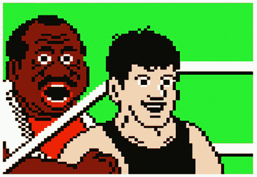

# 生活是一个电子游戏——以下是作弊代码

> 原文：<https://markmanson.net/life-cheat-codes?utm_source=wanqu.co&utm_campaign=Wanqu+Daily&utm_medium=website>

欢迎一号玩家来到游戏《生活》的策略指南。

毫无疑问，你已经发现，生活的游戏通常是相当困难的。你将面临意想不到的挑战和长期的挫折。你会经常与自我怀疑作斗争，感到无助和失落，有时当你没有卫生纸时会大便。

是的，生活是艰难的，俗话说。

但是不要害怕，这个简短的指南旨在帮助你完成你的任务，并在尽可能高的水平上完成游戏。

## 如何赢得生活

Don’t worry, Champ, you got this.

生活的目标很简单:尽可能地向上爬。生活中的每一个层面都代表着你必须克服的特殊挑战。一旦你克服了这个挑战，你就可以进入下一个阶段。目标是完成尽可能多的关卡。在游戏结束时，最高等级的人会得到最好的葬礼。

人生有五个层次:

*   第一级——寻找食物；晚上找张床睡觉
*   第二级——知道你不会死
*   第 3 级-找到你的人
*   第四级——做一些对自己和他人都重要和有价值的事情
*   第 5 级-创造遗产

第 1 级仅仅意味着你没有无家可归和/或挨饿。这是几乎所有其他事情的先决条件。很有可能，如果你停留在第一层，你现在甚至不会读这篇文章。

**第二关**变得有点复杂，因为很多人每天晚上都有一张舒适的床可以睡，但他们睡不着，因为外面有枪声，或者城市上空有炸弹爆炸，或者爸爸是个酒鬼，一直试图放火烧了房子。

这些东西都不酷。第二级要求你找到一个安全稳定的家作为你的基地。越过第二级需要找到一种方法，成功地将自己从这些危险的处境中解脱出来。

**第三层**意味着关系，找到合适的人去爱，找到合适的人爱你。

这听起来比实际上更容易也更有趣。主要是因为，你可能已经发现，大多数人都很差劲。

导航到那些没有导航的是一件非常棘手的事情，我稍后会讲到。

第四级意味着积累一些[技能](/life-skills)或知识或能力，为你周围的世界增加价值，同时在这个过程中让你觉得自己是个坏蛋。

第五级仅仅意味着确保你死后你的生命有意义。祝冠军好运。

由于我们的父母，我们大多数人都有一个良好的开端。如果你幸运的话，你的父母将会成功地指导你通过 1-3 级，甚至会给你一个很好的激励来达到 4 级。

如果你的父母照顾你，但他们在情绪上有点混乱，那么你会有第 1 和第 2 级，但在第 3 级完全靠自己。

如果你是被狼养大的，a)祝贺你学会了阅读，b)请不要嚼你的移动设备。

## 生活的设计

生活是一场复杂的大游戏。这是迄今为止已知的最大的开放世界游戏。我们都是从不同的起点开始的，我们被置于各种各样的环境中，这些环境要么给我们带来优势，要么给我们带来劣势。

但是因为大多数人在概念化生活方面有困难，他们因此认为他们无法控制生活。但是没有什么比这更偏离事实了。

生活的游戏设计其实出奇的简单。它由几个基本原则指导，这些原则旨在给玩家一种大量随机性的体验。

**1。生活被设计成不断向你抛出困难和意想不到的问题。生活是一个永无止境的问题流，必须面对、克服和/或解决。如果在任何时候，生活用完了给我们的问题，那么作为玩家，我们会不自觉地为自己发明问题。问题是让我们忙碌的事情，也是[赋予我们生活意义的事情](/the-meaning-of-life)，因此，是征服第 4 和第 5 层(给予价值和留下遗产)所必需的。**

作为玩家，我们大部分时间都在为预料中的问题做准备。但是正是因为有了这种准备，从定义上来说，我们生活中经历的最困难的问题将会是*意想不到的*。

这种持续不断的意想不到的问题让玩家感觉她对自己的生活缺乏控制，而事实上，生活的目的不是控制发生在你身上的事情，而是控制和选择对发生在你身上的事情做出更高层次的反应。

**2。玩家可能会用解决方案或分心来应对问题。所有玩家都必须面对问题做出反应(即使选择不对问题做出反应，这本身也是一种反应)。**

所有的反应可以分为两种方式:解决方案和分心。

解决方案是解决问题的行动和追求，防止问题在未来继续或再次发生。[分心](/stupid-things)是为了让玩家意识不到问题的存在或减轻问题可能造成的痛苦而设计的行为或追求。

如果一个玩家觉得他们理解一个问题并且有能力处理它，他们会寻求一个解决方案。如果玩家只是厌倦了生活中的狗屎，那么他们可能会寻求分心来帮助他们[假装问题实际上并不存在](/9-subtle-lies-we-all-tell-ourselves)。

**3。每一个解决方案或分心使用得越多，将来就会越容易，越自动化。**你越频繁地使用解决方案或分散注意力的方法，它就越容易被再次使用，最终会变得无意识和无意识。一旦解决方案或注意力分散是无意识和自动的，它[就变成了习惯](/habits)。

习惯是必要的，因为它能防止你退回到你已经征服的水平。玩家一旦找到了一个关卡的解决方案，就必须多次使用这个解决方案，使之成为一种习惯，从而掌握这个关卡，并允许他们进入下一个关卡。

**4。解决方案让我们迈向下一个层次，干扰让我们停留在同一层次。因为提高生活水平需要解决问题，把我们的注意力从我们的问题上转移会让我们停留在同样的水平上。**

如果我们的分心成为习惯，那么我们将永远停留在一个水平上，甚至意识不到它。如果你曾经想知道为什么在过去的十年里[你所有的关系都悲惨地失败了](/still-single)，那么很有可能你的分心习惯正在阻止你实现[真正的亲密](/healthy-relationships)，这是战胜第三级所必需的。

**5。因此，在人生游戏中获胜的公式实际上非常简单**:

*   a)正确识别你的解决方案和干扰因素
*   b)排除干扰
*   c)？???
*   利润

一个简单的例子:工作中出现了问题，我的老板讨厌我，所以我要么寻求解决方案(与老板对抗，寻求调动，更努力地工作，等等)。)或者我可以追求一种分散注意力的方式(每晚聚会，抽快克，一边看迪士尼动画片一边手淫，等等。).

我选择一个解决方案的次数越多，就越容易选择后续的解决方案，因此[最终会提升](/courses/build-a-better-life)。我选择分心的次数越多，就越容易选择随后的分心，从而使我成为一个有怪异性恋物癖的游手好闲者。

在我教你如何彻底欺骗生活并在你死后为你建造一座巨大的金字塔之前，最后一点要注意:

仅仅因为你提升了级别，并不意味着问题就止步于之前的级别。兄弟还是要吃饭的(1 级)。我们都需要安全才能完成任何事情(第 2 级)。[关系取功](/relationship-advice)(三级)，雅哒，雅哒。

所以把升级想象成不一定要从玩棒球变成玩刀子。相反，升级就像从杂耍三把刀到四把，然后五把，等等。

下面是五个秘籍，帮助你在生活中导航，并达到完全满意和水平的终点。

输入这些作弊代码很容易:只需在查看屏幕上按 Tab 键，进入你的思维之眼。[心灵之眼](/your-two-minds)是你主动观察自己和[选择思考](/personal-values)的地方。在那里，只要在“大脑”的提示下输入下面的秘籍，然后按回车键。

(注:这些秘籍和解惑、分心一样，也需要重复才能奏效。所以对他们要有耐心。它们最终也会成为自己的习惯。)

## 欺骗 1:我对此负责

人们搞砸事情的第一个原因是告诉他们自己对生活给他们的问题无能为力。

对于生活给你的问题，你总能做些什么。

当你决定你无能为力去解决一个问题时，你会立即限制你对分心事物的可能反应。如果你足够限制自己对分心事物的反应，很快你就会建立一个除了分心习惯之外什么也没有的生活。你会一直逃避所有的事，所有的人。你可能会变成优等生，一个自私的混蛋。

(另一个注意:“自私”本质上是一种对解决方案分心的倾向。由于你周围的人和你的关系受益于解决方案，而分心通常会使你与其他人隔离，不断追求分心可能会使你成为别人不想真正交往的人——除非，他们追求和你一样的分心。你知道，就像烟斗里的两颗豌豆。)

这第一次“欺骗”是如此重要，我曾经写了一篇关于它的文章叫做[【首要信念】](/the-prime-belief)，在[【脸书】](https://www.facebook.com/Markmansonnet/)上贴了整整三次。有些人甚至分享了它，不仅仅是我妈妈。第一个欺骗是如此重要，我在《T4》一书中用了整整一章来讲述它。这很重要，如果你在派对上喝醉了，我会用记号笔写在你的额头上。

## 欺骗 2:写下这些狗屎

不，我不是说写下你欠你的朋友迈克 12 美元，因为你喝了那些啤酒。虽然，这可能值得注意。

在你的生活中，将解决方案从干扰中分离出来是非常困难和复杂的。这是因为我们倾向于对自己的分心事物撒谎。我们告诉自己，我们需要分散注意力。我们告诉自己，我们的分心只是单纯的娱乐。我们完全控制住了他们，是的，也许我在桥下自己的呕吐物中醒来，但至少我记得我把车停在哪里了。看，*我负责*。

但最糟糕的是，有时我们开始相信我们的分心实际上是一种解决方案。我们认为每天在办公室呆上 12 个小时会给我们带来我们想要的充满爱的家庭，在公园里拉小提琴赚点零花钱是一项即将发生的事业。

我们经常会花上几年(或几十年)去追求我们认为会让我们变得更好的东西，却发现我们在过去的 12 年里基本上一直在拧我们的乳头，虽然感觉很好，但我们没有任何表现。

因此，我们都需要培养一种观察自己想法的能力。心理学家有时称之为“元认知”在过去，我称之为[超牛逼](/meta-awesomeness)。在这里，我就叫它“不要做一个混蛋”

为了观察你自己的想法，不做一个混蛋，你需要把你的想法拿出来，假装它们不是你的。只有到那时，你才能听到它们听起来有多荒谬。

一个常见的方法是定期写下你的想法。

这可以是一本日记，一个博客(不管怎样，你认为这些东西是怎么开始的？)，甚至是给朋友和家人的信/邮件。

重要的是，你在积极地[挖掘你生活中的问题](/the-meaning-of-life)，从第三人称的角度审视你的行为。

就像，我知道这听起来很神奇，当你决定[通过服药和与一系列情感上有需求的女人睡觉来处理你的妈妈问题](/parents)时，你可以很高兴地告诉她们以后滚蛋。T2 可能觉得这是个好主意。但是写下来。那就看看你有多混蛋。

[疗法](/therapy)在这方面也起作用。你坐在沙发上，对这个坐在那里假装关心的人说一堆话。然后那个人把你的想法反馈给你，只是方式不同。然后你会说，“哦，等等，这听起来完全不合理。谢谢你，医生。”然后你被耍了，因为你的健康保险不包括它。

所以，如果你像美国其他人一样没有保险，你可以通过养成写下狗屎的习惯来完成几乎同样多的事情。

## 欺骗 3:停止他妈的抱怨

抱怨实际上什么也做不了。飞机晚点？打车颠簸？最喜欢的披萨店没有意大利辣香肠了？

深呼吸…然后永远憋住…因为你需要[闭上他妈的嘴](/shut-up-and-be-grateful)。

抱怨带来了问题，然后延长了问题。它将这种从讨厌到合法的痛苦经历转化为社会实体，而社会实体之所以糟糕，是因为我们觉得有义务[保护它们，确保每个人都理解它们，同意我们的观点](/outrage)。然后你就变成了那个固执地认为这家餐厅很烂的家伙，会誓死捍卫你的观点，即使事实上，你真的不那么在乎，如果你没有把它变成一件大事，你甚至可能有点喜欢这个地方。

人们抱怨不是因为事情很糟糕。人们抱怨是因为他们在寻求共鸣，并感觉与周围的人有联系。

不幸的是，抱怨可能是与他人沟通最没用的方式。这就像在未经处理的污水中游泳来锻炼你的心脏一样。是的，你在锻炼，但是，呃，你脸上长的是什么东西？

## 欺骗 4:停止幻想

当我还在大学的时候，我参加了一次禅静修，我记得禅师在一次 T2 的问答中建议我们试着停止日常生活中的白日梦，并且从总体上放下幻想。

那时我大概 20 岁，因此，我醒着的大部分时间都在幻想 a)辣妹，b)在一群辣妹面前弹着吉他摇摆，或者 c)举办满是辣妹的超酷派对。

不用说，禅师的建议几乎摧毁了当时唯一给我一丝快乐的想法。我抵制这种想法，就像猫抵制洗澡一样。

但后来我变老了，最终克服了对辣妹的痴迷，我认为这是任何寻求成熟外表的男人的要求，并意识到禅师女士(是的，是个女人)一直是对的。

人类的想象力非常强大。想象力是一件有趣的事情——它吸引我们去阅读书籍、电影和电视节目，让我们在一个周末狂看。

但是当应用到我们自己身上时，想象力会变成另一种形式的分心。这可能是一种逃避现实的方式，一种通过他人提供给我们的图像和想法来替代生活的方式。当[独自坐在我们的沙发](/how-to-get-motivated)上时，这是一种获得成就感的方式。

我们对自己反复出现的幻想大多是对我们不安全感的反应。

I would count the number of insecurities going on in this picture, but if I did, I’d have to spend the rest of the article counting.

我让你猜猜我 20 岁时最明显的不安全感是什么…是的，辣妹(或者性，或者有吸引力/被渴望/被爱，或者随便你怎么称呼)。

而那些幻想并没有帮我化解那种不安全感。相反，我生活在幻想世界的倾向(*cough* [porn](/pornography-can-ruin-your-sex-life) *cough*)痴迷于物化女性，并将她们视为性征服，这促使我在现实生活中做出一些行为和痴迷，这些行为和痴迷比他们需要的更难放弃。

如果你花了几年的时间幻想那艘游艇，那么你很有可能会为了买它而毁掉自己的余生。如果你痴迷于幻想被所有人崇拜和喜爱，那么在你最需要的时候，你将无法为自己挺身而出。

幻想就像任何其他分散注意力的东西一样——它们应该有节制地使用，除了纯粹的享受别无它用。当他们开始支持你的自我价值感，你对在这个世界上的重要性的渴望时，你将会束缚住自己，你将永远不会在生活中再次提升。

## 欺骗 5:分享你的羞耻

我即将用一段话总结每个人在人生的游戏中处理的最大问题。你准备好了吗？

当我们还是孩子的时候，我们真的对生活中的许多问题无能为力。因此，我们依靠父母来帮助我们找到解决办法。但是我们的父母越是找不到解决办法，我们就必须给自己制造越多的干扰(注意到孩子们有多幻想了吗？那不是巧合)为了应付生活的困难。我们在童年时给自己制造的干扰越多，和/或我们的父母教给我们的干扰越多，他们就越有可能形成将持续到成年的习惯。一旦成年，我们会忘记我们的分心仅仅是对问题的反应，我们会相信我们有一些内在的缺陷或错误，我们必须不惜一切代价对他人隐瞒。

因此，我们隐藏自己的这些东西，为了隐藏它们，我们必须进一步分散自己的注意力，这只会造成这种分散注意力和羞耻的恶性循环。

摆脱我们的干扰，重新找回自童年以来一直困扰我们的问题的最佳方式是暴露它们，分享它们，并认识到 a)不，你不是一个怪胎，[大多数人都在同同样的问题作斗争，b)你的干扰只是:不健康的方式来补偿](/being-special)[你对自己的糟糕感觉](/hate-yourself)。

有句老话说“阳光是最好的消毒剂。”对我们自己来说也是如此。治愈你内心最黑暗的部分的唯一方法就是照亮它们。

祝一号玩家好运。记住，生活中的[游戏](/four-stages-of-life)被设计成复杂和令人困惑的。困难不在于获胜，而在于[知道获胜本身意味着什么](/measure-your-life)。因为这才是真正的挑战:决定我们自己的生活有什么价值，然后鼓起勇气去生活。