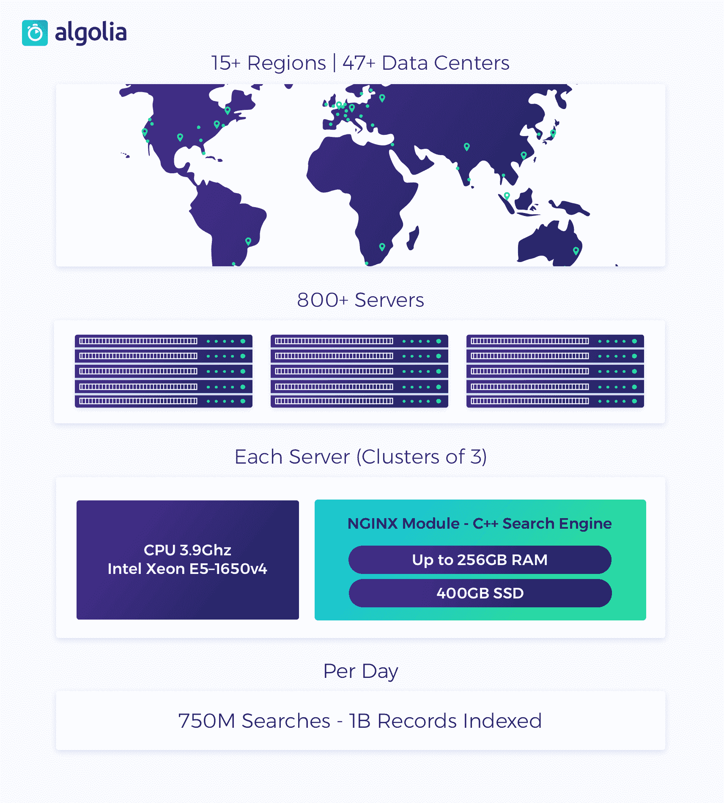
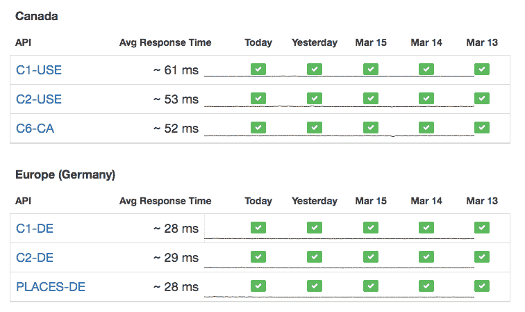

# Algolia 如何减少每月 21B 次搜索的延迟- Algolia 技术堆栈

> 原文：<https://stackshare.io/algolia/how-algolia-reduces-latency-for-21b-searches-per-month?utm_source=wanqu.co&utm_campaign=Wanqu+Daily&utm_medium=website>

*作者:[乔希·泽拉克](/dzello)，阿尔戈利亚的开发者代言人。*

* * *

[Algolia](https://www.algolia.com/?utm_source=stackshare&utm_campaign=stackshare?ref=stackshare_latency) 帮助开发者构建搜索。Algolia 的核心是一个通过 JSON API 公开的从头构建的搜索引擎。2017 年 2 月，我们为 8，000 多个实时集成处理了 210 亿次查询和 270 亿次索引操作。更多数字:

*   查询量:1B/日峰值，750 米/日平均(高峰时段 13K/秒)
*   索引操作:10B/天峰值，1B/天平均值(峰值可能超过 1 米/秒)
*   API 服务器数量:800 多台
*   生产中的总内存:64TB
*   每天的总 I/O:3.9 Pb
*   固态硬盘总存储容量:566TB

在之前，我们已经写了关于我们的 [stack 的文章，并且是 StackShare 和这里的社区的忠实粉丝。在本帖中，我们将探讨如何从头开始设计我们的堆栈以减少延迟，以及我们用来监控生产延迟的工具。](/posts/how-algolia-built-their-realtime-search-as-a-service-product)

我叫 Josh，是 Algolia 的一名开发人员，以前是 Keen IO 的工程副总裁。作为一名开发者倡导者是非常酷的。我开始编码、写作和说话。我还可以每天与使用 Algolia 的开发人员交流。

经常有人问我 Algolia 的 [API 技术栈](/algolia/algolia-api)长什么样。当我告诉许多人:

1.  **Algolia 搜索引擎用 [C++](/cplusplus) 编写，运行在 [nginx](/nginx) 内部。**所有搜索都在我们的 nginx 模块中开始和结束。

2.  API 客户端直接连接到 nginx 主机进行搜索。没有负载平衡器或网络跃点。

3.  Algolia 在手工挑选的裸机上运行。我们使用 3.9Ghz 英特尔至强 E5–1650 v4 等高频 CPU，并使用 256GB 内存加载计算机。

4.  Algolia 采用混合租赁模式。有些集群在客户之间共享，有些是专用的，因此我们可以高效地使用硬件，同时为需要的客户提供完全隔离。

5.  Algolia 没有为 API 使用 AWS 或任何基于云的主机。我们拥有自己的服务器，遍布全球 15 个地区的 47 个数据中心。

#### 为什么是这种基础设施？

我们堆栈的主要设计目标是**大幅降低延迟**。对于 Algolia 支持的搜索类型——适合习惯于谷歌、亚马逊和脸书的苛刻消费者——延迟是 UX 杀手。自谷歌 2011 年宣布即时搜索以来，即搜即搜的体验已经成为常态，这种体验有着苛刻的要求。任何超过 100 毫秒的端到端传输都会被认为是缓慢、故障和分散注意力的。但在 50 毫秒或更短的时间内，这种体验感觉很神奇。我们更喜欢魔法。

## 监视

我们的监控堆栈有助于我们监控所有集群的延迟。我们使用[波前](/wavefront)从每台机器收集指标。我们喜欢 Wavefront，因为它易于集成(我们将它插入了 [StatsD](/statsd) 和 [collectd](/collectd) )，提供了良好的仪表板，并集成了警报功能。

我们使用[page duty](/pagerduty)来触发异常警报，如 CPU 耗尽、资源耗尽和长时间运行的索引作业。对于非紧急警报，如单个进程崩溃，我们转储并收集核心以供进一步调查。如果相同的非紧急警报重复超过设定的次数，我们会触发寻呼机工作警报。我们只保留最后 5 个核心转储，以避免填满磁盘。

当查询时间超过 1 秒时，我们会向 [Slack](/slack) 发送一个警报。从那里开始，我们核心工程小组的人会进行调查。在一个典型的日子里，我们可能只看到 1 个甚至 0 个，所以 Slack 是一个很好的选择。

#### 探针

我们在全球 45 个地方部署了探测器，以测量生产集群的延迟和可用性。我们通过 12 个不同的提供者来托管探针，不一定与我们的 API 服务器相同。这些调查的结果在[status.algolia.com](https://status.algolia.com)公开可见。我们使用一个定制的内部 API 来聚合探测器从每个集群获取的大量数据，并将其转换为每个区域的单个值。

#### 倒下的机器

一个定制的 Ruby 应用程序可以在 30 秒内检测到停机的机器。一旦检测到一台机器停机，我们会推送 DNS 更改，将其从集群中移除。该更改的传播上限是 2 分钟(DNS TTL)。在此期间，API 客户端实现其内部重试策略，以连接到集群中的健康机器，因此不会对客户造成影响。

## 调试慢速查询

当一个查询花费异常长的时间——超过 1 秒钟——我们会将所有关于它的内容转储到一个文件中。我们保留了重新运行它所需的一切，包括应用程序 ID、索引名和所有查询参数。还存储了高级概要信息——有了它，我们可以计算出在最繁重的 10%的查询处理中时间花在了哪里。名为 [getrusage](http://man7.org/linux/man-pages/man2/getrusage.2.html) 的系统调用分析调用进程及其子进程的资源利用率。

对于内核，我们记录主要页面错误的数量(ru_majflt)、块输入的数量、上下文切换的数量、经过的挂钟时间(使用 gettimeofday，这样我们就不会像主要页面错误一样忽略阻塞 I/O 的时间，因为我们使用的是内存映射文件)和各种其他统计数据，这些数据有助于我们确定根本原因。

有了数据，调查按以下顺序进行:

1.  硬件
2.  软件
3.  操作系统和生产环境

**硬件**

最容易发现的问题是硬件问题。我们看到烧毁的固态硬盘、损坏的内存模块和过热的 CPU。我们通过对 S.M.A.R.T .数据发出警报，自动报告固态硬盘等最常见的故障。对于不常见的错误，我们可能需要运行一套特定的工具来缩小根本原因，比如 [mbw](https://github.com/raas/mbw) 来发现内存带宽问题。当然，总有系统日志记录大多数硬件故障。

个别机器故障不会对客户造成影响，因为每个集群有 3 台机器。在可能的情况下，在给定的地理区域，每台机器位于不同的数据中心，并连接到不同的网络提供商。这进一步隔离了网络或数据中心的损失。

**软件**

我们从 getrusage 系统调用中获得了一些接近于零的成本分析信息。有时这足以诊断出发动机代码的问题。如果不是，我们就需要侧写。出于性能原因，我们不能在生产中运行分析器，但我们可以在事后这样做。

一个外部二进制文件被附加到一个分析器上，包含与运行在 nginx 内部的模块完全相同的代码。分析器使用由非常精确的堆栈采样分析器 [google-perftools](https://github.com/gperftools/gperftools) 获得的信息来模拟生产机器的确切条件。

**操作系统/环境**

如果我们可以排除硬件和软件故障，问题可能出在当时的操作环境上。这意味着分析系统范围的数据，以期发现异常。

一旦我们发现内核中巨大页面的碎片整理会阻塞我们的进程几百毫秒。这种碎片整理是不必要的，因为我们保留了像 nginx 这样的大型内存池。现在，我们确保这种情况不会发生，从而为我们的所有客户带来更加一致的延迟。

## 部署

每个 Algolia 应用程序都运行在一个由 3 台机器组成的集群上，以实现冗余和更高的吞吐量。每个索引操作都使用持久队列在机器上复制。

群集可以通过 Algolia 的分布式搜索网络(DSN)镜像到其他全球区域。全球覆盖对于向来自不同大陆的用户提供低延迟至关重要。您可以将 DSN 想象成一个没有缓存的 CDN 每个查询都是针对一个最新的索引副本运行的。

#### 早期发现

当我们发布支持 API 的新版本代码时，我们以一种增量、集群感知的方式进行，因此如果出现问题，我们可以立即回滚。

由一组自定义部署脚本自动执行，滚动部署的顺序如下所示:

*   测试机器
*   分级机器
*   生产机器的⅓
*   生产机器的另一个⅓
*   生产机器的最终⅓

首先，我们用单元测试和功能测试在一个具有精确生产配置的主机上测试新代码。在 API 部署过程中，我们使用一组定制的脚本来运行测试，但是在堆栈的其他区域，我们使用的是 [Travis CI](/travis-ci) 。

我们要防范的一件事是在滚动部署期间产生裂脑分区的网络问题。我们的部署策略认为每个新版本都是不稳定的，直到它得到每个服务器的一致同意，并且它将继续重试部署，直到网络分区修复。

在部署开始之前，另一个进程已经加密了我们的二进制文件，并将它们上传到一个 [S3](/amazon-s3) 桶中。S3 桶位于 [CloudFlare](/cloudflare) 的后面，可以从任何地方快速下载二进制文件。

我们使用定制的 shell 脚本来进行部署。该脚本启动新的二进制文件，然后检查以确保新进程正在运行。如果不是，脚本会认为有什么地方出错了，并自动回滚到前一个版本。即使以前的版本也无法运行，我们在进行故障排除时也不会对客户造成影响，因为集群中的其他机器仍然可以处理请求。

## 缩放比例

对于一个搜索引擎，有两个基本的尺度:

*   搜索能力-可以执行多少次搜索？
*   存储容量——索引可以容纳多少条记录？

为了提高 Algolia 的搜索能力，您可以使用点击式 DSN 功能将数据复制到其他集群。一旦配置了新的 DSN 群集并更新了数据，它将自动开始处理查询。

扩展存储容量有点复杂。

#### 多个集群

如今，无法适应一个集群的 Algolia 客户需要配置一个单独的集群，并在应用程序层创建逻辑来平衡它们。这通常是 SaaS 公司所需要的，他们的客户以不同的速度增长，有时一个客户可能是其他客户的 10 倍或 100 倍，因此你需要将该客户转移到他们能够适应的地方。

很快我们将发布一个特性，将这种复杂性隐藏在 API 之后。Algolia 将根据一些关键信息自动平衡客户可用集群的数据。它的工作方式类似于分片，但是没有将分片固定到特定节点的限制。碎片可以在集群之间动态移动。这避免了许多搜索引擎遇到的一个非常严重的问题——如果最初的碎片键猜测是错误的，整个集群将不得不重新构建。

## 合作

我们的人类和我们的机器人聚集在空闲的时间。去年我们遇到了一些成长的烦恼，但是现在我们有了一个基于前缀的命名约定，它运行得相当好。我们的频道被命名为`#team-engineering`、`#help-engineering`、`#notif-github`等..`#team-`通道用于团队成员，`#help-`通道用于获得团队帮助，`#notif-`通道用于收集自动通知。

很难统计我们在某一天有多少次会议。我们的两个主要办公室分别位于巴黎和旧金山，因此太平洋标准时间上午 7 点到 10 点是视频通话的最繁忙时段。我们现在有专门的“变焦室”，配有 iPads、高分辨率相机和大电视，让体验变得非常流畅。随着在纽约州和亚特兰大的新办公室的设立，Zoom 将成为我们[合作团队](/algolia/algolia-collaboration)中更加重要的一部分，该团队还包括 [Github](/github) 、 [Trello](/trello) 和 [Asana](/asana) 。

## 组

当你是一个 API 时，性能和可伸缩性是面向客户的特性。我们的工程师所做的工作直接影响到依赖我们 API 的 15，000 多名开发人员。作为开发者，我们对开源和活跃于我们的 T2 社区非常有热情。

我们在招人！来帮助我们，让建筑搜索成为一种有益的体验。Algolia 的队友来自不同的背景和 [15 个不同的国家](https://medium.com/@kasiamichalak/thanks-for-your-offer-but-i-dont-want-to-relocate-9fb8d04ace05#.nuy2xnr5w)。我们的价值观是关怀、谦逊、信任、坦诚和坚韧。公司鼓励员工每年至少去一次不同的办公室——巴黎、旧金山或现在的亚特兰大——以在公司内部建立强大的人际关系。

在 StackShare 上查看我们的[未平仓头寸](https://stackshare.io/algolia/stacks#jobs)。

关于我们的堆栈有什么问题吗？我们喜欢谈论技术。请在下面评论或在我们的[论坛](http://discourse.algolia.com)上提问。

感谢朱利安·莱莫因、亚当·苏拉克、雷米-克里斯托夫·舍姆瑟、杰森·哈里斯和拉斐尔·特里耶对本文的大力帮助。