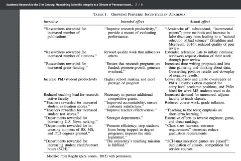

# 每一次管理学术界的尝试都让它变得更糟

> 原文：<https://svpow.com/2017/03/17/every-attempt-to-manage-academia-makes-it-worse/?utm_source=wanqu.co&utm_campaign=Wanqu+Daily&utm_medium=website>

我从 2011 年 4 月开始使用 Twitter，已经将近六年了。几周前，[我发的一条微博](https://twitter.com/MikeTaylor/status/832973591847202816)第一次突破了转发数千的大关。对此我很不开心。有两个原因。

首先，这不是我自己的内容——这是爱德华兹和罗伊(2017)的表 1 的截屏:

[T2】](https://svpow.files.wordpress.com/2017/02/c49rdmlweaaa4if.jpg)

第二，这太令人沮丧了。

这个问题是众所周知的，实际上也是我们在之前已经讨论过的[问题:一旦你试图衡量人们做得有多好，他们就会转向优化你所衡量的任何事情，而不是尽最大努力做好工作。](https://svpow.com/2015/04/23/measure-the-thing-youre-interested-in/)

事实上，这种现象已经广为人知，不同的人给它起了至少三个不同的名字:

*   [**古德哈特定律**](https://en.wikipedia.org/wiki/Goodhart's_law) 最简洁:“当一个衡量标准成为目标时，它就不再是一个好的衡量标准。”
*   坎贝尔定律 最为明确:“任何量化的社会指标越多地用于社会决策，它就越容易受到腐败压力的影响，就越容易扭曲和腐蚀它打算监测的社会进程。”
*   [**眼镜蛇效应**](https://en.wikipedia.org/wiki/Cobra_effect) 指为改善一种情况而采取的措施会直接使情况变得更糟。

正如我所说，这是众所周知的。在社会理论中甚至有一个术语:反身性。然而我们却坚持做那些*只会有这种结果*的傻事:

*   评估学校教师在年初和年末之间他们的孩子在考试中表现出的进步(这显然导致他们竭尽所能压低年初的考试)。
*   通过论文数量来评估研究人员(这只能导致分割成最小的可发表单元)。
*   评估他们——上帝保佑我们——他们的论文发表的期刊的影响因子(这助长了阻碍学术交流的品牌崇拜([)。](https://svpow.com/2016/10/26/openaccessweek-my-jisc-interview-about-designer-labels/)
*   评估研究人员的实验是否“成功”，即他们是否发现了具有统计意义的结果(这不可避免地导致 [p-hacking](https://en.wikipedia.org/wiki/Data_dredging) 和 [HARKing](http://goodsciencebadscience.nl/?p=347) )。

那么，解决办法是什么？

我读了经济学家 T2 蒂姆·哈福德的精彩博客已经有一段时间了。这源于读了他更优秀的书*卧底经济学家*(哈佛大学 2007 年出版)，这本书给了我一个关于经济如何运行、市场如何帮助、它们如何出错等基础知识的速成班。我真的不能说这本书有多好:这是我觉得每个人都应该读的书之一，因为这些问题是如此重要和普遍，而哈佛的解释是如此清晰。

在最近的一篇文章中， [*为什么央行行长不应该在*](http://timharford.com/2016/09/4035/) 的游戏中有皮肤，他提出了这样的观点:

> 任何激励方案的基本原则都是这样的:你能衡量所有重要的东西吗？如果你做不到，那么强大的经济激励只会产生短视、狭隘或彻头彻尾的欺诈。如果一份工作是复杂的、多方面的，并且涉及到微妙的权衡，那么最好的方法就是雇佣优秀的员工，付给他们合适的工资，并告诉他们尽最大努力去做好这份工作。

我认为最后一部分很大程度上是几十年前学术界的运作方式。现在，我不想变得泪眼朦胧、玫瑰色和怀旧——特别是因为我当时甚至没有涉足学术界，也不知道从经验来看是什么样的。但是，有没有可能……有没有可能……从学者那里获得好的研究和出版物的最好方法是雇用优秀的人，付给他们现行的工资，并告诉他们尽最大的努力去做这项工作？

[继续阅读 [*为什么*我们对学术界的管理如此糟糕？](https://svpow.com/2017/03/22/why-do-we-manage-academia-so-badly/) ]

# 参考

# 奖金

这是一份格式精美的整版爱德华兹和罗伊表格，你可以打印出来贴在大学的墙上。我感谢大卫·罗伯兹准备了它。

### 像这样:

像 装...

### *相关*