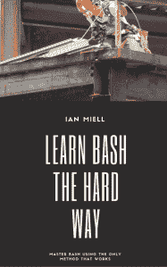
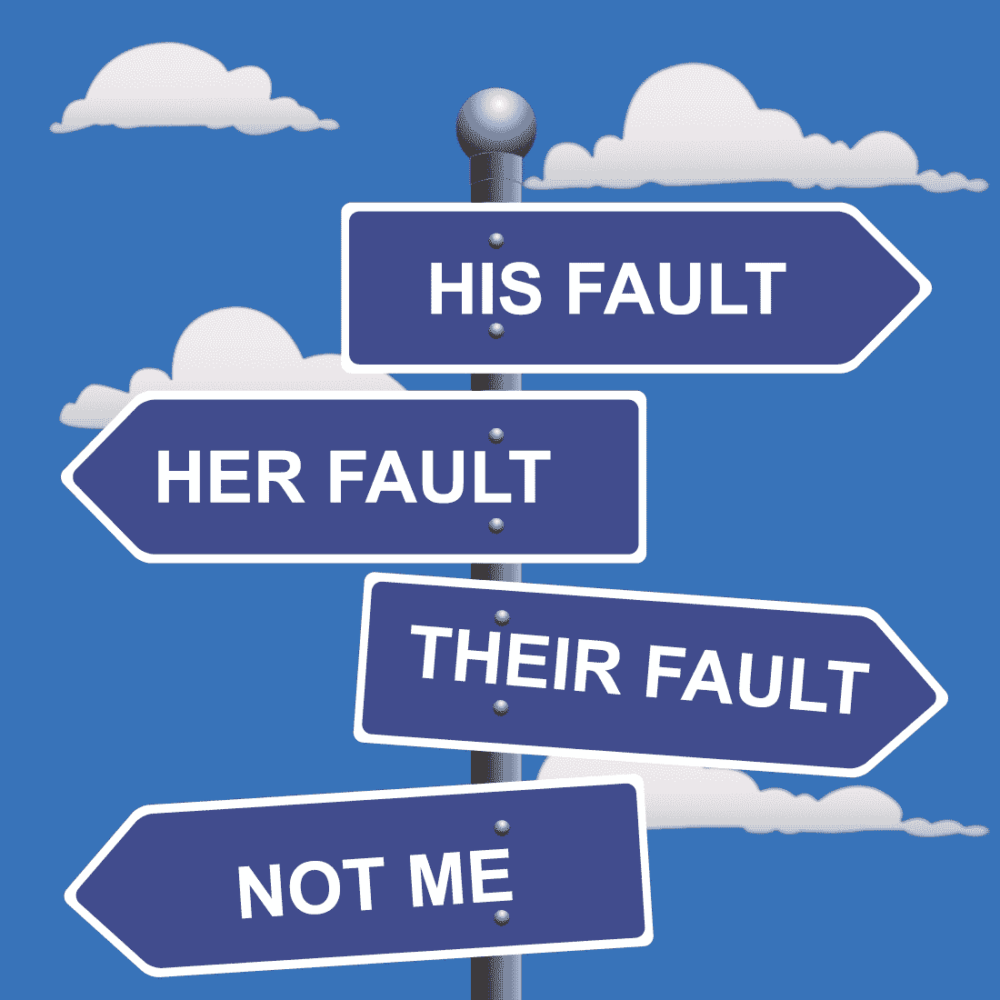

# 我从管理世界上最繁忙的赌博网站——zwischenzugs 网站的可靠性中学到的东西

> 原文：<https://zwischenzugs.wordpress.com/2017/04/04/things-i-learned-managing-site-reliability-for-some-of-the-worlds-busiest-gambling-sites/?utm_source=wanqu.co&utm_campaign=Wanqu+Daily&utm_medium=website>

## **TL；博士**

几年来，我为世界上许多最繁忙的赌博网站管理三线网站的可靠性运营，为一家鲜为人知的公司工作，该公司为几家企业构建和运行核心后端在线软件，每个企业在高峰期每小时可以获得数千万英镑的收入。几年前我离开了，所以现在是反思我在这个过程中学到了什么的好时机。

在许多方面，我们所做的类似于现在所谓的 SRE 函数(我将称我们为 SREs，但这个缩写词在当时并不存在)。我们随叫随到，必须响应事件，提出重新设计的建议，向开发人员和客户团队提供可靠的反馈，管理升级和紧急情况，运行监控系统，等等。

我加入的团队大约有 5 名工程师(都是以前的开发人员和技术负责人)，到我离开的时候，这个团队已经发展到大约 50 人，他们来自不同的地方，有着不同的经验。

我将在这里集中讨论过程和文档，因为我不认为在我读到它们的地方，它们被有效地讨论过。

如果你想读更长的东西，谷歌的 SRE 书是一个很好的资源**。**

## **流程**

流程对于运行和扩展 SRE 运营至关重要。这是我们所取得的一切的核心。当我加入这个团队时，习惯是不好的——有一个售票系统，但一个日志的决议并不少见。已修复，正在关闭。).

SRE 操作基本上是一个处理信息的工厂，应该相应地采取行动。如果没有处理货物流动的流程，你就不会有一个工厂在运行；同样，如果没有处理知识流动的流程，你也不会有一个知识密集型的 SRE 企业在运行。

我听到的对过程的一个常见的反对意见是，它“扼杀了创造力”。事实上，有效的流程(执行得不好的糟糕流程会把任何事情都搞砸！)让你的头脑变得清晰，允许创造性思维。

关于这个主题的一本很棒的书是[‘清单宣言’](http://atulgawande.com/book/the-checklist-manifesto/)，它启发了我们所做的许多改变，并且在团队中被广泛阅读。它引用了航空业处理流程的例子，这种方法通过常规操作的心理自动化，在紧张的条件下实现非凡的创造力。甚至有一部[电影](http://www.imdb.com/title/tt3263904/)讲述了一个讨论过的事件，飞行员自己[引用清单和常规作为他在那种紧张情况下快速思考的创造力和控制力的使能器](http://www.airspacemag.com/as-interview/aamps-interview-sullys-tale-53584029/)。事实上，我们自己也使用了类似的过程:在紧急情况下，一个有经验的工程师会投入寻找解决方案，而一个更初级的工程师会遵循清单。

对过程的另一个批评是过程会抑制有效的工作和协作。如果过程被视为一个因其自身的存在而合理的实体，而不是另一个活的资产，它绝对可以。唯一能防范这个的就是文化。稍后会详细介绍。

### **流程-工具**

首先要做好的是票务系统。就像监控解决方案一样，人们会纠结于哪种售票系统是最好的。他们这样做是错误的。你所使用的售票系统通常会因为熟悉而更受欢迎。票务系统只有在推动或鼓励糟糕的流程时才是糟糕的。什么是糟糕的过程取决于你的业务的约束。

拥有一个可靠运行并支持您的流程的票务系统要比其他方式重要得多。

这里有一个例子。在我任职期间，我们从 RT 搬到了 JIRA。JIRA 提供了许多优于 RT 的优势，我一般会推荐 JIRA 作为协作工具。然而，我们在切换时遇到的最大问题是丢失了我们内置到 RT 中的一些功能，这些功能对我们来说至关重要。RT 使我们能够获得票证的实时更新，这意味着事故方面的协作介于聊天和票证之间。该记录在事件后审查中非常宝贵。RT 还允许我们对客户隐藏条目，这也是很难丢失的。我们克服了这一点，但是这些事情出奇的重要，因为它们已经融入了我们的流程和文化。

当选择或改变你的票务系统时，考虑对运营真正重要的是什么，而不是列表上看起来不错的具体功能。对你来说什么是重要的，从它看起来有多好(说真的，你的客户可能会更重视你，你的品牌可能是好的设计)，到报告工具是否强大。

## **文档**

在过程之后，文档是最重要的事情，两者密切相关。

文档中有一本书，因为人们又一次关注了错误的事情。要理解的关键是，文档和其他资产一样是一种资产。像任何商业资产一样，文档:

*   如果管理得当，投资回报会翻几倍
*   需要投资来维护(就像工厂的结构)
*   如果过期，成本只是因为它在那里(像过期的库存)
*   如果质量差，或不可用，是负债，而不是资产

但是这是没有争议的——很少有人不同意好的文档是有用的这一观点。关键是:你会怎么做？

### **文件——我们在哪里**

我们处于这样一种情况，提供给我们的文档是没有用的(例如来自 devs 的:‘这里不包括网络分区，因为这是极不可能的’。猜猜发生了什么！这是他们费心写的文件…)，或者我们只是依靠以前的调查(那时我们已经开始写东西了)来弄清楚下次类似的事情发生时该怎么做。

这让我们所有人都很沮丧，我们花了很长时间抱怨文档仙女没有在我们自己承担责任之前拜访我们。

### **文档——我做了什么**

我是这么做的。

*   我选取了两年的优先事件(即触发或可能触发非工作时间通话的事件)，并将其列出。他们有 1700 多人。
*   然后我根据问题的类型对它们进行了分类。
*   然后，我检查了每种类型的问题，并总结了解决问题或达到需要上报的程度所需的步骤

这花了我七个月的时间。我是一名资深员工，坐在那里写作让我的公司损失了很多钱。因为我有一个精明的老板，我从来没有被质疑这是否是一个好的时间利用。我被信任了(文化，又来了！).我要说，这一努力花了四个月才看到任何回报。我记得这四个月是一段令人紧张的时间，因为我的注意力从运营上转移到了完全浪费我的时间和雇主的钱以及令人尴尬的失败上。

为什么不交给下属去做呢？有几个原因。这是如此重要，我们以前没有这样做，所以我需要知道它是正确的。我确切地知道需要什么，所以我知道我能以这样一种方式写它，它至少对我有用。我也是一个相对有经验的作家(艺术毕业生，前记者)，所以我喜欢认为这将有助于我写好。

按照 ITIL 的说法，我们称这些为“事件模型”，但它们也可以被称为“运行手册”、“婴儿床床单”等等。没关系。重要的是:

*   他们很容易找到/寻找
*   很容易确定你是否找到了匹配
*   它们没有被复制
*   他们可以被信任

我们将这个文档以纯文本的形式放在票务系统中，在一个独立的 JIRA 项目下。

文档团队听到了我们要做什么的风声，并试图迫使我们为此使用内部 wiki。我们断然拒绝了，这很关键:文档系统与票务系统的共存意味着搜索和更新文档不会出现阻抗不匹配。因为它是纯文本，所以速度快，更新简单，而且整洁。我们抵制危及我们正在做的事情的效用的过程。

* * *

**如果你想了解更多关于 bash 的知识，请阅读我的书[艰难地学习 Bash](https://leanpub.com/learnbashthehardway)，可以在 [$5](https://leanpub.com/learnbashthehardway) :** 买到

[T2】](https://leanpub.com/learnbashthehardway)

* * *

### **文档和整理的重要性**

当我们开始时，我们为这些事件模型设计了一个模式，这是一个美丽的东西，涵盖了所有可能出现的场景和情况。

最后，这几乎完全是浪费时间。我们最终使用的是一个非常愚蠢的结构:

*   问题陈述
*   要做的步骤 1-n
*   进一步/更深入的讨论，相关文章

就这样。试图更彻底地构建它的努力都失败了，因为它要么让新来者感到困惑，要么产生了太多的管理开销，要么覆盖面不够。随着时间的推移，一些文章开发了适合于任务的自己的模式，新的类别(例如，告诉你下一篇文章该看哪篇的“跳转”文章)也随着时间的推移而发展。我们无法提前设计这些东西，因为我们不知道什么可行，什么不可行。

如果你愿意，可以称之为“敏捷文档”——敏捷是现在的卖点(那时候是 ITIL)。同样，最重要的是**简单和实用**胜过一切。

### **没有文档仙女**

花了这么多时间和精力之后，关于文档的其他一些事情变得很清楚了。

首先，我们放弃了接受来自其他团队的文档。如果他们评论代码，很好，如果维基上有一些有用的东西让我们找到，也很好。但是到了移交项目的时候，我们不再“要求文件”。相反，我们会安排有经验的 sre 参加会议，讨论项目的设计。

不变的是(假设他们没有运营经验)，开发人员会关注他们构建的东西以及它们是如何工作的——这些东西通常是经过最彻底测试的，最不可能失败的。

相比之下，SRE 会关注薄弱环节，那些可能出错的地方。如果网络被分割会发生什么？如果数据库用完了磁盘怎么办？“我们能从日志中找出用户没有得到报酬的原因吗？”

然后我们会离开，编写我们自己的文档，并让工程师签字同意——与传统流程相反！在这个过程中，他们经常发表有用的评论，给我们提供更多的见解。

我们注意到的第二件事是，我们的工程师仍然不愿意更新只有他们在使用的文档。人们仍然觉得应该给他们提供文件。领导层必须不断强调，这是他们的文件，而不是从高处传下来的石碑，如果他们不不断维护这一点，它们将变得毫无用处。

这是一个文化问题，需要很长时间才能解决。撤销它还需要通过过程来加强文档变更。

最后，我认为大约 10%的持续工作时间花在了维护和编写文档上。在最初的 7 个月爆发后，这 10%的大部分时间花在了维护上，而不是生产新材料。

* * *

**如果你想了解更多关于 git 的知识，请阅读我的书[艰难地学习 Git](https://leanpub.com/learngitthehardway)，可以在:**买到

[T2】](https://leanpub.com/learngitthehardway/)

* * *

### **文档–优势**

在完成所有这些文档后，我们体验到了远远超过 10%持续成本的收益。列举几个例子:

在这个过程开始之前，我们不愿意雇用经验不足的员工。之后，入职变得轻而易举。除此之外，培训还包括在事件发生时跟踪事件，并跟随更有经验的员工。新员工的任务是帮助维护文档，这有助于他们了解自己的知识差距。

这些文档给了我们一个资源，让我们能够确定培训需求。这最终成为一门工具和技术的课程，任何工程师都可以以获得工作知识为目标。

*   通过更简单的升级减轻压力

这是一个大问题。在我们有逐步事件模型之前，何时升级是一个令人紧张的决定。一些工程师以提前升级而闻名，他们都不确定在下班后给负责的技术负责人打电话之前是否“错过了一些明显的事情”。SREs 也会因为*没有*尽早升级而被叫出去！

事故模型解决了这个问题。很快，升级到技术人员的第一个问题是“你遵循事故模型了吗”？如果是这样，并且遗漏了一些明显的东西，那么其中的缺口就变得清晰并很快得到修复。很快，非 sre 就忙于更新和维护文档，以备升级时使用。这成了一个良性循环。

文档对团队的明显价值有助于改善其他方面的纪律。有趣的是，SREs 以前被誉为“最响亮”的团队——经常有很多“活跃”的辩论，团队非常社会化——这是有道理的，因为我们作为一个团队相互依赖，以覆盖一个大的技术领域，经常与非技术客户高管打交道，分享知识和文化是至关重要的。

随着时间的推移，团队变得越来越安静——部分原因是聊天室的出现，远程工作的增加和国际团队的出现，但也是因为许多工作变成了例行公事:遵循事件模型，当你完成或不明白某事时，升级到更高级的人**。**

以这种方式自动化调查意味着可以通过软件进一步自动化调查。

有了哪些票证与哪些事件模型相关联的指标，就意味着我们知道应该将精力集中在哪里。我们编写了脚本来在后台梳理日志文件，使编码问题更快更简单地得到解决，自动回复客户(“问题是由应用管理员用户 XXX 所做的更改引起的”)等等。

这些自动化激发了我们基于 pexpect 为自己构建的自动化工具:[http://ianmiell.github.io/shutit/](http://ianmiell.github.io/shutit/ "Follow link")但那是另一回事了。基本上，一旦我们开始行动，这就是一个持续改进的良性循环。

### **返回流程**

假设你拥有所有这些资产，你如何防止它们随着时间的推移而贬值？这就是过程至关重要的地方。

两个过程对于确保一切顺利进行至关重要:伤检分类和事故后审查。

### **流程-分诊**

5%-10%的时间花在了分流流程上。同样，这需要很长时间才能使流程正确，但它带来了巨大的节约:

*   将步骤减少到最少*有用的*步骤

尽可能多的投入到你的分类过程中是很诱人的，但是保持过程的价值高于完整性是至关重要的。任何不常用的步骤都会被 triager 跳过或忽略。

*   注重在流程中节约成本

寻找重复项、找到相关的事件模型、快速回复给客户，以及尽早上报，所有这些都显著降低了每张票据的成本。这也让其他工程师在思考其他事情的时候，避免了被问到问题时的上下文切换。很难评估这些项目的好处，但我们能够以更少的人员和更低的难度处理越来越多的事件。高级管理层和客户注意到了。

记录这些工作的细节也节省了时间，因为(例如)给工程师一张分类票，工程师可以看到分类员用一个字符串搜索以前的事件，也许他们可以改进。这也意味着更有经验的工作人员可以检查分流质量。

有经验的工作人员需要定期检查分流流程，以确保其得到有效应用。

当我转到另一个运营团队(在一个我知之甚少的领域)时，仅仅通过正确应用这些技术，我就在大约 3 天内将事件队列减少了一半。分流过程是存在的，但没有经过任何思考或监督，而是交给了一名能力不是很强的初级员工。大错特错。分诊必须由经验丰富的人来完成——或监督——尽管它看起来很常规，很机械，但它涉及到许多依赖于该领域经验的重大决策。

没错，我是新老板，我选择在第一周做“低级”的分流工作。我认为这很重要。

没人想长时间做分流，所以我们每周轮换一次。这允许一些连续性和一致性，但防止工程师因花费太长时间反复做同样的工作而发疯。

### **流程-事件后审查**

伤检分类的镜像是“事故后审查”。每张票都由经验丰富的团队成员审核。同样，这是一个花费了大约 5%努力的过程，但也是重要的。

填写了一个标准表格，任何建议都被添加到可以优先处理的积压“改进”任务列表中。这给了我们一个我们想要了解的技术/过程债务的数字。

### **文化**

我提到过几次文化，如果你试图进行任何形式的变革，你总是会回到文化上来，因为文化从根本上来说是一套概念框架，是我们所有行为的基础。

我也提到过人们经常关注“错误的事情”。我一次又一次地听到人们关注工具和技术，而不是文化。是的，工具和技术是重要的，但是如果你不能有效地使用它们，那么它们比无用更糟糕。你可以拥有世界上最好的高尔夫俱乐部，但如果你不知道如何挥杆，而你却在打棒球，那它们就没什么用了。

文化比技术需要更多的投资(记住，我花了半年多的时间写文档)。如果文化是正确的，人们会在需要的时候寻找正确的工具和技术。

当让你选择在什么上面花费时间和金钱时，总是先选择文化。这花了我很多预算，但强行移除一个‘无益的’团队成员是我接手另一个团队时做的最好的事情。他离开后，团队的其他成员都很开心，不再被他咄咄逼人的行为所窒息，并且完成了许多以前没有完成的事情。

我们还用很少的预算建立了一个非常高效的团队，招聘人员会打电话给我，对我大喊我想要的是“不可能的”,但通过关注正确的行为，在我们找到的人身上投入时间，并建立良好的流程，我们得到了一个非常高效和忠诚的团队，他们在公司内外都取得了更大和更好的成就(但主要是在公司内部！).

### **政治**

简单谈谈政治。你必须选择你的战斗。你不太可能得到你需要的资源，所以把那些做不完的东西扔在地上。

是的，你需要一个监控解决方案、更好的文档、训练有素的员工、更多的测试……除非你有一台赚钱机器，否则你不会得到所有这些东西，所以选择最重要的，并尝试先解决它。如果你试图同时改善所有这些事情，你很可能会失败。

在过程和文档之后，我试图破解“可再现环境”的难题。这让我选择了码头工人，并彻底改变了职业生涯。我在这里和这里稍微讲一下这些事情[。](https://www.youtube.com/watch?v=Yj5I-yOaDao)

## 有什么问题吗？

在 twitter 上联系我:@ianmiell

或者 [LinkedIn](https://www.linkedin.com/in/ian-miell-694496)

我的书 [Docker in Practice](http://manning.com/miell/?a_aid=zwischenzugs&a_bid=e0d48f62) :

***代码:39 mil L2***享受 39 折优惠

* * *

如果你喜欢这篇文章，你可能也会喜欢:

[我为改变团队文化而做的五件事](https://zwischenzugs.com/2018/02/24/5-things-i-did-to-change-a-teams-culture/)

[关于 bash 我希望知道的十件事](https://zwischenzugs.com/2018/01/06/ten-things-i-wish-id-known-about-bash/)

[我 20 年的软件开发方法论经验](https://zwischenzugs.com/2017/10/15/my-20-year-experience-of-software-development-methodologies/)

[我建议每个 DevOps 工程师阅读的五本书](https://zwischenzugs.com/2017/04/11/five-books-i-advise-every-devops-engineer-to-read/)

* * *

### 像这样:

像 装...

### *相关*