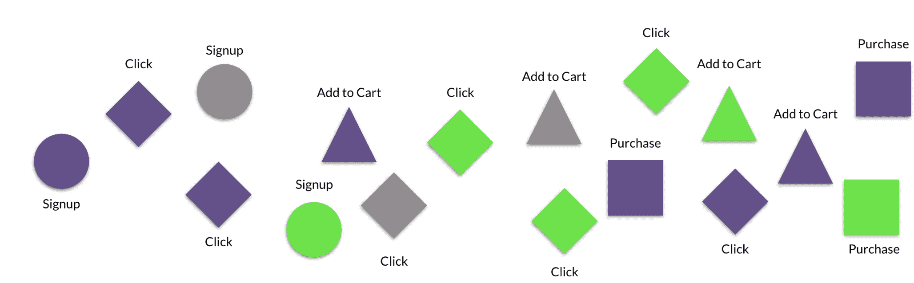

# 很抱歉，但这些是虚荣心指标|第一轮评审

> 原文：<http://firstround.com/review/im-sorry-but-those-are-vanity-metrics/?utm_source=wanqu.co&utm_campaign=Wanqu+Daily&utm_medium=website>

我们对虚荣指标的喜好很早就开始了。以学校为例，大多数学生在学校获得分数。一个“A”是否反映了一个学生未来的表现，或者实际上显示了谁在学习上更好？就其本身而言，一个“B”不就是“更努力地工作”而不是“更聪明地工作”的信号吗？

分数很容易滑入虚荣心的范畴，看重比较而非进步，看重自我而非进化。它们可能成为教师对比学生或学校董事会评估学校的工具，而不是学生改进的工具。很容易成为 a 的牺牲品。

创始人兼首席技术官[劳埃德·塔布](https://www.linkedin.com/in/lloydtabb/ "null")在科技领域看到了同样的现象。从每日活跃用户到收入增长的提升指标有效地比较了公司，但不一定有助于它们更好地运营。事实上，这些衡量标准往往倾向于投资者想要衡量的东西，显示的是*一家公司是否*有价值，而不是*它如何*创造更多价值。

事实证明，我们中的大多数人仍然对获得“a”耿耿于怀。在领导像 [LiveOps](http://www.liveops.com/ "null") 、Netscape 和 [ReadyForce](https://www.crunchbase.com/organization/readyforce#/entity "null") 这样的公司的数据团队 30 年后，Tabb 最大的收获不是你所期望的——或想听到的:你衡量的是错误的指标。我们都是。

在这次独家采访中，Tabb 分享了如何遵守产生方向的指标——而不是拍拍背——以便您的公司能够采取对业务最重要的行动。他对比了几种类型公司(包括服务、广告、软件和电子商务)的虚荣心和清晰度指标，以展示如何找到更好地预测长期行为的替代指标。最后，他强调了如何防止团队被虚荣心所诱惑——以及磨砺他们进行真实的、富有成效的度量的本能的技巧。

# 虚荣指标与清晰指标

对于学生来说，GPA 和 SAT 成绩是进入大学的关键。它们是反映整体表现的单一指标。你同样需要广泛的指标，比如用户数量，来说服投资者和顾问相信你的公司。这些指标都是有目的的——只是不是每一个目的都有*。“虚荣指标不是没有用的。他们有自己的使用案例，但也是*和其他*人评估你的比较点，”塔布说。“不要在内部关注他们。跟踪清晰度指标可以打造伟大的企业。”以下是他如何区分的:*

**虚荣指标**是表层指标。它们通常是给别人留下深刻印象的大尺度，比如下载量。用它们来建立伙伴关系并获得追随者。

**清晰度指标**是运营指标，比如你的产品每天实际使用的分钟数，或者用户获得服务需要多长时间。这些是推动增长的隐藏齿轮。用它们来巩固你的竞争优势。

混淆这两种测量方法可能会导致灾难。公司可能会如此迷恋虚荣指标，以至于无法建立一个可行的商业战略。“2014 年，一个招聘平台通过在注册后给用户的脸书朋友发电子邮件而火了起来。他们的顾问和投资者向他们施压，要求他们增加日活跃用户数。这是他们关注的全部，”塔布说。“这个策略奏效了:3300 万 dau 吸引了 4900 万美元的资金。这一切都发生在不到两年的时间里。他们太专注于单一指标，以至于没有意识到他们失去用户的速度和获得用户的速度一样快，这激怒了这个过程中的每个人。他们是一颗流星，直到他们坠入地球。”

用虚荣指标加油，你可能会开得足够远以获得投资，但最终你会耗尽汽油。

该公司在专注于损害其单位经济的增长后，从未完全恢复。“这就像古老的[猴爪](https://en.wikipedia.org/wiki/The_Monkey%27s_Paw "null")寓言。一位父亲找到了猴爪，被许了三个愿望。他希望得到 200 美元。他的儿子在一次事故中丧生，他从公司得到了 200 美元的善意赔偿。塔布说:“你得到了你想要的，但总会有险恶的转折。"有时，当你专注于虚荣的衡量标准时，你得到了猴爪."

以下是 Tabb 建议您如何在几种类型的业务模型中发现、衡量和运用真实指标的方法:

# 服务型公司

如果你在销售一项服务，**你的虚荣心指标通常是使用你的服务的人数**。将你的增长率与你的竞争对手进行比较，可以看出谁赢了，但通常不会揭示出赢的方式或原因。“对于服务行业，找到并衡量能让你抓住顾客幸福的指标。你的目标是回答这个问题:我们的客户得到好的服务了吗？我知道这是一个具有挑战性的问题，因为服务是主观的，”塔布说。“一旦你找到一个好的代理，**随着时间的推移衡量行为。行为改变了吗？如果情况好转，那么你的业务也会好转**。

公司如何找到这些代理人？走出你的行业可能会帮助你更开放、更有创造性地思考。例如，想象你正试图评价一家餐馆的良好服务。“有很多昂贵的方法来衡量注意力。例如，你可以计算有多少人试图与他们的服务员进行眼神交流。这并不具有预测性，因为你不知道他们是想引起他们的注意，还是对同桌的人感到厌烦。没有通用的衡量标准，”塔布说。“你需要的是一种易于发现、不易被误解的衡量标准。一种选择是你可以测量所有玻璃杯的液位。在任何给定的时间，满杯的百分比是整体服务的代表。这是一个可靠的衡量标准，因为它计算成本低，易于连续观察。”

专注于最早的服务行为。清晰度指标预测。对于那些在服务型公司工作的人来说，早一点找到这个标准。以汽车共享服务为例。经常引用的指标是[每月活跃骑手的数量](https://techcrunch.com/2016/10/19/travis-kalanick-says-uber-has-40-million-monthly-active-riders/ "null")。“但这是虚荣的衡量标准。它没有解释为什么客户会不断回来，或者服务如何才能改善。为了提供更好的服务，衡量取件时间。车来的越快，我就越有可能再次使用这项服务，”塔布说。“等候 1 分钟和 10 分钟的差别是服务质量的一个明显标志。对数据的分析可能会告诉你等待时间的极限。跨邻里或司机等维度跟踪等待时间故障将提高客户满意度，并随着时间的推移重复业务。”

这个教训对塔布来说尤其如此，他花了一年时间研究虚拟呼叫中心公司 LiveOps 的数据，试图找出如何预测呼叫代理的质量。没有两个电话是一样的，因为代理人和客户是不同的。“我试着测试通话时长。我的假设是，如果你的电话很短，你解决问题的速度更快，你是一个更好的代理人。这不是一个强有力的指标，因为它不能预测服务质量，”他说。“我尝试了代理商额外销售的电话百分比。当然，它预测的是收入，而不是服务。”

然后他突然想到。所有 LiveOps 代理都是独立承包商。他们选择他们想工作的时间。他们是否出现由他们决定。“我瞄准了可以衡量的最早行为:出勤率。我们开始追踪谁来了谁没来。事实证明，出勤率是问责制的一个替代指标，而问责制是衡量代理人表现的最佳标准，”塔布说。“这还不明显。这甚至不是电话里发生的事情。这是对性格的一种衡量——我们有相关的数据。但是我们必须找到一个代理人，因为没有衡量一个好代理人的标准。成功的最佳指标是你是否做到了你说过的话。我们开始将电话转接给最好的代理商，也就是那些说到做到的代理商，我们所有客户的收入都大幅增长。”

Lloyd Tabb

# 基于广告的公司

根据 Tabb 的说法，广告公司很容易受到虚荣指标的影响。但是**广告印象代表曝光率而不是结果**。他们也不预测行为。

“足够多的公司已经吃过苦头，知道**用户属性才是最重要的**，”塔布说。“如果你不在同一个数据库中跟踪点击率和购买指标，你最终只能得到点击你广告的人的百分比。你不知道他们接下来做了什么。一百万人可以访问你的网站而不购买任何东西。平均值是一维的虚荣度量。没有上下文，他们就忽略了为什么。”

你衡量的东西——用户、点击、交易——在野外共存。那么，为什么要将它们隔离在单独的数据流中呢？

Tabb 告诫不要孤立你的数据。“你们的指标相互影响。你需要监控如何做到这一点，”他说。“不要只衡量哪些点击产生订单。备份并分解它。从用户与你的第一次接触开始，跟踪他们在你的网站上的行为和实际交易。你必须从头到尾建立联系。”

如果你是一家电子商务公司，那就更进一步。“一旦你得到了一个用户，说明你是从哪里得到他们的，你为他们付了多少钱，以及从获得成本中收回所需要的时间。不要停留在表面。你为这些点击付费。你需要知道。这是你真正了解客户终身价值的唯一途径，”塔布说。塔布说:“我们与一家在线时尚经销商合作，他们提供大量免费赠品，认为一旦新注册者开始像普通顾客一样行事，就不会花太多时间来收回成本。”“但是自由是危险的。他们看到了各种各样的不良行为，这些新“顾客”中的大多数从未转变为更正常的行为。他们之所以能够看到这一点，是因为他们从点击到收购再到购买全程跟踪。”

将您的数据组织成事件流。孤立的数据会掩盖真实的指标。“首先，将用户活动和里程碑集中到单个数据流中。塔布说:“事件流显示了人们如何浏览你的产品，并让你分析他们的行为。“对许多人来说，这不是自然的选择。公司通常基于人口统计属性来划分用户，或者将他们的数据构建到单独的事务表中。单独的表格更容易阅读，让你的软件工作。但它们不会给你一个全面的视角，让你了解你的用户随着时间的推移会发生什么。”

An example of an event stream

回答以下问题，开始创建您的事件流:

用户何时注册了我们的产品/服务？

他们买了吗？

他们与我们一起度过了多少活跃的分钟？

他们在哪里花的时间最多？他们在哪里花钱最少？什么代理预测这种行为？

他们的行为如何随着时间而改变？

他们何时何地停止使用我们的产品？

Tabb 建议在创建事件流之后尝试一个简单的练习。"**计算你的用户一天中与你在一起的五分钟活跃时间段的数量，并在他们的行为中寻找行动集群和不行动的差距。**这是一种了解客户实际行为的廉价方式。他们在一个页面上花费大量时间是因为他们感兴趣还是他们感到困惑？如果他们正在购买，他们在购买前会浏览多少页面？”塔布问道。“如果您没有在事件流中按时间排列数据，您将永远无法回答这些问题。”

# 基于软件的公司

当你推出一款产品时，无论是应用还是 SaaS 平台，用户数量都是产品/市场契合度的核心，也是投资者、合作伙伴和顾问的关键卖点。Tabb 在这里提出了一个相反的论点:有多少次你下载了你不使用或使用一小段时间就忘记的软件？他说:“下载你产品的人数与你公司的生存没有关系。“有多少应用程序像病毒一样传播，几个月甚至几周后就消失了？**软件公司需要关注积极参与时间。**这是清晰度指标。”

积极参与是 Looker 衡量的第一个指标 Tabb:人们每天在该软件上花多少时间？“我不在乎收入或用户数量。当我们有了新客户，我需要知道他们是否真的在使用软件。“虚荣指标很容易误导公司。有人可以夸口说客户 90%的员工都有登录，但是，有多少人真正使用它呢？如果他们真的使用它，他们是主动浏览它还是只是让它留在后台？账户数量也是如此。它不会告诉你*人们如何使用你的产品。有时候，你甚至需要打电话给他们，然后才知道。”*

拿起电话打给局外人。每次 Tabb 在 Looker 的用户群中发现异常时，他都会查找客户的联系信息并打电话。在早年，他每天都这样做。“我给人们打电话是因为我想知道他们使用我们软件的感受。如果他们不使用 Looker，我想知道为什么。有什么问题吗？他们被卡住了吗？如果他们是活跃用户，我想了解他们的体验，以及我们如何改进，”塔布说。“我在 LiveOps 学会了如何调用异常值。当我注意到一组统计上很奇怪的电话时，我有幸听到了这些电话。例如，一个代理有特别长的通话。我可以看到代理人说得很慢，但电话那头的客户真的很投入，甚至比其他电话更投入。在这种情况下，长时间的通话并不是一件坏事。”

在 Looker 的早期，Tabb 会寻找缺乏参与。“当我注意到我们第一个客户的首席执行官正在打开我发给他的几个书签，但并没有真正在数据中查找时，我去拜访了他，”塔布说。“事实证明，他不明白 Looker 的界面是如何工作的，而且他并不孤单。因此，我最终为整个公司设立了培训。培训结束后，该公司的员工对挖掘数据感到轻松多了。它改变了我们接近客户的方式。”

Tabb 看到的一个常见错误是过度依赖 A/B 测试来解读数据中的模式。“也有例外。A/B 测试在某些情况下会很有帮助，比如当用户在网站上没有自我认同的时候。这种测试有助于识别匿名用户，”塔布说。“但绝大多数情况下，这并没有什么帮助。首先，如果你的数据是孤立的，A/B 测试会告诉你最直接的结果和长期的结果。例如，随着关闭按钮尺寸的减小，我们看到点击率增加了一倍，这可能是由于没有最终转化的错误点击。即使你有几十亿用户，如果你的数据是孤立的，你也找不到任何纹理。相反，研究客户的事件流。打电话给个人。现在开始。经常做。拿起电话，进行一次真正的对话。”

软件让人们以新的方式思考和行为。A/B 测试是没有交互的监控。放下望远镜。拿起电话打电话。

另一种专注于积极参与的方法是减少阻止用户使用你的产品的因素。特别是，跟踪两个比率会有帮助:**失败率**和**中毒率**。方法如下:

找到并降低你的失败率。失败率是指你的公司无法兑现承诺的次数。故障率是所有企业共享的运营指标，而不仅仅是安全性指标。“要获得贵公司的失败率，先在*的每个*部门找到它们。每个功能都有不同的失败率来评估他们的工作。对于客户体验来说，它是指 CX 代表未能解决客户问题的次数。对于供应链来说，这是指顾客试图购买一件已售完的商品的次数，”塔布说。“每个团队成员都需要了解并监控其特定角色和部门的失败率。每次你改变你的过程或产品，你的失败率的测量需要调整。如果你刚刚开始，使用免费的工具来识别失败并找到模式。让你的网络开发人员使用谷歌分析来检查你的 404 或内部服务器错误页面加载的频率。让支持人员使用免费的调查工具调查支持票证样本的满意度。”

失败率不是一个吸引人的外部指标，但是它们可以给企业带来理智。“有一次，[移动支付公司] Venmo 做了一个设计上的改变，使得用户很容易在他们想要汇款的时候意外汇款。一方面，这推动了虚荣心指标，如交易数量，因为每一次错误的资金转移都需要一次额外的转移来抵消，”塔布说。“但这在内部是一场灾难。用户迷失了方向，无法随心所欲地控制自己的支付。Venmo 精确定位了这一对特殊的交易——一次支付和一次反映该交易的“撤销”——以测试新设计是否是原因。团队的假设是正确的，他们解决了问题。”

故障率防止小裂缝变成断裂。虚荣指标很少是预防性的。

**奖励你的毒率。**失败率的一个分组，中毒率是指客户的第一次体验如此糟糕，以至于他们不会再回来。“这就像你在餐馆食物中毒一样。塔布说:“在那次经历之后，几乎不可能挽回一个顾客。“公司很少衡量中毒率，但在试图控制用户群增长时，它们可能是强有力的杠杆。你不仅会失去一个潜在客户，还会失去他们可能推荐的人。在社交媒体时代，毒药是有毒的。”

市场是最高的风险。“就拿 Airbnb 来说。某个出租的毒率高吗？它可能有很好的属性:面积大、位置好、价格有竞争力——但人们住在那里后就完全不再使用 Airbnb 了。现在，这是一个非常清晰的衡量标准，比如说，每次租赁的预订住宿数量。塔布说:“这只是一个虚荣心的衡量标准，直到你发现租金实际上损害了你的业务。“市场上有很多你无法控制的因素——找到并奖励你的中毒率。它实际上会帮你把混乱变得有序。它会让你了解你最初的损失，以及是否有可能恢复。”

# 电子商务公司

电子商务公司是忠诚的企业。要赢得市场，你需要客户反复选择你而不是竞争对手。“电子商务关乎机会成本。你必须找到并衡量激励顾客一次又一次订购的代理人。**这是关于*****顾客多久买一次，而不是*****”Tabb 说。“真正的衡量标准，如运输和交付方面的衡量标准，不如购物篮大小或收入那么吸引人，但随着时间的推移，它们会推动重复行为。”****

****“亚马逊就是一个明显的例子。从外界的角度来看，亚马逊 Prime 是一个忠诚度计划。两天免费送货会让你更经常购买吗？绝对的。塔布说:“亚马逊知道，如果你能持续更快地收到商品，当你需要某样东西时，你就会回来。“他们说得对。Prime 会员平均每年花费 1200 美元。非会员消费 500 美元。”****

****网飞在早期也采用了类似的标准。该公司进行了一项调查，询问用户是哪一天收到邮寄的 DVD。“他们测量了交付时间，以确定是否需要建立更多的分布式服务中心来减少运输时间。亚马逊可能也在做同样的事情。该公司专注于超额兑现承诺，而不是收入。他们投资机群和无人机，因为他们坚持不懈地超越你的期望。”****

******向物流倾斜以提升忠诚度。**每个公司都有一些与物流相关的清晰度指标。目标是建立可靠性并消除意外。这会建立忠诚度。回答这些问题，找出您物流的真实指标:****

****哪些顾客点餐最频繁？****

****他们有什么共同特征？****

****当他们开始订购更多时，你能找出一个明显的转折点吗？****

****你如何加强对他们的服务？****

****你可以建立什么样的特征来激发其他顾客的忠诚度？****

# ****培养你的数据意识****

****每一个商业模式都有它的虚荣心指标——和健全性指标。请放心，您已经有数据来帮助您区分这两者。你只是需要纪律。从提升预测单个客户随时间推移的行为的指标开始，而不仅仅是捕捉总体快照来与竞争对手进行比较。组织你的事件流来提供人们如何浏览你的产品的时序视图，这样你就可以测试它的各个部分。不要陷入 A/B 测试陷阱。相反，当你发现你的客户的行为有问题时，打电话给他们。数据不能揭示人的感受。确保每个部门都了解自己的失败率，并准备好降低失败率。你的物流是你业务的关键杠杆。教你的团队如何虹吸和查看数据。你需要一个数据侦探团队，而不是一个夏洛克。****

****“数据流畅不再仅仅是科技的专利。每个公司的每个部门都必须投资 it:客户支持、设计、业务开发。他们应该解析数据来寻找代理。当他们发现异常时，他们必须准备好投入进去。如果您的数据团队门外有一条线，您就无法扩展。举办关于事件流的 AMA，展示您的数据科学家。让人们跟随数据团队，或者在设计和客户支持等团队中安插数据科学家，”塔布说。“我看到一个世界，人们可以像通过谷歌查找信息一样探索数据。当你第一次使用谷歌的时候，你需要花时间去学习如何从谷歌中获取你想要的东西。最终，你学会了如何得到你所需要的——当你做到了，你就有了这个惊人的点击世界观。就数据而言，大多数公司都没有越过“搜索结果的第一页”。但现在，那是一种选择，而不是现实。不要满足于虚荣的标准。被发现照镜子，你会错过你周围正在变化的世界。"****

*****摄影由* *[影楼 Holladay](http://www.studioholladay.com/ "null")* 。****