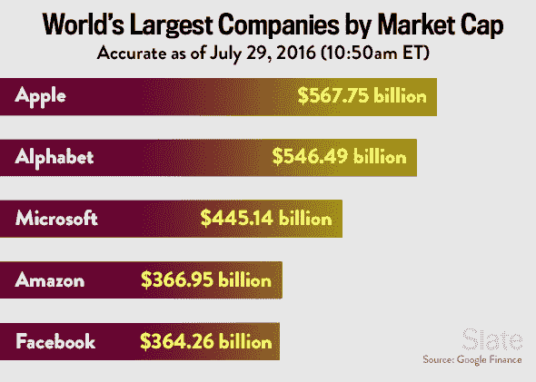

# 为什么你不能说

> 原文：<http://lacker.io/tech/2017/04/05/why-you-cant-say.html?utm_source=wanqu.co&utm_campaign=Wanqu+Daily&utm_medium=website>

最近，根据伊万·基里金的提示，我重读了这篇现已过时的保罗·格拉厄姆文章，《T2，你不能说的话》。如同[斯特劳斯阅读](http://lacker.io/books/2017/03/26/straussian-reading.html)的想法，这篇文章正在寻找目前不适合公开分享的秘密真相。

> 一想到我们相信未来的人会觉得可笑的事情，就很让人兴奋。坐时光机回来看我们的人必须小心不要说什么？这就是我想在这里学习的。但是我想做的不仅仅是用今天的异端邪说来震惊每个人。我想找到发现你不能说的东西的通用配方，在任何时代。

起初，我打算深入研究，按照这篇文章中的指示，也许试图获得 meta 并把它们放在文章本身上，并找到一些秘密的真理。但是有太多的东西一次咬不下去了，最后我咬了一条切线。

具体来说，真正引发我思考的部分是这个关于禁忌来源的假设:

> 要推出禁忌，一个群体必须在软弱和强大之间保持平衡。一个自信的群体不需要禁忌来保护。对美国人或英国人发表轻蔑的言论并不被认为是不恰当的。然而，一个团体必须强大到足以执行一项禁忌。
> 
> 我怀疑道德禁忌的最大来源将是权力斗争，其中一方勉强占上风。在那里，你会发现一个强大到足以实施禁忌，但又软弱到需要禁忌的群体。

我不完全相信大多数道德禁忌来自权力斗争。我个人的怀疑是，对道德禁忌来源的最好解释来自于[社会建构论](https://en.wikipedia.org/wiki/Social_constructionism)的理论:

> 人类通过创造社会世界的模型来合理化他们的经验，并通过语言来分享和具体化这些模型。

基本上，有些真理你相信是因为它们本来就符合逻辑。如果爱丽丝、鲍勃和夏娃中的至少一个在他们的口袋里有扳手，但是爱丽丝和鲍勃没有口袋，那么夏娃有扳手。有些真理你相信，因为有经验证据。地球是圆的，因为我在 SpaceX 的视频上看到过。但是有些真相你相信只是因为别人相信。

你可能会本能地认为，哦，这是 147 种糟糕论点中的一种。但是在实践中，你相信无数的事情，不是因为逻辑，而是因为别人告诉你。

*   你不应该吃泥巴
*   红灯意味着停止
*   人的生命是宝贵的

世界上许多有用且完全真实的事实都是社会建构的。

然而，这可能会导致一个禁忌的情况。一小部分人相信 x。大部分人不相信 x。因为这两个事实都是社会建构的，所以没有基本事实。没有办法进行明智的辩论。因此，较大的群体变成了愤怒的网络暴民，并对较小的群体大喊大叫。

我相信创业建议这个话题特别容易受到这种现象的影响。你不能从基本原则推导出创业的原则。一个有效的机制是学习成功的初创企业创始人的成功之道——寻找他们在社会中构建的真理。但这只是一个很小的群体。特别是，科技行业的所有人是一个更大的群体。有时，这些群体有对立的社会建构的真理。

这里有一个例子:白板面试。白板面试是面试人的好策略，还是面试人的坏策略？

去阅读主流科技新闻或社交媒体，你会得出白板面试很糟糕的结论。从“白板访谈”的前几个搜索结果来看:

主流结论显然是白板面试不是个好主意。但是另一方面:

最成功的公司都使用白板面试。不仅仅是顶级的大公司，还有顶级的晚期创业公司，顶级的早期创业公司，每一点都是顶级的。然而，中间技术互联网是反对的。这里发生了什么事？

我觉得根本的不和谐来自于面试的性质。例如，[谷歌接受了不到 1%的求职者](https://www.quora.com/What-is-Googles-internship-acceptance-rate)。然而，谷歌在 T2 有 7 万名员工。如果我的简单数学成立，他们已经拒绝了超过 700 万人。

就我个人而言，当我去申请工作时，我认为这是一个公理，那就是我应该得到这份工作。当我被拒绝时，我通常会断定这家公司要么是笨蛋，要么是邪恶的，或者如果面试官非常友好，我会仁慈一点，只是断定这是一个有缺陷的过程。所以，是的，我可以理解为什么会有 700 万人相信谷歌面试是一个有缺陷的过程。他们知道他们是正确的，因为他们的朋友大多同意他们。但我不认为 Larry 会后悔当初没有采用白板面试。

然而，真正遗憾的是，有一次我和一位初创公司的首席技术官进行了这样的对话:

> 我:招聘怎么样？
> 
> CTO:很好，找到软件工程师没有任何困难。
> 
> 我:哇，不常听到。
> 
> CTO:是的，一旦我们筹集到我们需要的 8 个人，我们在一个月内就雇佣了他们。
> 
> 我:双哇。你的小团队是如何在一个月内完成足够的面试来雇佣 8 个人的？
> 
> CTO:哦，我们只需要面试 9 个人。
> 
> 我:啊哦。你是怎么采访他们的？
> 
> CTO:众所周知，白板面试很糟糕，所以我们只是聊了聊他们过去的经历。
> 
> 我:哦不。
> 
> CTO:我对此有很好的预感。

所以，要小心采纳创业建议的中位数。你可能会得到中等的结果。

