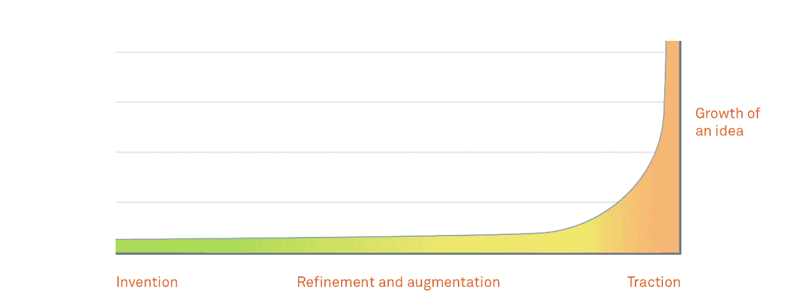
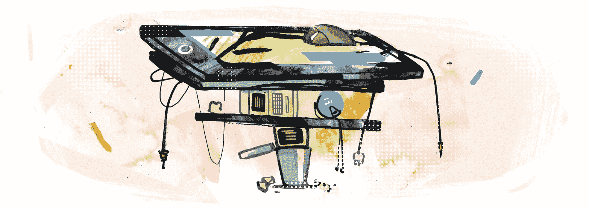
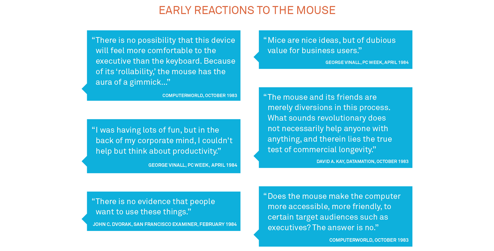

# 什么样的语音用户界面适合(什么不适合)-内部对讲机

> 原文：<https://blog.intercom.com/benefits-of-voice-ui/?utm_source=wanqu.co&utm_campaign=Wanqu+Daily&utm_medium=website>

语音要么是一项天才技术，它的时代终于到来了，要么是自机器人、区块链以来我们所见过的最被夸大的浪费时间，要么是时光倒流，游戏化。

现实没有那么戏剧化，而是更加微妙。现在有一个新的广泛可用的输入/输出接口来使用和设计，产品和设计人员可以做的最有用的事情是了解这在什么时候以及如何重要。

## 开始的结束

最近出现的 Alexa、Siri、Cortana 和“Okay Google”并不意味着语音“终于”到来了。恰恰相反，这意味着我们终于要出发了。概念演示、炒作周期和过度承诺的阶段已经结束。从这里开始，真正的技术支持真正的用例，或者打包回家。

有一个著名的“长鼻子”创新，每一个重要的新技术必须通过。微软研究院的首席研究员 Bill Buxton 经历了每一种新的用户界面形式，他估计从“研究项目”到完全成熟(定义为产生 10 亿美元的业务)需要 30 年。

所以这些东西需要一段时间，当它们到来时，我们不应该期望它们征服每一个现有的输入机制，它们是对它们的补充。

## 替换是罕见的

新的输入设备不会杀死它们的前辈，它们堆叠在前辈之上。语音不会杀死触摸屏。触摸屏没有杀死鼠标。鼠标没有杀死命令行。分析师渴望一种简单的叙述，即每项新技术的诞生都立即预示着前一项技术的死亡，但界面本质上是多模态的。越多越开心。每一项新技术都始于一个新的服务不足的领域，然后慢慢扩展，直到找到最适合它的所有领域。声音有一个很好的切入点…

## 胎盘

比尔·巴克斯顿引入了“地点-ona”的概念，改编了人物角色的概念([，我们都很讨厌这个名字](https://www.intercom.com/blog/when-personas-fail-you/))来展示一个地点是如何限制有意义的互动类型的。没有“一个最佳投入”或“一个最佳产出”。这完全取决于你在哪里，这反过来又定义了你有什么可以免费使用。

在一个非常简单的层面上，人类有手、眼睛、耳朵和声音。(让我们忽略“感觉”振动的能力，因为这是一种警觉——只是暂时的)。让我们来看看一些真实的场景:

*   “在图书馆里戴耳机”的地方是“不用手，不用眼睛，不用声音，不用耳朵”。
*   “烹饪”的地方是“手脏，眼睛自由，耳朵自由，声音自由”。
*   “夜总会”的位置是“不用手，不用眼，耳朵忙(你听不见)，声音忙(你可能不会说话/听不见)”。
*   “驾驶”的地方是“手忙、眼忙、耳闲、声闲”。

基于以上所述，您可以看到语音 UI 在哪些场景中是有用的，以及语音作为输入机制的一般角色。

虽然本尼迪克特·埃文斯在这条推文中将洞察力与尖锐的幽默混合在一起，但可以肯定地说，这不是声音的重点。或者说，声音在大多数地方都不是最佳的。

## 但是声音*又慢又有问题*

语音的速度和准确性比其他用户界面都要差。是的，我们说话的速度比打字的速度快，但即使是最先进的音频处理技术也仍然会让我们说话速度更慢，发音更清晰，并且仍然会导致错误。其次，听远比读慢，尤其是听数字声音。我们浏览和跳过文本的速度远远快于我们听的速度。这就是可视语音邮件如此受欢迎的原因(本尼迪克特再次指出)。

所以有两件事是清楚的:

1.  语音是一种不合标准的输入/输出机制
2.  有很多场景是最好的，因为它是唯一合适的

## 那么声音能有多大呢？

这个问题已经在无数关于这个问题的会议小组中被问过，答案通常是“视情况而定”，但我认为最好问更具体的问题:

### 多长时间一次语音更好？

今天，驾驶和“在家里走动时播放音乐”似乎很适合语音界面，但还有多少其他场景将会出现，这些用例将会走向生产力还是保持休闲？人们会希望通过 AirPods 阅读电子邮件吗？

### 音频处理/播放能有多好，什么时候？

世界上绝大多数人说话的速度都比打字的速度快，但当今的技术无法可靠地跟上。这离改变还有多远？

### 真正的多模态消息传递何时开始？

虽然当今大多数消息产品都包含异步语音剪辑，但它们要求消息以编写时的方式接收。用户必须就对话的媒介达成一致，但当他们处于不同的环境时，这种媒介就不起作用了。这就导致了我所说的“图书馆司机问题”:如果米歇尔在图书馆，爱丽丝在开车，他们怎么交流？

爱丽丝正在开车，所以不能使用她的手或眼睛，米歇尔不能在图书馆里说话或制造噪音。在一个理想的消息应用程序中，用户可以以他们想要的任何方式编写消息，以他们想要的任何方式消费消息，并且永远不会阻止对话的发生。

将语音引入正常的无处不在的信息传递将代表某种转折点，使人们通过在设备上说话来控制设备的想法正常化。

## 既不是平台也不是范例…

因此，虽然 [voice 不是一个平台](http://ben-evans.com/benedictevans/2014/10/1/voice-is-the-next-big-thing-in-mobile)，或者像通常所说的新的 UI 范例，但它**是**另一个新的界面，我们必须为其设计和交付，否则我们可能听起来像这些人……
