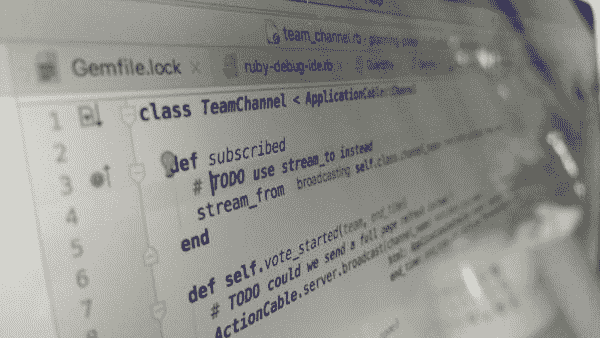
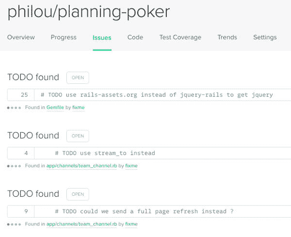
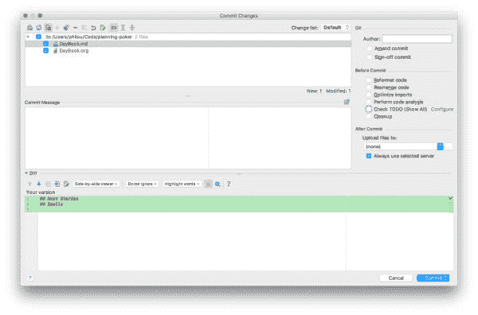

# 跟踪源代码中技术债务的无缝方法| Philippe Bourgau 的 XP 教练博客

> 原文：<http://philippe.bourgau.net/a-seamless-way-to-keep-track-of-technical-debt-in-your-source-code/?utm_source=wanqu.co&utm_campaign=Wanqu+Daily&utm_medium=website>

我最终偶然发现了一种跟踪源代码中技术债务的方法，这种方法既简单又内置于大多数工具中:简单的`TODO`注释！

## 怎么发生的？

前一段时间，我们试图在源代码中添加 [`@TechnicalDebt`](/a-plan-for-technical-debt-lean-software-development-part-7/) 注释。不幸的是，几个月后，我们得出了一个合乎逻辑的结论，即它太复杂了，不太有效:

*   它涉及太多的仪式，这吓坏了人们
*   人们不愿意改变注释周围的任何东西，而不是发出行动的号召
*   因此，它总是过时

在和我的同事讨论了一会儿之后，我们决定用简单的`TODO`注释替换所有这些注释。

当要做的重构看起来相当明显(但也为时过早)时，我们将使用一个简单明了的`//TODO (example) introduce a factory`消息。下一次，当一对搭档开始处理这部分代码时，他们会得到同伴的无声意见，以帮助他们决定如何处理这部分代码。其他时候，代码可能很糟糕，但我们还不知道该怎么做，在这种情况下，我们同意使用`//TODO SMELL (example) responsibilities are not clear in this class`，它仍然是`TODO`注释，但不是明确的行动号召。

当我开始我的[当前端项目](https://github.com/philou/planning-poker)时，我很自然地开始使用它们。他们在[代码气候](https://codeclimate.com/github/philou/planning-poker/issues)中表现得很好。

### 赞成者

关于`TODO`注释的伟大之处在于，作为一个非常古老的编程技巧，它们已经被大多数工具 [IntelliJ](https://www.jetbrains.com/) 、 [SonarQube](https://www.sonarqube.org/) 、 [Rails](http://rubyonrails.org/) 、 [CodeClimate](https://codeclimate.com) 以及我猜还有许多其他工具所支持。就在我重构到`TODO`注释的第二天，一个队友修复了一个出现在他 IDE 的 TODO 标签中的注释！

### 坏处

一些工具，尤其是 ide，倾向于假设您应该在提交任何东西之前修复所有的`TODOs`。这不完全是我们如何使用它们来跟踪持久的技术债务。所以这是你需要记住的一件事。

另一方面，Sonar 之类的工具会给代码中的任何`TODO`分配一个固定的修复成本，但通常情况根本不是这样！

## 如何在您的项目中设置它

正如你可能猜到的，这很容易。只要开始在代码中添加`TODO`注释…

### 团队智慧

不过，首先与你的同事一起验证这种做法是值得的。有许多方法可以做到这一点，这取决于您团队的工作习惯:

*   使用你的团队 [Slack](https://slack.com/) (或任何你使用的聊天室)来分享这个帖子的链接，并创建一个是/否投票
*   或者，如果您认为您需要它，创建一些 wiki 页面来解释该实践并详细说明它在您的上下文中的基本原理，添加一个是/否投票，最后与您的团队共享该页面
*   最后，如果你认为这个话题值得讨论，那就和每个人开一次会，讨论这个问题。为了使会议更有效率，事先分享关于实践的信息可能是值得的。你可以用[拇指投票](http://www.plays-in-business.com/thumb-voting/)来结束投票(上:是，下:否，侧:随便)

Photo from [Plays in Business](http://www.plays-in-business.com/thumb-voting/)

不要等全体一致才开始实践，多数就够了！确保那些投了反对票的人最终会遵循团队惯例。记住，无论答案是什么，讨论团队实践都是好的。

一旦所有的团队都同意使用(或不使用)`TODO`注释，在你的团队的编码惯例或工作协议中提及这种实践(我强烈建议在某处写下)。如果你还没有，创造一些！

大多数工具都会开箱即用地处理`TODO`。

*   Rails 附带了一个`rake notes`任务来列出`TODO`注释。
*   CodeClimate 和 SonarQube 都在其默认配置中将`TODOs`列为问题
*   大多数 ide 都有一个“TODO”标签，显示项目中的`TODO`注释
*   否则，老好人 grep 会很乐意在你的代码中找到`TODO`注释

一些工具可能需要小的调整来改善体验:

*   在 IntelliJ 中，在“提交”窗口中，取消选中“检查待办事项”复选框，以避免每次提交时都收到警告

*   SonarQube 对每个 TODO 注释使用相同的固定补救成本。这取决于您是否能根据自己的情况调整补救成本。

## 下一步是什么？

评论是追踪技术债务的良好起点。一旦你开始使用它们，你可以做一些事情:

第一，记得定期固定一些。很老的`TODO`评论是自己的技术债！使用 SonarQube 或 CodeClimate 这样的代码质量仪表板有助于持续改进您的代码。

如果您的工具允许的话，您可以考虑设置一个更简单的`//SMELL ...`而不是`//TODO SMELL ...`或者其他任何可能对您的上下文有用的特殊注释。

最后，有一个精益持续改进实践，包括在问题发生时记录问题。这样做可以帮助您的团队决定哪些技术债务热点是最需要修复的。在适当的时候，将问题与`TODO`评论联系起来。这样过了几个星期后，在回顾中遍历所有的问题，应该会发现代码的哪些部分引起了最多的麻烦。

## 编辑 2017-04-19

非常感谢您的评论！人们对我的基本设置提出了大量的改进建议:

*   其他工具的插件也支持`TODO`注释
*   激活 CodeClimate 中的问题与您的问题跟踪系统之间的自动同步
*   使用自定义注释标记
*   每次你被技术债务困扰的时候，在你的评论中添加一个“X ”,工具可以被配置为分配一个更高的严重性给有很多“X”的问题

