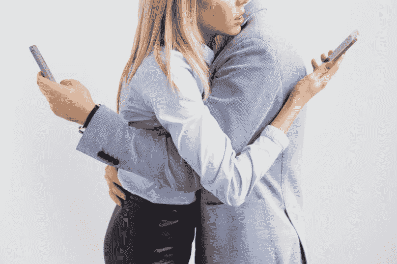

# 智能手机是新的香烟

> 原文：<https://markmanson.net/smartphones?utm_source=wanqu.co&utm_campaign=Wanqu+Daily&utm_medium=website>

如果你仔细想想，我们的注意力是我们生活中唯一真正拥有的东西。我们的[家当](/minimalism)可以走了。我们的身体会受到损害。我们的关系可能[分崩离析](/how-to-break-up-with-someone)。甚至我们的记忆和智力也会逐渐消失。

但是选择关注什么的简单能力将永远属于我们。

不幸的是，随着今天的技术，[我们的注意力比以往任何时候都被拉向更多的方向，这使得我们自己的注意力分配比以往任何时候都更困难，也更重要。](/attention-economy)

卡尔·纽波特(Cal Newport)在他的书《深度工作 中指出，长时间专注于一个项目、想法或任务的能力不仅是在信息时代取得成功的最重要技能之一，而且这种能力在人群中似乎正在减少。

但我会更进一步。我想说的是，我们专注于我们所需要的东西的能力是过上快乐健康生活的核心要素。我们都有过这样的日子，几天或几周(或几个月或几年),我们感到心不在焉——无法控制自己的现实，不断被[的无意义信息](/stupid-things)和由无尽的点击和通知组成的戏剧所吸引。

为了快乐和健康，我们需要感觉到我们在控制自己，我们在有效地利用我们的能力和天赋。 [2](#footnote-2) 要做到这一点，我们必须[控制我们的注意力](/attention-diet)。 [3](#footnote-3)

我想这就是为什么健身房的手机事件让我很生气。那些训练真他妈的难。它们要求我不仅要集中精力进行身体训练，还要进行精神训练。每 10 分钟停下来一次，因为有人需要给他们的老板发电子邮件或者发短信，他们的男朋友把我拉出来。更糟的是，这违背了我的意愿。

随着智能设备的爆炸和互联网的普及，从廷巴克图到你母亲的屁股，注意力污染正越来越多地渗透到我们的日常生活中，而我们却没有意识到这一点。

这就是为什么吃饭时有人在我们面前发短信，我们会感到恼火。这就是为什么当有人在电影院掏出手机时，我们会很生气。这就是为什么当有人在查看邮件而不是看球赛时，我们会变得烦躁。

他们无法集中注意力干扰了我们(已经很脆弱的)集中注意力的能力。就像二手烟伤害吸烟者周围人的肺部一样，智能手机也会伤害智能手机使用者周围人的注意力。它劫持了我们的感官。它迫使我们暂停谈话，不必要地加倍思考。它使我们失去了思路，忘记了我们头脑中正在构建的重要观点。它侵蚀了我们与他人联系和简单相处的能力，在这个过程中破坏了亲密关系。

但是吸烟的比较并没有就此结束。有证据表明，我们正在对我们的记忆和注意力持续时间造成长期伤害。同样，吸烟以一系列短期兴奋的名义损害我们的长期健康，我们从手机中获得的多巴胺刺激正在损害我们大脑的长期功能，所有这些都是以我们刚刚拍摄的食物的真正酷的新照片上获得一群[赞](/social-media-isnt-the-problem)的名义。

现在，听起来好像我反应过度了。就像我有一次糟糕的健身课，并在网上向成千上万的读者发泄。

但我是认真的。我觉得这比我们意识到的更糟。

我注意到，随着时间的推移，对我来说，坐下来写一篇这样的文章比三四年前更难了。这不仅仅是因为这些年来可利用的分心事物的数量增加了，而是因为我抵抗这些分心事物的能力似乎已经下降到我经常感觉不到 T2 在控制我自己的注意力。

这让我有点害怕。我并不是怨恨健身房里那个 10 分钟都不检查信息的女人。我讨厌自己变成了健身房里那种 10 分钟都不查看信息的人。

我很确定我不是唯一一个。

过去几年，我遇到过一些人，如果他们在社交场合不能查看手机，他们会变得非常焦虑。他们带着手机参加谈话，就像有些人带着狗上飞机一样。如果与另一个人的想法和感觉交流的必要性变得过于强烈，这是一个持续的出口。

我开始注意到，有些人觉得他们需要经常查看电子邮件或信息，才能感觉自己是一名优秀、高效的员工。不管是他们孩子的小提琴演奏会，还是在红灯前的车里，或是周六午夜的床上。他们觉得他们必须总是抓住扔给他们的每一条信息，否则他们就会失败。

我注意到有些朋友再也不能坐着看完整部电影(甚至是电视节目的几集)而不在中途多次掏出手机。那些不把手机放在盘子旁边就不能吃完饭的人。

这种事情到处都在发生，因此成为了一种社会规范。被侵蚀的注意力正在成为正常的、社会可接受的注意力，我们都在为此买单。