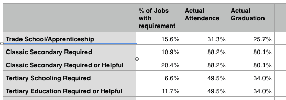

# 有多少工作真的需要大学？

> 原文：<https://devinhelton.com/how-many-jobs-require-college?utm_source=wanqu.co&utm_campaign=Wanqu+Daily&utm_medium=website>

有些人普遍认为我们需要送更多的人上大学。正如比尔·盖茨写的那样，“美国正面临大学毕业生短缺……到 2025 年，美国三分之二的工作需要高中以上学历。”

我非常怀疑这个观点。在之前的一篇文章中，我认为许多专业工作(建筑师、经理、律师)没有必要要求三到七年的高等教育。更确切地说，严格的要求是由于限制进入该行业并支撑工资的资格认证法。

在这篇文章中，我决定浏览一份美国就业电子表格，并对真正需要大学学历的工作比例做出自己的评估。我将每种职业归为以下几类:

1.  *小学或更低学历*——除了阅读、写作和基础数学，这份工作不需要任何教育。任何特定工作的培训需要不到六个月的时间。例如:卡车司机、厨师、按摩师、发型师或勤杂工。
2.  需要的职业培训–这份工作需要小学教育和一到四年的职业培训。这种培训可以通过职业学校、社区大学或学徒制来进行。例如:水管工、木匠、社会工作者、汽车修理工、音乐家、机械师、x 光技师或职业护士。
3.  普通中等教育有帮助这些是白领、领导或专业工作，受益于传统的普通高中教育。经典的高中教育包括:文笔好、文史概论、逻辑学、修辞学、普通科学、足以记账的数学等。这份工作可能还需要长达两年的特定工作培训，可以在社区大学、职业学校、在线课程或学徒期间教授。例子包括:财务顾问、行政人员、教师或营销经理。
4.  *大专学习必备*。除了传统的中等教育之外，这些职业需要一到三年的专业学习和实践，然后一个人才能在初级水平上有利可图地就业。但是，这项研究不需要在学校进行。这项研究可以自我指导，并通过考试进行认证。或者一个年轻的受训者可以在办公室兼职工作，也可以兼职自学。这方面的例子有:计算机编程、建筑师、律师或会计师。进入法律行业的传统途径是在现有律师的办公室里“阅读法律”。曾几何时，建筑师从十几岁就开始从事初级绘图员的工作。直到现代，法律才改变，要求研究在学校进行，而不是在工作场所。
5.  *大专学校必备*。这些职业需要数年的监督培训，而这不可能在工作中发生。最好的例子就是当医生。受训者必须花时间解剖尸体和做实验，然后才能被用来治疗真正的病人。

我根据自己的主观评估对工作进行了分类，而不是根据人力资源部门和法律的要求。如果你认为我错了，[这是我工作的电子表格](/assets/media/employment-matrix.xlsx)。创建您自己的副本，做出您自己的更改，并在评论部分分享它。解释为什么你认为一份特定的工作真的需要或多或少的教育。

下面是我的结果表，与实际出席率相比:

这就是了——根据我自己的主观分类，我是对的，比尔·盖茨是错的:-)我们的学校教育太多了，而不是太少。如果有人有比尔·盖茨的电子邮件地址，请把这篇文章发给他，把他链接到职业电子表格，告诉他他完全疯了。十年后，60%的工作天生就需要学位，这是不可能的。如果 60%的工作要求书面上的大学学位，这一要求将完全是人为的(由于资格认证法和竞争性信号螺旋/学位膨胀——比如 DC 的新规定，即儿童保育工作者必须拥有大学学位)。

我注意到的最令人惊讶的事情是，有多少工作几乎不需要专门的学习或培训。即使在反对大学的知识界，也流行说我们需要更多的职业教育和学徒。但是技术行业只占工作的 15%左右。大多数工作不需要特殊培训。它们是像收银员、司机、勤杂工、房地产经纪人、客户服务代理、商店店员、油漆工或劳工这样的工作。

只有不到 15%的工作比传统的高中教育需要更多的学习。这些工作中只有一部分需要通过正规学校教育，而不是自学。

有一种观点认为，大学是人们努力学习新思想和“学会如何思考”的地方——重要的不是直接技能，而是大学提供了对各种工作都有用的知识基础。

我认为这个论点在四个方面失败了:

1.  人们混淆了因果关系。大学毕业生更可能聪明和有思想，但大学并没有让他们这样——这是进入大学的首要条件。2..大学真正教人们如何思考的越来越少了。只有一小部分学生真正阅读了经典著作，接触到了各种各样的思想，或者在小组或研讨会中真正受到了思考的挑战。大学越来越成为一个敌视自由探究的环境。甚至在 15 年前，在一所常春藤联盟的学校里，我也不喜欢在课堂上说与时代精神相去甚远的话，因为这不值得冒让班上的某个人生气的风险。我听说现在问题更严重了。
2.  “学会如何思考”是小学和高中应该做的。问题是我们开始把每个人都送进高中，所以我们淡化了高中课程。现在，我们把越来越多的年轻人送进大学，淡化大学课程…
3.  大多数人不会有一条知识工作者的职业道路，在这条道路上，学习如何思考的广泛培训是有用的。他们也没有这种职业道路的天赋。

(在我的上一篇文章中，我写了更多关于“学会如何思考”的观点。)

## 想要“好”工作？直接补贴工资

一个普遍的假设是，既然受过大学教育的专业人士工资很高，如果我们希望每个人都有一份“好工作”，我们就需要让每个人都上大学。

这显然是谬误的。如何让每个人都成为工程师或律师或其他专业人士？我们会没有卡车司机和暖通空调安装工吗？这怎么可能呢？

即使软件开发人员可以发明机器人来取代暖通空调安装人员和卡车司机，也不会雇佣 1 亿名软件开发人员。仍然只有几百万软件开发人员，而其他人都需要争夺另一份工作。

当更多的人被推入大学，它很少扩大就业机会的供应。相反，该职业的工资被压低，边缘学生最终无法进入该领域。当律师曾经是一个很有吸引力的职业。但是太多的学生去了法学院，所以除了优等生，其他人的工资都下降了，工作也变得稀缺。同样，太多的学生去了研究生院，年轻的研究生的工资和工作前景变得可怕。

总的来说，边缘大学毕业生越来越觉得他们的学位没人要，没用。没人需要南俄亥俄州立大学的另一个国际关系专业。他毕业了，最终去了酒吧，或者做了设备销售，或者做了其他一百万份没有学位也能做的工作中的一份。我们在其他国家也看到了这一点——比如埃及——那里对年轻人教育的推动远远超过了经济提供专业工作的能力。

送更多的人上大学不会从根本上改变工作数量和他们的薪水。要想让工薪阶层过得更好，只有两种可能:一、[直接补贴工资](https://devinhelton.com/living-wage)。我以前写过如何做到这一点。第二，改变文化，让这些工作有更高的地位。索赔理算员或营销经理的工作并不比卡车司机或流水线厨师的工作更高尚或更优越。我们认为一个是“好工作”，而另一个是“没有前途”的工作，这是愚蠢的。过去，流行文化赞美普通工人阶级的工作，但在 20 世纪下半叶，这种情况发生了转变，大学教育成为获得地位的唯一途径。

## 真正的技能赤字

想想构成美好舒适生活的商品和服务:高科技小发明、燃气供暖、室内管道、建造良好的住宅、看熟练的医生、好餐馆、好啤酒、公园、建造良好的基础设施、漫步在有漂亮建筑的街道上，等等。如果你看看这些商品和服务的生产过程，只有一小部分工人需要大学学历。而且大多数授予的学位并没有改善生产过程——授予数百万个“商业”、“通信”或“社会科学”学位是如何带来更多更好的产品的呢？并没有。事实上，通过引导如此多的人进入大学管道，我们已经失去了创造美好生活的技能。我们失去了曾经创造美丽街景和华丽建筑细节的工匠。我们花在基础设施上的钱更少了。我们有更多的债务，更多的压力。

此外，即使在工程领域，许多知识也只存在于生产组织内部——而不存在于教科书中。每个工程师在找到工作后，都有一段很长的适应期，因为他们要学习事情是如何实际完成的。他们学习为什么教科书版本被简化或过时，他们学习真正的技术，技巧和工具，他们实际上需要知道使事情工作。

在过去的几十年里，美国在学位方面变得更受教育。但事实上，随着婴儿潮一代退休，高科技工作转移到海外，像我父亲这样的人正在培训中国工程师来取代他们。现在[福布斯告诉我们，Kindle 不能在美国制造](https://www.forbes.com/sites/stevedenning/2011/08/17/why-amazon-cant-make-a-kindle-in-the-usa/#5de892218d0b)，因为基本的技术产品在这里已经不存在了。政策专家根据人们坐在椅子上的年数来衡量技能和教育水平，他们认为我们受教育程度更高了。但如果你看看制造高科技产品所需的实际知识，这个问题就更加模糊不清了。

## 一个健全的教育体系应该是什么样的？

如果盖茨先生让我负责他的政策建议业务，以下是我极力推动的一些解决方案:

*   将学校教育与资格认证分开。目前所有需要学位的工作都应该要求知识测试。雇主不应该关心知识是如何获得的，只要申请人有知识。也许甚至会把询问大学学位信息定为非法，就像询问种族或性别是非法的一样。你可以要求知识，但不能要求学位，因为要求学位是对那些没有时间或金钱上大学的人的歧视。
*   创建一套免费的在线高中和大学学位课程，任何美国人都可以参加，并按照自己的节奏学习。人人免费大学！由于课程是在线的，政府的成本可能相当低。
*   13 岁时，给每个人一张 10 万美元的教育券。他们可以把钱花在职业学校、高中或者职业学校。如果他们在 30 岁之前没有花掉代金券，他们可以直接把它存入退休账户，或者用它来支付抵押贷款。如果有人没有利用学校教育的天赋，给他们 10 万美元，而不是把钱浪费在对他们没用的高中或大学项目上，不是更有意义吗？如果有人能高效地自学书本知识，为什么不让他们保留一些本该花在学校教育上的钱呢？
*   使学徒合同合法化和正常化。甚至更好——要求所有盈利的公司每 7 名员工雇用 1 名学徒。一旦一个人完成小学、高中或职业学校的学业，他们就可以直接申请这些学徒。学徒制通常优于 votech 学校，因为 1) votech 学校必须复制工作现场已经存在的昂贵设备；2)在学徒制中，你从实际从业者那里学习，而不是从可能已经离开该领域一段时间的老师那里。第一份工作总是最难的，强制学徒制可以直接解决大学假装要解决的问题——让下一代融入劳动力大军。

如果这些改革得以通过，普通的专业人士将会在更早的年龄就能挣到钱，并且负债更少。普通劳动者在生活中会得到高达 10 万美元的资助。整个人口的财务压力将大大减轻。

但是相反，我们让越来越多的人接受越来越多年的昂贵教育，这对所有人都是更大的伤害。