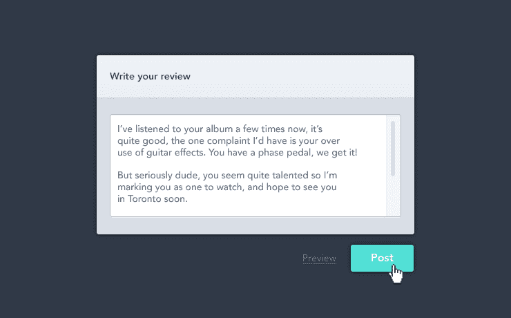

# 有没有小的变化-内部对讲机

> 原文：<https://blog.intercom.com/there-are-no-small-changes/?utm_source=wanqu.co&utm_campaign=Wanqu+Daily&utm_medium=website>

“我们希望将产品评论的长度限制在 140 个字符以内，因为我们可能会在某个阶段使用短信。这是一个很小的变化，对不对？”

不对。

当你致力于交付高质量的软件时，没有小的变化。我们来看上面的案例。一个天真的程序员很可能在三分钟内编写好这段代码——毕竟这只是一个 if 语句。

咨询行业的背景，你的时间是有报酬的，教会你在进行“小改变”之前问几个问题。让我们从一些简单的问题开始。

评论在 140 字以上会怎样？我们是裁剪字符串，还是向用户显示一条错误消息？如果我们显示一个错误，它出现在哪里？上面写了什么？谁来编写错误消息？我们如何向用户解释为什么我们把它们限制在 140 个字符以内？这些错误看起来如何？我们有定义的风格吗？如果不是，是谁在设计？

## 但是等等，还有更多…

万一我们有了上述所有问题的答案，**我们还没有完成**。仅仅在服务器端这样做是一种处理错误的混乱方式。我们应该在客户端进行。但是如果我们要进行客户端验证，我还有几个问题…

谁在编写 JavaScript？JavaScript 是否显示与服务器端代码相同类型的错误？如果没有，新的风格是什么？没有 JavaScript 它是如何表现的？我们如何确保对 140 个字符要求的任何新更新都会影响客户端和服务器端验证？

我们**还没有完成**。从用户的角度来看这个问题。由于一个他们无法理解的奇怪原因，他们不得不将评论限制在 140 个字符以内，这已经让他们很沮丧了，现在我们让他们猜猜他们的消息有多长？一定有更好的办法。让我们给他们一个字符计数器。哦，这又引出了几个问题…

## 快到了…

谁来写这个字符计数器？如果我们使用的是在网上找到的一个，那么谁会想在我们的目标浏览器中测试它(即不仅仅是 Chrome 27 和更高版本)。

还有，屏幕上显示的字母数在哪里？伯爵长什么样？当然，当用户接近零个字符时，样式应该改变，当用户使用超过 140 个字符时，样式看起来肯定是错误的——或者应该在那个时候停止接受输入？如果是这样，当他们粘贴东西的时候会发生什么？我们应该让他们编辑下来，还是提醒他们？

当我们实现了字符计数器，对所有错误进行了样式化，实现了服务器端验证，并在我们所有支持的浏览器中对其进行了检查之后，接下来的工作就是为其编写测试，然后部署它。假设你的[生产时间](https://www.intercom.com/blog/shipping-is-your-companys-heartbeat/)是稳定的，这一点将是直截了当的。

所有这些都忽略了一个事实，用户会奇怪为什么有人在他们之前写了一篇 80 字的评论，而现在他们只被允许写一篇 140 字的评论。显然，我们需要保持对这方面的支持，并更新我们的文档、API、iPhone 和 Android 应用程序。还有，我们怎么处理之前所有的评论？我们应该修剪它们，还是让它们保持原样？

不要让我开始谈论我们将如何处理这些天人们使用的所有时髦的字符……祝你用短信发送它们好运。我们可能需要清理输入字符串中的流氓字符，这意味着新的错误消息、新的服务器端代码……不胜枚举。

一旦你完成了所有这些，你就有了你自己的特征，这只是一个字符数。现在尝试一些比 if 语句更复杂的东西。当你正确地做事时，没有微小的特征。这就是为什么作为一名 UX 设计师，在你点头写下另一个要点之前，你需要很好地理解实现一个功能需要什么。

### 你不会是认真的吧…

是的，这是一个咆哮。是的，上面的大多数决定可以由有经验的开发人员即时做出，但不是全部。是的，您可以使用 maxlength，但是这只能解决上面的一个问题，而且只能在 HTML5 上下文中使用。

当没有考虑到大局时，看似两分钟的工作往往会变成两小时的工作。在两分钟的评估中看起来“物有所值”的特性在两小时后就超出了范围。

**关键点:**范围增长是分钟而不是月。照看好分分秒秒，月份自会照顾好自己。

同意功能看起来很容易。对它们进行编码很少是这样。维护它们可能是一场噩梦。当你努力追求质量时，不会有小的变化。