# 《脸书和垄断的成本——战略》,本·汤普森著

> 原文：<https://stratechery.com/2017/facebook-and-the-cost-of-monopoly/?utm_source=wanqu.co&utm_campaign=Wanqu+Daily&utm_medium=website>

无耻到令人窒息。

讲了几个笑话，总结了他的宣言，并承认了所谓的“脸书杀手”的受害者，脸书创始人兼首席执行官马克·扎克伯格在公司的 F8 开发者大会上开始了他的主题演讲:

> 你可能已经注意到，我们最近在应用中推出了一些摄像头。那是第一幕。照片和视频正变得比文本更重要。因此，在我们所有的应用程序中，摄像头需要比文本框更居中。今天我们将谈论第二幕，以及我们从这里走向何方，这与我们之前谈论过的更广泛的技术趋势有关:增强现实。

如果这看起来很熟悉，那是因为它是[的解释，就像我是五个](https://www.reddit.com/r/explainlikeimfive/)的总结 [Snap 的 S-1](https://www.sec.gov/Archives/edgar/data/1564408/000119312517029199/d270216ds1.htm) :

> 就像闪烁的光标成为台式电脑上大多数产品的起点一样，我们相信相机屏幕将成为智能手机上大多数产品的起点。这是因为智能手机摄像头拍摄的图像比键盘上输入的文本等其他形式的输入包含更多的上下文和更丰富的信息。这意味着我们愿意冒险尝试创造创新和不同的相机产品，更好地反映和改善我们的生活体验。

Snap 可能已经宣称自己是一家相机公司；扎克伯格认为这是“第一幕”，明确表示脸书打算不只是采用 Snapchat 的一个头条功能，而是采用它的整个愿景。

#### 脸书和微软

Snap 的 S-1 出来不久，我在 [Snap 的苹果战略](https://stratechery.com/2017/snaps-apple-strategy/)中写道，公司就像苹果；不幸的是，我所指的苹果并不是我们今天所熟悉的制造 iPhone 的巨头，而是被微软击败的创造 Macintosh 的弱者，这就是脸书的用武之地。

> 今天，如果 Snap 是苹果，那么脸书就是微软。正如微软的成功不是因为产品优势，而是通过利用 IBM 个人电脑带来的机会，借助蓝色巨人的东风占据生态系统的主导地位，脸书不仅在产品功能上取得了成功，还通过数字化线下关系取得了成功。而且，就像微软对苹果一样，脸书有[复制好](https://stratechery.com/2016/the-audacity-of-copying-well/)的胆量。

我在 Instagram 推出 Instagram stories 的时候写过[抄得好的胆大妄为](https://stratechery.com/2016/the-audacity-of-copying-well/)；这个产品的精彩之处在于脸书没有试图重新发明轮子。Instagram 的故事——以及现在的脸书故事、WhatsApp 故事和 Messenger Day——都是对 Snapchat 故事的直接抄袭，这不仅不是问题，实际上还是最佳策略:Instagram 的与众不同之处不是功能，而是它的网络。通过让 Instagram 的故事与 Snapchat 的故事相同，脸书将竞争缩小到谁拥有更强大的网络，[并且成功了](https://www.recode.net/2017/4/13/15278522/instagram-stories-snapchat-facebook-users-200-million)。

#### 微软和垄断

当然，微软被发现是垄断的，正如我几个月前在[宣言和垄断](https://stratechery.com/2017/manifestos-and-monopolies/)中所写的，对脸书不抱同样的想法越来越难。不过，这正是你对聚合器的期望。来自[反垄断和聚合](https://stratechery.com/2016/antitrust-and-aggregation/):

> [聚合理论](https://stratechery.com/2015/aggregation-theory/)的第一个关键反垄断含义是，由于这些良性循环，大的变得更大；事实上，在所有条件都相同的情况下，聚合理论所涵盖的市场均衡状态就是垄断:一个聚合者抓住了所有的消费者和所有的供应商。然而，这种垄断与过去的垄断有很大不同:聚合者不再通过控制供应(如石油)或分销(如铁路)或基础设施(如电话线)来限制消费者的选择；相反，消费者可以自行选择聚合平台，因为这是一种更好的体验。

这种自我选择，尤其是在“自由”平台上的自我选择，使得人们很难计算脸书表面上的垄断给社会带来了什么代价(如果有的话)。考虑一下为什么垄断是有问题的经济学 101 解释:

*   In a perfectly competitive market the price of a good is set at the intersection of demand and supply, the latter being determined by the marginal cost of producing that good:[1](#fn1-2530 "If any individual firm’s marginal costs are higher, they will go out of business; if they are lower they will temporarily dominate the market until new competitors enter. Yes, this is all theoretical!")

    [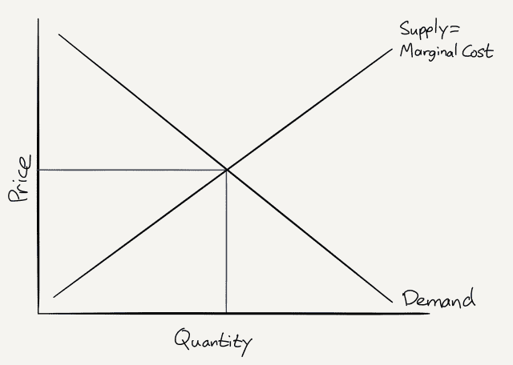T2】](https://i0.wp.com/stratechery.com/wp-content/uploads/2017/04/stratechery-Year-One-336.png?ssl=1)

*   “消费者剩余”，即消费者为一件产品可能支付的金额减去他们实际支付的金额，是在需求曲线之下但在价格点之上的区域；“生产者剩余”，即生产者出售产品的价格减去生产该产品的边际成本，是边际成本/供给曲线之上和价格点之下的面积:

    [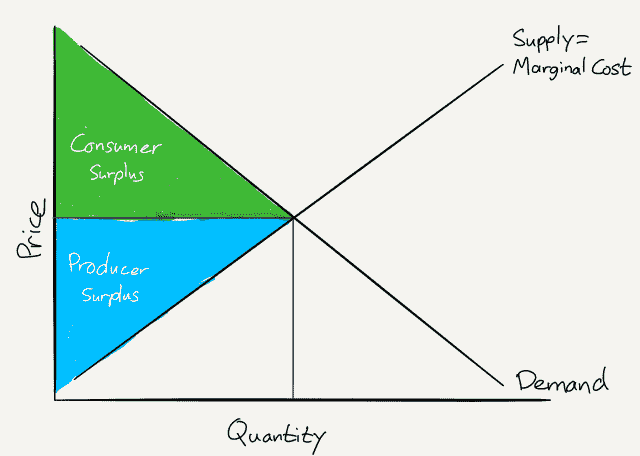T2】](https://i0.wp.com/stratechery.com/wp-content/uploads/2017/04/stratechery-Year-One-339.png?ssl=1)

*   在垄断的情况下，没有竞争；因此，垄断供应商基于利润最大化做出决策。这意味着垄断供应商不考虑需求曲线，而是考虑从销售额外产品中获得的边际收入(价格减去边际成本)，并在边际收入等于边际成本的情况下设定价格。尽管如此，最重要的是，价格是根据*需求曲线*确定的:

    [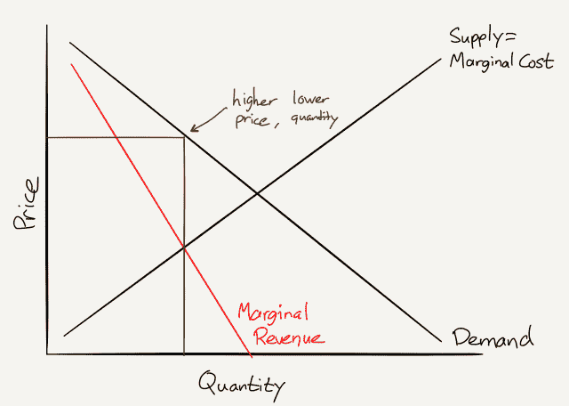T2】](https://i0.wp.com/stratechery.com/wp-content/uploads/2017/04/stratechery-Year-One-332.png?ssl=1)

*   垄断定价的结果是消费者剩余减少，生产者剩余增加；然而，作为一个社会，我们关心的原因是棕色部分:这是无谓损失。竞争市场可以满足的一些需求被忽略了，这意味着没有任何形式的过剩产生:

    [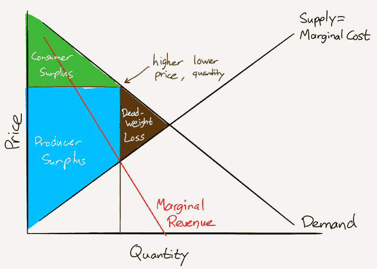T2】](https://i0.wp.com/stratechery.com/wp-content/uploads/2017/04/stratechery-Year-One-337-1.png?ssl=1)

对脸书使用这种分析的问题应该是显而易见的:对脸书来说，多服务一个顾客的边际成本是零！这意味着图表看起来像这样:

[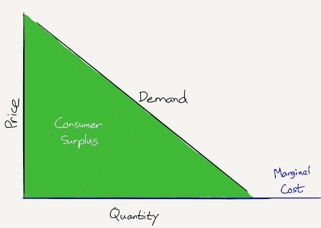T2】](https://i0.wp.com/stratechery.com/wp-content/uploads/2017/04/stratechery-Year-One-327.png?ssl=1)

可以肯定的是，脸书可能在社交网络领域占据垄断地位，尽管这可能是 Snap 或任何其他网络公司的问题，但脸书肯定会认为，无谓损失的缺乏意味着整个社会不应该太担心。

#### 脸书和内容提供商

问题是，脸书不仅仅是一个社交网络:这项服务是一个三方市场——用户、内容提供商和广告商——虽然脸书的统治地位的基础是连接所有这些用户产生的网络效应，但这种统治地位已经渗透到了其他方面。

内容提供商是一个明显的例子:脸书在 2015 年超过谷歌成为最大的流量驱动者[，截至去年秋天](http://fortune.com/2015/08/18/facebook-google/)为普通新闻网站带来了超过 40%的流量，即使在算法改变减少了出版商的影响之后。

那么，就内容提供商市场而言，这是垄断吗？我会说是的，感谢上面的垄断框架。

请注意，我们再次处于没有明确价格的情况:没有内容提供商向脸书支付张贴链接的费用(尽管他们显然可以将所述链接制作成广告)。然而，脸书确实从这些内容中赚钱，至少是间接的:用户越觉得这些内容吸引人，他们在脸书上花的时间就越多，这意味着他们会看到更多的广告。

这就是为什么 Facebook 即时文章看起来是一个如此聪明的主意:一方面，读者会有更好的阅读内容的体验，这将使他们在脸书停留更长时间。另一方面，脸书帮助出版商盈利的提议——出版商可以出售自己的广告，或者诱人的是，脸书可以以 30%的佣金出售广告——不仅会支持作为脸书三方市场一方的内容提供商，还会将他们锁定在脸书，让他们获得无法从其他地方获得的收入。我想象的市场应该是这样的:

[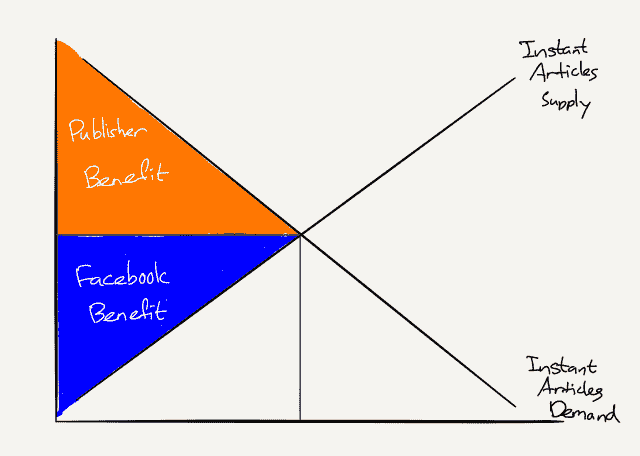T2】](https://i0.wp.com/stratechery.com/wp-content/uploads/2017/04/stratechery-Year-One-338.png?ssl=1)

然而，即时文章并没有像我预期的那样:消费者的利益是存在的，但脸书在利用他们的出版商赚钱方面完全失误了。这并不是说脸书整体上没有盈利，部分原因是内容，而是该公司没有分享的动力。或者，换句话说，脸书把大部分盈余留给了自己:

[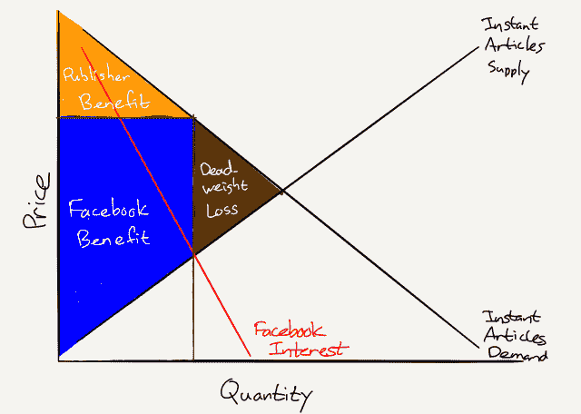T2】](https://i0.wp.com/stratechery.com/wp-content/uploads/2017/04/stratechery-Year-One-327-1.png?ssl=1)

在这种情况下，并不是脸书在设定一个更高的价格来最大化他们的利润；相反，他们分享的收入更少了；然而，结果是一样的——利润最大化。请记住，这种方法在竞争激烈的市场中是不可能的:在内容投放方面，如果脸书真的有竞争对手，脸书将不得不分享更多的收入，以确保所述内容在其平台上。然而，事实上，脸书在关注度方面占据着主导地位，它根本不需要为出版商做任何事情(而且，如果上述出版商发布即时文章，他们仍然会放置链接，用户无论如何也不会去任何地方)。

#### 脸书和广告商

在广告中可能会出现类似的证据——脸书能够以提高价格从而增加利润的方式减少供应。在一个完全竞争的市场中，广告成本看起来像这样:

[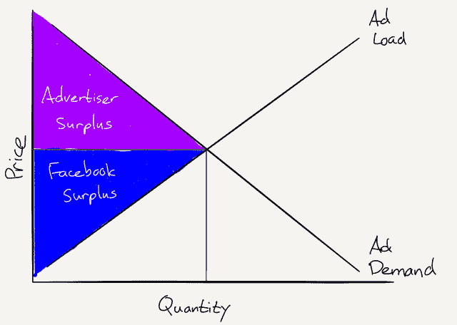T2】](https://i0.wp.com/stratechery.com/wp-content/uploads/2017/04/stratechery-Year-One-337.png?ssl=1)

然而，脸书将很快限制数量，或者至少限制其增长。在去年 11 月的收益电话会议上，首席财务官戴夫·韦纳(Dave Wehner)表示，脸书将在 2017 年夏天停止增加广告负载(即脸书长期以来一直在增加相对于新闻内容的广告数量，但将停止这样做)。不清楚的是——正如我当时在提到的[，韦纳在回答这个问题时闪烁其词——这是否会导致每条广告的价格上涨。](https://stratechery.com/2016/microsoft-teams-versus-slack-facebooks-earnings/)

有两个可能的原因让 Wehner 闪烁其词:

*   价格不会上涨，这对脸书来说是一个不好的信号:这意味着尽管有脸书的所有数据，他们的广告并没有区别，本来会花在脸书的钱只会花在其他地方
*   价格将会上涨，这将意味着脸书的广告是差异化的，这样脸书就可以通过限制供应来增加利润

把第二种可能性用图表的形式表现出来:

[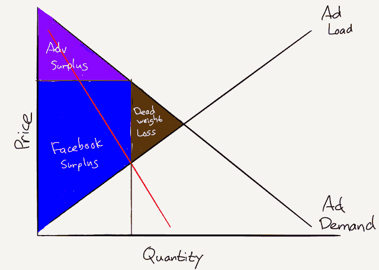T2】](https://i0.wp.com/stratechery.com/wp-content/uploads/2017/04/stratechery-Year-One-332-1.png?ssl=1)

请注意，脸书已经表示，收入增长将因为这一变化而放缓；不过，这与拥有垄断权力并不矛盾。垄断者寻求利润最大化，而不是收入最大化。或者，这可能只是脸书担心用户体验；看到该公司的底线如何随着这些变化而变化将是非常有趣的。

#### 垄断和创新

然而，即使脸书在内容发现和分发以及数字广告方面拥有垄断力量，这对用户来说真的是个问题吗？这可能是一件好事吗？

脸书董事会成员彼得·泰尔肯定是这样认为的。在《零比一》中，泰尔不仅明确指出垄断企业是理想的，还说我上面使用的模型没有用，因为它们假设了一个静态的世界。

> 在静态世界中，垄断者只是收租人。如果你垄断了某样东西的市场，你就能抬高价格；其他人将别无选择，只能向你购买……但我们生活的世界是动态的:发明新的更好的东西是可能的。创造性的垄断者通过给世界增加全新的丰富类别给消费者更多的选择。创造性垄断不仅对社会其他部分有益；他们是让它变得更好的强大引擎。
> 
> 新垄断企业的活力本身就解释了为什么旧垄断企业不会扼杀创新。随着苹果 iOS 的崛起，移动计算的崛起极大地削弱了微软几十年来的操作系统统治地位。在此之前，IBM 六七十年代的硬件垄断被微软的软件垄断超越。在 20 世纪的大部分时间里，美国电话电报公司垄断了电话服务，但现在任何人都可以从任何数量的提供商那里获得廉价的手机套餐。如果垄断企业的趋势阻碍进步，它们将是危险的，我们反对它们是正确的。但进步的历史是更好的垄断企业取代现有企业的历史。垄断推动进步，因为几年甚至几十年的垄断利润承诺为创新提供了强大的激励。然后垄断企业可以继续创新，因为利润使他们能够制定长期计划，并资助雄心勃勃的研究项目，而这些项目是陷入竞争的企业做梦也想不到的。

问题是泰尔的例子反驳了他自己的观点:像美国电话电报公司、IBM 和微软这样长达几十年的垄断对我来说肯定是件坏事！当然，它们最终被推翻了，但不是在榨取租金之后，更糟糕的是，在多年的压制创新之后。想想微软:该公司在 R&D 上花费了数十亿美元，并给了无数未来科技的演示；实际上市的最成功的产品(Kinect)最终伤害了它应该帮助的产品。 [2](#fn2-2530 "I’m referring to the fact the Xbox One had a higher price and lower specs than the PS4, thanks in large part to the bundled Kinect")

事实上，很难想出任何例子，在这些例子中，既有的垄断企业生产的技术不会是自由市场生产的；泰尔错误地将新公司创造新垄断企业的动力与旧垄断企业为所欲为的权利混为一谈。

这就是为什么脸书不仅窃取了 Snapchat 的功能，还窃取了它的整个愿景，这让我很不爽，尽管这有很好的商业意义。我确实认为以这种方式利用该公司的网络垄断会损害创新，同样的垄断图解释了为什么。在竞争激烈的市场中，创新的回报满足了客户的需求，以确定创新的数量以及谁能从中获益:

[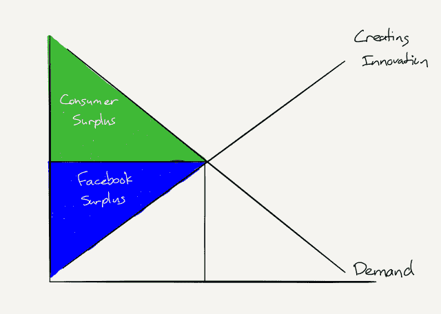T2】](https://i0.wp.com/stratechery.com/wp-content/uploads/2017/04/stratechery-Year-One-330.png?ssl=1)

然而，垄断并不需要创新的动力——或者更准确地说，不需要从创新中获利，这导致了懒惰的支出和优先考虑技术演示而不是运输产品。毕竟，垄断可以简单地利用他人的创新，赚取比其他方式更多的利润:

[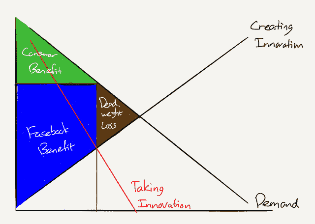T2】](https://i0.wp.com/stratechery.com/wp-content/uploads/2017/04/stratechery-Year-One-334-1.png?ssl=1)

这就是为什么昨天的主题演讲如此令人失望。去年，在脸书意识到它可以利用自己的网络来压制 Snap 之前，马克·扎克伯格在他的演讲中花了大部分时间来阐述脸书想要创新的所有领域的长期愿景。今年的情况大不相同:没有愿景，只是大规模采用 Snap 的产品，还有一大堆技术演示，但这些演示从来没有告诉我们，它们为什么对脸书的用户真的很重要。至少在一段时间内，这是可行的，但毫无疑问，脸书是唯一的赢家。

### *相关*