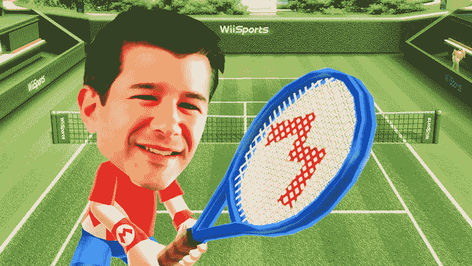
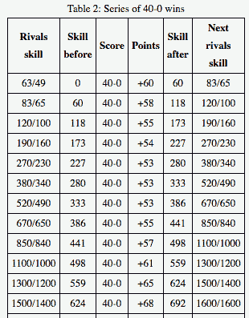

# 优步的 CEO 真的是第二好的 Wii 运动网球选手吗？Ars 技术

> 原文：<https://arstechnica.com/gaming/2017/04/was-ubers-ceo-really-the-second-best-wii-sports-tennis-player/?utm_source=wanqu.co&utm_campaign=Wanqu+Daily&utm_medium=website>

[Enlarge](https://cdn.arstechnica.net/wp-content/uploads/2017/04/uber-wii-tennis.jpg) /

“球场是空的，因为所有潜在的竞争对手都害怕面对我。”

奥里奇·劳森

上周末的

[*New York Times* profile](https://www.nytimes.com/2017/04/23/technology/travis-kalanick-pushes-uber-and-himself-to-the-precipice.html?_r=0)

优步首席执行官特拉维斯·卡兰尼克

[plenty of important revelations](https://arstechnica.com/apple/2017/04/tim-cook-once-slapped-uber-on-the-wrist-for-breaking-the-app-store-rules/)

关于卡兰尼克和他经营的公司，两者都被

[facing some tough PR lately](https://arstechnica.com/apple/2017/04/tim-cook-once-slapped-uber-on-the-wrist-for-breaking-the-app-store-rules/)

。但是有一句偶然的，几乎是被抛弃的台词让我停了下来:

> "在其他个人爱好方面，他曾是任天堂 Wii 网球游戏机的世界第二高分保持者。"

这一行让我困惑，原因有很多，尤其是“Wii 网球”中“高分”的概念没有多大意义。声称在 Wii Sports*网球中获得“世界第二高的分数”就像声称在 *Pong* 中获得第二高的分数一样，仅仅是基于与电脑和你的朋友进行比赛。缺乏某种认可的锦标赛或合乎逻辑的第三方排名系统，这种说法根本无法解析。*

然而，这种吹嘘却异常具体。根据《T2 时报》的报道，卡兰尼克并没有赢得世界上最好的“Wii 网球”分数。他取得了*第二名*的最好成绩。如果这只是一个寓言式的吹嘘，为什么要把自己限制在第二位呢？如果不仅仅是吹嘘，谁是第一？

更重要的是，记录文件不会用“他说”或“他声称”来对冲其声明卡兰尼克的“Wii 网球”高分是事实，这篇文章的作者迈克·艾萨克[在 Twitter](https://twitter.com/mikeisaac/status/856222701966544902) 上说这是“三重来源”。(艾萨克没有回应进一步的置评请求。)

在过去的几天里，我花了相当多的时间来研究这句话。事实证明，要弄清卡兰尼克的 *Wii Sports* 技能，需要钻研人类记忆的变幻莫测、逆向工程的渐进平衡系统以及视频游戏成就本身的语义。

## 萨卡看到了什么

 

[放大](https://cdn.arstechnica.net/wp-content/uploads/2017/04/sacca.jpg) /

法官大人，我想传唤萨卡先生出庭作证...

虽然**《纽约时报》*给了它一个新的关注，卡兰尼克声称的“Wii 网球”第二高的分数并不是一个新的。这一陈述至少早在 2013 年就出现在优步的“关于”页面上，除了其他成就，该网站还称卡兰尼克“不知何故”...还设法获得了世界上第二高的 Wii 网球分数。游戏，设置，匹配。”上个月,[在《芝加哥论坛报》的一篇文章](http://www.chicagotribune.com/bluesky/technology/ct-uber-ceo-argues-with-driver-20170301-story.html)中也提到了这个自夸。

在 2014 年*的一次英国《金融时报》*采访中，卡兰尼克还自称是“*愤怒的小鸟*全国第七。”在所有这些简介中，自吹自擂被认为反映了在其他人不太重视的追求中获胜的更广泛的动力。“如果有人给我一个休闲游戏，并对我说，‘好吧，这是世界纪录’，我会一直玩下去，直到我到达那里，”卡兰尼克告诉《金融时报》的记者。

关于“Wii 网球”故事的更多细节，我们需要依靠克里斯·萨卡，这位([最近退休的](http://www.cnbc.com/2017/04/26/chris-sacca-is-retiring.html))硅谷投资者通过美国广播公司的*鲨鱼池*而变得家喻户晓。在[的一篇 2015 年中期文章](https://medium.com/@sacca/why-i-would-never-want-to-compete-with-travis-kalanick-64e5f0218362)中，萨卡用一则“Wii 网球”轶事来突出卡兰尼克的极端竞争力。

据说，在一次与朋友和家人的假日聚会中，萨卡的父亲向卡兰尼克挑战“一场友好的 Wii 网球赛”老萨卡在卡兰尼克面前坚持了下来...直到这位优步高管透露，他用的是弱手。“带着十足的公主新娘的派头，”正如萨卡所写的那样，卡兰尼克改用他的惯用手，继续赢得每一分。

接下来是萨卡故事的关键细节，卡兰尼克试图“提供”...“给被击败的对手一点安慰:

> “我要坦白一件事，萨卡先生。“我以前玩过相当多的 Wii 网球，”卡兰尼克说。一边说话，他一边用控制器浏览 Wii 上的设置页面，找到一个高分列表。“事实上，”他继续说道，“在 Wii 网球全球排行榜上，我目前并列世界第二。”

看了这个详细的解释，只是在我的脑袋里敲响了更多的警钟。Wii Sports 并不像 Sacca 声称的那样有任何“全球排行榜”。系统或游戏上没有“设置页面”让你在线上和其他人比较你的表现。我真的[写了一本关于 Wii](https://www.amazon.com/dp/B002V1H0EU/?tag=arstech20-20) 的参考书，其中 *Wii Sports* 写了整整一章，所以我对这一点很有信心。

然而，Sacca 在引用“Wii 网球全球排行榜”时似乎也很自信。这是他近年来在一次会议上和播客中重复的故事，两次都引用了“全球排行榜”。

Sacca 在 2016 年碰撞会议上与 CNN Money 讨论“任天堂 Wii 的故事”。

我拼命想出一些与萨卡所见相符的解释。他们可能在玩 Wii 运动俱乐部的 Wii U 再发行版*，而*的*有在线多人和地区排行榜吗？萨卡说故事发生在“我相信是 2010 年的元旦”，远在 Wii U 上市之前，所以这没什么帮助。*

他们有可能在 Wii 上玩另一个网球游戏吗？毕竟，像艺电的*大满贯网球*和世嘉的*虚拟网球 2009* 似乎都有在线竞争。这也感觉不太可能； *Wii Sports* 自 2006 年推出以来一直是 Wii 的一款套装游戏和主要系统销售商，以至于“Wii Tennis”可以被安全地假设为该游戏中的网球模式(尽管在这种情况下，为了清晰起见，措辞令人沮丧)。

也许卡兰尼克已经通过 Wii 的网络浏览器导航到了某种在线乐谱列表？有几个网站维护着一些 Wii 运动的训练模式和游戏的“技能等级”的高分列表然而，Sacca 在多次讲述中特别提到它是“Wii 上的设置页面”，训练模式分数似乎不是这种吹嘘的焦点(Twin Galaxies，业界最接近官方记分员的东西，[表示不知道](https://twitter.com/twingalaxies/status/856233609237114880)Sacca 指的是什么，它的价值是什么)。

由于迫切需要更多的细节，我[联系了 Sacca](https://twitter.com/KyleOrl/status/856339201004109824) 来确认和解释他故事中的一些细节，特别是关于“排行榜”的细节令我惊讶的是，他居然回应了。你可以在上面链接的 Twitter 帖子中看到我们的整个讨论，但这里是他回复的核心内容:

> 我向你保证当时有一个世界排名。我刚刚和在场的其他朋友和家人核实了一下。我们清楚地记得它的原因之一是，我们就#1 实际上是不是一个黑客进行了长时间的讨论。我们详细讨论了侵入 top spot 是对软件本身的渗透还是对控制器的机械侵入。
> 
> 我们还记得他并没有独占#2。他和其他人绑在一起。这再次凸显了#1 是一个潜在的黑客。抱歉，在你追捕的时候，我没什么可以提供的。

似乎很明显，萨卡(显然还有他的朋友和家人)清楚地记得看到卡兰尼克在《Wii 网球》的某种“世界排名”上名列第二。然而，同样清楚的是，在 Wii Sports 的最初版本中，从来没有任何游戏内在线排名。这是怎么回事？

## 输入“技能等级”

对 *Wii Sports* 网球技能等级算法进行逆向工程所需的大量数据收集的小样本。

虽然 *Wii Sports* 没有任何在线排行榜，但它确实有一个游戏内衡量每个组成运动进展的指标。这种“技能水平”是一种 [Elo 风格的](https://metinmediamath.wordpress.com/2013/11/27/how-to-calculate-the-elo-rating-including-example/)表现衡量标准，根据你对计算机控制的人工智能的表现而上下浮动。

技能水平是最接近总体“分数”的东西，在 Wii Sports 中提到它是有意义的，尽管我认为称它为“分数”在最坏的情况下是不正确的，在最好的情况下是误导的。无论如何，我相信对这种技能水平的困惑可能是卡兰尼克和萨卡的“Wii 网球”主张的核心。

我能找到的关于 Wii Sports 网球技能等级系统的最详细和准确的分类是这里的 T2。完整的解释需要一些非常详细的数学计算，所以这里有一个简短的总结:

在 *Wii Sports* 中，你使用的每一个 Mii 都是从零技能等级开始的。每当你击败一个电脑对手，技能水平就会根据你在那场比赛中的分数和对手的(模拟)技能水平而增加。

你的下一个电脑对手的技能水平随着你的技能水平上升，直到你面对游戏中排名第一的电脑对手 Elisa 和 Sarah，他们的技能水平分别为 2000 和 1900。

<iframe type="text/html" src="https://www.youtube.com/embed/wduL3q0ldg8?start=0&amp;wmode=transparent" frameborder="0" allowfullscreen="">视频</iframe>

这就是在 *Wii Sports* 网球赛中与最难对付的电脑对手比赛的样子。

一旦你到了 Elisa 和 Sarah，技能等级增加的速度会很快达到一个收益递减的点。在技能等级为 2300 的情况下，每赢一场游戏，你最多可以获得五个技能等级。到了 2350 级，你每赢一场最多可以赢两级。从技能等级 2398 到 2399 需要连续 14 场完美的比赛。

总的来说，要达到 2399 的技能等级，至少需要战胜计算机人工智能 160 场，而且这只是在你能够与游戏可能扔给你的最强大的计算机对手进行几十场完美的 40 比 0 比赛的情况下。*