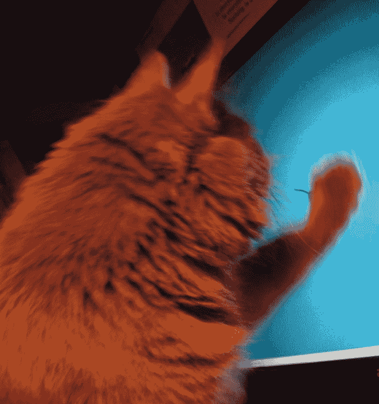
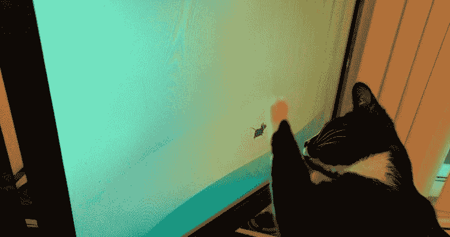

# 这个 Xfce Bug 正在破坏用户的显示器——OMG！Ubuntu！

> 原文：<https://www.omgubuntu.co.uk/2017/03/xfce-wallpaper-cat-bug?utm_source=wanqu.co&utm_campaign=Wanqu+Daily&utm_medium=website>

用于 Linux 的 Xfce 桌面环境可能快速而灵活——但是它目前受到一个非常严重的缺陷的影响。

GNOME 和 KDE 的轻量级替代品的用户报告说 Xfce 中默认壁纸的选择**会损坏笔记本电脑的显示器**和 LCD 显示器。

有确凿的照片证据支持这些说法。

### Xfce 错误号 12117

*“默认桌面启动画面导致显示器损坏！”*T4 的一名用户尖叫道，Xfce bugzilla 上的一个 bug 归档。

“defualt 壁纸让我的动物撕掉了我 LED 显示器上的所有塑料！我们可以选择不同的壁纸吗？我不能指望抓痕和你没有？让我们在这里结束鼠标游戏。”

[T2】](https://149366088.v2.pressablecdn.com/wp-content/uploads/2017/03/cat-xfce-bug-2.jpg)

这个缺陷——或者应该是爪形的？—也不仅限于一个用户的桌面。其他用户已经能够重现这个问题，尽管不一致，因为这第二个，一个受影响的 Reddtior 的独立照片证明:

目前还不清楚这是 Xfce 的还是猫的。如果是后者，解决问题的希望就没有意义了；就像廉价的安卓手机一样，猫无法从他们的 OEM 那里获得升级。

> 对于在其他 Linux 发行版上使用 Xfce 的用户来说，前景就不那么乐观了

幸运的是，Xubuntu 用户没有受到索赔问题的影响。这是因为基于 Xfce 的 Ubuntu 风格自带无鼠标桌面壁纸。

但是对于其他 Linux 发行版上的 Xfce 用户来说，前景就不那么乐观了。

已经提出了一个补丁来解决这个问题，但是还没有被上游接受。如果你担心 12117 号错误，你可以在你自己的系统上手动应用这个补丁，方法是下载下面的图片并将其设置为你的壁纸。

[T2】](https://149366088.v2.pressablecdn.com/wp-content/uploads/2017/03/xfce-dog-wallpaper.jpg)

***经由**/[r/Linux](https://www.reddit.com/r/linux/comments/60rzjn/my_cat_was_fooled_by_xfce/)T5】*

[首页](https://www.omgubuntu.co.uk/)T5】随机 **这个 Xfce Bug 是在破坏用户的监视器**

