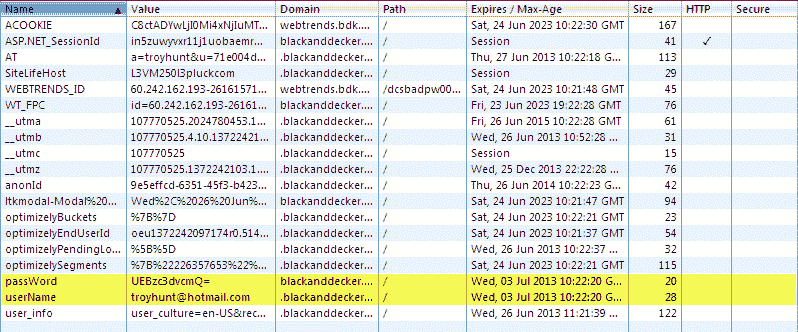
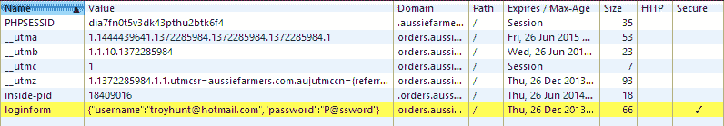
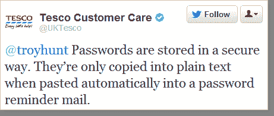
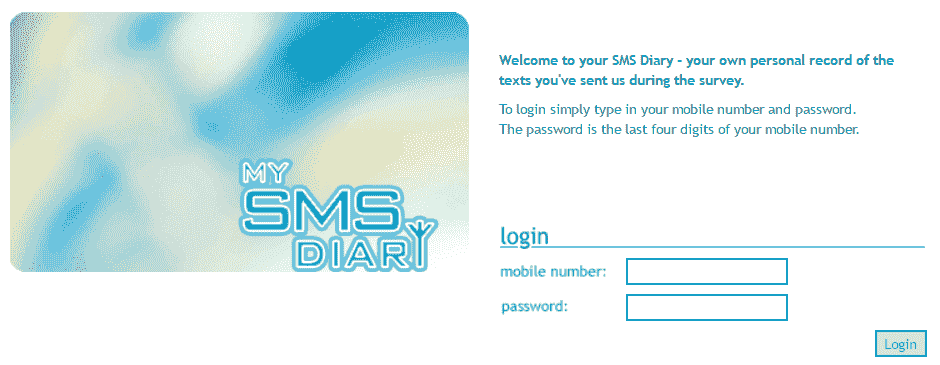
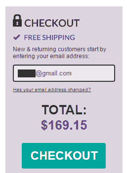
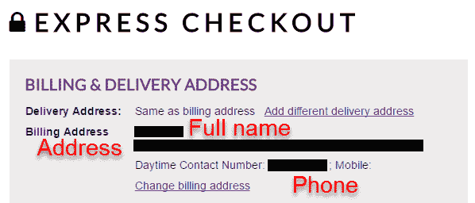
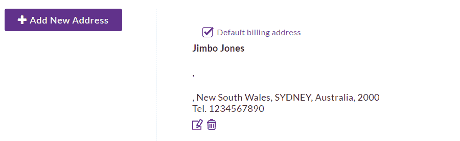

# 特洛伊·亨特:估计你见过一些愚蠢的安全措施吧？给，拿着我的啤酒...

> 原文：<https://www.troyhunt.com/reckon-youve-seen-some-stupid-security-things-here-hold-my-beer/?utm_source=wanqu.co&utm_campaign=Wanqu+Daily&utm_medium=website>

我的朋友 Lars Klint 前几天分享了这条推特:

很自然地，[我把它传给了](https://twitter.com/troyhunt/status/853517036131041280),因为让我们面对现实吧，那里正在发生一些疯狂的事情。对此，推特上的回应是同样的极度恐惧和指责，因为他们没有把这看作是在 Reddit 上流传的一个笑话[。但事情是这样的——这是可行的。不，真的，我已经看到了一些*非常*愚蠢的安全东西，就像上面的例子不仅可信，而且可能。不相信我？给，拿着我的啤酒...](https://www.reddit.com/r/ProgrammerHumor/comments/65l9yq/logins_should_be_unique/)

## 《请记住我》

比方说，你想建立一个“记住我”的功能，你知道，就是你勾选这个框，然后当你下次回到网站时，你已经登录了。[以下是布莱克和德克尔的做法](https://www.troyhunt.com/how-to-build-and-how-not-to-build/):

是的，这只是 cookie 中的 Base64 编码版本的密码，是的，它在每个请求中都被不安全地发送，而且是的，它没有被标记为“安全”,因此它被明文发送。

你觉得这不好吗？试试我在同一篇文章中提到澳大利亚农民指导:

哦哇，安全了！但它仍然是 cookie 中的密码，仍然不是 HTTP only *和*他们在网站上反映了 XSS 的风险。一旦被告知，他们是如何回应的？这使我想到了下一点...

## 企业反应

早在 2013 年，我就尽职尽责地让澳大利亚农民了解了这种风险。我还建议他们也许不应该用电子邮件发送密码(还有其他一些非常讨厌的东西)，对此我从一个头衔为“营销经理”的人那里得到了以下解释:

> 到目前为止，我们还没有一个安全问题是由新客户被电邮密码引起的，我知道事实上我个人注册的 90%的网站也遵循同样的过程。

这让我想起了前几天我在 HTTPS 新课程的帖子中提到的国际石油天然气公司的评论。这是他们变得暴躁的地方，因为 Firefox 现在会在登录表单加载不安全时警告用户:

> 你的通知不安全的密码和/或登录自动出现在登录我的网站，石油和天然气国际不是想要的，并在未经我们允许的情况下放在那里。请立即删除它。我们有自己的安全系统，15 年来从未被攻破过。你的通知引起了我们订户的关注，对我们的业务不利。

他们的网站在那之后不久就停止了工作(SQL 注入的风险可能没有帮助)。他们现在回来了，虽然还不清楚他们是否已经重置了整个“15 年”的时钟。

当我们谈论无意义的安全评论时，[英国天然气公司在过去也挣扎过一段时间](https://www.troyhunt.com/the-cobra-effect-that-is-disabling/):

当我们身处世界的那个角落时，很难忽略乐购作为推特上企业疯狂的一个例子:

但是，嘿，安全密码重置是很难的！不，真的，看看这个...

## 密码重置

一切都是从这个开始的:

现在你可能会想，“哦，你的用户名就是你的电子邮件地址，Betfair 会给你发一封电子邮件，你可以通过一个独特的链接重置密码”，但现在你知道这种想法太符合逻辑了，不能在这里出现。但令人惊讶的是，必发实际上并不相信保罗，所以我制作了一个视频来解释这一点:

<iframe src="https://www.youtube.com/embed/YjBBmfovL08?feature=player_embedded" frameborder="0" allowfullscreen="">VIDEO</iframe>

听起来确实如此——如果你知道某人的电子邮件地址和出生日期，你可以将他们的密码重置为你想要的任何密码。但是，在这次交流中，Betfair 善意地建议说，如果 Paul 将他的电子邮件地址和出生日期告诉其他任何人，他将违反他们的条款，我认为这是一本正经。

你知道他们真正需要什么吗？安全问题...

## 安全问题

我就把这个留在这里:

什么？太笼统？试试这个:

因为安全问题太疯狂了！我的意思是，这些都是额外的坚果，但总的来说，整个想法要么是不变的数据，如你母亲的娘家姓，要么是可列举的问题，如你的第一辆车的品牌，要么是短暂的，如你最喜欢的电影...仅仅是安全问题的想法就值得在这篇文章中占有一席之地！让我们试试更理智的方法...

## 注册

你知道什么很难吗？密码。要是有更简单的方法就好了:

在你说“但这只是一条推文，甚至可能不是真的”之前，它*是真的*而[这里是它的 archive.org 快照](https://web-beta.archive.org/web/20150117203933/mysmsdiary.co.uk):

在我们都失去了“密码必须死”的想法之前，还没有人想出如何让它发生！有很多技术上的解决方案没有人真正想使用，简单的事实是，我们比以往任何时候都有更多的密码，他们不会去任何地方。但是，嘿，我见过更糟的...

## 人身安全

没有一种方法能让这个问题看起来更荒谬，所以我就直说了:

你知道真正让我来到这里的是什么吗？想想你的非技术朋友和亲戚，他们只是想让电视和 DVD 播放器一起工作。他们走进商店，拿起两根 HDMI 电缆，翻到盒子的背面。他们正在比较规格-其中一个有防病毒保护，另一个没有-他们会怎么做？！

现在，还有一件事...

## 帐户枚举

我想把最好的留到最后。这是最好的，因为它仍然是一个活跃的愚蠢的安全问题，这是不可思议的愚蠢，但嘿，至少他们正在修复它:

但在撰写本文时，那已经是 8 个月前的事了。这个愚蠢的安全措施是什么？想象一下:你去草莓网扔一些营养乳液或者干的爽身粉或者其他我不知道的东西到你的购物车里，然后点击结账按钮。您现在看到的是:

所以你输入一个电子邮件地址——任何在网站上有账户的电子邮件地址——之后，你会看到，嗯，别人的个人数据:

等等-什么？！这正是它看起来像，因为他们会交出任何人的个人资料与电子邮件地址在系统上。那里也有很多人，因为[他们是世界上最大的 5000 个网站中的一员](https://www.alexa.com/siteinfo/strawberrynet.com)所以你可以直接进入，输入一个女性名字(他们主要是卖化妆品的),然后输入一个流行的电子邮件服务，你就到了！如果你在想“这太可怕了”，不，这实际上是一个功能:

> 请注意，在我们完成的调查中，绝大多数客户喜欢我们的系统没有密码。使用您的电子邮件地址作为密码就足够安全了。

不不是的。不，他们没有！我在八月份写了关于网站列举疯狂的文章，这是他们早期推文的宣传内容，他们似乎完全没有意识到这个问题。我甚至自己创建了一个帐户来检查它是如何工作的:

我想我需要再来一杯啤酒...

