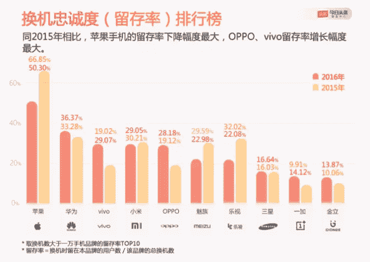

# 苹果的中国问题——本·汤普森的策略

> 原文：<https://stratechery.com/2017/apples-china-problem/?utm_source=wanqu.co&utm_campaign=Wanqu+Daily&utm_medium=website>

你听说新的微软 Surface 笔记本电脑了吗？[通常怀疑](https://twitter.com/reckless/status/859448810187235330)声称它是 MacBook 的竞争对手，这是真的，因为它是一台笔记本电脑。不过，事实上，Surface Laptop 根本不是 MacBook 的竞争对手，原因很明显，它运行的是 Windows，而 MacBook 运行的是 MacOS。这一直是苹果商业模式的基础:[通过软件区分硬件](https://stratechery.com/2016/everything-as-a-service/)，这样所述硬件可以比运行商品操作系统的名义竞争对手获得更大的利润。

此外，优势超越了利润:理解苹果利润和它的许多选择的最佳方式是理解该公司不仅在 MacOS 上垄断了 T1，更重要的是在 iOS 上垄断了 T1。这意味着苹果不仅能在硬件上获得消费者剩余，还能在应用销售上获得开发者剩余；一些应用没有被生产出来是苹果选择承担的无谓损失[以确保完全控制](https://stratechery.com/2013/why-doesnt-apple-enable-sustainable-businesses-on-the-app-store/)。

然而，就监管者而言(这是正确的)，iPhone 只是另一部智能手机，MacBook 确实在与 Surface 笔记本电脑竞争。功能基本相同，如果用户重视用户体验中的持续优势，苹果理应获得随之而来的利润和权力。

#### 苹果的收益

苹果昨天公布了第二季度财报；从[彭博](https://www.bloomberg.com/news/articles/2017-05-02/apple-sells-fewer-iphones-in-latest-quarter-as-consumers-wait):

> 苹果公司(Apple Inc .)报告 iPhone 销量下降，突显出该公司要想抵御三星电子(Samsung Electronics Co .)等竞争对手，就需要在下一代旗舰设备中推出重磅新功能。在定于今年晚些时候进行的 iPhone 重大改进之前，投资者的信心一直在增强。然而，竞争对手最近发布了新的高端智能手机，给苹果带来了压力，要求其推出一款足够先进的设备，以吸引现有用户升级并吸引新客户。

哦看哪！这是我刚才抱怨的一个例子:是的，三星制造智能手机，是的，它们具有高端功能。但是——这是上一次三星被认为是 iPhone 的威胁时被遗忘的一点——*三星智能手机不运行 iOS。*这一直是苹果的王牌，上个季度也是如此。在[收益电话会议](https://seekingalpha.com/article/4068153-apple-aapl-q2-2017-results-earnings-call-transcript?part=single)上，首席财务官卢卡·马埃斯特里在准备好的发言中表示:

> 第三季度的收入为 529 亿美元，我们在美国、加拿大、澳大利亚、德国、荷兰、土耳其、俄罗斯和墨西哥实现了两位数的增长。我们的增长率甚至更高，在许多其他市场超过 20%，包括巴西、斯堪的纳维亚、中东、中欧和东欧、印度、韩国和泰国。

[数字](http://investor.apple.com/secfiling.cfm?filingID=1628280-17-4663&CIK=320193)证实了这一点:

#### 苹果收入(十亿美元)

|  | Q2 2017 | Q2 2016 | Q2 2015 |
| --- | :-: | :-: | :-: |
| 美洲 | $21.2 (+11%) | $19.1 (-10%) | $21.3 (+19%) |
| 欧洲 | $12.7 (+10%) | $11.5 (-5%) | $12.2 (+12%) |
| 日本 | $4.5 (+5%) | $4.3 (+24%) | $3.5 (-15%) |
| 亚太其他地区 | $3.8 (+20%) | $3.2 (-25%) | $4.2 (+48%) |
| 总数 | $42.1 (+11%) | $38.1 (-8%) | $41.2 (+15%) |

需要明确的是，这些数字反映的不仅仅是 iPhone 在最近一个季度，苹果最重要的产品贡献了 63%的收入，这意味着总收入的一些变化是由于 Mac(主要是由于 ASP 的增加)、服务和其他产品(主要是 Apple Watch 和 AirPods)的增长，被 iPad 的持续下滑所抵消。尽管如此，iPhone 仍然是最重要的因素，尽管看起来很明显 iPhone 6 确实比 iPhone 6S 有所升级，但 iPhone 7 的增长相当不错。

此外，鉴于苹果 iOS 的垄断地位，这种增长正是你所期望的:iPhone 用户很少转向 Android，而相当数量的 Android 用户转向 iPhone，这意味着即使在饱和的市场中，苹果的份额也应该随着时间的推移而增长。此外，份额的增加不仅会增加 iPhones 的销量，还会增加服务收入，从长远来看，还会增加苹果其他产品的销量。

然而，这幅图并不完整:它不包括中国。

#### 苹果的中国问题

以下是大中华区的收入数据:

#### 苹果收入(十亿美元)

|  | Q2 2017 | Q2 2016 | Q2 2015 |
| --- | :-: | :-: | :-: |
| 美洲 | $21.2 (+11%) | $19.1 (-10%) | $21.3 (+19%) |
| 欧洲 | $12.7 (+10%) | $11.5 (-5%) | $12.2 (+12%) |
| 中国 | $10.7 (-14%) | $12.5 (-26%) | $16.8 (+71%) |
| 日本 | $4.5 (+5%) | $4.3 (+24%) | $3.5 (-15%) |
| 亚太其他地区 | $3.8 (+20%) | $3.2 (-25%) | $4.2 (+48%) |
| 总数 | $52.9 (+5%) | $50.6 (-13%) | $58.0 (+27%) |

从 Stratechery 成立之初，我就是大屏幕 iPhones 的大力拥护者，也是看好苹果在中国前景的大牛。我在 iPhone 5C 的[发布会后写道:](https://stratechery.com/2013/two-minutes-fifty-six-seconds/)

> 对绝大多数消费者来说,( iPhone)遥不可及吗？没错。但这将是令人向往的，是你摆在桌面上向别人展示你买得起的东西。而且，要明确的是，有很多人买得起。说[像“iPhone 5C 相当于中国的平均月工资”这样的蠢话掩盖了对中国的根本误解，掩盖了中国的不平等，掩盖了整个亚洲的巨大规模。此外，当你考虑到一辆奔驰比一辆丰田贵几万美元时(在奢侈品行业，亚洲尤其是中国是最大的市场)，多 300 美元并不算多。](https://twitter.com/SueChangMW/status/377568286386298880)
> 
> 此外，在中国，苹果的品牌是 iPhone 最大的吸引力。应用程序是免费的(盗版是主流)，更大的屏幕是首选，规格和定制比在美国更能顺应主流。但是没有别人是苹果。

当然，这些大屏幕最终也在苹果在中国移动推出的同一时间框架内出现:这就是为什么 Q2 2015 年的数字如此令人瞠目结舌(71%的增长！).你当然可以说，去年，就像世界其他地方一样，苹果吸引了大量潜在买家(中国比世界其他地方下降更多，但与亚洲其他地方大致相同)。然而，这并不能解释今年疲软的结果:世界上每个地区——尤其是亚洲其他地区——都在上涨，除了中国，下降了 14%。苹果有一个中国问题。

#### iOS 对微信

与几年前形成鲜明对比的是，在 iPhone 6 热潮期间，蒂姆·库克(Tim Cook)急于推销有多少 iPhone 用户尚未升级的故事，这位苹果首席执行官本季度更愿意改变目标，告诉分析师等待下一部 iPhone:

> 我们认为 iPhone 的购买暂停了，我们认为这是因为更早和更频繁的关于未来 iPhone 的报道。所以这一部分显然正在进行，它可能是数据背后的东西。

但这并不是世界上大多数地方正在发生的事情:许多人——比去年更多——很乐意购买 iPhone 7，尽管它看起来与 iPhone 6 没有太大区别。毕竟，如果你需要一部新手机，并且你想要 iOS，你没有太多的选择！再说一次，除了中国:这是 iPhone 的外观最重要的国家；然而，苹果的问题在于，在中国，这是唯一重要的事情。

最根本的问题是:与世界其他地方不同，在中国，智能手机堆栈中最重要的一层是*而不是*手机的操作系统。确切地说，是微信。安德里森·霍洛维茨公司的康妮·陈在 2015 年试图解释微信是如何融入近 9 亿中国人的日常生活的，并且这种融合从那时起就一直在增长:一个典型中国人生活的方方面面，不仅仅是在线，也包括离线，都是通过一个应用程序进行的(而且，在其他应用程序被使用的情况下，它们经常是通过微信推广的游戏)。

在任何其他国家都没有什么可以与之相比，尤其是脸书的公司(脸书、Messenger 和 WhatsApp ),微信经常被拿来与它们相比。所有这些都与沟通或浪费时间有关:微信是这样，但它也用于阅读新闻、叫出租车、支付午餐费用(尝试用现金支付午餐，你会看起来像一个卢德分子)、获取政府资源和做生意。实际上，微信*就是你的手机*，在中国，手机比其他任何地方都更重要。

自然，微信在 iOS 上的工作方式和在 Android 上是一样的。引申开来，这意味着对于中国人的日常生活来说，放弃 iPhone 不会受到任何惩罚。不出所料，与世界其他地方形成鲜明对比的是，[根据今年早些时候的一份报告](https://mp.weixin.qq.com/s?__biz=MjM5ODEyOTAyMA==&mid=2661906770&idx=2&sn=73662bbef300beda9237d30adaf374fa&chksm=bd92a5418ae52c57eb1c238a34b9f8a6418993d3384ec331758b4ae102351a4e04d2ed878336&mpshare=1&scene=1&srcid=0504Q1KjS8LTXMPois1oL3yP&key=c84baf55e7d27452d7d25e8d4216f3083fd387d19f1c1a67737c24d1dd9b45dae04bc0e728d03eada93643c901672625aa3e51158cc3bfff1934908b5c0229bee273701f7cf7b5d3c55a6dfefacb6747&ascene=0&uin=MTY1ODQwOTc0MA%3D%3D&devicetype=iMac+MacBookAir6%2C2+OSX+OSX+10.11.6+build(15G1421)&version=12020610&nettype=WIFI&fontScale=100&pass_ticket=txq8pNJOZPQCgr2USCGKoo4Q6ywoGnIyfwIIr0PTnlFp6hwHmmCF%2FvRWzEnCnVY2)，在 2016 年购买另一部手机的 iPhone 用户中，只有 50%继续使用苹果手机:

[T2】](https://mp.weixin.qq.com/s?__biz=MjM5ODEyOTAyMA==&mid=2661906770&idx=2&sn=73662bbef300beda9237d30adaf374fa&chksm=bd92a5418ae52c57eb1c238a34b9f8a6418993d3384ec331758b4ae102351a4e04d2ed878336&mpshare=1&scene=1&srcid=0504Q1KjS8LTXMPois1oL3yP&key=c84baf55e7d27452d7d25e8d4216f3083fd387d19f1c1a67737c24d1dd9b45dae04bc0e728d03eada93643c901672625aa3e51158cc3bfff1934908b5c0229bee273701f7cf7b5d3c55a6dfefacb6747&ascene=0&uin=MTY1ODQwOTc0MA%3D%3D&devicetype=iMac+MacBookAir6%2C2+OSX+OSX+10.11.6+build(15G1421)&version=12020610&nettype=WIFI&fontScale=100&pass_ticket=txq8pNJOZPQCgr2USCGKoo4Q6ywoGnIyfwIIr0PTnlFp6hwHmmCF%2FvRWzEnCnVY2)

这仍然优于竞争对手，但与苹果在世界其他地区享有的 [80%+的保留率](http://www.businessinsider.com/iphone-users-abandon-loyalty-to-apple-2016-11)、、[、](#fn4-2565 "This originally said 90%, but retention numbers have slipped globally")、T5】相比，这是令人震惊的低，结果是 iPhone 在中国的销售排名下滑:去年 iPhone 的销量[仅为市场的 9.6%](https://www.bloomberg.com/news/articles/2017-02-06/oppo-huawei-widen-lead-in-china-as-apple-shipments-plummet)，落后于 Oppo、华为和 Vivo 等中国本土品牌。所有这些公司都销售自己的高端手机；问题不在于苹果太贵，而是 iPhone 6S 和 7 太无聊了。

* * *

或许从这一分析中最令人惊讶的是，库克是对的:我们有理由对 iPhone 8 保持乐观。有传言称，将会有一种全新的边缘到边缘的设计，将会在手中或咖啡店的桌子上脱颖而出。当然，像任何现代智能手机一样，它将运行微信。可以肯定的是，iPhone 仍然是有地位的:苹果绝不是注定要失败的，这些中国的数据在今年秋天有可能变成正数。

不过，这对苹果来说是一个长期问题:是什么让 iPhone 系列如此有价值——我还要补充一点，是这么多人长期以来忽略的根本因素——是对 iOS 的垄断。对于世界上的大多数人来说，一部 iPhone 用户升级到另一部 iPhone 是不可想象的:用户体验太多，应用程序太多，在美国等一些国家，iMessage 上的联系人太多，甚至无法支持另一部手机。

这种束缚在中国并不存在:苹果可能是世界大部分地区事实上的垄断者，但在中国，该公司只是另一家智能手机供应商，而仅仅是另一家智能手机供应商是一个危险的地方。需要说明的是，这并不全是坏事:在中国，苹果仍然以地位和奢华为交易依据；然而，与世界其他地方不同的是，该公司必须通过每一次发布来赢得它，这是一个理论上很难清除的障碍，鉴于最近的两款 iPhones，现实中也很难清除。

### *相关*