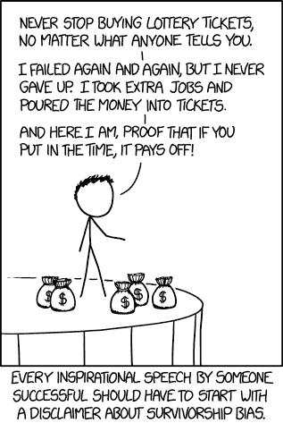
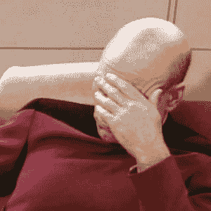
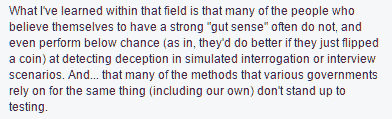
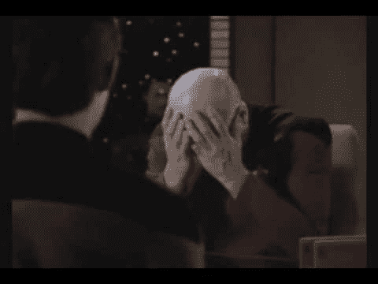

# 不要让大师们向你兜售生存偏见——SJO.com | SJO.com

> 原文：<http://www.sjo.com/gurus-are-scamming-you/?utm_source=wanqu.co&utm_campaign=Wanqu+Daily&utm_medium=website>

我喜欢这张照片。这显然是一个极端，但它完美地抓住了

[survivorship bias](https://en.wikipedia.org/wiki/Survivorship_bias)

。

请告诉我，什么是生存偏差？

> 生存偏差是一种逻辑错误，专注于通过了某些选择过程的人或事，而忽略了那些没有通过的人或事，通常是因为他们缺乏可见性。这可能以几种不同的方式导致错误的结论。这是一种选择偏差。

你知道谁会把生存偏见发挥到极致吗？

**古鲁。**

## 没有感谢大师

如果你读过我的作品，你就会知道我特别鄙视生活教练和大师(大多数，不是全部)。偶尔我会遇到一些如此令人兴奋的平淡无奇的东西，我忍不住要进去。

最新的消息来自西蒙·西内克(Simon Sinek)，他自称是乐观主义者，致力于通过领导力激励人类。

引用一下:

> “伟大的领导者是那些相信自己直觉的人。他们理解艺术先于科学。他们先赢得人心，再赢得理智。”

我的反应:

让我们来分解一个声明的荒谬性。

***注:*** 这不是关于某个特定品牌的古鲁 X 或古鲁 Y(虽然我没有提到托尼·罗宾斯在他的《我不是古鲁》中把自己描述成一个反向投资者是多么的聪明，当时这是一部为他的古鲁服务的两小时的新闻片)。这部*是*关于大师们如何滥用生存偏见向你出售梦想，同时牟取暴利。

## 精神错乱的定义是一遍又一遍地做同样的事情，却期待不同的结果

去年我在 BigOmaha 演讲(plug:伟大的活动——令人敬畏的组织者，令人敬畏的演讲者，令人敬畏的与会者)。我谈到了风险投资和创业，但我也是企业家精神的小组成员。我是有着 17 年经验的老古董；我在小组中的两位同事都很成功，但在创业领域相对来说还是新手。

(这可能会让人觉得我是在屈尊俯就，但我不是——他们都是了不起的踢人者)。

一位绅士走上讲台。他的声音透露出他的疲惫，他讲述了他如何有一个想法/生意，已经做了九年。！)年，甚至没有发现一点成功。他该怎么办？

我现在的记忆有点不准确，但我的两位同事谈到了一个人必须坚持不懈，即使面对逆境。总会有反对者，但只要足够努力，他会成功的。

然后我拿起麦克风，说了完全相反的话:疯狂的定义是一遍又一遍地做同样的事情，却期待着不同的结果。也许他的想法并不伟大。也许市场还没有准备好(我在 90 年代末举了几个领先于时代的企业例子，结果他们的基本前提在 15 年后获得了巨大成功)。

我不得不说，人们没有被打动。在接下来的事件中，我在感情上被认为是一个坏脾气的人(没错)。

## 生活不是童话

古鲁启发信仰的最惊人的例子之一是一个叫托尼·扎扎的孩子:

<iframe loading="lazy" src="https://www.youtube.com/embed/T2wc_X0iPkY?feature=oembed" frameborder="0" allowfullscreen="">视频</iframe>

*TL；dw*–这个孩子辞去了有福利的工作，卖掉了所有的东西，骑了 2000 公里的自行车(从底特律到佛罗里达州的圣彼得堡)，这一切都是因为……埃利奥特启发了他？

嗯……为什么不做些侧推呢？为什么不朝着你的梦想稳步前进，而不是不得不颠覆一切？

他承认自己没有计划(这并不总是一个坏举动——我自己的[临时性质和杠杆](https://sjo.com/leverage/))，但这只是在装傻。

见鬼，如果你读到成功人士都做些什么，一个共同的主题就是[计划](http://calnewport.com/blog/2015/10/06/on-full-horizon-planning-and-the-under-appreciated-power-of-workflow-systems/)。不仅如此，他们[对他们所学的东西采取了一种经过测量和计算的](http://observer.com/2016/08/bill-gates-warren-buffett-and-oprah-winfrey-all-use-the-5-hour-rule/)方法，而[则专注于将帮助他们获得成功的](https://sjo.com/you-need-to-focus/)

他自称勇敢，但我认为他是在模棱两可。没有可辨别的技能或专业知识，放弃一切，搬到佛罗里达州会产生…到底是什么？

[是的，我有点苛刻，但这是出于同情，而不是屈尊俯就]

但是把托尼的故事带给一位大师，他们会称赞他有多了不起。

他追寻自己的梦想——一个现代童话，这是多么鼓舞人心啊！

但是你猜怎么着——生活不是童话。在你的信仰飞跃之后，没有自动的*快乐地过着*的生活。

那么一旦高潮过去会发生什么呢？当转瞬即逝的梦想破灭，现实世界出现时，会发生什么？

这是一个“拥抱”自己梦想的人……并且住在帐篷里。一个人的“勇气”获得了近 200，000 次点击……下面还有一个销售页面的链接。一个男人，当他说他将比任何人都努力工作时，会让你看到一个“学习如何赚钱”的广告框。

天杀的聪明

如果他看了那个广告，然后点击那个链接，买任何提供的东西，这几乎是合适的。

然而，这就是不停的战斗口号#喧嚣和#研磨和这种痴迷所发生的事情，不追随梦想会让你变得软弱和懦弱。人们把一切都抛在脑后，连一个如何真正获得成功的计划或想法都没有。

> 梦想需要计划和技巧，而不仅仅是希望它发生。

## 现实不在乎你的梦想

我已经达到了越来越多的人吹我屁股冒烟的程度(警告:我的巨大自我)，但现实是我 90%的成功是因为我出生在一对从东方移居到西方的正确的人类身上(我 14 岁时移民到加拿大)。

我的成功取决于我的机会。我几乎所有的表兄弟姐妹和亲戚都住在巴基斯坦和印度。

他们比我聪明。

他们无疑比我工作努力。

见鬼，他们肯定比我更精明/更有策略。

然而我现在比他们成功 100 倍。

你想要一个关于机遇的有趣的仿真陈述吗？从 2008 年到 2016 年，YouTube 在巴基斯坦被禁

现实是，生活就像彩票。想象一下你出生在中国的一个水稻种植村，看看你会变得多么成功…

你需要想要某样东西并为之努力的比喻是一条底线，而不是那些成功人士独有的真理。

努力工作是成功的必要条件，而不是充分条件。不这样想就是沉溺于伟大的幻想。

> 这是老生常谈，但“更聪明而不是更努力地工作”应该是你的目标；努力就是单纯的预期基线。

## 现实不在乎你的一万个小时

扩展你只需要“努力工作”的想法，大师们喜欢援引臭名昭著的“10，000 小时规则”。

正如马尔科姆·格拉德威尔所推广的，这句格言变成了:要在某件事情上取得成功，你必须练习 10，000 个小时。

这一概括有三大错误:

1.  实际上，10，000 小时是平均值，标准偏差是 2000 小时。
2.  10，000 小时不是高性能的预测值；他们练习的 [*质量*是预测因素。这不仅仅是“仅仅”10，000 个小时，而是大约 10，000 个小时的](http://calnewport.com/blog/2010/01/06/the-grandmaster-in-the-corner-office-what-the-study-of-chess-experts-teaches-us-about-building-a-remarkable-life/)[刻意练习](http://jamesclear.com/deliberate-practice-theory)。
3.  残酷的现实是，那些平庸的人也练习了同样长的时间。

这种误解的传播如此之广，以至于最初的作者被迫反驳 10，000 小时规则！

> 大师们很方便地关注 10，000 个小时，但是很方便地忽略了计划、刻意的练习和那些平庸的人(也就是生存偏见)

## 反智主义的兴起

所以我们回到了一个人必须先理解艺术再理解科学的问题上。

真是一派胡言。

西蒙在这里宣扬的正是导致美国政府当前灾难的胡说八道。这正是特朗普信奉的逻辑——在对你的决定的后果一无所知或理解的情况下，跟随自己的直觉。

这是老生常谈的胡说八道，会让你飞向天空，奔向星星(和你一起兜风)。

这些大师住在他们的启蒙城堡里，只不过是现代的骗子，除了他们自己，谁也不在乎。他们得到了一些，嘿，如果你足够努力，你也会得到一些。

这里面有很强的反智主义倾向。你不需要学习。你不需要去思考，去琢磨，去思考。你不需要收集事实(数据)并理解它。你的直觉会解决你遇到的任何问题。

但是正如我们上面所说的，你的成功在很大程度上取决于你能得到的机会，你潜在的天赋，以及你投入的刻意练习的数量。

那么，直觉在这里起什么作用呢？见鬼，你最后一次真正思考自己的直觉是什么时候？

## 你的直觉是什么？

想想你上一次做不舒服的事情时的直觉？你的直觉告诉你该怎么做？

快跑。找个借口。弗利尔。

你的直觉不是你内在的某种形式的神性。你的内心没有纯粹的#幸福或天使般的本质，只要你愿意倾听，就能随时引导你！

你的直觉是你训练出来的。你塑造的东西。你培养的东西，比如生活中任何有价值的东西(关系、健康、知识等)。

见鬼，有一项研究要求执法部门的退伍军人确定人们是否在说谎。

仅凭直觉，他们最终得到了…低于标准的结果。来自一位研究人员:

真正的领导者使用数据/科学来帮助引导他们的直觉，而不是用他们的直觉来忽视世界的现实。有一个反馈循环让你学会持续改进(如《黑盒思维》一书中所述)。

当这些大师说要把艺术放在科学之前时，他们说的是数据/科学并不重要。事实不重要。该死的反馈循环，坚持下去！

数据是帮助你发展直觉的基础。科学就是试图理解它。

我绝不是反直觉的。你的直觉很重要。但这是你通过反馈循环和精确的练习发展起来的。你的直觉*是*重要的……需要注意的是，它是战略性发展的，而不仅仅是假设它是你成功的源泉。

> **那个**是关于一个有着强烈直觉的领导者的真理——它是基于经验和反馈循环，而不是“我 ***相信*** 所以它是真的。”

## 古鲁只是更精明的占星家

取笑占星家是模棱两可的专家是常见的做法——他们用感觉良好的陈词滥调和普遍真理说话，这样他们的话就适用于任何人。

这些大师到底有什么不同？

他们的通用公式是一样的——人都是懒的，不相信，所以你要相信，努力工作，你就会得到你想要的。看着我！

真是一堆自我放纵的废话。

我们得到的[结果不是典型的](http://tvtropes.org/pmwiki/pmwiki.php/Main/ResultsNotTypical)结果是有原因的。你只能看到少数成功的人(回到生存偏差)；你看不到很多人尝试了又尝试，最后还是和 bupkis 在一起。

危险的是那些没有成功的人感觉像是骗子。要是他们工作更努力就好了。要是他们更想要它就好了。那么他们也可以成为电视上的成功故事！

需要帮助的人现在陷入了更深的困境！

这极具破坏性。

当讨论臭名昭著的 10000 小时时，我们注意到真正的预测因素是详细的实践。大师们宣扬的正好相反——不要担心细节。

这是一个完美的例子，可以把它和关于艺术先于科学和相信你的直觉的笑话联系起来。

走火。

对皈依者来说，这是你信仰的呐喊，也是因为你相信，你才能做到。

对于使用科学的人来说，这是显而易见的——[热量传递的速度不足以烧伤你](http://skepdic.com/firewalk.html)。

更不用说，我敢肯定在你走火堆之前，你的直觉会说“我们不要这样。”

那么，当直觉符合大师的叙述时，我们就有选择地忽略它？

> 古鲁们已经完善了作为一种抚慰剂的形式——他们安抚你的不安全感，让你暂时感觉好一些，但实际上对你没有任何帮助。

## 不要让大师们向你推销生存偏见

所以我们兜了一圈。

辞职也是可以的。

失去信仰没关系。

意识到“这可能不适合我”是可以的。

认为努力工作会自动获得成功是不对的。

没有任何想法或数据就做决定是不行的，因为你感觉到了。

因为事情变得艰难而放弃是不行的，但是最终，**随着你积累更多的知识(也就是数据点和洞察力)，你将更有能力做出明智的决定**。

太多的人把放弃和失败联系在一起([失败并没有错](https://sjo.com/failure/))，但那根本不是真的。

正如我的好友埃德·李克所说，“放弃今天正在做的事情，去开始明天更好的事情，这并不可耻。”

> 在一个充满信号和噪音的世界里，数据/科学是信号，喋喋不休的自恋专家是噪音。关注数据，根据数据做出明智的决策。

### 厌倦了大师们？

我建立了多个业务，踢屁股，取名字-完全不相关的领域。

留下那些自己没做过的不合格的古鲁。跟随 SJO.com 获得现实生活中有经验的建议和想法。

成功！现在检查您的电子邮件以确认您的订阅。

### 评论

<comments-count href="https://sjo.com/gurus-are-scamming-you/">评论</comments-count>