# 你的正文太小了|漫威博客-漫威博客

> 原文：<https://blog.marvelapp.com/body-text-small/?utm_source=wanqu.co&utm_campaign=Wanqu+Daily&utm_medium=website>

正文是传达信息或故事的主要部分的关键组成部分，它可能是网站上最重要的元素，即使人们有时只阅读标题。

为什么我们要通过将正文最小化到浏览器的默认尺寸来限制正文的有效性呢？这种默认尺寸已经有 20 多年的历史了，甚至在大显示器上也是如此。

# 什么太小了？

大多数网站仍然在**15-18px**的范围内。我们开始看到*一些*网站采用大约 **20px** 甚至更大的正文文本显示在较小的桌面上，但在我看来还不够。*

在整篇文章中，我将使用像素来表示字体大小，而不是磅，这样就很容易与网络和数字空间的框架联系起来。

现在，我不是说小字体不好。一个 **18px** 字体在正确的距离上清晰可见。较小的字体在某些情况下非常有用，比如在标题、卡片和其他 [UI 元素](https://marvelapp.com/blog/35-great-ios-ui-kits/)上，但是有很好的理由为正文文本增加几个等级。

## 一点历史

通过打字机时代，我们确定了 12pt 是印刷易读性的最佳尺寸，尽管事实上书籍、杂志和报纸变小以减少纸张数量成本。

[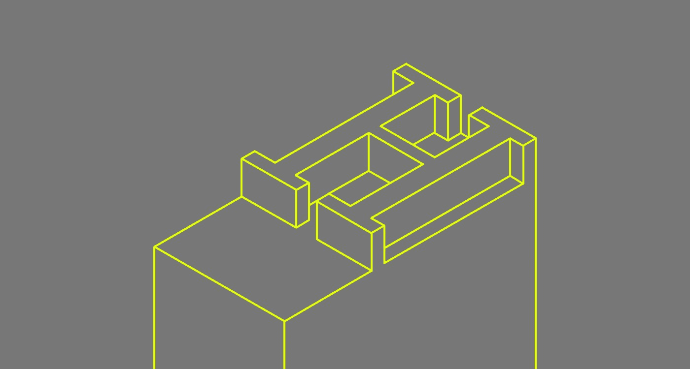T2】](https://marvel7077.wpengine.com/wp-content/uploads/2017/04/1-8tgcuGYjPLVi_WEX_mE5AA.jpeg)

[点](https://en.wikipedia.org/wiki/Point_%28typography%29)单位起源于 17 世纪，指的是铸造字符的金属体的高度。然而，在今天的数字空间中，点是[相当复杂](http://www.thomasphinney.com/2011/03/point-size/)并且不可靠地翻译。

在 20 世纪 90 年代，数字平台建立了从点到像素的转换，但当然我们有低分辨率的 14 英寸屏幕与之抗衡。苹果的 Mac OS 进行了直接转换——12pt 等于 72 [ppi](https://en.wikipedia.org/wiki/Pixel_density) 时的 **12px** 。[然而，微软](http://www.thomasphinney.com/2011/03/point-size/)确定 12pt 等于 96 ppi 的 **16px** ，这就是 [IE](https://en.wikipedia.org/wiki/Internet_Explorer) 假定[默认基数为 **16px** 的方式。](https://books.google.com/books?id=zZ4K3-vdN3oC&pg=PT345&dq=base+size+of+16px+at+96ppi&hl=en&sa=X&ved=0ahUKEwikoP2_1aXPAhWDXR4KHSOhBXgQ6AEIHjAA#v=onepage&q=base%20size%20of%2016px%20at%2096ppi&f=false)

在整个 20 世纪 90 年代末和 21 世纪初，网站的正文在 9 到 14px 之间。有一段时间，[的设计师认为 16px 太大了](https://books.google.com/books?id=zZ4K3-vdN3oC&pg=PT345&dq=designers+think+that+16px+is+too+large&hl=en&sa=X&ved=0ahUKEwjz0NOH16XPAhXFVh4KHYxoA5QQ6AEIHjAA#v=onepage&q=designers%20think%20that%2016px%20is%20too%20large&f=false)，因为他们习惯了 MAC 电脑上的 12pt ( **12px** )默认设置。

回到 2007 年，信不信由你， **16px** 仍然被[视为巨大的正文文本](http://alistapart.com/article/howtosizetextincss)，但是到了 2011 年，响应式开发和更大分辨率显示器的主流涌入，导致设计师们将 [16px 视为最低](https://www.smashingmagazine.com/2011/10/16-pixels-body-copy-anything-less-costly-mistake/)，从那以后，我们一直在努力接近那个标志。

# 为什么正文不变大

为了理解大正文的好处，我们首先要考虑设计师(和开发者)选择小正文的原因。更多的时候，是因为期待；这是我们所习惯的，如果几乎每个人都以某种方式做，那么我想我们应该这样做。

## 我们设计移动优先

[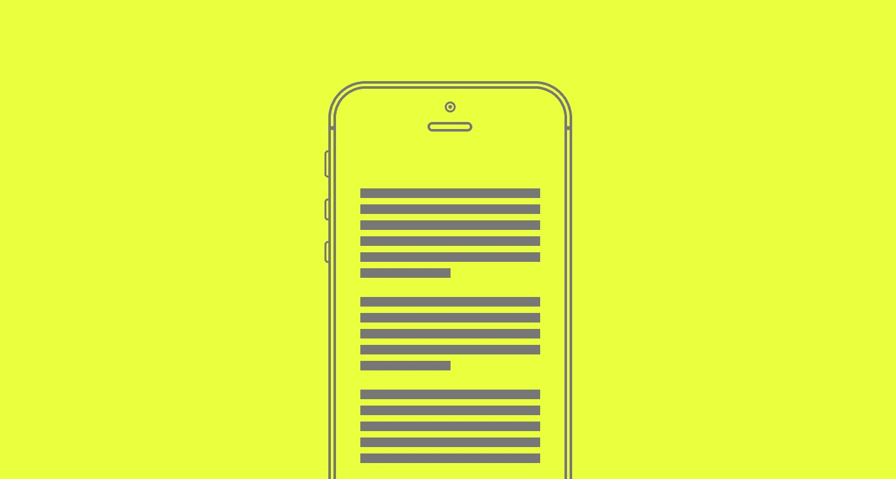T2】](https://marvel7077.wpengine.com/wp-content/uploads/2017/04/1-ESWbiZ3rev4yIEdhtrtrzg.jpeg)

本着[移动优先](https://responsivedesign.is/strategy/page-layout/mobile-first)的理念，我们从一开始就设计了针对移动设备进行优化的正文。这可能意味着在**15-18px**之间的任何地方。但在设计一个响应式网站时，我们往往会忘记，字体大小不仅会影响使用手持设备的人，还会影响使用笔记本电脑和台式电脑等更大设备的人，是的，还有智能电视。

这可能会导致一种一刀切的心态，即我们不会考虑扩大规模，也不会考虑小桌面分辨率之外会发生什么。

## 我们把大和“笨重”联系在一起

[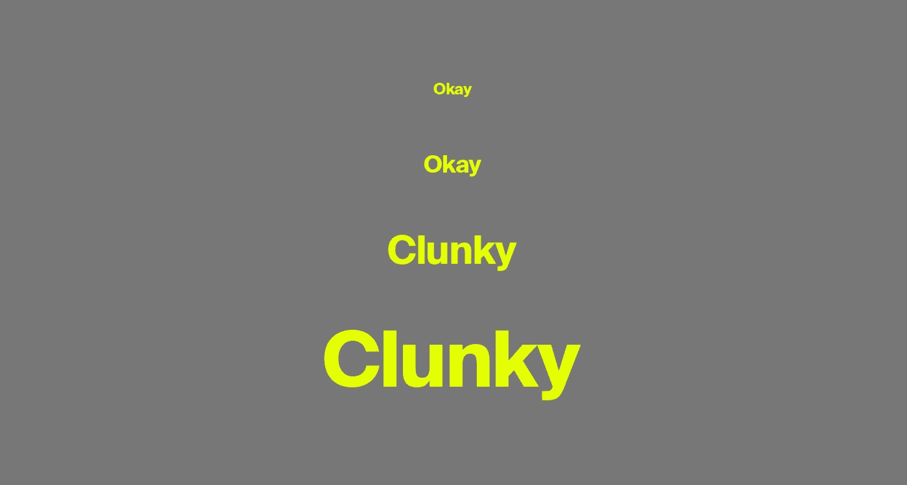T2】](https://marvel7077.wpengine.com/wp-content/uploads/2017/04/1-ZCOAZV6kDgGea1P3DdNvzQ.jpeg)

一些设计师(和利益相关者)有一种误解，认为大的正文让人感觉“笨重”，或者幼稚。当儿童故事书的字体过大时，这种联系就没有用了。

但实际上，引起这种感觉的不是字体的大小，而是字体的风格；它的设计细微差别，字距，字母间距，行高，以及其他影响我们视觉理解的属性。有些字体大了就不那么吸引人了。

## 缩放是一个选项

[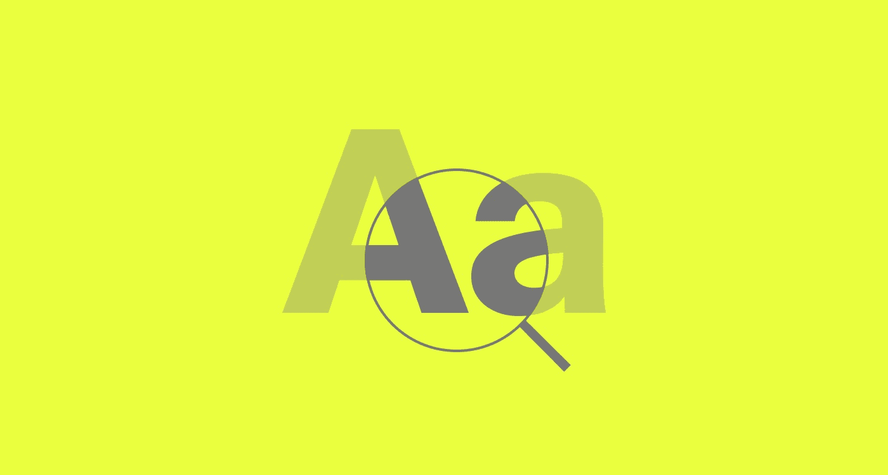T2】](https://marvel7077.wpengine.com/wp-content/uploads/2017/04/1-yT95dZKcz0bzXILthsAHSQ.jpeg)

我们不要忘记[缩放](http://learnhowtozoom.com/)是浏览器中的一个很棒的特性——事实上它是强制性的。它让视力不好的人更容易接近，但我们不应该依赖它。不是所有的用户都知道这个特性以及如何使用它，如果他们知道，缩放会以意想不到的方式[破坏布局](https://css-tricks.com/zooming-squishes/)，除非有良好的响应实践。

## 易读性和可读性是混淆的

[T2】](https://marvel7077.wpengine.com/wp-content/uploads/2017/04/1-9FWK0b0zUOHk2mvDT-lBNw.jpeg)

我们关注的是*易读性*而不是*可读性*。有区别。如果文本是*可读的，*不意味着它是*可读的*。有了易读性，文本可以被解读，但可读性更进一步，将设计的情感效果与阅读的努力结合起来。这就是为什么较小的正文尺寸被认为是“易读的”就足够了。

## 我们希望避免滚动

[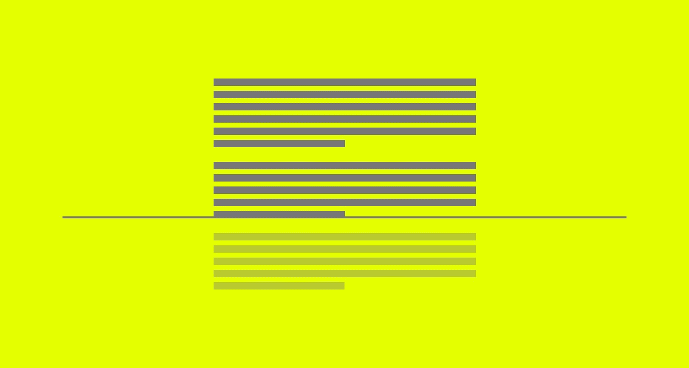T2】](https://marvel7077.wpengine.com/wp-content/uploads/2017/04/1-UWWW7ec1c3vcLqql8sWPA-1.jpeg)

不幸的是，有目的地设计网站以避免滚动是一个常见的错误。对设计不利的是，为了减少滚动，或者压缩布局以适合副本中或周围的其他元素，正文的大小被减小。

滚动是网络上一种自然的、既定的模式——人们期望必须滚动。即使这是不可能的，人们也会尝试滚动来查看页面是否提供了比最初视图更多的内容。可读性比所需的滚动量更重要——好的内容不会阻止用户滚动。

## 框架建立的方式

[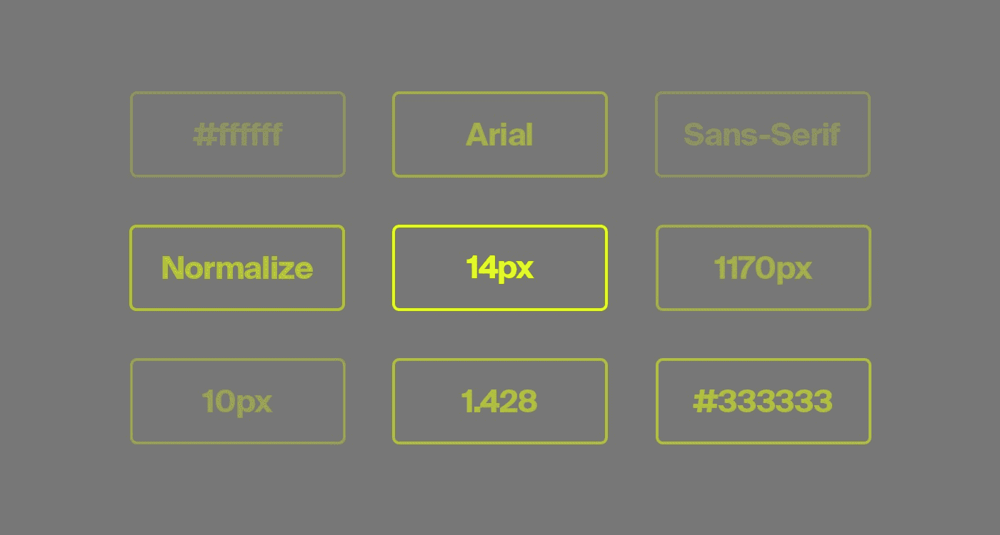T2】](https://marvel7077.wpengine.com/wp-content/uploads/2017/04/1-xWp4pCAZ637XLhfzD4y4A-1.jpeg)

框架可以节省宝贵的时间，并加强一个可靠的协作系统，尤其是在排版方面。他们仍然允许定制，但是尺寸经常是默认的，这可能导致一刀切。

[Bootstrap](http://getbootstrap.com) 是创建响应式 web 项目最流行的框架之一，信不信由你，在其当前稳定版本 3 的正文文本上有一个[全局默认**14px**T5——版本 4 的早期版本显示它已经上升到 **16px** 。现在，Bootstrap 是一个移动优先设计的框架，但他们将它留给设计师和开发者来决定除此之外会发生什么。保留默认尺寸，我们甚至在最大的屏幕上也有移动尺寸。](http://getbootstrap.com/css/#type)

# 用更大的正文设计的理由

更大的字体增加了网站的体验。简单来说就是更*有效*。即使仅仅将 **18px** 与 **20px** 进行比较，也可以获得巨大的收益，增强设计和用户体验。

## 1.从远处看效果更好

[T2】](https://marvel7077.wpengine.com/wp-content/uploads/2017/04/1-ZRfhd9xVxTOUDFzhhXx_zw.jpeg)

我们可以假设用户离屏幕有多远，无论是使用手机、平板电脑还是台式电脑，但在超高清显示屏和智能电视上浏览网页已经变得越来越普遍。用户可能在 3 到 16 英尺远的任何地方。

事实是，屏幕越大，距离越不可预测。这就是为什么电视制造商根据屏幕尺寸提供最佳观看距离 *范围*的原因。由于明显的原因，由于人类视觉系统在细节识别方面的限制，小屏幕在远距离下不会工作得很好。存在一个阈值，超过该阈值就不能区分关键细节。

这也适用于虚拟现实，在虚拟现实中，长文本对 UX 来说是一个坏主意，但同样的感知距离法则也适用。由于清晰度和三维因素，在 VR 中设计[字体可以说更难。](https://medium.com/startup-grind/4-things-i-learned-designing-user-interfaces-for-vr-cc08cac9e7ec#.3jwxgpk18)

对于手持设备和笔记本电脑，它们往往不超过一臂的长度，但对于大型桌面显示器，我们必须假设它可能会更长。用户可以靠在椅子上，而显示器位于深书桌的后面。对于更大的显示器，用户不喜欢为了阅读文本而将脸靠近他们。

对于距离更远的用户来说，更好的体验将来自于放大元素和利用更多的可用屏幕空间，尤其是在更大的显示器上。

## 2.它提高了可读性

[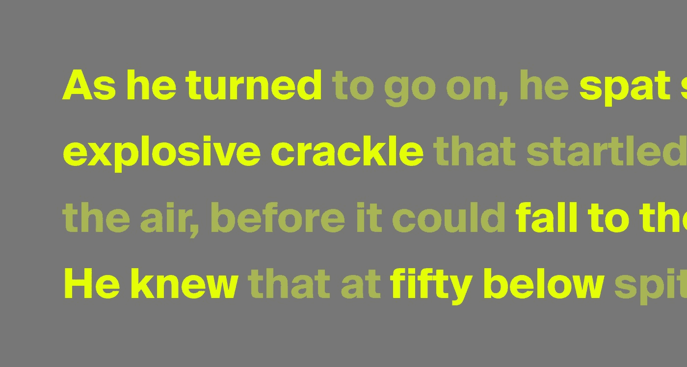T2】](https://marvel7077.wpengine.com/wp-content/uploads/2017/04/1-m3k27kyJ6FUgnhHabfGSIQ.jpeg)

平均来说，用户只会阅读网页上大约 28%的文字，而且由于网上信息的巨大数量和有限的时间，通常是 t 2 浏览而不是阅读。精读很少，需要更多的专注。

较大的字体已被证明可以提高所有类型用户的可读性，无论其年龄或视力如何。虽然看起来很明显，[年长用户](https://www.nngroup.com/articles/usability-for-senior-citizens/)由于[视力退化](http://www.aoa.org/patients-and-public/good-vision-throughout-life/adult-vision-19-to-40-years-of-age/adult-vision-41-to-60-years-of-age)，[年轻用户](https://www.nngroup.com/articles/young-adults-ux/)更倾向于浏览和不耐烦。

> “较大的字体已被证明可以增强所有类型用户的可读性，无论其年龄如何……”

更大的文本激励我们使用更少的单词，并鼓励[更低的内容密度](https://ia.net/know-how/100e2r)。由于多余字符的空间较少，我们可以专注于抓住要点。

通过提高可读性，而不仅仅是易读性，我们将增加用户阅读或浏览我们呈现给他们的内容的可能性。较大的文本需要较少的关注。

## 3.它提高了可用性

[T2】](https://marvel7077.wpengine.com/wp-content/uploads/2017/04/1-AqfnhiPTQZ3JVjhPXv3Gug.jpeg)

我们处理大量信息的能力受到大脑处理能力的限制。如果花更长的时间理解信息，我们的表现就会受到影响。我们可能会不知所措，错过重要的细节。

当我们的作品中有较大的正文时，它会占据屏幕的大部分。这就需要我们设计一个版面，让文案有更多的呼吸空间。这也可能意味着在任何时候比以前更少的拷贝是可观察到的。简而言之，它可以最小化混乱，减少额外的认知负荷，并提高可用性。

## 4.它增加了视觉冲击

[T2】](https://marvel7077.wpengine.com/wp-content/uploads/2017/04/1-6-O-4fDUcWRhun7Y1toq5g.jpeg)

标题上较大的字体可以引起更强烈的情感联系，同样的情况也适用于正文。文字可以显得更突出。信息变得更响亮、更自信、更有说服力。

另一个视觉冲击更微妙。只有用更大的字体设计，你才能展现出字体设计的所有细微差别，而这些细微差别在更小的尺寸下是肉眼看不到的。区分好的和差的字体变得更加明显。

# 谁要变大？

下面是一个网站列表，这些网站已经采用了更大的正文，即使是 1440 x 900 这样的小尺寸桌面或笔记本电脑分辨率。它们从 **20px** 一直到 **58px** ！

# 优化更大的正文

当设计网站的正文时，重要的是要意识到没有一种尺寸适合所有人，因为它完全取决于诸如字体设计、背景/前景色和视窗尺寸等因素。

## 1.首先设计正文

[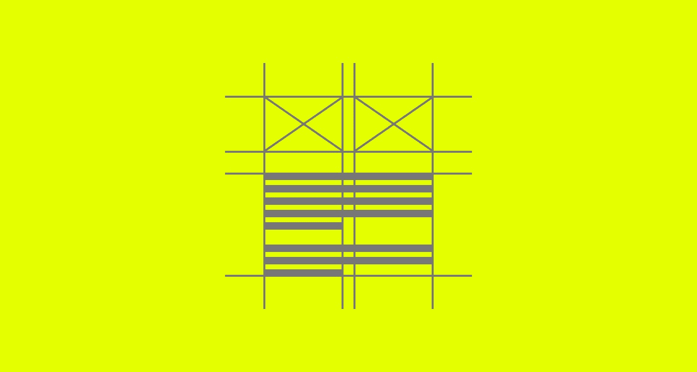T2】](https://marvel7077.wpengine.com/wp-content/uploads/2017/04/1-SeWsKBs6necx0N62catOzw-1.jpeg)

最重要的是，当设计一个网页时，我们应该首先设计正文，通常是在布局中的任何事情之前。这是最常见的元素，它的出现会对作品的其他部分产生明显的影响。尤其是正文越大，占用的空间越大。

## 2.选择一种缩放性好的字体

[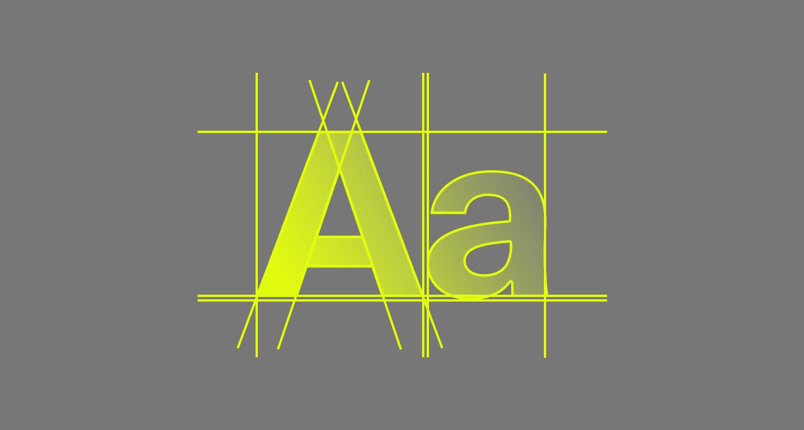T2】](https://marvel7077.wpengine.com/wp-content/uploads/2017/04/1-1BCZLMlGMabA4nM9k2DcGw.jpeg)

作为排版的一般原则，通常最好是正文使用衬线字体或无衬线字体。然而，并不是每种字体放大后都能很好地工作。一些字体在较小的尺寸下看起来清晰锐利，但在较大的尺寸下感觉笨拙且设计不佳。系统字体，比如 Georgia 和 Arial，感觉放大了，因为它们设计了有限的细节，以便在 **14px** 时清晰可见。

[文本字体](https://www.fonts.com/content/learning/fontology/level-1/type-anatomy/text-v-display)经过有目的的设计和优化，可以在 6-14 磅(**8-18px**)之间很好地工作，但是由于它们增加的字符间距、更重的对比度和小写的 x 高度，在 **24-26px** 处可能看起来不吸引人。另一方面，一些字体在任何比例下都有可能保持其个性和完整性，只需要跟踪调整来补偿任何间距问题。

对于衬线字体，重要的是[在更大的尺寸下检查它们的特性](https://www.fonts.com/content/learning/fyti/typographic-tips/thinking-big);尤其是发际线、衬线和尖角。更大的字体大小允许加入更多细节的衬线字体——更高对比度的笔画和更小的 x 高度，但当它需要缩小以适应更小的屏幕时，您可能会降低易读性。适用于大正文文本的衬线字体的一些示例包括****[**弗兰齐斯卡**](http://www.fffranziska.com/)**[**莱图拉新闻**](https://typekit.com/fonts/leitura-news)**[**梅里韦瑟**](https://fonts.google.com/specimen/Merriweather)**[**米勒**](https://store.typenetwork.com/foundry/cartercone/series/miller?family=miller-display)**********

 ******尽管无衬线字体在正文中没有衬线字体那么受欢迎，但当涉及到*大号*正文时，它会是一个有效的选择。由于对比度低，笔画粗细一致，缺乏细节或华丽，它们通常不会遇到衬线放大的问题。它们能够保持它们的形态。适用于大正文文本的无衬线字体的一些示例包括 [**Atlas Grotesk**](https://commercialtype.com/catalog/atlas/atlas_grotesk) **，**[**Futura**](https://www.linotype.com/1212991/futura-family.html)**，**[**Lato**](https://fonts.google.com/specimen/Lato)**，**[**Maison Neue**](http://www.milieugrotesque.com/typefaces/maison_neue/)**，** [**真实文本**](https://www.fonts.com/font/fontfont/ff-real-text)

 **有趣的是，相比最初为印刷设计的字体，最近设计的字体在响应网络上得到更好的优化——一些现代衬线字体在屏幕上和不同比例下表现得非常好。有了响应式网站，这就成了一个平衡的问题——一种无论大小都适用的字体。

总的来说，在使用字体之前，最好对我们的正文进行一次大尺寸(和小尺寸)的测试，以仔细检查细节。像 [Typecast](http://typecast.com/) 这样的工具可以让我们预览大部分内容冗长的字体，并进行简单的调整和比较。

## 3.最小 20px 的光学尺寸

[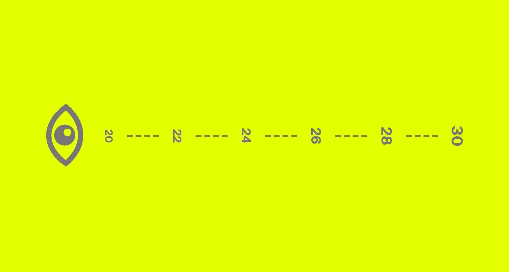T2】](https://marvel7077.wpengine.com/wp-content/uploads/2017/04/1-oWr53tYpxvePLYsGRjVA0g.jpeg)

由于字体之间有许多不同的特征，一个特定设计的尺寸与相同尺寸的不同字体相比会有不同的比例。

这就是为什么我们应该[让我们的眼睛决定](https://www.fonts.com/content/learning/fyti/typographic-tips/type-sizes)，而不是基于一个数字值，即*对于不同的字体或不同的项目听起来*很好或工作得很好。每次字体改变时，都需要进行相应的光学调整。

字体的大小也可能因前景和背景的颜色而异，因此最好根据接近最终确定的颜色或不同的颜色场景来选择字体大小。

虽然已经有一段时间承认正文的最小字体大小为**16px**，但我相信在小型桌面显示器上更好的起点应该是 **20px** 或更大。我们应该只能求助于 **16px** 在非常小的移动设备上进行正文复制。即便如此，根据字体的不同，最好从 18px 开始，然后随着屏幕变大而相应增加。

## 4.优化字母间距

[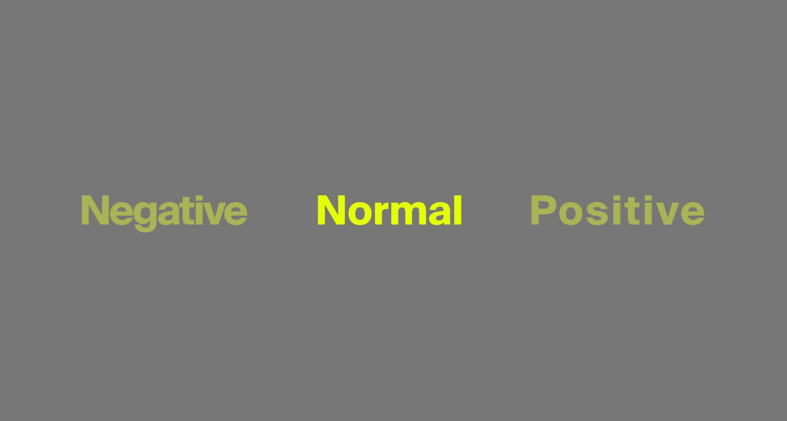T2】](https://marvel7077.wpengine.com/wp-content/uploads/2017/04/1-Np2-LHtYqD4L2keoofzwfA-1.jpeg)

放大的正文可能需要我们微调字母间距，以获得更好的可读性和美观性。不同形式的字体需要不同的调整。例如，一种文本字体，由于其额外的字符间距，在调整大小时可能需要一个负的*值。*

对正文文本跟踪的任何更改都应该是最小的，并且要谨慎使用，因为过多的调整可能会使它变得更糟，而不是更好。并不是每种字体都需要调整，真正调整字母间距和字体大小还是要靠眼睛。

字距调整与字母间距完全无关，它关注的是两个特定字符之间的间距。大多数现代的和精心开发的网络字体都包含了字距调整表，并且有一些方法可以让 T2 在开发中优化字体设计，以鼓励在有支持的地方使用它。

## 5.优化线条长度和线条高度

[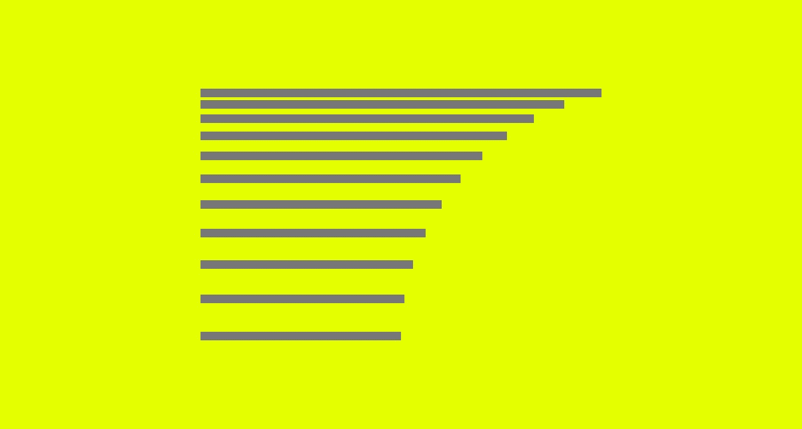T2】](https://marvel7077.wpengine.com/wp-content/uploads/2017/04/1-1YNneq-C2AilZSYrAgJeIQ.jpeg)

根据[排印风格的要素](https://en.wikipedia.org/wiki/The_Elements_of_Typographic_Style)，Robert Bringhurst 指出，排印中最佳的行长度或每行字符数(CPL)大约是 55 到 75。一长串的文本会导致疲劳，因为读者必须从一边到另一边进一步扫描，寻找下一行的开始。如果一行太短，有一些单词或短语会被分解成一个单元。

这个思维规则适用于任何比例的正文，因为行的长度总是与字体的大小相关。

在[网格系统](https://www.amazon.com/Grid-Systems-Graphic-Design-Communication/dp/3721201450)中，Josef Müller-Brockmann 指出一列的宽度必须与字体的大小成比例。因此，当我们增加正文的字体大小时，我们需要*增加*框架的容器或列的宽度，以保持最佳的行长度。关键是，我们的排版应该决定文本栏的宽度，而不是相反。

> 重点是，我们的排版应该决定文本栏的宽度，而不是相反

如果 CPL 对较大的正文很重要，那么行高也很重要。这都是关于比例和平衡，以促进更好的可读性。行高也应该与字体大小相关，因为它是为更大的显示器而放大的。有多种方法可以实现[最佳行高](https://www.smashingmagazine.com/2013/05/typographic-design-patterns-practices-case-study-2013/)比率，然后我们可以根据我们想要的字体样式进行调整。

## 最后一个音符

这不是关于拥有最大的正文，因为最大并不是最好的。它是关于优化你能给你的用户的最好的阅读体验，较小的正文不能实现这种潜力。

在推特上关注我。

*本文原载于[基督教网站](http://xtianmiller.com/notes/your-body-text-is-too-small/)，[媒体页](https://blog.attackthefront.io/@xtianmiller)。*********