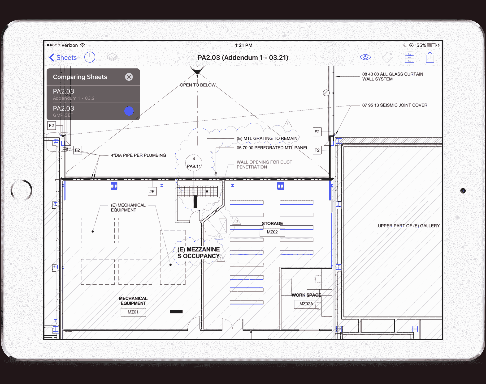

# PlanGrid 为创业公司提供的破解大型成熟行业的剧本

> 原文：<http://firstround.com/review/plangrids-playbook-for-startups-to-crack-open-big-established-industries/?utm_source=wanqu.co&utm_campaign=Wanqu+Daily&utm_medium=website>

作为一名建筑工程师，Tracy Young 的部分工作是检查医院的 800 多个房间，以确保它们建造正确。这需要在工作现场携带厚厚的纸质蓝图，以记录任何问题和差异。事实上，纸张太多了，她的老板不得不特别订购一辆双层手推车，让她推来推去。她知道一定有更好的工作方式——但在一个手推车是颠覆性创新的行业，变革是一项艰巨的任务。

如今，Young 是 PlanGrid 的联合创始人兼首席执行官，该平台已经帮助超过 50 万个建筑项目存储和组织蓝图和建筑数据，使它们可以通过移动设备访问。“建筑是当今唯一一个生产率低于 60 年前的行业，”她说。“这个市场直到 2011 年才开始利用软件和计算能力。我们知道做出改变可能需要我们几十年的时间。”

杨和她的团队并不是唯一一个挑战顽固的传统产业的人。PlanGrid 是追求这些领域的众多创业公司之一(想想农业、政府、航空旅行、航运)。即使现在它是世界上最大的蓝图库，它的工作还远远没有完成。在这次独家采访中，Young 详细讲述了他们是如何破解建筑行业的，以及希望做同样事情的初创公司(跨领域)可以学习到什么。

# 1.打破规则。透支你的信用。把你的产品展示在人们面前。

当 PlanGrid 开始时，人们对建筑技术，尤其是平板电脑持怀疑态度。iPad 一年前才问世，价格昂贵，看起来很精致——不像是任何戴着安全帽、穿着泥泞的靴子的人都会随身携带的东西。“即使是看到潜力的人也不愿意花钱去试验，”杨说，他马上就相信平板电脑是建筑行业的完美电脑。每当她演示 PlanGrid 软件时，人们都会印象深刻，但他们就是不愿意投资他们需要使用的硬件。

所以她为他们做了这件事。“我和我的联合创始人看着对方说，‘好吧，我想我们要买一些平板电脑。’我们必须为自己消除这一障碍，即使它无法扩展。“当时，32 GB 的 iPads 售价 800 美元一台，由于生产能力有限，苹果公司一次不得销售超过三台。创始人(这是真的)乔装打扮，刷爆了信用卡，为建筑主管和项目经理采购设备。

该团队发现了摩擦，并尽一切努力消除摩擦，尽管这是不可持续的，但这一切都是为了让 PlanGrid 被看到和使用。

这样做的必然结果是支持没有经验的、不是超级技术专家的用户，这样他们会继续使用产品，不会感到沮丧。杨和她的同事花了大部分时间来回答关于使用移动设备的问题，而不是应用程序本身——他们很乐意也很高兴这样做。回答基本的 IT 问题使他们能够通过 PlanGrid 本身提供出色的客户体验。

很容易忽略、重定向或忽略这些查询。他们没有，这已经成为他们客户支持策略的基础。今天，主页上有一个聊天框，可以立即向访问者打招呼，每天 18 小时有人值守，在 6 秒钟内提供回复。不习惯浏览创业网站的客户不必去寻求帮助或浏览常见问题。支持是专门为那些在建筑方面有深厚专业知识，但碰巧是新技术的人设计的。

即使在这一切之后，该公司仍然遇到了一个问题，他们已经耗尽了他们的直接联系，需要去寻找新用户。同样，他们的理念是让产品被人看到。亲自使用它不仅会带来客户，还会带来反馈、批评和发展方向。“我们立刻想到，‘建筑会议！’”杨说但是展位最低租金是 5000 美元——所以，你知道，我们包了地毯。我们买了 60 美元的票，走到陌生人面前说，“嘿，想看些很酷的东西吗？”不管他们是否回答我，我都会运行演示。我们可能违反了规则，但我们正准备向 50 个从未见过 PlanGrid 的人展示它。"

今天，PlanGrid 的十大客户中至少有两个来自湾区的早期会议日活动。

在每一个例子中，教训都是一样的:**打入一个庞大的行业依赖于你的产品被使用，即使只有少数人使用**。为人们提供工具、支持和环境，以确保他们通过任何必要的手段获得良好的体验。

# 2.将你的市场分成几个部分，然后对它们进行优先排序。

成熟的行业很大，而且看起来不可逾越。你必须把他们缩小。“我们所谓的‘市场’实际上只是人和公司，”杨说。“你可以从[美国劳工统计局](https://www.bls.gov/ "null")获得一大堆关于你所在市场的数据，但不要把它弄得太复杂——它实际上只是告诉你你所在行业的每一层有多少人在工作，为哪些公司工作。”

PlanGrid 通过考虑建筑工地上的不同角色，对其获得的建筑数据进行了分解。每个项目都有主管、工头、工程师、项目经理、现场和操作人员等。他们查看这些数字，以确定从大型摩天大楼项目到小型厨房改造项目的每个细分市场中存在多少这样的角色。

然后，他们定义了每个角色的角色——例如，一个主管需要什么，什么样的论点或特征最能吸引项目经理——并推出了他们的策略，知道他们会用什么策略试图转化多少人。这使得看似庞大而模糊的市场变得更容易有条不紊地接近。

<svg class="fill-current w-8" viewBox="0 0 24 24">对于 PlanGrid 和 construction，此人是负责人。</svg>

“我们关注总监，因为他们有最丰富的建筑经验，完全了解建筑的挑战，以及哪里可以立即提高生产率，”杨说。“与此同时，他们是令人难以置信的领导者，几乎所有在现场或项目中的其他人都指望他们在极端条件下建造复杂的结构，并在一天结束时让每个人安全回家。”他们往往也有一个特定的轮廓:他们中的许多人早年开始从事建筑业，可能没有上过大学。大多数人以前没有在工作中使用过软件，也最不可能采用它，尽管它可能会给他们带来最大的优势。

“我们突然想到，如果主管们拿起 PlanGrid，其他人也会拿起它，”Young 说。为了让他们加入进来，这个团队开始在办公室举办“问我任何事情(AMA) ”会议，两个目标是庆祝他们成为该领域的专家，并尽可能多地了解他们的生活、工作和问题。“我们几乎问了他们所有的问题——‘他们早上什么时候醒来，他们最害怕的是什么，他们最喜欢在现场穿什么品牌的鞋子，什么令人讨厌，他们最喜欢的是什么？’我们想把他们作为一个整体来了解，让他们觉得他们的整个经历会影响到产品。确实如此。"

在这些活动中，主管们也认识了 PlanGrid 的个人，并带走了比以前更大的布道者。这是一种传达信息的方式，即该公司非常关心改善他们的生活，并致力于设计一种直观的产品，尽管有学习曲线。

# 3.创建一个模型，让你一直处于现场。

不能只跟用户对话。为了建立他们需要的功能，你必须整天观察他们的工作。不止一天。好几周了。杨说，去工作正在进行的地方，无所不在。这是你识别模式和机会的唯一途径。

她说:“例如，如果你**写下那些对任务**来说资历过高的人正在手动做的所有事情，这些都是成熟的领域，在这些领域，某个功能可能会为某人节省大量时间。”。“如果你不去那里，一次观察几天，并真正理解一切是如何连接的，你可能会构建一个过于狭隘的解决方案，或者优化对你的公司来说最容易的地方，但不会为你的客户带来最大的差异。”

PlanGrid 的关键工具之一是其问题跟踪套件。传统上，工程师和主管用手记录现场问题，抓拍照片，并可能记录语音备忘录。从那里，他们回到办公室，手动将其输入电子表格，以跟踪需要修复的内容。他们甚至剪切和粘贴照片和其他笔记，将它们发送给合适的人。有了 Plangrid，他们可以使用该技术记录一个问题的全部细节，一切都会自动同步到云端。这是通过观察人们花六个小时或更多时间来完成可以自动化的任务而得出的结论。

留意那些痛苦到让你畏缩的事情——你想马上开发软件来解决它。

这些剧烈疼痛的时刻是你的突破口。对杨来说，这是看着像她以前一样的项目工程师在混乱的环境中疯狂地翻阅数百份蓝图，只为了找到一份数据。对其他人来说，这是看到蓝图在现场丢失、损坏或销毁。这些激动人心的时刻——那种你只有亲自看着别人才能体会到的时刻——通常会成为你的产品最能引起共鸣的特征。

现在 PlanGrid 更大了，他们不得不设计一个新的模型。让所有员工都在现场跟踪别人已经行不通了。他们的新重点有两个:1)通过培训让所有员工感受到他们正在努力解决的问题的严重性；2)保持活跃的现场团队，不断将观察结果反馈给总部。

# 让他们感受燃烧

在入职过程中，员工会确切地感受到使用纸质蓝图时版本控制是多么令人沮丧。你必须把成千上万张又大又笨重的纸按照修改的顺序排好，否则你会遇到严重的问题。所有新员工都被要求处理这些规格，并了解在飞行中查找信息和做出决策有多难。

连通性也是一个重大挑战。建筑工地很少有可靠的连接，所以应用程序必须能够安全地存储非常重要的数据，并尽可能适时上传。为了理解这有多么令人沮丧和高风险，PlanGrid 让工程师和产品经理在低连接环境中测试新功能。这激励他们创造一种无论如何都感觉无缝和安全的用户体验。

在一个庞大的行业工作也让你通过描述你所能做出的改变的规模和程度来强调痛点。利用这一点。“我们很早就告诉员工，要经常将建筑视为世界的基础设施。如果我们能让它的成本效率更高一点，或者让这个领域的就业状况更好一点，那将是一个巨大的影响。”

世界上 10%的人受雇于建筑。如果我们为每个人节省几分钟，我们就为人类节省了几个小时——几年。

# 恒定场模型

正是这一使命的范围帮助 PlanGrid 从皮克斯、谷歌和甲骨文聘请了高管，并激励他们在加入后立即开始旅行，亲自查看建筑工地并与客户面对面交流。在轮换的基础上，创始人、执行团队、产品和工程负责人日复一日地观察建设项目，即使它成本高昂且具有后勤挑战性。在杨的经历中，这是值得的。

该公司还雇佣了一个名为**现场运营**的完整团队，该团队经常外出访问现场，并与现有和潜在客户交谈。“他们中的大多数人都有软件销售背景，但他们的职责不仅仅是获得新业务，”她说。“他们是该产品的专家。他们培训用户，并帮助在新的项目网站上部署 PlanGrid。他们将反馈传递给我们的产品团队，并帮助构建路线图。”这一策略拓宽了销售人员的身份，使他们不仅仅是交易型的，他们成为客户可信赖的持续资源。

“他们是那些让我们意想不到的事情浮出水面的人，”杨说。“在办公室里，我们会觉得一切都很神奇，然后我们会从现场操作人员那里听说，灰色文本由于眩光而无法阅读，或者为什么某些按钮在快节奏的环境中会令人困惑。”

PlanGrid 与红杉资本合作的原因之一是，管理合伙人 Doug Leone 看到了创始人早期对客户参与的强调，并说:“你必须雇佣并建立一个现场团队——我知道如何做到这一点。”杨让他加入董事会来提供这方面的专业知识。雇用合适的现场运营专业人员很重要，但为他们提供专业培训和工具对于他们的职业发展和公司的成功至关重要。

今天，有一个全面的培训计划，最终在一个安全帽毕业典礼。它包括了解**四个主要组成部分**:建筑行业、建筑专业人士、建筑挑战和 PlanGrid 的解决方案。由于 PlanGrid 的团队中有超过 20%的人是建筑、工程和施工(AEC)行业的资深人士，Young 解释说:“我们帮助整个团队从各个角度了解客户的痛点，并学会说他们的语言。这是我们为所有新员工提供的宝贵见解。”

# 4.坚持熟悉的工作流程和(喘气！)模拟机制。

通常，行业对技术和创业公司持抵制态度，因为他们担心这会影响他们的生产力(他们说得有道理)。学习曲线可能太陡，太耗时。不懂技术的人会感到落后。它不适合日常工作，并且会产生比它解决的更多的开销。

“我们从一种心态开始，那就是我们永远不会强迫任何人以某种方式工作。相反，我们试图消除尽可能多的限制，”杨说。这就是为什么 PlanGrid 在任何移动设备上工作如此重要，也是为什么他们不断确保他们的软件在越来越便宜的设备上运行良好。“我们希望每个人都能在他们最熟悉的设备上使用这款应用，并且无论如何都会使用。”

该应用程序的设计也非常有意地类似于蓝图在现实生活中的出现和安排。“我们希望以客户熟悉的方式解决版本控制问题，并消除手动流程。”

例如，如果一堆纸中有 500 个绘图，每个绘图将代表同一张纸的不同版本，但是按照迭代的顺序。在现场，建筑工人会将所有这些文件弄得散乱无序，因为决策制定得很快，而最后期限总是迫在眉睫。不幸的是，工人们总是根据过时的图纸来建造，这是一个代价高昂的错误。在 PlanGrid 中，蓝图仍然以堆叠的形式呈现，现场工作人员可以翻阅，只是更容易将它们保持有序，并在需要时参考以前的规格。

在模拟世界中，蓝图通常标有类似这样的符号:“如果你想知道这块玻璃是如何连接到这面墙上的，请查看 A8.23 页的细节 24，”你必须一页一页地翻，直到找到为止。PlanGrid 通过自动超链接使这变得更简单，但仍然使用行业语言。

**要点:**如果你试图进入一个抵制变革的行业，尽可能给你的客户更多的自由，让他们仍然从你的产品中获得价值，并让它看起来和感觉起来像他们习惯的工艺和材料。这只会有助于你的采用率。

# 5.分三波战胜你的怀疑者。

即使你部署了上面描述的所有策略，仍然会有人不明白。“有些人不接我的电话，也不参加会议，即使他们所有的同事都在使用这个产品——他们只是不知道这是什么，也不知道为什么他们应该关心，”Young 说。当你遇到这样的墙时，你不能把它推倒。你必须逐渐地侵蚀它。为此，她推荐三波方法。

# 第一波:带着价值主张的枪进来。

甚至不要给对方说“我不感兴趣”的机会一开始就说，“这是您应该关心的原因，您有这些问题，这是我们的解决方案如何帮助您。”突然，你强调了他们不知道的问题，并在两分钟内提供了解决方案。

在会面之前，列出你的目标的主要难点和关注点。你如何具体地——最好是定量地——向他们展示他们的问题到底有多糟糕，以及你的产品如何缓解他们的问题？

# 第二波:赋能草根口碑。

传统上，企业软件是自上而下销售的，但是不要低估正面的口碑如何推动它在市场中向上发展。因为 PlanGrid 像任何其他移动应用程序一样可以在 App Store 上获得，所以它经常被对建筑感兴趣的个人下载——从 DIY 者到家庭承包商。每当有人在应用市场搜索“建筑”时，它就会出现。

那些喜欢玩这个产品的人会与在地区公司工作的朋友分享，而这些朋友会与在更大的公司工作的同事分享。如果 PlanGrid 只直接销售给合格的潜在客户，他们就会错过这一从市场底部上升的影响力浪潮，慢慢改变行业的思维模式。

# 第三波:让员工转化他们的领导者。

该产品的构建方式，即使团队中的其他人不使用它，它也可以对单个建筑专业人员有用。他们可以记录笔记，跟踪自己的规格。但是他们也可以看到如果他们的整个项目团队都使用 PlanGrid，它会变得更有价值。

Young 说:“你希望在员工中产生网络效应。“建筑工地上有一种病毒式传播，人们喜欢分享很酷的新工具，许多公司都在密切合作，一直在交流。如果你所在的行业具备这种品质，你会希望人们只需接受最少的培训，就能轻松地从你的应用中获得价值，这样他们就能立刻成为你的拥护者，获得更高的回报。”

# 6.预见未来的趋势，只发布你的市场已经准备好的产品。

通过应用程序、客户服务和现场团队，PlanGrid 每月会收到数千个功能请求。他们记录下每一个细节——从一开始就是这样。这使他们处于能够看到行业趋势的独特位置。例如，在早期，50 次交流中可能有一次是关于 Windows Surface 的。现在三分之一的人是。显然，市场正在发生变化。

如果你能预见到未来的趋势，你可以根据用户下一步最有可能接受的东西来对功能进行优先排序。

关键是不要向前跳得太远。因为坚持可识别的设计和行为是如此重要，你不希望通过过于激进地改变产品的外观、感觉或行为来破坏用户的信任。Young 建议，不仅要利用你的趋势数据来确定未来是什么，还要准确地确定你能走多远，同时保持在用户的舒适区内。

对于 PlanGrid 来说，发展移动硬件方面的专业知识是必须的。在任何时候，他们都会测试 20 款新的移动设备。数据显示，他们的大多数客户希望使用价格低于 100 美元的设备。但是软件必须仍然工作相同，并且完美无缺。

“当你在处理一个大型、成熟的行业时，在构建用户要求的功能和以一种可接受的方式推动行业前进的创新之间，有一个微妙的平衡，”Young 说。“PlanGrid 的工作是通过我们的产品向他们展示技术的可能性，并让他们与我们一起塑造建筑未来的愿景。”

*摄影由* *[迈克尔乔治](http://home.michaelgeorgephoto.com/ "null")* *。*