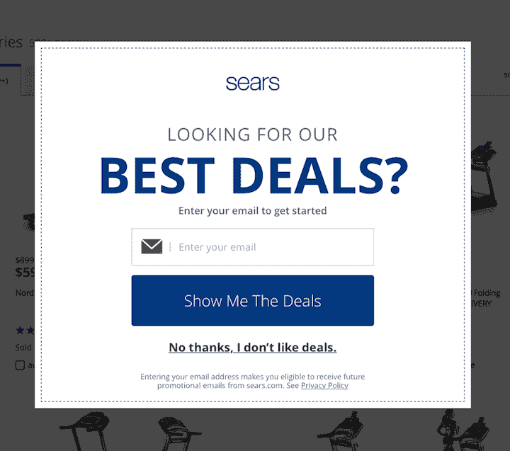
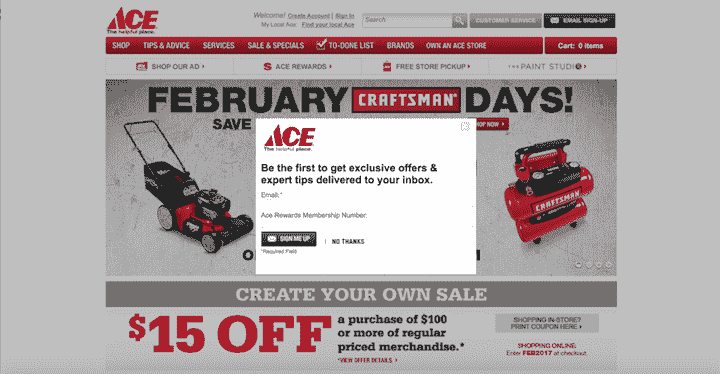
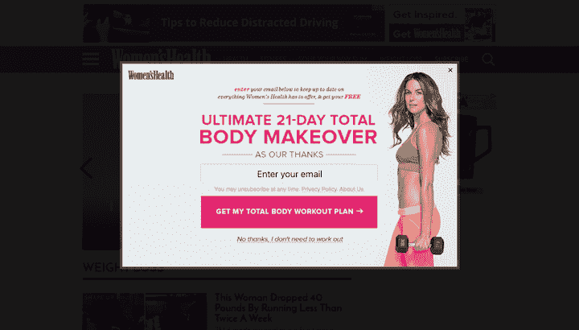
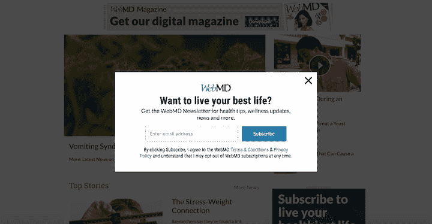
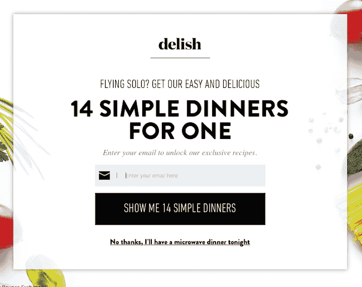

# 停止羞辱你的用户进行微转化

> 原文：<https://www.nngroup.com/articles/shaming-users/?utm_source=wanqu.co&utm_campaign=Wanqu+Daily&utm_medium=website>

一个有问题的趋势正在网络上像流行病一样蔓延。一些网站不顾一切地试图将用户推向像时事通讯注册这样的转化，在他们的弹出窗口中添加了可操作的链接文本。这些让用户感到羞耻的标签被称为 **manipulinks** (史蒂夫·科斯特洛创造的一个聪明的术语):它们采用了通常被称为**确认羞辱**的做法——让用户对选择退出某项服务感到不舒服(从逻辑上来说，这种做法可能更好地被描述为拒绝羞辱)。

*Sears.com: This [modal](http://www.nngroup.com/modal-nonmodal-dialog) includes a classic example of a manipulink.  A prompt, Enter your email to get started is followed by two “creatively” labeled options: Show Me The Deals, and the manipulink, No thanks, I don’t like deals. The text actually stating that users will receive promotional emails is the least noticeable on the page.*

这种模式通常出现在一个[模态叠加图](/articles/modal-nonmodal-dialog/)(有时，一个[请不要去弹出窗口](https://www.nngroup.com/articles/needy-design-patterns/))中，包含一些不同的提议——注册我们的时事通讯，加入我们的服务，注册一个帐户。报价下方有两个选项——是或否——标签文本以第一人称表述。

这就是模式变得令人讨厌的地方。接受链接(例如，“是的，我想要最好的交易”)通常更大、更明亮、更引人注目。然后，拒绝链接(manipulink)是关于用户个性或优先级的各种不受欢迎的声明。例如，“不，谢谢，我讨厌存钱。”

Manipulinks 代表旧模式的新旋转。多年来，传统的弹出窗口一直使用大而醒目的接受按钮，旨在引导用户选择所提供的任何内容。然而，当让用户选择退出时，这些老派的弹出窗口稍微礼貌一些。如果用户不感兴趣，他们可以选择“不，谢谢”。马尼普林克人的做法增加了新的敌意。

*Ace Hardware employs a traditional and more direct approach to promoting its newsletter via a modal. It presents the offer directly without using a condescending tone. Users can simply say No thanks or close the window and move on. *

Manipulinks 只是另一个需求模式的例子——不顾一切地试图影响用户行为。然而，尽管许多需要的模式只是令人讨厌(就像上面的弹出例子)，manipulinks 对用户体验的负面影响更大。它们是用户界面元素，被故意设计来产生负面的情绪影响。我们可以将糟糕的情感设计分为三个层次:

1.  **失误**导致的负面情绪:设计师没有把事情想透(或者没有进行可用性测试)，从而创造出了一些人们不喜欢的东西。
2.  最初令人愉快的设计通过反复曝光变得令人不快。这种长期转向负面领域的情况，往往是试图追求表面愉悦的结果，比如文本动画。
3.  这个设计是**故意让人感觉不舒服**。

所有这些结果都降低了用户体验，但至少第一和第二是不完美设计的副作用。没有人是完美的，所以我们不能过分指责那些设计师。还是把罪责留给那些想伤害用户的人吧。

Manipulink 的粉丝认为，使用它们背后的逻辑是让用户在选择拒绝链接之前暂停一下。使用这种策略的设计师试图通过将用户的拒绝与负面的自我形象联系起来，来操纵情感设计的反思水平。

在我们的一个可用性研究中，一个用户看到了两个模态——一个包含一个来自 Women's Health 的 manipulink，另一个来自 WebMD 的更传统的提议。

《女性健康》杂志的提议没有引起用户的共鸣，因为尽管她对杂志上的其他类型的信息感兴趣，但她并不关心锻炼计划。她还意识到《女性健康》杂志试图通过这一提议来欺骗她订阅其时事通讯。她说，“这本质上是一种伪装成促销的简讯注册形式。我想我会直接点击“不，谢谢，我不需要健身”,尽管这听起来很有趣，因为《女性健康》杂志提供的不仅仅是健身建议。”

*Women’s Health required the user to click a manipulink she didn’t identify with in order to close the modal.*

当同一个用户收到来自 WebMD 的新闻订阅弹出窗口时，她更喜欢直接和礼貌的方式，说

“我喜欢这一点，因为这是更严重的问题，他们不会试图做任何类型的尖刻评论，比如，哦，不，我会生病的。我很感激他们变得更严肃了。我喜欢他们直截了当地说，‘看，这是一份时事通讯，如果你想订阅的话。如果你不想的话，这里有一个 X 按钮。这里发生的事情非常清楚，他们没有试图误导。"

*WebMD’s honest, straightforward offer resonated with the user where Women’s Health failed.*

这只是一个用户对两种语气的定性反应，但它说明了居高临下和操纵的语气可能产生的影响。事实上，这种做法引起了如此多的不满，以至于有人创建了一个专门批评确认羞辱的 tumblr 账户。**你的用户并不愚蠢，如果你像对待他们那样对待他们，他们会被冒犯。**咄。

## 为什么 Manipulinks 没有真正发挥作用

支持者引用导致更高比例的[微转化](https://www.nngroup.com/articles/micro-conversions/)的 [A/B 研究](https://www.nngroup.com/articles/putting-ab-testing-in-its-place/)作为他们策略成功的证据。当然，manipulinks 可能会让更多的用户订阅时事通讯。但是，专注于转换而排除常识是一个灾难的处方。**如果你不得不强迫更多的人订阅你的时事通讯，那也没关系。**

虽然 manipulinks 实际上可能会导致人们暂停，考虑，甚至转换更高的数字，有一个隐藏的权衡涉及。**这种方法会对您的用户体验产生负面影响**，这种影响不容易用 A/B 测试来量化。微转化增加带来的短期收益是以不尊重用户为代价的，这可能会导致长期的损失。多注册几个简讯就值得降低 [NPS 分数](https://www.nngroup.com/articles/nps-ux/)吗？还是负面的[品牌认知](https://www.nngroup.com/articles/brand-experience-ux/)？或者失去[可信度和用户的信任](https://www.nngroup.com/articles/trustworthy-design/)？

*Delish.com uses a manipulink in a modal meant to get users to sign up for a recipe newsletter.  The copy indicates that providing your email address will “unlock exclusive recipes” to help you avoid eating microwave dinner (you, loser!). The text does not actually communicate that by providing their email address, users also sign up for the newsletter.*

还有另一个原因，为什么声称“巨大的”微观转化增加可能是误导。在许多情况下，包含 manipulinks 的模态通常对他们提供的东西不诚实。上面的 delish.com 模式就是一个很好的例子——它要求用户的电子邮件地址来“解锁”食谱，但没有说明提供电子邮件地址也将注册 delish 时事通讯。在用户提供他们的电子邮件地址来解锁食谱后，Delish 立即给他们发送一封电子邮件，欢迎他们加入时事通讯。

当公司使用这种肮脏的策略，然后看到转化率增加，这可能与“聪明”的 manipulink 文本关系不大，而与他们直接欺骗用户的事实有关。这不仅仅是一种贫困的模式，也是一种黑暗的模式。

## 不要为了追求微转化而不尊重用户

你不应该对你的顾客刻薄，这只是常识。牺牲你与用户的关系来获得更多的电子邮件地址是只见树木不见森林。

你网站上的每一次用户互动都是一次[对话](https://www.nngroup.com/online-seminars/every-word-count/)——你在和你的用户交流，而界面只是媒介。想象一下，一个餐馆的服务员说，“你喜欢主菜上放胡椒，还是喜欢清淡的食物？”Manipulinks 是这种互动的数字等价物。**如果当面说是不礼貌的，那么抄下来也是不礼貌的。**

