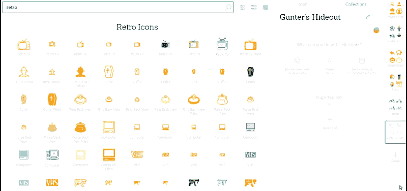
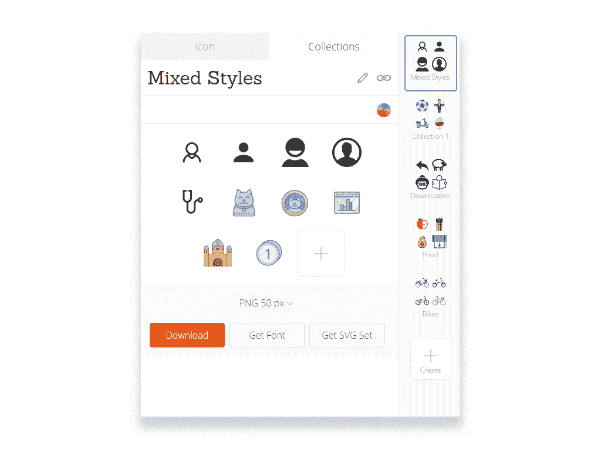
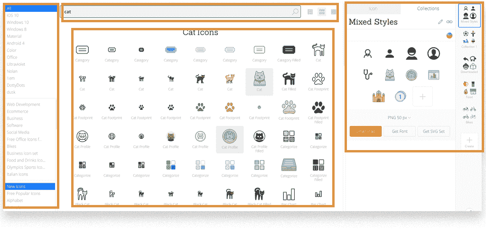
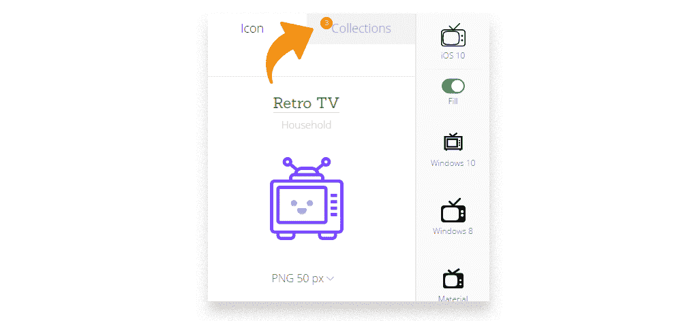
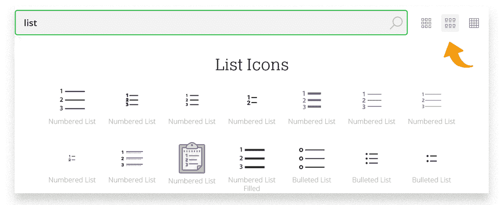
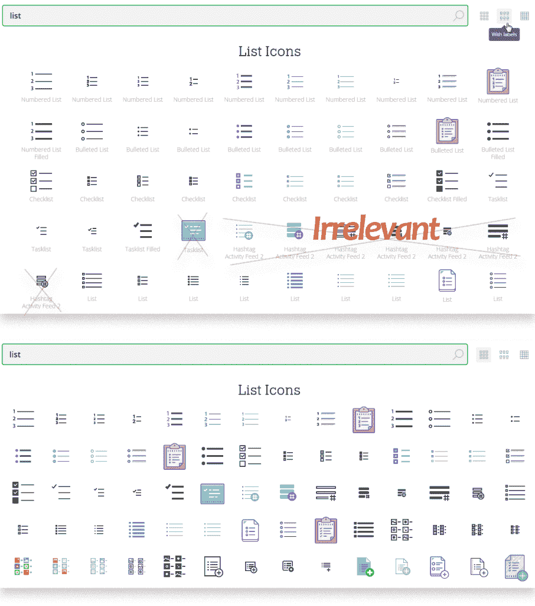

# 用户界面和 UX 的区别。一个实际的例子——blog.icons8.com

> 原文：<https://icons8.com/articles/difference-between-ui-ux-a-practical-example?utm_source=wanqu.co&utm_campaign=Wanqu+Daily&utm_medium=website>

我知道你在想什么。只是另一个试图在一个有争议的，引发圣战的话题上强加他的个人观点的家伙。“UI vs UX:有什么区别？”

你说得对。

我与其他文章的唯一区别是，我将向您展示我作为可用性专家的个人经验中的实际例子。我是一个在真人身上测试过一些真实功能项目的人。然而，不言而喻，我的观点是主观的，所以在《豪斯医生》每集的前 10 分钟，你可以比休·劳里更怀疑。

## 你可以分解 UI，但不能分解 UX

为了说明这一点，我将使用我们的[网站](https://icons8.com/web-app/new-icons/all)的一个功能——收藏。它可以让你创建图标组。

我创建了一个新的收藏，并开始拖动我想要的图标。

<noscript></noscript>

这是收藏的用户界面:

<noscript></noscript>

**什么是 UI？**以上看到的一切。

UI 可以很容易地分成几个部分。下面你可以看到整个图标 8 的用户界面，但它可以分为不同的子部分，如类别用户界面，收藏用户界面，搜索用户界面等。

<noscript></noscript>

那么 UX 是什么？

> “用户体验”包括最终用户与公司、公司服务和产品互动的所有方面。唐·诺曼。

换句话说，“收藏”是用户在我们网站上整体体验的很小一部分，因为它们是我们产品和相关服务的很小一部分。

让我们看一个真实的例子:

约翰是一位经验丰富的[图标使用者。他目前的收藏经验高度依赖于他以前在我们网站和任何其他图标网站的经验，不能孤立地考虑。](https://icons8.com/web-app/new-icons/all)

在使用集合之前，他已经使用了其他功能，例如*重新着色*。因此，当谈到收藏时，他希望能有同样的功能。

好的，第一个要点:

UX 不能分成不同的部分。UI 可以分。

我故意不说“UX 收藏品”，因为它破坏了 Don Norman 给出的整个定义。收藏是整个用户体验的一小部分。

你不能把 UX 收藏和整个 UX 孤立开来，因为没有人会在真空中使用这些收藏。在使用收藏之前，顾客可能已经搜索过图标，阅读过我们的时事通讯或者访问过其他图标网站(这也是他们体验的一部分)。

第二点:

每个人的 UI 都是一样的。UX 因人而异。

我采访了 3 个网站[访问者](https://icons8.com/web-app/44544/guest-male) : **约翰**，**艾丽西娅**和**史蒂夫**。没有对 UI 进行 A/B 测试，所以他们都平等地看待 Collections UI。然而，他们的总体经历(UX)是不同的。

约翰收到了一封[的电子邮件](https://icons8.com/web-app/1669/email)宣传我们的新功能“收藏”。鉴于他订阅了我们的[邮件列表](https://icons8.com/icon/773/list)，很明显他以前上过我们的网站。他是一个经验丰富的用户。新发布的收藏解决了他的老问题——一次下载多个图标。他很开心。他有一个伟大的 UX。

艾丽西娅通过谷歌搜索找到了我们的网站。她是第一次来访。她下载了一个图标就走了。她甚至没有看到“收藏”标签。她的经历是怎样的？她没有。至少她的经历没有接触过收藏。中立的 UX？不会。她可能遇到了和约翰一样的问题(一次下载多个图标)，但从未找到解决方案。那是一个糟糕的 UX。

Steve 每天都会使用收藏。但是在试图[将第 500 个图标](https://icons8.com/icon/1582/add-image)添加到他的收藏中之后，他得到了一个[错误](https://icons8.com/web-app/360/error)消息“没有找到”。史蒂夫还指出，通过使用另一个网站，他能够从数千个图标中生成字体。坏 UX。

看到了吗？UX 因人而异。

记得我说过这样一个事实…
*UX 不能分成不同的部分。UI 可以分。*

它甚至更进一步。

不同人的 UX 氏症也不能相互隔离。

这里我们有两种不同的用户体验。是否应该分别对待？号码

约翰有一次很棒的经历。然而，我们必须确保在帮助其他两位客户 Alicia 和 Steve 的同时，不会让他的 UX 变得更糟。

艾丽西娅和史蒂夫都代表我们的客户，每个人都有自己的问题和一个坏 UX。我们需要提高他们的整体 UX。

从艾丽西娅开始吧。艾丽西娅代表了很多根本没有注意到右上角“收藏”标签的人。在此之后，我们试图通过添加以下通知来提高人们对收藏的认识:

<noscript></noscript>

现在，当人们[下载](https://icons8.com/icon/)任何图标时，我们会自动为他们创建一个名为“Downloaded”的收藏，这个红色通知会显示添加到收藏中的新图标的数量。艾丽西娅的 UX 得到了改善，但这并没有使约翰(最快乐的顾客)的生活更加艰难。而史蒂夫…好吧，让我们说史蒂夫有更大的问题要考虑。

史蒂夫面临的问题在技术上要求更高。我们将任何给定集合中的最大图标数量限制为 500 的原因是，只有 0.001%的客户需要这么大的集合。扩大这一限制将导致[服务器](https://icons8.com/web-app/1340/server)负载急剧增加，从而导致所有用户的响应时间延长。这可能会恶化其他客户(如 John 和 Alicia)的整体体验。

简而言之，我们不能在不恶化约翰和艾丽西娅体验的情况下改善史蒂夫的体验。然而，我们可以把事情缓和一点。还记得史蒂夫在添加第 500 个图标时得到的消息吗？错误消息“Nothing found”具有误导性。让我们稍微调整一下:

“我们的收藏不支持超过 500 个图标。请创建另一个集合或联系我们的支持人员”

很容易，我们设法增加史蒂夫的 UX，而不伤害其他任何人的。

我要把这一点真正的锤炼出来[家](https://icons8.com/icon/73/home) : *UX 的不同人不能孤立的看待。*

你看，不同人的 UX 是相互联系的。你永远不应该在不考虑其他顾客的情况下对待某些顾客的体验。是的，你对待每一个问题都不同，但是你总是应该考虑解决方案如何影响其他人的 UX。

## UI/UX 区别的另一个例子

有一次，我的任务是对我们的搜索进行可用性调查。我写了一个非常棒的侦探故事，所以这次我会很简短。

我的目标是测试 3 种不同的搜索模式:

<noscript></noscript>

<noscript></noscript>

这个故事中的 UI 是什么？这是两个在搜索模式和搜索结果(图标)之间切换的按钮。

所以我能和我的参与者测试的就是这些按钮是否是可点击的，以及人们是否能找到它们。参与者花了 2 分钟完成所有这些。

UX 是什么？

带着这个问题，我的调查突然从 2 分钟的聊天变成了 30 分钟的全面采访。

我越是询问人们在搜索模式之间切换的体验，就越能发现:

*   UX 因人而异。
*   UX 不能分成不同的部分。

再说一次，UX 对任何人来说都是不同的(如果没有别的，请记住我打了 100 遍的这句话)。

无论我多么刻意地遵循我的采访脚本，所有 5 名参与者都有完全不同的问题和做事方式。

例如，[一位设计师](https://blog.icons8.com/articles/how-to-become-a-ux-designer/)发现“只有图标，没有文字标签”模式更方便，而一位[经理](https://icons8.com/web-app/11178/manager)发现文字标签让她可以更容易地纠正自己的搜索参数，找到她想要的东西。

UX 不能被分割成不同的部分。

我让人们在不同的模式下搜索图标，他们的体验很大程度上取决于他们第一次使用的搜索模式。

例如，我让人们搜索一个[列表](https://icons8.com/web-app/for/all/list)图标。

<noscript></noscript>

然后我让他们指出结果中任何不相关的图标。如果他们第一次在“图标和文本标签”模式下搜索，无关图标的数量会显著增加。在 UX，一切都是相互关联的。

## 编后记

互联网上充斥着讨论 UI/UX 差异的文章。我不想再给你发垃圾邮件了。代替术语和自我想象的定义，我试着给你展示一些实际的例子，这样你可以自己感受什么是 UI，什么是 UX，以及它们在每种情况下是多么的接近，然而又是多么的遥远。

* * *

***关于作者:** Andrew 在 Icons8 开始是一名可用性专家，进行采访和可用性调查。他非常希望[与我们的专业社区分享](https://icons8.com/icon/3447/share)他的发现，并开始为我们的博客撰写有见地和有趣(有时两者都有)的故事。*