# 网络繁荣和萧条——25iq

> 原文：<https://25iq.com/2017/05/12/the-dot-com-boom-and-bust/?utm_source=wanqu.co&utm_campaign=Wanqu+Daily&utm_medium=website>

“99 年的时候，大多数企业家都不在了。他们对它没有任何肌肉记忆。“比尔·格利(2016 年 9 月)

不像比尔·格利所说的企业家，我有很多来自互联网泡沫的肌肉记忆。作为过山车的投资者，你不可能用语言完全表达出坐在领头车里的感受。在事实发生后审视周期，与展望未来、不知道接下来会发生什么完全不同。这段经历仍然影响着我的思维和行为方式。从某些方面来说，这很有趣。如果你不能像我们在市场上经历的过山车一样从网络现象中吸取教训，你就没有注意。好的判断来自经验，而经验往往来自坏的判断。大多数与网络时代相关的错误判断都被观察到了，但其中一些是我自己或作为群体的一部分犯下的错误。很难描述当时 FOMO 的感受有多强烈。人们害怕错过上涨的机会，厌恶损失和账面收益使得他们不愿意采取行动来缓冲下跌。

每个故事都要有一个起点。开始这个故事的最佳时间可能是 1993 年，当时商业环境首次开始发生变化，并发展成泡沫。那些我们后来回过头来看并会说“那太疯狂了”的变化一开始并没有以一种巨大的方式发生。开始时，初始压力增加是逐渐的和稳定的。但到了 1994 年，派对开始变得更好，小摆设更加奢华，纸财富以令人印象深刻的速度创造出来。每个人都是沸水中的青蛙，但他们大多没有感觉到。到 1995 年，在滚石乐队或老鹰乐队中，在由大人物主持的私人聚会上演奏，在某些地区的某些圈子里已经成为常态。

这一时期不正常的一个方面是首次公开募股数量的快速增长。这张图表显示了 20 世纪 90 年代中后期的“IPO 猪穿过蛇”。这也让我们对当前的 IPO 市场有了一个全面的认识。

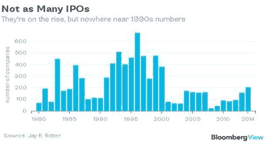

风险投资支持的 IPO 如下图所示。一位在《彭博》上引用的风投人士最近预测，2017 年将有 30-35 宗 IPO。作为比较基准，2016 年有 21 家科技公司 IPO，2015 年有 23 家，2014 年有 55 家，2013 年有 84 家。

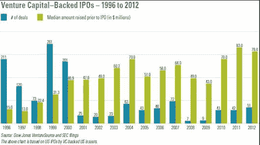

直到 1996 年左右，纸财富的创造量才开始加速到疯狂的水平。虽然 1996 年是首次公开募股最多的一年，但就估值和筹资金额而言，1999 年是关键的一年:

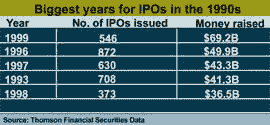

互联网时代 IPO 疯狂的一个方面是第一天上市的第一天。在 1999 年，对一些人来说，获得“朋友和家人”股份的首次公开募股似乎是一种有保证的盈利方式。像大多数泡沫现象一样，*首日暴涨*的方法一直奏效，直到它突然失灵。

当疯狂正在进行时，有人预测泡沫正在形成，而且结局会很糟糕；其中一些人过早做空股票，导致他们的基金跌至 0 美元。这一经历说明了提前做出预测与犯错是难以区分的。到 1999 年末，我记得我在想“不可能每个人都这么富有。或者他们能吗？”一些人在短短几个月内就在纸面上变得惊人地富有，这种嫉妒和妒忌的影响导致其他人失去了与现实的联系。环境简直是疯狂的。FOMO 让人们做一些事后看来疯狂的事情，但在当时看来是合理的。这里是一个回顾:

根据汤姆森金融证券公司的数据，1999 年首次公开募股筹资超过 690 亿美元，比第二大年度 1996 年增长 39%。然而，更令人瞠目的可能是今年创纪录的首日涨幅。VA Linux 在 12 月初的首日交易中创纪录地上涨了 733%。根据 WorldFinanceNet.com 的数据，今年有 117 家，或者说 23%的 IPO 在交易的第一天飙升了 100%以上。今年首日平均涨幅为 68%，远远超过了去年 23%的平均涨幅。根据 IPO.com 的数据，今年有史以来首日涨幅前 10 名的股票中，有 9 只获得了今年的冠军。

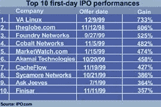

VA Linux 怎么了？

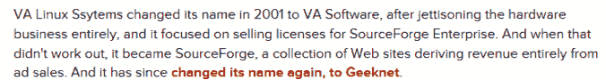

极客网现在出售经典商品，如:

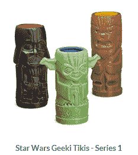

2000 年 4 月的一篇沙龙文章描绘了一幅技术世界中的派对场景，这是由太多的现金追逐太少的价值而产生的。这篇文章最值得注意的地方可能是它出现在泡沫破裂之后。派对现场仍在进行中，但即将灾难性地停止。

杰西卡·克洛利克喝下她的免费饮料，从桌子上拿起一件黑色羊毛夹克，冲出了旧金山现代艺术博物馆的网络派对。她和四个陌生人一起跳上一辆面包车，他们正前往另一个城市的网络狂欢。话题从工作转移到公寓，但显然没有提到数字内容交付公司 Digital Island，该公司花费 5 万多美元购买食物、饮料和羊毛，以庆祝其新标志并宣布与苹果公司合作。事实上，当克罗利克和她的团队到达第二个派对时——这是一个由在线货币公司 Beenz 主办的热带主题的更喧闹的活动——很少有人记得第一个公司的名字，也没有人知道或关心这两家公司是做什么的。网络公司的估值可能已经下降，但对奢侈的网络派对的热情却没有下降，派对预算也没有削减的迹象。在任何一周，科技公司都会在旧金山湾区举办 15 到 20 场派对。根据派对策划人和场地所有者的说法，平均每个派对花费 3 万至 5 万美元，尽管 25 万美元的井喷并不罕见。例如，今年 3 月，在线销售自动化服务 Salesforce 和提供流媒体工具和内容的 iCast 的营业额都超过了 20 万美元，招待了 1000 多名客人。Acteva 的总裁马克思(Marx)同意这一观点。Acteva 于去年 12 月邀请了 2000 人到金银岛参加一个耗资 20 万美元的派对，并宣布了它的新名字。更多的钱，更多的人，更奢侈的想法，绝对是要走的路。他扫视了一下微不足道的 WiredPlanet party，说道:“仅仅‘召集几百人，给他们喝一杯’已经不够了。

很明显，1999 年 IPO 和不盈利公司的数量异常之多。

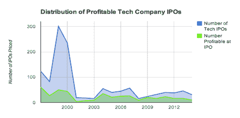

s *chadenfreude* 和病态好奇心的程度也是前所未有的。疯狂的点名很长:

抓住他

皮克斯龙

Startups.com

eToys

Pointcast，

行星 RX

蓝山

Digiscents

信息空间

网络折扣

融合

GovWorks

Beenz

Webvan

Kozmo

地球化学

地面

一份在互联网时代上市的公司的更完整的名单可以在这份名为“互联网泡沫破裂的前奏”的文件中看到。如果数学揭示了另一个幂定律，那将会很有趣。

很难描述的一件事是事情变得如此之快。有些人像被车灯照着的鹿一样僵住了。其他人采取了行动，挽回了一些价值。在市场中的每一天，即使是在波动性较小的时候，你也是坐在过山车的头车中，看不到前面的任何东西，但因为在互联网时代，上下波动非常剧烈，这种经历尤其令人不安。

“2000 年 3 月 10 日，纳斯达克股票总价值为 6.71 万亿美元；崩盘始于 3 月 11 日。截至 3 月 30 日，纳斯达克市值为 6.02 万亿美元。2000 年 4 月 6 日是 5.78 万亿美元。”

到 2000 年初，投资和商业环境不像 1999 年那样疯狂，但情况仍相对较好。但是那一年情况急转直下:

汤姆森金融证券数据公司的首席市场策略师理查德·彼得森说:“与 1999 年不同，2000 年新发行的债券中有许多大输家。”。彼得森的公司报告称，去年上市的 452 只股票中，有 284 只(63%)的股价低于发行价，68%的股价低于首个交易日的收盘价。

是什么导致了泡沫破裂？2000 年 3 月,《巴伦周刊》刊登了一篇报道，其中包含一些发人深省的数字，一些人认为这些数字是引发股市回调的关键。我认为引发这次调整的原因是缺乏现金。巴伦的文章是压在骆驼背上的最后一根稻草吗？这是不可能证明的，但有些人这样认为。我记得读过《巴伦周刊》的报道，但由于我看到许多手头没有多少现金的互联网公司，这篇文章的结论并不算新闻。巴伦的文章中提到的名单上有电信公司，但直到 2001 年初，电信世界才出现崩溃。名单上还有一些公司幸存下来，如亚马逊、Ticketmaster、迈克菲和 Priceline。无论如何，不管你是否认为这篇文章是变化的原因，巴伦的故事是非常及时和正确的:

“互联网股票评估公司 Pegasus Research International 为《巴伦周刊》进行的一项独家研究表明，至少有 51 家网络公司将在未来 12 个月内烧钱。这相当于我们研究中 207 家公司的四分之一。资金可能很快告罄的公司包括 CDNow、Secure Computing、drkoop、Medscape、Infonautics、Intraware 和 Peapod。为了评估互联网行业的财务状况，Pegasus 假设研究中的公司将继续以与去年第四季度相同的速度记录收入和支出。虽然这种方法不能准确预测未来，但它有助于回答一个困扰许多股市分析师的问题:拥挤的互联网行业何时开始被淘汰？后果是深远的。首先，美国 371 家公开上市的互联网公司已经发展到了总市值 1.3 万亿美元的地步，相当于整个美国股市的 8%。"

纳斯达克的这些图表讲述了一个关于何时发生了什么的图形故事。值得注意的是，它下跌的速度和上涨的速度一样快。据我回忆，有一家公司最终被困在仓库里的 FPGA 芯片里，价值 100 美元的 1B。一切都变了。快点。电信泡沫花了更长一点的时间来纠正，但这是另一个故事。

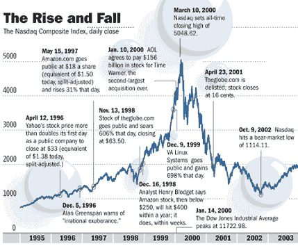

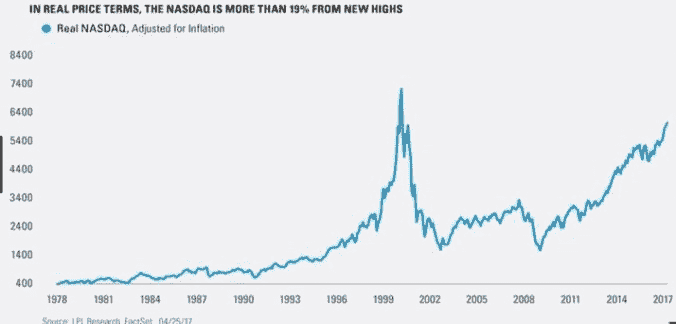

到 2000 年 12 月:

“一年的变化真大。纳斯达克指数下跌。股票提示已经被衰退的言论所取代。许多开创性的网络公司倒闭或勉强生存。由网络蓝筹股组成的道琼斯互联网指数自 3 月以来下跌了 72%以上。曾是华尔街宠儿的在线零售商 Priceline 和 eToys 的股价已经从高点下跌了 99%以上。

Philip J. "Pud" Kaplan 经营了一个网站，发布失败创业公司的故事、内部备忘录和泄露的文件，这些文件仍然可以在[http://web . archive . org/web/20011201061308/http://fucked company . com/](http://web.archive.org/web/20011201061308/http:/fuckedcompany.com/)找到。你可以改变日期，模拟每天看着死水一潭的感觉。帖子看起来像这样:

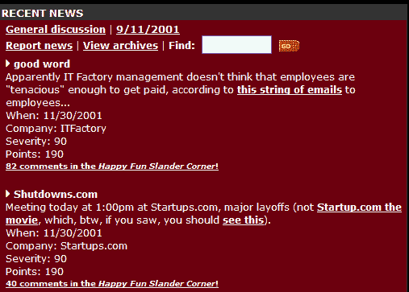

就我自己与泡沫结束有关的决定而言，1999 年夏天，我在阅读了大量有关巴菲特和芒格观点的材料后，通过卖出一些股票和买入一些看跌期权作为代理对冲，对市场进行了对冲。那一年，我决定把足够的钱存起来，这样无论发生什么事情，我都能过得舒适。生活中总有这样的时候，这个世界没有多大意义，至少对你来说是这样。举个例子，1999-2001 年的互联网泡沫就是这样一个时期。股票销售和代理对冲确保了我退休后不会成为任何人的负担，也确保了我的孩子能够在我的资助下上大学。我没有卖掉所有的东西，确实留下了很多钱，但是我的“杠铃投资组合”完成了它的设计目标。我的决定并不完美，但它们是合理的。

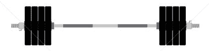

风险小(现金和安全债券)风险大(初创公司和科技股)

所以你可能会问，我们现在是在泡沫中吗？我们可以说情况大不相同。今天的情况与 2000 年 3 月时不同。《经济学人》写道:

“今天成功的基础更加广泛。2000 年，全球约有 4 亿人可以使用互联网；到 2015 年底，将有 32 亿人。互联网以比 15 年前更多的方式进入这些人的生活。记者兼企业家约翰·巴特利说，科技不再是一个垂直行业，因为 40 年来每个人都明白这一点。他创办了《行业标准》( Industry Standard)杂志《T1 》,该杂志在 2001 年破产前报道了互联网热潮。技术现在是贯穿整个经济的一股横向推动力量。"

我属于这样一类人，他们认为我们今天没有估值泡沫，而是存在风险泡沫。从 2000 年的泡沫破裂中吸取的最大教训是，现金龙头可能会很快关闭。前一天你能筹到几亿美元，第二天你就筹不到五分钱了。从互联网泡沫结束到 2003 年，现金确实是王道。我记得早在 1998 年，格雷格·马菲(Greg Maffei)在他还是微软首席财务官的时候就告诉过我。风险和估值不一样。现在有许多事情都不同了，LPL 金融公司首席投资官伯特·怀特在本文[中提到了其中一些](http://www.valuewalk.com/2017/05/nasdaq-6000-now-infographic/)

*   **市盈率。【2000 年 3 月纳斯达克的本益比是 107，而今天是 23。即使使用一致的未来(未来 12 个月)收益预期，2000 年 3 月的市盈率仍为 75 倍，而今天为 22 倍。现金流倍数也说明了同样的问题:当时接近 100，而现在只有 25 左右。**
*   市净率。基于公司资产减去负债的价值或账面价值的估值指标也显示，2000 年的纳斯达克要比现在贵得多。在互联网泡沫期间，缺乏支持估值的资产是一个大问题(浏览量、眼球和点击量是不够的)。2000 年 3 月高峰时的市净率是 7 以上，现在是 3.9(截至 2017 年 4 月 28 日)。如今，这些资产产生的利润要高得多。
*   **市场轨迹。将今天的纳斯达克与 2000 年的纳斯达克进行比较的另一种方法是观察两次反弹的陡度，这揭示了一个巨大的差异。纳斯达克指数在过去两年中上涨了 22%，相比之下，在 2000 年 3 月 10 日达到峰值之前的两年中，该指数上涨了 189%。显然，今天的科技股反弹没有互联网泡沫的抛物线性质。**

不好的经历可以带来好的东西。许多当时失败的想法现在正在成功。资本主义需要失败，说互联网泡沫导致许多事情失败是一种保守的说法。CB Insights 在这里描述了一个很好的例子:“1996 年，Borders 书店(现代电子商务时代的一个著名受害者)的创始人 Louis Borders 有一个疯狂的想法，让人们在网上订购杂货，并让他们送货上门。为了实现这一目标，Louis Borders 在 1999 年年底通过首次公开募股筹集了 3.96 亿美元。然而，在持续亏损数年后，该公司终于在 2001 年倒闭。但 Borders 的梦想是人们永远不必离开家去买杂货，这个梦想已经被亚马逊采纳了。“我认识几个喜欢 WebVan 的顾客，他们为它的消亡感到悲伤。但是他们无法支付他们的成本(风险慈善事业没有规模)并且现金告罄。

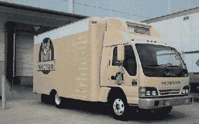

**备注:**

1999 年:http://money.cnn.com/1999/12/27/investing/century_ipos/

2000 年:https://www.forbes.com/2001/01/03/0103sf.html

https://mattermark.com/technology-company-ipos-then-now/

10 年过去了:[https://www . CNET . com/news/10-years-Gone-the-va-Linux-systems-IPO/](https://www.cnet.com/news/10-years-gone-the-va-linux-systems-ipo/)

### 像这样:

像 装...

类别:[未分类的](https://25iq.com/category/uncategorized/)