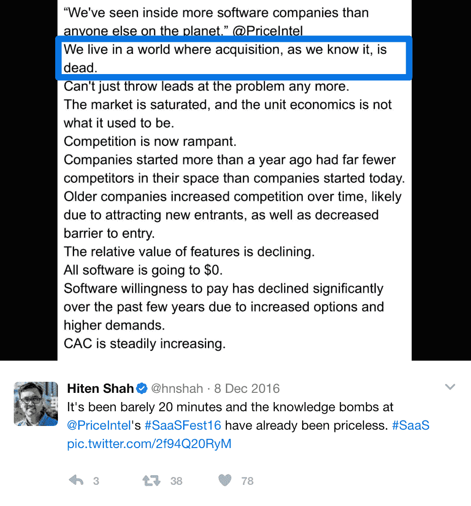
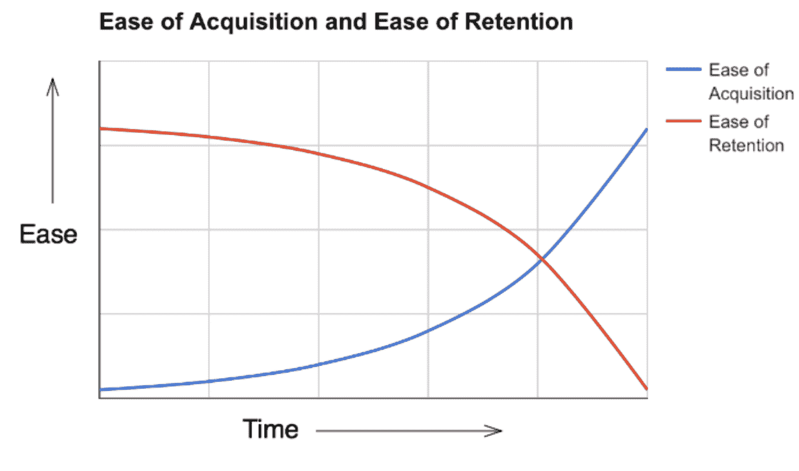
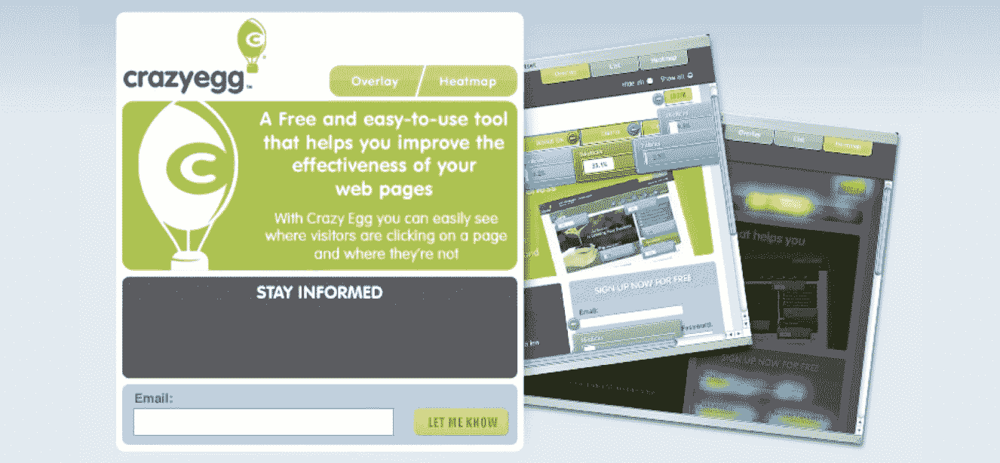

# 收购很容易。留住人才很难。产品习惯

> 原文：<https://producthabits.com/acquisition-is-easy-retention-is-hard/?utm_source=wanqu.co&utm_campaign=Wanqu+Daily&utm_medium=website>

# 收购很容易。留住人才很难。

在 SaaS，获得新客户曾经非常困难。大多数公司要么局限于通过 Google AdWords 的横幅广告，要么局限于 SEO。

如今，获得大量新用户并不困难。难的是留住他们。

去年 12 月，我在推特上发布了 Price Intelligently 的 2016 年 SaaSFest 中一些最令人震惊的观点。

有一个观点引起了我的注意，因为它违背了一些关于 SaaS 增长的普遍看法:*我们生活在一个收购已死的世界。*

## 更多的竞争意味着强大的产品会胜出

如果你想建立真正伟大的东西，你必须超越低挂的水果。如今，让大量用户注册你的产品不足以维持和扩大业务。

Reforge 首席执行官、HubSpot 前增长副总裁 Brian Balfour 曾说过，留住人才是所有增长的基础。“但是很多公司并没有这样做。一项由 Price Intelligently】进行的[研究显示，大多数 SaaS 公司都在谈论和制造用于收购而非保留的产品。如果保留如此重要，为什么人们仍然如此痴迷和专注于收购？](http://www.priceintelligently.com/blog/saas-growth-focused-too-much-on-acquisition)

SaaS 知识共享的增加、更好的技术和更低的工具成本使得收购变得更加容易。但是你的公司越容易获得客户，就越难留住他们。

这里有三个主要问题:

*   **竞争加剧:**进入壁垒的消除使得企业家更容易带着他们的产品进入这个领域。越来越多的人在建立和销售 SaaS，所以你必须提供比“仅仅”一个产品更多的东西来突出你的目标市场。
*   **降低 SaaS 工具之间的转换成本:**免费增值工具为潜在客户提供了一种无风险的方式来试用你的产品。但是潜在客户越容易从另一个产品转到你这里，你的客户就越容易离开你的产品，去买竞争对手的产品。
*   **更便宜的配送:**在奥兰治县，服务器放在机架上的日子已经一去不复返了。SaaS 的产品分销成本将为零。尽管为更多的客户服务更容易，但并不是所有的客户都是你可以围绕着建立业务的客户。

我们正处于 SaaS 的第二波浪潮中，这个行业的竞争比以往任何时候都更加激烈。赢家曾经是销售团队最大的公司。在今天的零和市场中，你的成败取决于你产品的实力。你的产品会吸引客户的注意力，随着时间的推移提供越来越多的价值，并符合你的最佳客户的需求。

SaaS 的每一次转变都让收购变得更加容易，却让留住人才变得更加困难。以下是如何克服这些挑战的方法。

## 1.更多的竞争使得注意力成为稀缺资源

随着 SaaS 产业的发展，进入变得越来越容易。建造 SaaS 曾经是昂贵的，不为人知的，而且推向市场是有风险的。但是很多事情都变了:

*   关于建立 SaaS 公司的信息是免费的。随着越来越多的人获得行业经验，越来越多的人愿意分享自己的经验来帮助他人学习。
*   开发者可以以较低的成本获得更多构建 SaaS 的工具。开源软件工具，如 [Twilio](https://www.twilio.com) 和 [Clearbit](https://clearbit.com) 帮助公司开发应用程序和寻找客户。亚马逊网络服务的兴起也使得构建和扩展应用变得更加容易和廉价。
*   最终用户有一种“什么都有一个应用”的心态随着越来越多的 SaaS 产品出现并越来越多地集成到工作流程中，旧的工作方式被 SaaS 所取代。市场更容易接受 SaaS 的解决方案，这个行业有更多的钱可以赚:从 2006 年到 2016 年，软件公司[创造的收入翻了三番，从 530 亿美元增加到 1690 亿美元。](https://seekingalpha.com/article/3967118-just-far-along-saas)

这是一把双刃剑。进入的便利性已经帮助超过 150，000 个独特的企业云应用程序参与进来。来自同一领域的应用程序的更多竞争使得客户有限的注意力成为稀缺资源。

### **如何保持高保持率**

当竞争激烈时，你留住客户的最佳武器是[一款客户真正想要使用的优秀产品](https://hitenism.com/competing-in-saas/)。

做到这一点的一个方法是在几个方面对你的顾客有用***。****例如，Intercom 这样的公司旨在成为满足用户所有客户沟通需求的一站式商店。随着时间的推移，成为客户的最佳解决方案已经从提供一种工具演变为提供一套工具。公司正趋向于[一体化 SaaS](https://www.slideshare.net/hiten1/the-rise-of-allinone-saas) 。*

 *Intercom 最初是一个简单的聊天式弹出窗口，其理念是与客户交谈应该很容易。

但是今天，客户交流不仅仅意味着实时聊天。它是实时聊天、电子邮件、知识库等等，所有这些都整合到一个系统中。因此，Intercom 已经扩展为一套产品，包括实时聊天、应用内消息传递、客户帮助台和公共知识库产品培训。他们都在对讲机平台上一起工作。

Intercom 的新定价表明，他们仍在试图找出如何让每个人都进入他们的平台，而不是只使用一两个产品。

该平台是免费的，所有用户都可以免费试用任何产品。推动因素是让客户参与整个服务，而不仅仅是一部分。

当创始人计划在竞争更加激烈的领域留住客户时，他们需要问:

*   行业何去何从？新技术如何影响行业？
*   现在还有哪些产品可以帮助我的客户？
*   我的客户在 1 年、5 年、10 年后会想要什么？

随着竞争加剧，客户稀缺的注意力被拉向几个方向，Intercom 正在寻找与客户保持关联的方式。多样化和扩大你的产品供应可以避免你在其他选择中被淘汰。

## 2.降低转换工具的成本意味着可以吸引客户

SaaS 不仅有更多的竞争者。竞争对手也比以往任何时候都更容易获得你的现有客户。

*   订阅模式为客户提供了流失的机会。定期付款而不是大笔初始投资意味着客户可以随时轻松更换提供商，而不会赔钱或违约。
*   免费增值 SaaS 让用户无风险地试用竞争产品。公司采用免费增值模式作为一种低摩擦的方式来获得客户，并向他们展示其产品的价值。一种产品的消费者可以“[试用并转换](http://ink.library.smu.edu.sg/cgi/viewcontent.cgi?article=3440&context=sis_research)到竞争对手那里，并自信地认为他们知道他们得到的是什么。
*   存储在产品中的数据不再锁定客户。过去，客户使用某个产品的时间越长，就越有可能继续使用该产品，因为该产品存储了他们越来越多的数据。但是像 [Segment](https://segment.com) 这样的工具可以让客户很容易地从一个产品中提取他们的数据，并将其带给竞争对手。

SaaS 的顾客可以随时来来去去。当客户知道机会成本很低时，他们更倾向于尝试你的产品。这很好——但是一旦他们注册了，他们也可能会尝试你的竞争对手。

### **如何保持高保持率**

如今，转换 SaaS 工具的财务成本和机会成本都很低。那些可能让客户停留在过去的东西——转换的障碍——已经不再相关了。

但是，如果你提供的是你的高价值客户想要的东西，并且随着时间的推移给他们越来越多的价值，客户就没有理由转向竞争对手。

这就是 Front 如何在竞争激烈的环境中成长起来的。Front 没有专注于通过徽标实现纯粹的增长，而是专注于通过保留和追加销售现有用户来实现增长。首席执行官玛蒂尔德·科林[最近出版了他们用来筹集 1000 万美元 A 轮融资的卡牌](https://medium.com/@collinmathilde/front-series-a-deck-f2e2775a419b)，展示了现有客户的增长如何锁定了公司的成功。

Front 创造了一个对它的许多用户来说非常有粘性的产品。Front 用户的使用量增长迅速(Front 月活跃用户的 50%也是日活跃用户)。同时，提前将这些客户销售给更高的计划，从而扩大了收入。

Front 挖掘了客户真正喜欢这款应用的地方，以及提高他们参与度的因素。分配和共享电子邮件的能力、团队范围的透明度以及内置的协作工具都鼓励团队中更多的人更多地使用。Front 现有客户平均增长了 50%,实现了净负流失率。他们的留存率如此之高，以至于不用收购就可以逐月增长。

了解客户想要什么，来源于与客户的沟通。

你可以通过问以下问题来确定是什么让顾客再次光顾:

*   谁是你产品的理想用户？
*   对这些用户来说，你的产品最有用的方面是什么？如何改进这一特性或使其更加明显？
*   随着用户公司的成长，你如何与他们一起成长？

从第一天开始，Front 就试图让他们的用户添加更多的团队成员，使用更多的功能，并发送更多的电子邮件。客户维系与他们的收购和入职密不可分。由于每个客户都有逃跑的风险，Front 计划从他们注册的那一天开始追加销售。

## 3.分销的低成本使得公司更容易服务更多的顾客

将软件带给大量受众的价格正在缩水到零。配送成本曾是一家 SaaS 公司能够服务的客户数量的限制因素，但这些障碍正在缩小:

*   SaaS 产品的边际成本几乎为零。所有产品都有初始成本和边际成本。初始成本是服务第一个客户的费用。边际成本是在此之后为每一位顾客提供服务所需的成本。AWS 让公司几乎不用花钱就能为 T2 分发软件成为可能。
*   营销和销售产品的工具越来越多。SaaS 工具数量的增加有助于提高销售、营销和增长的效率。今天的公司可以实现广泛的营销分布，即使只有一个小团队。
*   公司正在向高端市场转移，向企业销售产品。在中小企业市场起步的 SaaS 公司可能会通过向高端市场转移并向企业销售来实现增长，如 [New Relic](http://producthabits.com/dont-make-this-common-mistake-with-your-startup-business-model/) 。他们随着时间的推移改进他们的产品，以创建一个能够满足大公司需求的工具。这种“自下而上”的策略帮助他们以更高效的销售周期向企业销售软件。

现在，向更多人营销和服务更多客户的成本更低了。挑战在于如何在这些客户的基础上发展业务。额外的挑战是留住那些通过廉价和积极的收购活动进来的客户，他们从一开始就没有完全接受你的产品。

### **如何保持高保持率**

廉价的分销使你很容易填满你的漏斗顶端。但是要获得真正对你的公司感兴趣的客户，你必须确保你的产品和营销是一致的。

我们在一个谷歌分析已经存在的领域建立了疯狂蛋。但是，即使谷歌分析是免费的，并且帮助了很多人，它并没有做一些开发者需要的关键事情。因此，我们构建疯狂鸡蛋的第一步是建立一个早期访问登录页面，并开始与潜在客户交谈。

我们从不满的谷歌分析用户那里了解到，他们需要热图来跟踪页面上的每一次点击。即使在今天，谷歌分析也不能提供这种功能。因此，为了让我们的理想客户使用我们的产品，我们确保在营销中强调我们的热图功能，比如“可视化您的访问者”

如今，没有了 Orange County 机架上的服务器，吸引尽可能多的客户变得前所未有的容易。但疯狂鸡蛋的增长是由客户驱动的，他们被该产品的特定价值——热图——所吸引，并坚持使用它。

面对更便宜、更容易的分销方式，创始人应该问自己这样的问题来调整他们的产品和营销:

*   产品的什么特点吸引顾客？
*   注册后，他们发现哪些是最有用的？
*   你如何[确定你的销售线索](http://blog.clearbit.com/the-modern-guide-to-lead-qualification/)以确定哪些潜在客户值得追求？

仅仅因为它容易营销和服务更多的客户并不意味着你应该这样做。如果你在追逐销售线索，而不是告诉人们产品的价值，你就是在浪费时间和金钱在那些会流失的客户身上。

随着获取变得越来越容易，保留变得越来越难，仅仅创造一个工具是不够的。您必须为客户创造最佳解决方案。这就是为什么所有这些宏观问题都集中在一个想法上:改进你自己的产品。

## 一个好的产品仍然会胜过竞争对手

当前 SaaS 的形势使得收购变得不需要动脑筋。但是，在竞争更加激烈的环境中，解决方案并不是使用这些现成的收购策略。说到增长，这些高度可见的策略已经过时了。

相反，这些解决方案都是关于改善你自己的产品和你的客户对你的产品的体验。考虑如何平衡获取和保留的创始人需要考虑:

*   你的产品如何适应你的行业？它将如何适应未来几年？
*   你的产品在哪些方面鼓励使用？如何让用户更容易使用这些功能？
*   逗留时间最长的顾客最喜欢什么？你如何围绕这些特征调整你的营销？

增长必须是明智收购和明智保留的结合。了解什么是容易的，很好地执行它，然后进一步努力，迎接挑战。*