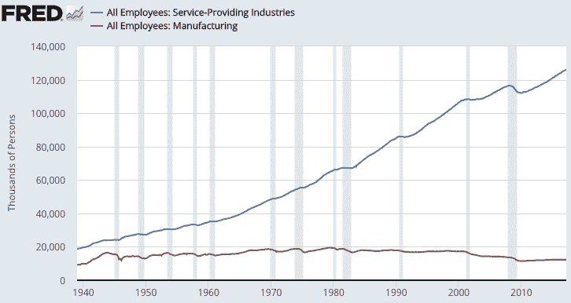

# 销售无形资产

> 原文：<http://awealthofcommonsense.com/2017/05/selling-intangibles/?utm_source=wanqu.co&utm_campaign=Wanqu+Daily&utm_medium=website>

我花了很多时间思考和写作更好的技术和改进的知识基础如何影响金融市场，但这些变化可能会对劳动力市场产生更大的影响。我一直告诉我的妻子，我们三岁的孩子可能会从事一份目前并不存在的工作或行业。

就在本周，脸书宣布他们将雇佣 3000 人来监控他们网站上的暴力或犯罪活动视频。这是我们现在生活的奇异世界，但我的猜测是，如果硅谷人群的预测有一半成真，技术将继续推动人们工作方式的变化。

与前几代人相比，最大的变化，也是已经存在一段时间的变化，是我们将看到从制造业到服务型工作的持续转变。你可以清楚地看到事情的发展方向:

随着我们从以产品为中心的世界转向以服务为中心的世界，人们和公司将不得不掌握新的生存技能。

对服务行业的人来说，最大的问题是它不是像产品一样的有形商品。这个过程中包含了更多的信念。在与服务相关的行业中，你很难区分运气和技能，质量往往取决于旁观者。

Harry Beckwith 在他非常有用的书《销售无形资产:现代营销实地指南》中谈到了这些观点 :

*美国是服务经济，有产品营销模式。但服务不是产品，服务营销也不是产品营销。*

产品是有形的。你可以看到它，触摸它。相比之下，服务是无形的。事实上，当你购买一项服务时，它并不存在。如果你去美容院，在你买之前，你看不到、摸不到或试不到一个发型。你点吧。那你就明白了。

当产品出现故障时，你通常会知道。音响停止播放，离合器停止离合，牛奶难吃。知道服务何时失败要困难得多。这是来自你的福利顾问的好建议，还是来自你的房屋油漆工的好画——也就是说，这是你讨价还价的服务吗？谁知道呢？

由于大多数产品故障都是显而易见且可证明的，因此大多数产品都可以保修。大多数服务不能。因此，对于大多数服务失败，你唯一的求助手段要么是痛苦的谈判，要么是痛苦的诉讼。

所以你购买了一项没有保证的服务——甚至更多的不确定性。

贝克威思阐述了这对那些从事服务行业的人意味着什么。以下是我的一些想法，关于人们可以在一个更加以服务为导向的劳动力中做些什么来帮助他们脱颖而出:

**了解人，建立关系。**因为你一开始就在销售客户看不见的东西，所以你必须成为一个好的关系建立者，才能在服务行业取得成功。你在卖服务，但你也在卖你自己、你的愿景、你的哲学和价值观。你必须让人们感到舒适。当顾客有无穷无尽的选择时，讨人喜欢是一个先决条件。贝克威思说:“潜在客户买不到你的工作有多好。他们买你在有多好，你是谁。

试着脱颖而出。每个人都认为自己是一片特殊的雪花，但事实上，同一行业的许多人、公司和服务都有非常相似的产品。贝克威思说，“服务越相似，差异就越重要。突出琐碎。”

学会如何讲一个好故事。人类是寻求叙事的生物。[讲故事的能力](https://awealthofcommonsense.com/2016/02/the-importance-of-story-telling-ability/)帮助我们从小部落发展到大城市、文化和组织。大多数推销都很无聊，充满了陈词滥调。我发现隐喻几乎总是比技术细节更有效。那些能以引人入胜的方式讲述自己故事的人将在竞争中胜出。大家都是做销售的。

**简化。**在金融界尤其如此，业外人士几乎不可能知道我们都在做什么。这个世界是一个复杂的地方，当人们试图做出困难的决定时，他们最不需要的就是更多的复杂性。当销售复杂的东西时，你必须把东西降低到最小公分母。在这个充满选择的世界里，简单胜过复杂。

弄清楚如何正确跟踪进度。与客户建立长期关系时，销售无形资产变得更加困难，因为短期内很难看到结果。这就是为什么如此多的投资者关注短期表现——这是有形的。超越无意义的短期表演舞蹈的方法是专注于过程。你告诉顾客你会为他们做什么，然后出去做你说过的事情。你为客户做的每件事都要尽可能透明，这也比以往任何时候都重要。服务行业的大部分工作是客户永远看不到的，所以拉开帷幕让他们知道他们得到的一切是值得的。

发展你的品牌。我写这篇文章的时候有点畏缩，因为这是现在每个人都在说的话，但这是真的。但是品牌并不一定是大多数人想象的那样。这不是一个符号或广告或标语。一个好的品牌是与一个值得信赖的公司联系在一起的，这个公司会像它应该表现的那样表现。服务企业建立在承诺的基础上。一个好的品牌是一个公司或个人的代名词，他们会在一致的基础上履行这些承诺，所以当你签约时，你确切地知道你会得到什么。

来源:
[销售无形资产:现代营销实地指南](https://www.amazon.com/gp/product/0446672319/ref=as_li_tl?ie=UTF8&camp=1789&creative=9325&creativeASIN=0446672319&linkCode=as2&tag=aweaofcomsen-20&linkId=f176d2e55dcac2c2fdab8e556e65bfea)

延伸阅读:
[大家都在销售](https://awealthofcommonsense.com/2016/12/everyone-is-in-sales/)

 