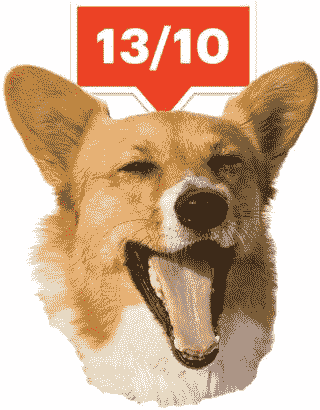
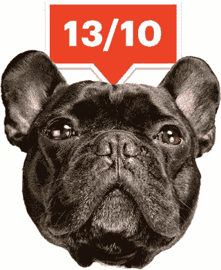
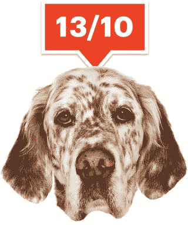
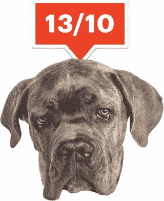

# 《我们给狗打分》的马特·纳尔逊把一个玩笑式的推特账户变成了成功的生意

> 原文：<http://www.esquire.com/lifestyle/a54940/we-rate-dogs-matt-nelson-interview/?utm_source=wanqu.co&utm_campaign=Wanqu+Daily&utm_medium=website>

学期快结束了，雨应该还会再下几个小时，但坎贝尔大学高尔夫管理专业的一群学生却被困在市场营销原理中，而不是在球场上。本周三下午的课程是关于产品生命周期，从新产品上市开始，经过稳步上升、达到顶峰，然后不可避免地下降的自然过程。

昏暗的报告厅里，40 名学生中的大多数人看起来都有点昏昏欲睡，但教授特蕾西·皮尔斯(Traci Pierce)仍保持着令人钦佩的乐观情绪，她展示了教科书中的一张图表，标题是“采用过程可以指导推广规划”该图显示，给定产品大约三分之二的潜在市场在成长阶段采用它。另外 10%到 15%是早期采用者。最稀有的一类消费者——根据皮尔斯的幻灯片，大约 3%到 5%——甚至超过了他们。

“你们中有创新者吗？”她问大家。

坐在后排的一个年轻人主动表示，他偶尔会在 Kickstarter 上支持新产品，皮尔斯想了一会儿，然后同意让他成为一名创新者。与此同时，在第二排，20 岁的大二学生马特·尼尔森偷偷查看他的手机，用只有他自己能听到的节奏敲打地板上的一双勃艮第运动鞋。这并不是说尼尔森不喜欢营销原理——事实上，这是他最喜欢的课程，主要是因为这是这学期唯一一门与他现在认为的职业道路相关的课程。虽然皮尔斯看起来是一个非常称职和敬业的老师，但尼尔森可能是演讲大厅前排的那个人。

纳尔逊在校园里呆了两个月，就开始了一个荒诞幽默的推特账户，专门为狗服务。“我们这里有一只日本爱尔兰雪达犬。在越南失去了眼睛(？).热衷于在楼梯上放松。2015 年 11 月 15 日，他在一张朋友的杂种狗和两只不同颜色的眼睛的照片上写道。他相信 WeRateDogs 会很快流行起来，因为在他的个人账户上任何关于狗的笑话“都会得到比它应该得到的更多的喜爱。”他的朋友马特坐在他旁边，成为他的第一个追随者。

在此后的 17 个月里，又有近 200 万人追随了“狗利率”。一本名为《WeRateDogs》的书将于 10 月份出版，这本书结合了热门歌曲和原创材料。一款由英国公司开发的手机游戏于今年早些时候首次亮相，但为尼尔森赚取了版税。他的网上商店出售衣服和印有账户中流行谚语的杯子，每月收入不到五位数。他帮助推广了“DoggoLingo”，这是一种网络语言，现在已经传播到现实世界的 T2 T3。他已经成为一种非常 2017 年的幽默的象征，这种幽默无缝融合了互联网的两种不同装置——无情的不敬的小吃和对可爱动物的真诚欣赏。其结果已经成为数百万 Twitter 用户最喜欢的休息时间，有时会感觉像是网上的恐怖游行。

> 他已经成为 2017 年一种幽默的象征，这种幽默无缝融合了互联网的两种不同形式。T3】

在互联网时代，WeRateDogs 可能比其大学时代的创造者更老——一个笑话 Twitter 账户在一年半后继续以指数级增长更受欢迎是极其罕见的。借用皮尔斯概述的营销框架，下一个问题是 WeRateDogs 的生命周期何时达到顶峰并开始下降？当尼尔森两年后毕业时，他还会以 WeRateDogs LLC 的首席执行官的身份谋生吗？“最初，我认为这是一条通往写作或喜剧工作的道路，”他在校园小鸡餐厅吃午饭时告诉我，“现在的目标是把它变成一份工作。我原以为这会带来机会，事实也确实如此，但现在这就是机会。”

这个内容是从 twitter 导入的。您可以在他们的网站上找到另一种格式的相同内容，或者找到更多信息。

在市场营销原理中，“创新者”意味着比其他人更早购买别人的创造。在纳尔逊的世界里，如果你不是那个创造的人，那就没什么意思了。虽然他的创造可能不会让一位中年营销高管觉得特别有创意，但纳尔逊对互联网逃避现实的更深层次的理解，已经在他 21 岁生日之前，将 WeRateDogs 变成了一个新兴的帝国。现在他只需要想出如何在 22 岁以后继续扩大它。

* * *

关于社交媒体名气的故事通常被说成是关于幸福意外的故事——一个未知用户发布了一些本来是给几个朋友的东西，但通过某种天意或炼金术，它“像病毒一样传播”，并使其创造者一夜之间成为明星。这不是 WeRateDogs 的故事。对马特·纳尔逊来说，Twitter 一直是一场需要赢得的游戏。

当然，对尼尔森来说，一切都是一场需要赢得的比赛。他的妹妹阿曼达，现在 22 岁，是学术明星；她今年从密歇根大学毕业。他的哥哥米切尔，现在 17 岁，是一个悠闲的人；他刚在西弗吉尼亚州的查尔斯顿读完三年级，马特八岁时尼尔森一家搬到了那里。马特，他的母亲芭芭拉说，是“紧张的一个。”

“小时候，不管发生什么事情，他都很争强好胜，”她说。“这可能就像寻找复活节彩蛋一样简单，他想不惜一切代价赢得胜利。不是你家里的每一件事都能成为比赛；这对你的兄弟姐妹来说并不总是好事。”

“如果呼吸是一项竞技运动，他的目标将是比所有人呼吸都快，”他的父亲马克补充道。

1996 年 10 月，马特在弗吉尼亚州北部出生三天后，接受了心脏直视手术，修复了一个危及生命的先天性缺陷；几年后，他的心脏病专家建议他开始游泳，认为这有助于保持健康。尼尔森很快就喜欢上了这项运动，他在高中期间参加了全国游泳比赛，并帮助他的球队连续四次获得西弗吉尼亚州冠军，尽管事实上他几乎总是游泳池中最小的人。

> 如果呼吸是一项竞技运动，那么他的目标就是比所有人都呼吸得快 T3】

他还参加了高尔夫比赛，这是他从祖父那里学到的，并决定在高中时成为职业选手。为了成为一名教练，他选择了北卡罗莱纳州中部乡村的浸信会大学坎贝尔分校(Campbell)的职业高尔夫管理项目，该项目是 PGA 认可的 19 个培训学生在该行业工作的项目之一。在大学一年级期间，他每天都在球场上，几乎每个周末都参加比赛；不过，今年以来，高尔夫逐渐退居二线。一天下午，当我陪尼尔森和三个朋友去打一轮球时，他警告我说他已经生疏了——他已经两周没打球了，这是他第一次拿起球杆以来最长的一次。(在下雨把我们赶进室内之前，他打出了超过七洞的标准杆。)“我仍然热爱高尔夫，我刚刚意识到，我宁愿成为 10 年后的会员，而不是 10 年后的首席职业球员，”他说。

乔丹赖特T3】

因此，曾经用于研究高尔夫产业的精力现在都用在了跑 WeRateDogs 上，而他从来没有打算把它当成一个业余爱好。前提看起来很简单:粉丝们给尼尔森发他们狗狗的照片(每天大约 1200 张)，然后他给这些照片打分，让其他粉丝看到，最近一次统计显示有 199 万粉丝。但是收视率本身，现在都落在 10/10 和 14/10 之间，基本上是题外话。真正神奇的是令人愉快的超现实主义字幕。我最喜欢的一条 [<u data-redactor-tag="u">WeRateDogs 推文</u>](https://twitter.com/dog_rates/status/790581949425475584) 展示了冰箱里一只德国牧羊犬小狗的两张照片，先是坐起来，然后躺在一些包装好的熟食肉和几瓶 Shiner Bock 之间。“这是公爵。他有时会偷偷溜进冰箱。这是他安全的地方。11/10 在必要时会给小夹克。”狗是“doggos”或“puppers”该账户早期的一个标志性短语是“哦 h*ck”，这是对一个已经对家庭友好的词的愚蠢审查，这个词如此有趣，以至于纳尔逊现在每个月都出售数百顶带有这个短语的帽子、杯子和衬衫。

在学生中心吃午饭时，尼尔森穿着标准的大学制服:长袖 t 恤和短裤，帽檐翘起 150 度的棒球帽，明亮的蓝绿色眼睛上方伸出金色的卷发，似乎可以牢牢锁定他正在看的任何东西。当我问他多久花一次时间在网站上，他没有停顿，面无表情地回答，“24/7。”无论是在课堂上还是在高尔夫球场上，他都在不断监控自己的推特回复，如果没有获得足够的喜欢，他会在头十分钟内删除每十条或十五条推特中的一条。

> > “显然我的整个人生都变了。”
> 
> T3】

“专注于一件事真的是我喜欢做的事情，”他边吃鸡肉沙拉三明治边告诉我。他认为聚会没什么意义，更喜欢周末晚上发邮件或睡觉。尽管如此，他对校园活动的缺乏还没有完全准备好。镇上没有酒吧。最近的一个在西边四英里。(“反正我也进不去，”他告诉我，以此来解释为什么他没有像他的许多朋友一样去弄假身份证。“我看起来十二岁。”)这三家餐厅——莫伊餐厅、福乐鸡快餐店餐厅和绿洲餐厅——都在晚上九点关门。大一和大二学生被要求每周去一次教堂。但对于一个有抱负的高尔夫教师来说，排名第一的 PGM 项目起初感觉很有成就感。不过，四个学期下来，“这种情况有所改变，”他说。“显然我的整个生活都变了。”

黄炳耀；由 KEPT2 设计 T3//盖蒂图片社T7】

* * *

在 2015 年 11 月推出 WeRateDogs 后的早期，Nelson 向采访者 [<u data-redactor-tag="u">讲述了一个关于他如何产生这个想法的故事</u>](http://fox5sandiego.com/2016/08/31/bored-college-students-idea-spawns-wildly-popular-weratedogs-twitter-account/) 。当他在苹果蜂餐厅吃饭时，一个朋友宣布他的汉堡是“满分 10 分”一瞬间，他想到:为什么不开一个专门给狗评级的推特账号？

但就像许多发明家出身的故事一样，这个故事是胡扯。在苹果蜂餐厅时，他确实迈出了第一步，在 Twitter 上发起了一项民意调查，询问他的粉丝是否认为这是一个好主意，但那时他已经是 Twitter 喜剧的强化学生一年多了。没有对汉堡的评级，只有对什么让动物成为互联网黄金的深刻理解，以及一点研究，以确保以前没有人对狗进行过评级。(事实上，有人说过——纳尔逊的账户是“dog_rates ”,因为“dogrates”在三个月前就被取走了。它的主人一天之内发了 7 条推特，给每只狗打了 10/10 分，之后就再也没用过这个账号了。)

乔丹赖特T3】

“我想这是人们想听到的；纳尔逊说:“他们希望我想出这个点子的时候有一个灵光一现的时刻，但我就是没有。”一个工作日的晚上，他在校园内的星巴克里整理电子邮件，然后撰写他每晚的狗评级推文。他没有欺骗任何人的意思，他只是不确定如何回答这个问题，不想显得没有帮助。

尼尔森在 2014 年高中三年级时加入 Twitter，并很快陷入了被称为“怪异 Twitter”的兔子洞，这是一种亚文化用户，他们在大约五年的时间里一直通过超现实主义的幽默推动 140 个字符的形式。(应该指出的是，许多奇怪的推特用户， [<u data-redactor-tag="u">反对奇怪的推特</u>](https://www.buzzfeed.com/jwherrman/weird-twitter-the-oral-history?utm_term=.etaEJm6M#.yqab43xK) 这个名字，尽管没有人想出一个更好的名字。)他发现了像@jonnysun 这样的账户，他是麻省理工学院的一名博士生，他的网上身份是“aliebn confused abot humann lam gauge”，他想成为其中的一员。他开始在推特上发布自己的笑话，现在他认为绝大多数笑话都很无趣，虽然他出现的太晚，无法成为怪异推特的核心部分，但他在推特上发布投票时已经有大约一万名粉丝了。

这个内容是从 twitter 导入的。您可以在他们的网站上找到另一种格式的相同内容，或者找到更多信息。

@dog_rates' [<u data-redactor-tag="u">第一条推文</u>](https://twitter.com/dog_rates/status/666020888022790149) ，讲述了一只在越南失去一只眼睛的爱尔兰猎犬，为 WeRateDogs 的未来描绘了一幅蓝图，尽管没有现在所知的该账户的大部分特征。奇怪的推特上常见简短、断断续续的句子；他添加了发明的狗品种和最终系列的评级加评估结构。

这个内容是从 twitter 导入的。您可以在他们的网站上找到另一种格式的相同内容，或者找到更多信息。

该账户于 2015 年 11 月 15 日开通时，总统竞选已经如火如荼地进行着:那一天——伊斯兰恐怖分子在巴黎的一系列袭击中杀害 130 人后不到 48 小时——法国轰炸了叙利亚，当时的共和党总统候选人杰布·布什呼吁美国向 ISIS 宣战。周末沉重的新闻周期并不是尼尔森那天开始 WeRateDogs 的原因，也不完全是偶然的。他之所以决定关注狗，并不是因为他对狗特别着迷(不过，他急忙补充道，他对他家的金毛猎犬佐伊非常着迷)，而是因为狗的照片在他的个人账户上表现很好。他也知道，就像我们都知道的那样，狗狗照片表现良好的原因是因为新闻周期总是令人恐惧，还有什么比通过可爱宠物的照片来摆脱它更好的方法呢？

“如果你在 Twitter 的错误地区，它很容易被描述为一个可怕事情的污水池。因此，这样一来，你可以把我的账户视为一种逃避，”他表示。“你可以挑选你关注的人，并通过这样做来调整你的体验，但有些人别无选择，只能处理日常新闻。我可以看到对他们来说，这真的就像，'这是我去的地方，不讨厌一切。'"

克拉克和公司；由 KEPT2 设计 T3//盖蒂图片社T7】

* * *

荒诞幽默的互联网和可爱动物的互联网都远远早于 WeRateDogs 纳尔逊的天才不在于发明它们，而是将它们重新组合形成新的东西。虽然这些看起来像是网络喜剧光谱的对立两端——一个如此可爱，有时很甜，一个如此怪异，有时很可怕——但两者都源于同一个互联网论坛。

糟糕的事情开始于一个名叫 Richard“low tax”Kyanka 的密苏里州人的个人博客，但到了 2000 年代中期，它已经成为一个蓬勃发展的在线公告栏，拥有几十个子论坛和成千上万的付费用户。现在，也许最著名的是启发威斯康星州两名少女刺伤她们的朋友以努力打动一个名叫<u data-redactor-tag="u">的虚构人物的迷因背后的网站，一些可怕的事情的留言板也诞生了我可以哈兹汉堡芝士汉堡？，动物迷因的第一个网站之一，还有怪异的 Twitter。</u>

<u data-redactor-tag="u">Kyanka 的网站也是 Dogspotting 的原始家园，也许是 WeRateDogs 最直接的祖先。尽管在我告诉尼尔森之前，他从来没有听说过一些可怕的事情——当网站推出时他才两岁——但他知道 Dogspotting 的脸书小组，该小组在 2008 年左右从该论坛发展而来，目前仍有大约 50 万成员(一个独立的 Dogspotting 应用程序只有这个数字的一小部分)。要点很简单:看到一只狗(你自己的不算)，尽可能详细地描述它，然后等待其他成员根据狗的特征和行为，加上你复述的创意给你打分。</u>

<u data-redactor-tag="u">“我是一个可怕的书呆子，花了太多时间玩视频游戏，喜欢看到数字上升，所以我想，‘我可以添加什么样的组合和修饰语？’"现年 29 岁的创始人约翰·赛唯雅告诉我. "然后你开始整理它，它变得越来越复杂，一切都从那里开始盘旋。你会有一种感觉，'我是其中的一部分，50 万人可以看到我找到的这只可爱的狗。'"</u>

<u data-redactor-tag="u">“我不是假装我用 WeRateDogs 重新发明了轮子，而是花时间去寻找声音和制作声音，我在开始时花了 24/7 的时间做这件事，这就是它成功的原因，”Nelson 告诉我。“没有什么是原创的了。所以你必须在一件已经存在的事情上加入自己的观点。”</u>

<u data-redactor-tag="u">WeRateDogs 也许是曾经风靡一时的网络幽默发展的完美例证:Nelson 从怪异的 Twitter 上学习，但删除了更尖锐、更 NSFW 的部分。实际上，成为主流已经得到了回报。怪异推特是一个只对会员开放的私人俱乐部；WeRateDogs LLC 是一家多元化公司。</u>

> <u data-redactor-tag="u">> “再也没有什么是原创了。所以你必须在一件已经存在的事情上加入自己的观点。”
> 
> T3】</u>

* * *

<u data-redactor-tag="u">尼尔森不太确定他坐在苹果蜂餐厅时开设的一个幽默的 Twitter 账户是从什么时候开始变成一项业务的。是在 2015 年 12 月，WeRateDogs 存在的第一个整月，他签署了他的图书协议吗？是不是第二个月，一个陌生人让他提供 1 万美元购买当时拥有几十万粉丝的账户？是在 2016 年 2 月，有人试图破坏他的欺诈性版权索赔暂时关闭了他的账户，并导致他向成为他导师的代理人咨询吗？是那年春天，他雇佣了他的前两个雇员，其中一个就是试图购买这个账户的人吗？</u>

<u data-redactor-tag="u">这个内容是从 twitter 导入的。您可以在他们的网站上找到另一种格式的相同内容，或者找到更多信息。</u>

<u data-redactor-tag="u">又或许是在那个 9 月，一位名叫布兰特·沃克(Brant Walker)的 Twitter 用户质疑了纳尔逊账户的前提，无意中为一句俏皮话铺平了道路，这句话让 WeRateDogs 声名鹊起。“你的评级系统糟透了，”他写道。“把你的名字改成‘可爱狗狗’就行了。”</u>

<u data-redactor-tag="u">“你为什么这么疯狂，勃朗特，”尼尔森五分钟后回应道，使用了一种奇怪的 Twitter 惯例，稍微改变某人的名字以产生效果。</u>

<u data-redactor-tag="u">“你给每只狗 11 分和 12 分。这根本没有任何意义，”沃克在 60 秒内回应道。</u>

<u data-redactor-tag="u">四分钟过去了，然后纳尔逊又发了那句改变他一生的话:“它们是好狗布伦特。”</u>

<u data-redactor-tag="u">该回复被直接发送给了沃克，这意味着只有关注这两个人的人才会在他们的时间线中看到它，但一名阅读 WeRateDogs 提及的人在推特上发布了一张交流截图。尼尔森估计，这条推文现在已经被浏览了 3500 多万次。**《华盛顿邮报》*称《他们是好狗狗布伦特》 [<u data-redactor-tag="u">为 2016 年最佳模因</u>](http://www.standard.net/Pets/2017/01/07/theyre-good-dogs-brent-meme-online-fight-2016) 。这条线已经被几十家公司、运动队和大学占用，希望在网上看起来很酷。它也标志着纳尔逊商店中最受欢迎的商品——仅布伦特商品一项每月就能带来数千美元的收入。*</u>

<u data-redactor-tag="u">*这个内容是从 twitter 导入的。您可以在他们的网站上找到另一种格式的相同内容，或者找到更多信息。*</u>

<u data-redactor-tag="u">*沃克告诉《华盛顿邮报》的记者，他唯一的意图是让人们发笑，但纳尔逊真的被冒犯了。他在高尔夫球场的球洞间告诉我，“这就像，只有可爱的狗才是主角的想法触动了我的每一根神经。”。“如果只是可爱的狗，我就不会有数百万的粉丝。我在这方面真的很努力，让文字变得很好，所以他说人们只是因为照片才喜欢它，这让我很生气。”*</u>

<u data-redactor-tag="u">*然而，他说他没有太多考虑“它们是好狗，布伦特”，也没有考虑更愤怒的回答。打破角色会戳破他创造的世界，在那里典型的互联网尖酸刻薄被具有魔力的小狗和小狗所取代。*</u>

> <u data-redactor-tag="u">*“如果只是可爱的狗，我就不会有数百万的粉丝了。”T3】*</u>

<u data-redactor-tag="u">*尼尔森只在少数情况下允许外部世界渗透到 WeRateDogs 中。他有史以来最受欢迎的推特是一位多伦多居民的转发，她带着她的金毛猎犬参加了该市的妇女游行，身上穿着一块印有鲜艳字母的夹层板，上面写着“我为我的妈妈游行”虽然几十名特朗普的支持者用“坚持狗”的不同形式进行了回复，800 人没有关注他，但该账户在推文发布后的 24 小时内获得了 37，000 名粉丝。“我为我的妈妈游行”已被转发近 5 万次，点赞 13.4 万次。自称自由主义者的纳尔逊后来在推特上发布了一张照片，照片上是一只狗与它的伊朗裔美国主人团聚，此前一家法院取消了特朗普总统的旅行禁令，但他表示，他不会做任何明显带有党派色彩的事情。“对我来说，这些更多的是支持人权，而不是政治，”他说。“如果你的观点是反对基本人权的，那么我很确定我可以说出我想要的并得到支持。”*</u>

<u data-redactor-tag="u">*这在很大程度上被证明是正确的。但随着知名度的提高，不可避免地会招致更多的批评，即使主题是狗，纳尔逊仍在完善语气，以便在有人叫他时发出攻击。今年三月，他在推特上发布了三张柯基犬的照片，照片中的柯基犬尾部安装了一个辅助装置，让它在后腿瘫痪的情况下仍能行走。“这是第谷。她刚刚安装了新的车轮。准备放大。0-60 在 2.4 秒内。13/10 和 h*ck 一样鼓舞人心，”他写道。这条推文触动了残疾人权利倡导者的神经，他们中的许多人反对“鼓舞人心”这样的词，说它们将人们简单地过自己的生活物化和幼稚化。当一些追随者批评他的用词时，纳尔逊的第一反应是书面的翻白眼。“我放弃了，”他在个人账户的一个截图上写道。"...发生了什么，”他引用了另一条微博。20 分钟后，他改变了路线，并在推特上道歉。“出于我仍在学习的原因，这是考虑不周的，”他写道。*</u>

<u data-redactor-tag="u">*

甘迪瓦桑；由 KEPT2 设计 T3//盖蒂图片社T7】*</u> 

* * *

<u data-redactor-tag="u">*在帐户的早期，纳尔逊的唯一目标是使他的笑话尽可能有趣。既然 WeRateDogs 是一个品牌，计算就更复杂了。尼尔森的大部分推文不再像以前那样荒谬，更多的感觉是公式化的。他使用一款名为 Twitter Engage 的应用，该应用面向名人和“有影响力的人”，他痴迷地检查账户的分析，试图在成功的推文中找出模式，并删除他认为无用的推文。*</u>

<u data-redactor-tag="u">*我看到的第一批狗评级之一，是在他 2015 年 11 月开设账户三天后，显示一只表情紧张的哈士奇小狗坐在草丛中。“这是约书亚。他是个超级混蛋。他显然依赖主人，但不尊重他们。尼尔森写道:“11/10，梦幻般的眼睛，”这个标题对怪异推特的成员来说很熟悉，但对最近关注该账户的人来说却很陌生。我在拜访坎贝尔时发的一条推文抓住了新的风气:“向布玛儿问好。他是一只桑迪·普普。尽情狂欢。12/10 会热情地抚摸，”他在一张海滩上小狗的照片下写道。通过将“桑迪”换成不同的形容词，该标题可以取代 WeRateDogs 档案中的大量推文。*</u>

<u data-redactor-tag="u">*这个内容是从 twitter 导入的。您可以在他们的网站上找到另一种格式的相同内容，或者找到更多信息。*</u>

<u data-redactor-tag="u">*纳尔逊确实怀念在 WeRateDogs 开始为他赚取超过大多数工作成年人的收入之前的创作自由。今年 3 月，他开设了一个新账户，名为[thinks of Dog](https://twitter.com/dog_feelings)，他用一种更荒谬的风格从一只狗的角度来发微博。他不打算将 Dog 的思想融入到更大的品牌中；目前，它已经取代了主账户，成为了一个业余爱好，让他可以在更少的约束下展示自己的幽默写作能力。*</u>

<u data-redactor-tag="u">*“WeRateDogs 现在没那么有趣了，因为我觉得我能说的话受到了限制，”他告诉我。“对我来说，这不像‘哇，我刚刚为这张照片做了一个精彩的标题’，这只是一个会做得很好的帖子。很明显，我不想停止这样做，所以一旦所有的字幕看起来都在重复，那么我就会把创作精力集中在其他地方。”*</u>

<u data-redactor-tag="u">*安迪·沃霍尔曾经说过，“在生意上做得好是最迷人的艺术。赚钱是艺术，工作是艺术，好的生意是最好的艺术。”如今，经营 WeRateDogs 更多的是关于好生意的艺术，尼尔森也开始喜欢上了这一点。他每天发两次微博，每次几分钟到一个小时不等。其余时间，他负责监管品牌:评估社交媒体分析，计算如何分配当月利润，回复源源不断的电子邮件。他将一些任务分配给两名兼职员工:约翰是宾夕法尼亚大学的应届毕业生，他每天从粉丝提交的大约 1200 张照片中筛选，然后将大约 20 张最佳候选照片发给尼尔森进行评分；泰勒这个月从密苏里州的高中毕业，负责监管这家网店。每个人都从通过商店卖出的每件商品中获得一小笔佣金。*</u>

> <u data-redactor-tag="u">*“WeRateDogs 现在没那么有趣了，因为我觉得自己说的话受到了限制。”T3】*</u>

<u data-redactor-tag="u">*尼尔森也成为了网上笑话盗窃的反对者。2016 年 2 月，一名匿名 Twitter 用户对 WeRateDogs 进行了一系列虚假的版权投诉，导致该账户被暂时关闭，一名专业代理人通过直接消息自愿帮助确保 Twitter 不会再次暂停他的职务。从那时起，尼尔森就特别指出那些转发他的推文却不注明出处的人，通常是以滑稽和亵渎的方式。*</u>

<u data-redactor-tag="u">*纳尔逊的父亲马克是查尔斯顿一家律师事务所的执行董事，他提供了实际的商业经验，帮助他的儿子想出如何给他的语言注册商标、分配收入以及投资股份。“我不断提醒他，职业运动员没有毕业，他们得到了 1000 万美元的合同，三年后他们不能参加自己选择的运动，他们所有的钱都没了，因为钱要么被偷了，要么他们管理不善——这不是说马特有那样的收入，”马克说。"但是到目前为止，他还没有从 WeRateDogs 中获得一分钱的收入."*</u>

<u data-redactor-tag="u">*尼尔森计划增加收入:更多的商品，新的流行语，手机游戏的最新更新，他非常兴奋，主动提到了三次。他正在处理他的第一个重要的公司合作关系，这将支付他接管公司账户一天的费用。目前，狗狗的世界充满了希望。*</u>

<u data-redactor-tag="u">*但互联网老手知道，迷因和病毒式 Twitter 账户不会永远存在。正如研究网络文化的查尔斯顿学院媒体研究教授赖安·米尔纳所说:“趁你可能的时候签你的书，因为，毫无疑问，六个月后人们会对此感到厌倦，笑话会变得陈腐吗？病毒传播是一个超级尖锐的峰值，然后逐渐消失。”我回想起纳尔逊的营销原理课上关于产品生命周期的一课。这位教授的图表显示了一个倒置的“U”形，在受欢迎程度的下降中达到顶点。她没有讨论例外情况。*</u>

<u data-redactor-tag="u">*当我问纳尔逊是否考虑过辍学的可能性时，他立即回答，就像赶走一只讨厌的蚊子。“我认为我的优势在于，没有人会很快停止喜欢狗。Twitter 可能会消亡，但如果 Twitter 消亡了，那些热爱写作的人，那些追随我的人，会在其他地方找到我。”*</u>

<u data-redactor-tag="u">*在我的坎贝尔之行几周后的一个晚上，尼尔森在他的个人账户上发了一条令人震惊的微博:“WeRateDogs 需要改变。”他立即跟进:“没什么大变化，冷静下来”，但等了 40 分钟才进一步解释:“这太容易预测了。我会尝试做一些令人耳目一新的事情&更加忠实于我认为发展良好的创意内容。”当我在一条短信中询问他的想法时，他说他并不是想做一个大姿态，他只是觉得“连续几条推文似乎都过时了。”第二天，一个罕见的视频帖子吸引了 61，000 个赞，远远高于平均水平，而迪士尼电影*里洛和史迪奇*中外星人的[照片上的说明又回到了该账户受 Twitter 启发的早期。](https://twitter.com/dog_rates/status/859074603037188101)*</u>

<u data-redactor-tag="u">*这个内容是从 twitter 导入的。您可以在他们的网站上找到另一种格式的相同内容，或者找到更多信息。*</u>

* * *

<u data-redactor-tag="u">*学期结束时，尼尔森会在父母家停留一周，然后前往费城进行为期五个月的高尔夫实习，这是毕业所必需的。但似乎越来越有可能的是，完成他的职业高尔夫管理课程并不重要:他计划利用今年夏天的空闲时间，向拥有数字媒体项目的大学申请转学。他在考虑加州大学洛杉矶分校、斯坦福大学或南加州大学——如果你想增加观众，加州似乎是个不错的地方，他决定了。*</u>

<u data-redactor-tag="u">*他告诉我，尽管他在高尔夫项目中有一些很好的朋友，但他不会因为离开坎贝尔而难过。他可能是网络名人，但几乎没有人知道他是谁。当他在一个安静的学生中心吃午餐，公开谈论他的图书生意、他的手机游戏生意和他蒸蒸日上的服装系列时，没有人走近问他是否真的是 WeRateDogs。如果有人关心他的成功，他本可以帮助这所位于北卡罗莱纳州乡下的浸礼会大学招生。但是没有人知道。“我欠这所学校的唯一一件事，”他说，“就是最初让我开设这个账户的无聊。”*</u>

> <u data-redactor-tag="u">*> “我对这所学校唯一亏欠的就是当初让我开账户的无聊。”
> 
> T3】*</u>

<u data-redactor-tag="u">*在整理完电子邮件和商店三月份的最终销售总额后，尼尔森坐在校园内的星巴克里，将注意力转向了狗的照片。他今天还没有发布原创的推文，尽管他在《市场营销原理》课上转发了一条旧的最爱，灵感慢慢来了。约翰已经整理了当天的 1000 多条短信，并给他发了大约 40 张截图(他们的短信链上有太多的照片，以至于尼尔森的 iPhone 短信应用程序崩溃了，所以他只能在笔记本电脑上打开)，但似乎都没有有趣的字幕。他回复了几个人，要求他们提供额外的照片，并短暂地考虑过使用一张狗在经过汽车后座窗户前向外看的照片，因为小狗不在驾驶座上。*</u>

<u data-redactor-tag="u">*大约十分钟后，他找到了一个简单的解决办法:两张柯基穿着鲨鱼装的照片，尖尖的毡制牙齿挂在它眼睛上方。“非狗”是这个故事中的一个主题——无论是通过服装、伪装，还是仅仅是与其他动物的模糊相似——而且这个笑话每次都是一样的。尼尔森切换到他的 iPhone 的 Twitter 应用程序。他在屏幕上停留了 30 秒左右，用大拇指互相圈住对方，然后快速输入:“真的吗，伙计们？又来了？我们只给狗打分。请不要再提交这样的东西了——”他停顿了一下。他在网上列出了一个国籍列表，这是寻找形容词时的常用策略，在改变主意、选择一个更通用但更愚蠢的方法之前，他会忽略令人担忧的可能性(“我不能用‘阿富汗尼’”)。...这条超级棒的双髻鲨。谢谢你。12/10.”他总结道。*</u>

<u data-redactor-tag="u">*这个内容是从 twitter 导入的。您可以在他们的网站上找到另一种格式的相同内容，或者找到更多信息。*</u>

<u data-redactor-tag="u">*以他的标准来看，这算不上是一场喜剧胜利，而是一次对关键元素的完美融合。他预测会有两万个赞——不是全垒打，但也不错。晚上 8 点 13 分，他发布了这条微博，然后回到宿舍，在睡觉前减压一会儿。*</u>

<u data-redactor-tag="u">*到第二天，这条鲨鱼的推特就有了三万个赞，接近了他对病毒的非官方定义。在他的提及中，另外三个人也回复了他们的狗穿着同样服装的照片。其他几个人对这张照片没什么可说的，只是恳求新的动物幽默之王:“请给我的狗打分！！!"*</u>

<u data-redactor-tag="u">**摄影由[乔丹赖特](http://wrightworkphotography.com/)* *。**</u>

<u data-redactor-tag="u">*

机构动物图片；由 KEPT2 设计 T3//盖蒂图片社T7】*</u>