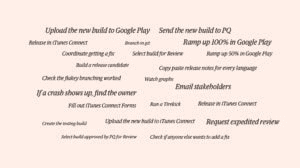
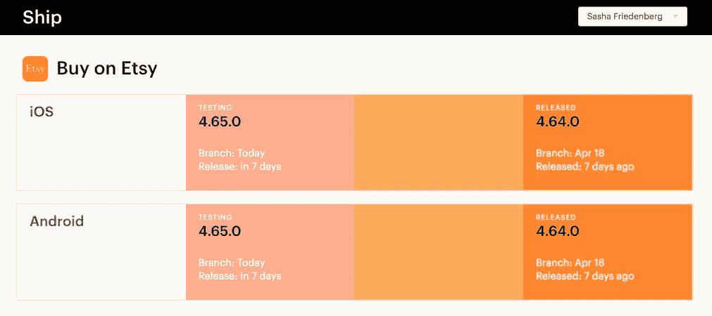
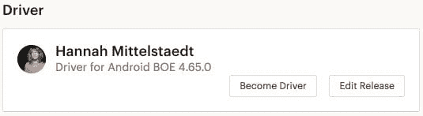
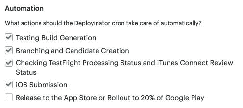
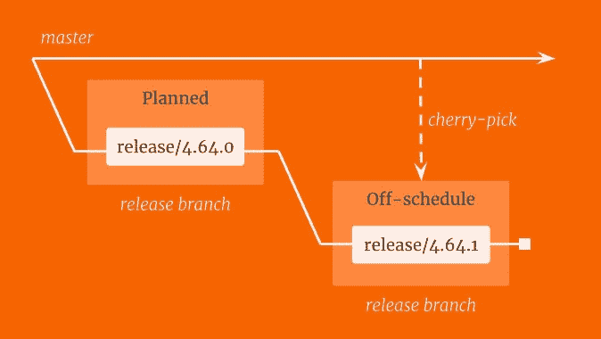
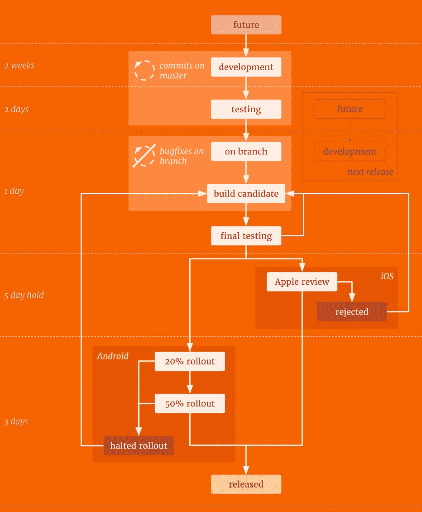
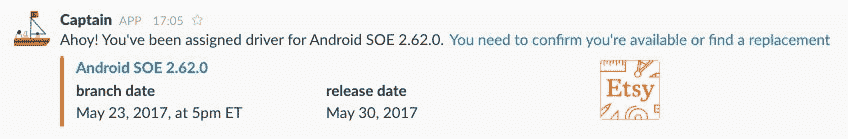
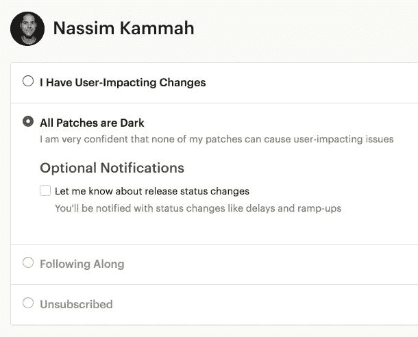

# Etsy 工程| Etsy 如何发布应用

> 原文：<https://codeascraft.com/2017/05/15/how-etsy-ships-apps/?utm_source=wanqu.co&utm_campaign=Wanqu+Daily&utm_medium=website>

【Etsy 根据其网络部署理念转变其应用发布流程


## 锚定在高处

部署代码应该很容易。它应该经常发生，而且应该有它的工程师参与。对于 Etsyweb，这看起来像是连续部署。一组工程师(我们称之为 [push train](https://www.slideshare.net/premshree_pillai/continuous-deployment-at-etsy/81) )和一个指定的驱动程序都将他们的变更引导到一个登台环境，然后到生产。在旅程中的每个检查点，push train 的成员负责测试他们的更改，分享他们已经准备好发布，并确保没有任何问题。列车上每个人都必须齐心协力，安全完成部署。这种情况经常发生:一天多达 50 次。

```
 TOPIC: clear
 mittens> .join                                TOPIC: mittens
   sasha> .join with mittens                   TOPIC: mittens + sasha
 pushbot> mittens, sasha: You're up            TOPIC: mittens + sasha
   sasha> .good                                TOPIC: mittens + sasha*
 mittens> .good                                TOPIC: mittens* + sasha*
 pushbot> mittens, sasha: Everyone is ready    TOPIC: mittens* + sasha*
  nassim> .join                                TOPIC: mittens* + sasha* | nassim
 mittens> .at preprod                          TOPIC:  mittens + sasha | nassim
 mittens> .good                                TOPIC:  mittens* + sasha | nassim
   sasha> .good                                TOPIC:  mittens* + sasha* | nassim
 pushbot> mittens, sasha: Everyone is ready    TOPIC:  mittens* + sasha* | nassim
 mittens> .at prod                             TOPIC:  mittens + sasha | nassim
 mittens> .good                                TOPIC:  mittens* + sasha | nassim
     asm> .join                                TOPIC:  mittens* + sasha | nassim + asm
   sasha> .good                                TOPIC:  mittens* + sasha* | nassim + asm
     asm> .nm                                  TOPIC:  mittens* + sasha* | nassim
 pushbot> mittens, sasha: Everyone is ready    TOPIC:  mittens* + sasha* | nassim
 mittens> .done                                TOPIC: nassim
 pushbot> nassim: You're up                    TOPIC: nassim
    lily> .join                                TOPIC: nassim | lily
```

这个策略成功的原因有很多，但特别是因为每个部署都是由最熟悉即将发布的变更的人来处理的。那些写代码的人最有资格发现它的缺陷，然后修复它。正因为如此，开发人员应该能够根据需要部署代码，并密切关注它的推出。应用发布是一种不同的野兽。他们不容易适应这种部署代码的哲学。首先，它们有版本，需要编译。由于它们是通过应用商店发布的，这些版本可能需要一段时间才能到达最终用户手中。传统上，这些特征导致了涉及发布分支和发布经理的策略。我们的应用程序发布以这种方式开始，但我们很快发现它们感觉不太好。所以我们开始改变它们。

## 珍和萨沙


我们是发行经理。珍管理 Etsy 应用程序的销售，我管理 T2 的 Etsy 应用程序。我们负责所有发布阶段的过渡，维护时间表，并管理围绕发布的所有沟通。我们还负责解决冲突和协调跨团队资源，以防出现 bug 和需要发布的紧急阻止程序。

### 准备发货

我们工作的一个关键部分是确保每个人都知道他们应该做什么以及他们应该什么时候做。最大的检查点是当一个发布分支时——这是当我们为主发布创建一个专用的分支时，主发布成为下一个发布。这是预先安排好的，它决定了对于给定的版本，什么样的更改会进入生产环境。确保这些变化是预期的，并且已经过测试，这一点非常重要。对于 Jen 和我来说，我们自己不可能跟踪一个版本中的许多变化，所以我们的工作是与做出实际变化的工程师协调，并确保这些变化是预期的和测试的。在实践中，这意味着当接近某些检查点(如分支)时，要发送电子邮件或消息。同样，如果有任何风暴警告(如妨碍演出的虫子)，我们有责任举起旗帜通知其他人。

然后 Jen 为了另一个机会离开了 Etsy，我成了单点故障和看门人。每一个发布决定都经过我的批准，我是唯一能够做出和执行这些决定的人。



我不知所措。沮丧。我担心我会被困在 iTunes Connect 和 Google Play 上，发邮件。坦白说，我不想做那些事。我想让这些事情自动化。给我一个按钮上传到 iTunes Connect，另一个按钮开始在 Google Play 上展示。想到在 web 上部署的便利性，我就充满了嫉妒。这段时间对工程师来说也不容易。即使回到我们有两个发布经理的时候，从工程师的角度来看，这段时间的应用发布也是不透明的。很难知道我们处于发布的哪个阶段。发送了大量的电子邮件，但很少是针对那些真正需要它们的人的。我们一般会向一个包含我们所有四个应用的大列表发送电子邮件。各种各样的电子邮件都会寄到那里。仅供参考的事情，以及需要紧急关注的事情。我们正在走向[警惕疲劳](http://www.kitchensoap.com/2013/07/22/owning-attention-considerations-for-alert-design)。所有这些意味着工程师们感觉他们更像是在货舱里，而不是在驾驶舱里。但这不符合我们为网络做事的方式。这不符合我们的部署理念。我们不喜欢它。我们想要更好的东西，让工程师站在舵柄前面。

### 船



因此，我们构建了一个容器来协调状态、时间表、通信和应用程序发布的部署工具。下面是 Ship 的帮助:-跟踪谁提交了一个版本的变更

*   向适当的人发送关于相关事件的松散消息和电子邮件
*   管理所有版本的状态和时间表

很难抽象地想象所有这些，所以这里有一个例子:

### 船长日志

*   艾丽西娅第一次使用 4.64.0 版的 iOS 应用程序。
*   Ship 得到通知，并向 Alicia 发送电子邮件，欢迎她加入 v4.64.0。

#### 星期一

*   一个 cron 将发布版本移动到“测试”中，并生成测试版本 v4.64.0.52。
*   Ship 得到通知，并向 Alicia 发送一封电子邮件，告知构建情况。
*   Alicia 安装构建，验证她的更改，并告诉 Ship 她准备好了。

#### 星期二

*   每个人都已经测试了他们的更改，并报告他们自己已经准备好了。
*   cron 对发布进行分支，并创建一个发布候选。
*   Ship 会收到通知，并发送电子邮件来协调发布的最终测试。

#### 星期三

*   最终测试没有发现任何问题
*   cron 将 v4.64.0 提交给 iTunes Connect 进行审查。

#### 星期五

*   cron 会检查 iTunes Connect 以了解此版本的审查状态，并更新已获批准的版本。
*   发送电子邮件给艾丽西娅和其他人，让他们知道发布已获批准。

#### 星期二

*   cron 发布了 4.64.0 版。(如果艾丽西娅致力于我们的 Android 应用，cron 将开始在 Google Play 上进行展示。)
*   发送电子邮件给艾丽西娅和其他人，让他们知道该版本已经正式发布。

#### 星期三

*   Ship 通过电子邮件向发布中的所有工程师(包括 Alicia)发送一份顶级崩溃报告

在发货之前，上述所有组件都是手动执行的。但是您会注意到上面的脚本中缺少发布经理；我们已经用船上所有的自动化取代了发布经理吗？

[T2】](https://www.etsy.com/listing/220021401/international-code-flag-letter-g-fathers)

### 发布驱动程序

部分地。Ship 有一个特性，每个版本都分配有一个驱动程序。



这个驱动负责一堆我们不能或者[不应该自动化](https://www.ise.ncsu.edu/wp-content/uploads/2017/02/Bainbridge_1983_Automatica.pdf)的事情。他们的职责是:-改变时间表

*   带领其他工程师“整装待发”
*   在发布前调查显示停止错误

其他的呢？那是自动化的。分支、发布候选生成、提交到 iTunes Connect——甚至在 Google Play 上进行展示！但是，我们以前从自动化出错中吸取过教训。默认情况下，有些东西设置为手动。还有一些是 Ship 明确不允许自动化的，比如在 Google Play 上继续分阶段展示。像这样的事情应该涉及并需要人类的互动。对于其他自动化的东西，我们添加了一个故障保险:在任何时候，司机都可以禁用所有的 crons，并从自动驾驶仪接管驾驶:



当司机想要手动做一些事情时，他们不需要访问 iTunes Connect 或 Google Play，因为这些东西都可以通过一个按钮来访问。这样做的一个非常好的副作用是，我们不必担心为任何一个应用商店提供人员，并且我们有驱动程序采取的每个版本相关操作的清晰日志。一旦一个版本转移到主版本上，驱动程序就被分配，并且是基于以前的驱动程序和致力于以前版本的工程师半随机选择的。分配后，我们会向他们发送入职电子邮件，让他们了解自己的职责:


### 准备再次发货

驱动程序可以保持休眠状态，直到出现分支的那一天。在我们分支之前的几个小时，司机有责任确保所有有影响的工程师都准备好发货，并在他们没有准备好的时候进行协调。在我们准备好之后，车手的责任就是在最终测试进行的时候保持联系。如果出现问题，可能会向驾驶员咨询解决步骤。然后，假设一切顺利，发布日就到了。驱动程序可以选择手动释放，或者让 cron 为他们做这件事——无论哪种方式，如果出现问题，他们都会收到通知。然后，在我们发布一天后，驱动程序查看我们所有的仪表板、日志和图表，以确认发布的健康状况。

### 错误修复

但并不是所有的版本都在计划之中。事情失败了，这是意料之中的。假设某个严重的 bug 不会出现在一个应用程序版本中是天真的。有很多事情可以也将会成为事后分析的主题。当这些事情发生时，任何工程师都可以从最近发布的主线版本中衍生出一个 bugfix 版本。



请求此错误修复的工程师将被指定为该版本的驱动程序。一旦他们对发布进行分支，他们就在发布的分支中进行必要的错误修复(如果他们与驱动程序协调，其他人也可以加入进来添加错误修复)，构建一个发布候选，测试它，并为生产做好准备。然后驾驶员可以随意释放它。

## 状态机

发布实际上相当复杂。



它始于一个抽象的未来会发生的事情。然后变成一个具体的东西，通过 git 中的 master 上的 commits 主动收集更改。在收集提交的这段时间之后，发布被认为是完成的，并转移到它自己的专用分支。然后，从这个专门的分支构建候选发布，然后进行彻底的测试，并转移到生产中。然后发布本身作为一个未合并的分支结束。一旦一个版本分支，下一个未来的版本就会转移到主版本上。每个版本都有自己的状态机，其中开发和分支状态在连续的版本之间重叠。

### 通知:时差和电子邮件



Ship 的输出中插入了通知。因为在生产的过程中有如此多的关注点，所以在正确的时间通知正确的人是非常重要的。因此，我们使用 Ship 的状态机向工程师(和其他订阅者)发送通知，通知基于他们要求知道多少，以及他们如何影响发布。我们还允许任何人注册发布通知。这被产品经理、设计师、支持团队、工程经理等等使用。我们的宣传非常针对那些需要或想要的人。就他们要求了解的内容而言，我们非常简单地通过电子邮件获取了关于某个版本状态变化的详细信息:



就它们如何影响发布而言，我们需要从其他地方获取数据。

## 饭桶

我们提到过数据船从外部来源接收数据。在 Etsy，我们使用 GitHub 进行源代码控制。我们的应用在每个平台上都有回复(Android 和 iOS)。为了保持 Ship 对发布的了解是最新的，我们设置了 [GitHub Webhooks](https://developer.github.com/webhooks/) 来通知 Ship 何时将变更推送到 repo。我们特别监听两个变化:推送到主服务器，和推送到任何发布分支。当 Ship 得到通知时，它遍历提交，并使用作者、更改的路径和提交消息来确定提交影响哪个应用程序(买方或卖方)，以及我们应该将此更改归因于哪个版本。Ship 然后将所有这些结合成一个状态，代表每个工程师对给定版本的影响。那个工程师是“影响用户的”还是“黑暗的”([我们对非实时](https://etsy.com/codeascraft/how-does-etsy-manage-development-and-operations)变更的术语)？Ship 然后使用这个状态来确定谁是哪个版本的成员，以及谁应该得到关于什么事件的通知。此外，在发布期间的任何时候，工程师都可以更改他们的状态。如果他们想收到更多关于发布的信息，或者 Ship 将他们的一个提交误解为影响了发布，他们可能会这样做。

## 部署者

之前的一切都解释了船是如何跟踪事物的。但没有人解释一些影响应用回购或 Etsy 以外的事情的自动化操作是如何发生的。我们有一个自己开发的管理部署的工具，叫做 Deployinator，我们增加了应用程序支持。它现在可以与应用程序 repos 进行变异交互，以及所有与 Google Play 和 iTunes Connect 相关的部署操作。这是我们构建测试候选、发布候选、分支发布、提交到 iTunes Connect 等等的地方。我们选择使用 Deployinator 有几个原因:- Etsy 工程师已经熟悉它了

*   它是我们将构建过程打包成一个按钮的首选环境
*   适用于需要单独运行日志和清除故障的情况

在我们的自定义堆栈中，我们有 crons。这就是我们周二晚上如何分支(假设每个人都准备好了)。这是我们与 Google Play 和 iTunes Connect 交互的地方。我们在自己编写的自定义 python 模块中使用 Google Play 的官方 API，对于 iTunes Connect，我们使用[飞船](https://github.com/fastlane/fastlane/tree/master/spaceship)与非官方 API 接口。

## 适于航海的

发布的最终结果是我们已经发布了发布管理。Etsy 不再有专门的发布经理。但是它确实有一个曾经是工程师的工程师——我甚至可以时不时地发布一个版本。人不可能完全自动化离开。这适用于我们的 web 部署，同样适用于应用发布。我们的新流程就是在这种情况下运作的。它是独一无二的，因为它突破了我们认为可以自动化的极限。然而，与此同时，它赋予了我们的应用工程师前所未有的能力。工程师控制何时发布产品。工程师决定我们是否准备分支。工程师按下按钮。这就是船的真正意义。它使我们的工程师能够为我们的用户提供最好的应用。船让工程师掌舵。