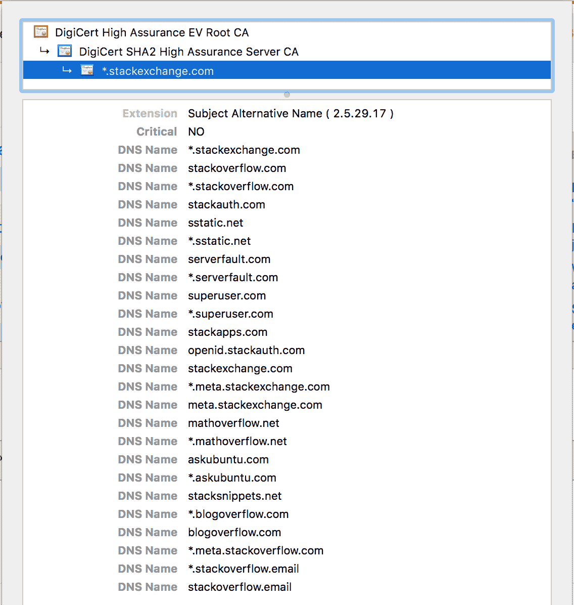
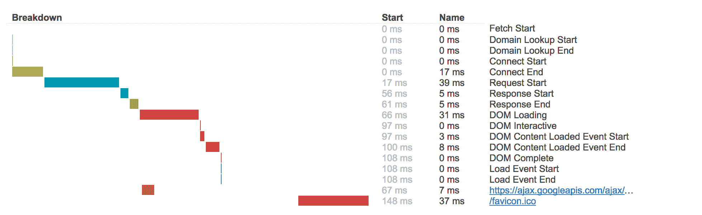
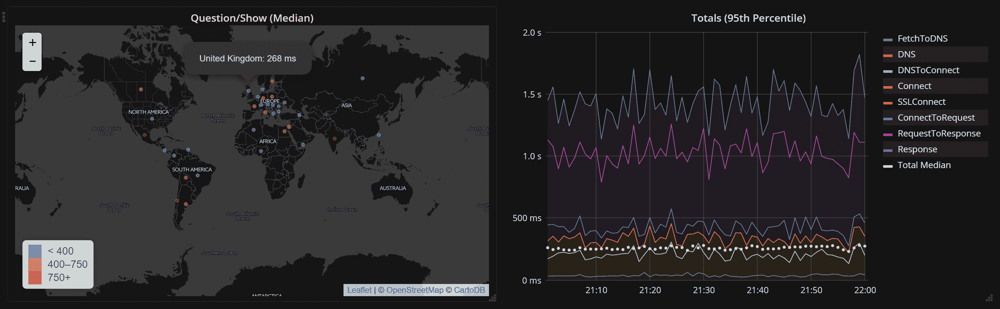
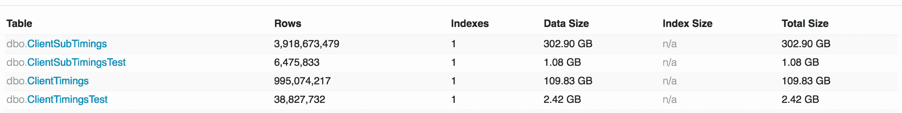
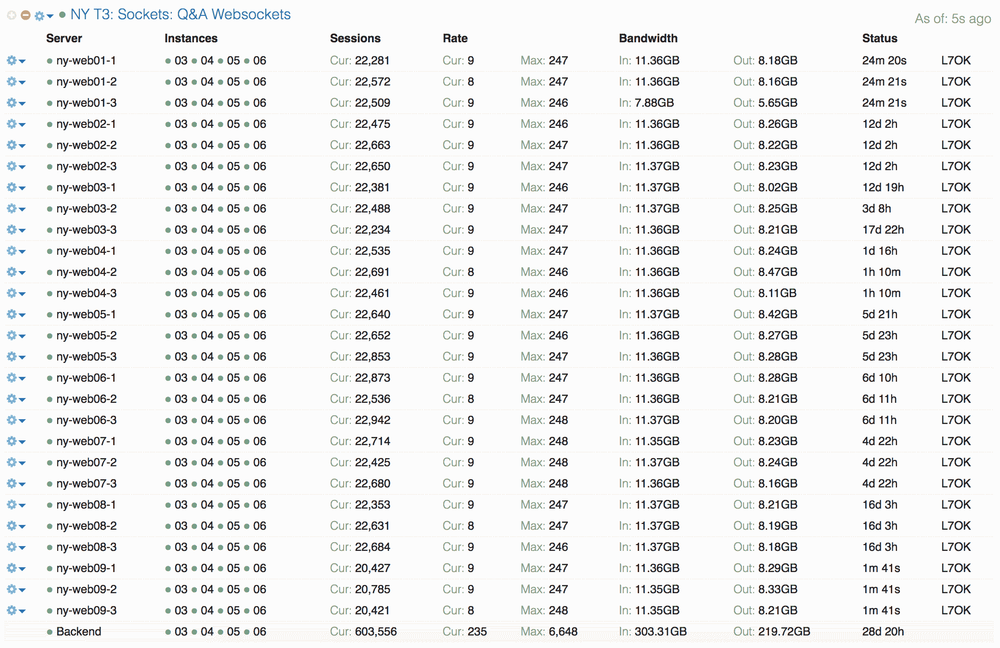
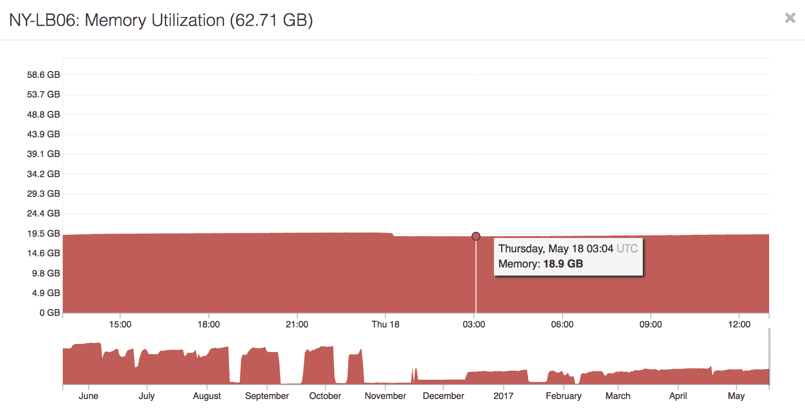
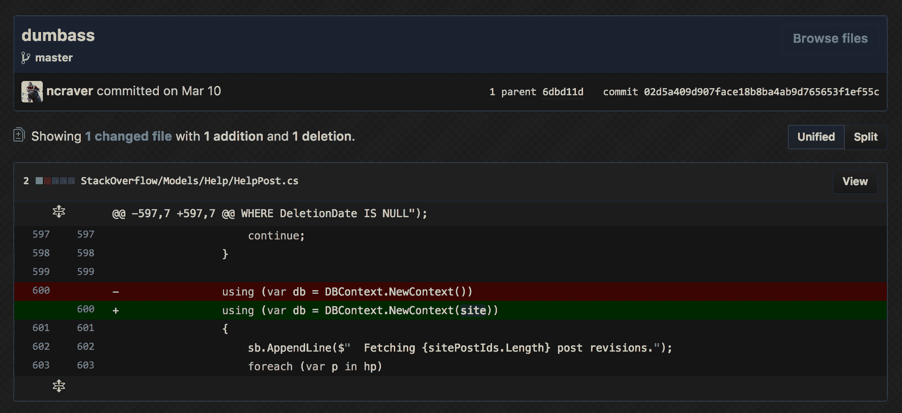

# 尼克·克拉弗- HTTPS 论堆栈溢出:漫长道路的尽头

> 原文：<https://nickcraver.com/blog/2017/05/22/https-on-stack-overflow/?utm_source=wanqu.co&utm_campaign=Wanqu+Daily&utm_medium=website>


今天，我们在[堆栈溢出](https://stackoverflow.com/)上默认部署了 HTTPS。所有的流量现在都被重定向到`https://`，谷歌链接将在未来几周内改变。激活这个功能实际上就是打开一个开关(功能标志)，但要做到这一点需要多年的努力。截至目前，HTTPS 是所有 Q & A 网站的默认设置。

在过去的两个月里，我们一直在堆栈交换网络中推广这一技术。栈溢出是最后一个站点，也是最大的一个。这对我们来说是一个巨大的里程碑，但绝不是终点。还有更多的工作要做，这些[我们将在](#next-steps)中讨论。但结局终于在望，万岁！

公平的警告:这是一个长途旅行的故事。非常长。你的滚动条现在非常小。虽然堆栈交换/溢出并不是我们一路上遇到的唯一问题，但是这些问题的组合是相当罕见的。我希望你能发现我们的试验、磨难、错误、胜利，甚至一些开源项目的一些细节，这些都是有帮助的。很难将如此复杂的依赖链组织成一篇按时间顺序排列的文章，所以我将按主题来分类:基础设施、应用程序代码、错误等等。

我认为首先列出一系列问题是有帮助的，这些问题使我们的情况有些独特:

*   我们有数百个域名([许多网站](https://stackexchange.com/sites)和其他服务)
*   我们允许用户提交和嵌入内容(如帖子中的图像和 YouTube 视频)
*   我们从单个数据中心提供服务(单一来源的延迟)
*   我们有广告(和广告网络)
*   我们使用 websockets，在任何给定的情况下都有超过 500，000 个活跃用户(连接数)
*   我们得到了处置(代理)
*   我们有许多网站和应用程序通过 HTTP APIs 进行通信(代理问题)
*   我们痴迷于性能(*也许*有点过了)

由于这个帖子有点疯狂，为了方便起见，链接如下:

### 开始

早在 2013 年，我们就开始考虑在堆栈溢出上部署 HTTPS。所以显而易见的问题是:现在是 2017 年。**到底花了 4 年时间？**延迟几乎所有 IT 项目的两个相同原因:依赖性和优先级。老实说，关于堆栈溢出的信息并不像大多数其他数据那样有价值(对安全来说)。我们不是银行，我们不是医院，我们不处理信用卡支付，而且[我们甚至每个季度通过 HTTP 和 torrent 发布一次我们的大部分数据库](https://archive.org/details/stackexchange)。这意味着从安全的角度来看，它只是没有在其他情况下那么重要。我们也有比大多数更多的依赖，这是部署 HTTPS 时一些大问题领域的一个相当独特的组合。稍后您将会看到，一些领域问题也是永久性的。

给我们带来问题的最大领域是:

*   用户内容(用户可以上传图像或指定 URL)
*   广告网络(合同和支持)
*   从单个数据中心托管(延迟)
*   [**数百个**域名](https://stackexchange.com/sites)，多个级别(证书)

好吧，那么为什么我们希望 HTTPS 出现在我们的网站上呢？数据并不是唯一需要安全的东西。我们有版主、开发人员和员工，他们可以通过网络进行不同级别的访问。我们想保护他们与网站的通信。我们想保护每个用户的浏览历史。有些人每天都生活在恐惧中，知道有人会发现他们偷偷喜欢单子。谷歌[也提升了 HTTPS 网站](https://webmasters.googleblog.com/2014/08/https-as-ranking-signal.html)的排名(尽管我们不知道提升了多少)。

哦，还有**性能**。我们热爱表演。我喜欢表演。你热爱表演。我的狗喜欢表演。来个表演拥抱吧。那很好。谢谢你。你闻起来不错。

### 快速规格

有些人只是想要规格，所以这里有快速问答(我们喜欢问答！):

*   问:你支持哪些协议？
*   问:你支持 SSL v2，v3 吗？
*   问:你支持哪些密码？
*   快速连接到 HTTPS 上空的原点吗？
    *   答:是的，如果 CDN 请求是 HTTPS，则始发请求是 HTTPS。
*   问:你支持前向保密吗？
*   问:你支持 HSTS 吗？
    *   答:是的，我们现在正在问答网站上推广。一旦完成，我们将把它移到边缘。
*   问:你支持 HPKP 吗？
    *   答:不，我们很可能不会。
*   问:你支持 SNI 吗？
    *   答:不，出于 HTTP/2 性能的原因，我们有一个组合通配符证书(详情如下)。
*   问:你从哪里获得证书？
    *   答:我们使用 [DigiCert](https://www.digicert.com/) ，他们棒极了。
*   问:你支持 IE 6 吗？
    *   答:这一招终于把它干掉了，彻底。IE 6 不支持 TLS(默认-虽然 1.0 可以启用)，我们不支持 SSL。有了 301 重定向，大多数 IE6 用户不再能够访问堆栈溢出。当 TLS 1.0 被删除时，任何人都不能。
*   问:你使用什么样的负载平衡器？
*   问:HTTPS 的动机是什么？

### 证书

让我们来谈谈证书，因为有很多错误的信息。我已经记不清有多少人说你只需安装一个证书，就可以进入 HTTPS 了。再看看你的滚动条的微小尺寸，大胆猜测一下我是否同意。对于我们的猜测，我们更喜欢用[SWAG 方法](https://en.wikipedia.org/wiki/Scientific_wild-ass_guess)。

我们得到的最常见的问题是:“为什么不用[让我们加密](https://letsencrypt.org/)？”

回答:因为他们不为我们工作。咱们加密是在做一件大事。我希望他们坚持下去。如果你在一个领域或者只有几个领域，它们对于各种各样的场景来说都是一个很好的选择。我们根本不在那个位置上。栈交换有[上百个域](https://stackexchange.com/sites)。让我们加密[不提供通配符](https://letsencrypt.org/docs/faq/)。这两件事互相矛盾。每次我们部署一个新的 Q & A 站点(或任何其他服务)时，我们都必须获得一个(或两个)证书。这极大地增加了部署的复杂性，并且要么 a)放弃非 SNI 客户(目前大约 2%的流量),要么 b)需要比我们更多的 IP 空间。

我们希望控制证书的另一个原因是，我们需要在本地负载平衡器和 CDN/代理提供商上安装完全相同的证书。除非我们能做到这一点，否则我们无法在所有情况下都干净地进行故障转移(远离代理)。任何通过 HPKP (HTTP 公钥锁定)锁定[证书的人都将无法通过验证。我们正在评估是否部署 HPKP，但我们已经做好了准备，好像以后会部署。](https://developer.mozilla.org/en-US/docs/Web/HTTP/Public_Key_Pinning)

我对我们的主证书拥有我们所有的主域名+通配符感到惊讶。看起来是这样的:

[<picture><source type="image/webp" srcset="/blog/content/HTTPS-MainCertificate.webp"><source type="image/png" srcset="/blog/content/HTTPS-MainCertificate.png"></picture>T6】](/blog/content/HTTPS-MainCertificate.png)

为什么要这么做？公平地说， [DigiCert](https://www.digicert.com/) 是应我们的请求为我们做这件事的人。为什么每次更改都要经历手动证书合并的痛苦？首先，因为我们想支持尽可能多的人。这包括不支持 SNI 的客户端(例如，当我们开始时，Android 2.3 是一件大事)。也是因为 HTTP/2 和现实。我们一会儿会谈到这一点。

Stack Exchange network 的原则之一是为每个问答站点提供一个讨论的场所。我们称之为[【第二名】](https://stackoverflow.blog/2010/04/29/do-trilogy-sites-need-a-third-place/)。举个例子，`meta.gaming.stackexchange.com`的存在就是为了说一说`gaming.stackexchange.com`。那么，这有什么关系呢？其实并没有。我们只关心这里的领域。它有 4 层深。

我在之前已经[报道过这个，但是我们最后到哪里了呢？首先是这个问题:`*.stackexchange.com`*覆盖了`gaming.stackexchange.com`(以及其他数百个站点)，但是**没有**覆盖`meta.gaming.stackexchange.com`。RFC 6125(第 6.4.3 节)*](/blog/2013/04/23/stackoverflow-com-the-road-to-ssl/)*声明:*

 *> 客户端不应试图匹配所呈现的标识符，其中通配符包含除最左侧标签之外的标签(例如，不匹配`bar.*.example.net`)

这意味着我们不能有通配符`meta.*.stackexchange.com`。好吧，妈的。那我们该怎么办？

*   选项 1:部署 [SAN 证书](https://www.digicert.com/subject-alternative-name.htm)
    *   我们需要 3 个(限制是 100 个域名)，我们需要专用 3 个 IP，我们会使新网站的发布复杂化(直到方案改变，它已经发生了)
    *   我们将不得不在 CDN/proxy 上支付 3 个定制证书的费用
    *   在`meta.*`方案下，我们必须为每个子元拥有一个 DNS 条目
        *   由于 DNS 的规则，我们实际上必须为每个站点添加一个 DNS 条目，这使得站点的启动和维护变得复杂。
*   选项 2:将所有域移至`*.meta.stackexchange.com`？
    *   我们会有一个痛苦的举动，但它是一次性的，简化了所有的维护和证书
    *   我们必须建立一个全球登录系统
    *   这种解决方案也产生了`includeSubDomains` HSTS 预压的问题([细节在此](#hsts-preloading)
*   选项 3:我们已经运行良好，关闭它
    *   这个是最简单的，但是没有被批准

我们[建立了一个全球登录系统](#global-login)，后来移动了子元域(301)，他们现在在他们的新家。比如，[https://gaming.meta.stackexchange.com](https://gaming.meta.stackexchange.com)。这样做之后，我们意识到 HSTS 预加载列表会是一个多么大的问题，仅仅因为那些域名曾经存在过。我会在接近结尾的时候介绍那个[，因为它还在进行中。请注意，这里的问题在我们的旅程中反映了类似于`meta.pt.stackoverflow.com`的东西，但规模更有限，因为只有 4 个非英语版本的堆栈溢出存在。](#hsts-preloading)

哦，这给*本身带来了另一个*问题。通过将 cookies 移动到顶级域并依赖它们的子域继承，我们现在必须移动域。例如，我们在新系统中使用 SendGrid 发送电子邮件(现在推出)。它从`stackoverflow.email`发送指向`sg-links.stackoverflow.email`的链接(一个 [CNAME](https://en.wikipedia.org/wiki/CNAME_record) 指向它们)的原因是，这样你的浏览器就不会发送任何敏感的 cookies。如果是`sg-links.stackoverflow.com`(或者是`stackoverflow.com`下面的任何东西)，你的浏览器会把我们的 cookies 发给他们。这是新事物的一个具体例子，但是在我们的 DNS 下也有各种各样不是由我们托管的服务。这些子域名中的每一个都必须被移动或退出才能从我们认证的域名下退出…否则我们会把你的 cookies 发送到非我们的服务器。如果做了所有这些工作，最后只是将 cookies 泄露给其他服务器，那将是一种耻辱。

在一个实例中，我们试图通过代理我们的 Hubspot 属性一段时间来解决这个问题，在通过的过程中剥离 cookies。但不幸的是，Hubspot 使用的是 Akamai，它开始把我们的 HAProxy 实例当作一个机器人，并每周以各种有趣的方式阻止它。前三次很有趣。所以不管怎样，那个*真的*没成功。事情太糟糕了，我们再也不会做了。

你好奇为什么我们在 https://stackoverflow.blog/有一个堆栈溢出的博客吗？是的，保安。它托管在外部服务上，以便营销团队和其他人可以更快地迭代。为了促进这一点，我们需要它远离烹饪领域。

上述关于元子域的问题也引入了与 [HSTS](https://en.wikipedia.org/wiki/HTTP_Strict_Transport_Security) 、[预加载](https://hstspreload.org/)和`includeSubDomains`指令相关的问题。但是我们稍后会看到为什么这变成了一个争论点。

### 性能:HTTP/2

很久以前，人们普遍认为 HTTPS 要慢一些。的确如此。但是时代变了。我们不再谈论 HTTPS 了。我们正在谈论 HTTPS 与 HTTP/2。虽然 [HTTP/2 不需要加密](https://http2.github.io/faq/#does-http2-require-encryption)，*实际上*需要。这是因为主要的浏览器需要安全的连接来启用它的大部分功能。你可以整天争论规范和规则，但浏览器是我们生活的现实。我希望他们把它叫做 HTTPS/2，这样可以节省很多时间。各位浏览器厂商，现在还不晚。请听我说，你是我们唯一的希望！

HTTP/2 有很多性能上的好处，特别是在用户请求资源之前，有机会将资源推给用户。我不会详细描述这些好处，伊利亚·格里戈利克已经在这方面做了出色的工作。简单概括一下，最大的优化(对我们来说)包括:

嘿，等一下，那个愚蠢的证书呢？

HTTP/2 的一个鲜为人知的特性是[您可以推送不在同一个域](https://hpbn.co/optimizing-application-delivery/#eliminate-domain-sharding)上的内容，只要满足某些标准:

1.  源解析到相同的服务器 IP 地址。
2.  来源由相同的 TLS 证书覆盖(答对了！)

那么，让我们来看看我们当前的 DNS:

```
λ dig stackoverflow.com +noall +answer
; <<>> DiG 9.10.2-P3 <<>> stackoverflow.com +noall +answer
;; global options: +cmd
stackoverflow.com.      201     IN      A       151.101.1.69
stackoverflow.com.      201     IN      A       151.101.65.69
stackoverflow.com.      201     IN      A       151.101.129.69
stackoverflow.com.      201     IN      A       151.101.193.69

λ dig cdn.sstatic.net +noall +answer
; <<>> DiG 9.10.2-P3 <<>> cdn.sstatic.net +noall +answer
;; global options: +cmd
cdn.sstatic.net.        724     IN      A       151.101.193.69
cdn.sstatic.net.        724     IN      A       151.101.1.69
cdn.sstatic.net.        724     IN      A       151.101.65.69
cdn.sstatic.net.        724     IN      A       151.101.129.69 
```

Heyyyyyy，那些 IP 匹配，而且证书一样！这意味着我们可以在不伤害 HTTP/1.1 用户的情况下获得 HTTP/2 服务器推送**的所有胜利。HTTP/2 获得推送，HTTP/1.1 获得[域分片](https://blog.stackpath.com/glossary/domain-sharding/)(通过`sstatic.net`)。我们还没有部署服务器推送，但所有这些都在准备中。**

所以就表演而言，HTTPS 只是达到目的的一种手段。我不介意。我可以说我们的主要驱动力是性能，而网站的安全性不是。我们需要安全，但在我们的情况下，仅仅安全不足以证明在我们的网络中部署 HTTPS 所需的时间投资是合理的。当你综合上述所有因素时，我们可以证明完成这项工作所需的大量时间和精力是合理的。在 2013 年，HTTP/2 并不是一件大事，但随着支持的增加，这种情况发生了变化，并最终帮助我们在 HTTPS 投入时间。

同样值得注意的是，在我们的部署过程中，HTTP/2 环境发生了很大的变化。网络从 [SPDY](https://en.wikipedia.org/wiki/SPDY) 转移到 [HTTP/2](https://en.wikipedia.org/wiki/HTTP/2) 和 [NPN](https://tools.ietf.org/id/draft-agl-tls-nextprotoneg-03.html) 到 [ALPN](https://en.wikipedia.org/wiki/Application-Layer_Protocol_Negotiation) 。我不会涵盖所有这些，因为我们在那里没有做任何事情。我们看到了，也受益了，但是网络巨头们正在推动这一切。如果你好奇的话， [Cloudflare 对这些动作有很好的描述](https://blog.cloudflare.com/introducing-http2/)。

### 为 HTTPS 服务

早在 2013 年，我们就在 HAProxy 部署了最初的 HTTPS 支持。为什么 [HAProxy](https://www.haproxy.org/) ？因为我们已经在使用它，他们在 2013 年(2014 年正式发布)[版本 1.5](https://www.haproxy.org/news.html) 中添加了支持。有一段时间，我们的 nginx 在 HAProxy ( [你可以在上一篇博文](/blog/2013/04/23/stackoverflow-com-the-road-to-ssl/)中看到)。但是越简单越好，消除许多 conntrack、部署和一般复杂性问题通常是个好主意。

我不会在这里涉及太多细节，因为没有太多的内容要介绍。HAProxy 从 1.5 开始通过 OpenSSL 原生支持 HTTPS，配置很简单。我们的配置亮点是:

*   在 4 个进程上运行
    *   1 专用于 HTTP/前端处理
    *   2-4 台专用于 HTTPS 谈判
*   HTTPS 前端通过[一个名为](https://unix.stackexchange.com/a/206395/400)的抽象套接字连接到 HTTP 后端。这极大地减少了开销。
*   每个前端或“层”(我们有 4 层:主层、次层、Websockets 层和 dev 层)都有相应的 443 个侦听器。
*   当转发到 web 层时，我们附加请求头(并去掉您发送的请求头——不错的尝试),以指示连接是如何进来的。
*   我们使用 Mozilla 推荐的[Modern compatibility cipher suite。注意:这不是我们 CDN 运行的同一个套件。](https://wiki.mozilla.org/Security/Server_Side_TLS#Modern_compatibility)

HAProxy 是用有效的 SSL 证书支持 a :443 端点的相对简单的第一步。回想起来，这只是所需努力的一小部分。

这是我上面描述的逻辑布局…接下来我们将覆盖前面的小块云:

[T2】](/blog/content/HTTPS-Layout.svg)

### CDN/代理:利用 Cloudflare 快速应对延迟

在栈溢出时，我最引以为豪的一件事是[我们的栈](https://stackexchange.com/performance)的[效率](/blog/2016/02/17/stack-overflow-the-architecture-2016-edition/)。太棒了，对吧？在一个数据中心的一小组服务器上运行一个大型网站？没有。没有那么多。这次不会。虽然对于某些事情来说高效是很棒的，但是当谈到延迟时，它突然变成了一个问题。我们从来不需要很多服务器。我们从未需要扩展到多个位置(但是，是的，我们有另一个灾难恢复位置)。这一次，这是一个问题。我们还不能(还不行！)解决延迟的基本问题，由于光速。我们被告知其他人正在研究这个，但是有一个小挫折，时空结构撕裂，失去了沙鼠。

说到延迟，我们来看看数字。赤道周围几乎正好是 40，000 公里(光速往返的最坏情况)。光速在真空中[为 299792458 米/秒**。不幸的是，很多人使用这个数字，但大多数纤维不是在真空中。实际上，大多数光纤比 T4 慢 30-31%。所以我们看到的是(40，075，000 米)/ (299，792，458 米/秒* .70) = 0.191 秒，或者在最坏的情况下一次往返需要 191 毫秒，对吗？嗯……不，不是真的。这也是假设的最佳路径，但在互联网上的两个目的地之间很少是一条直线。有路由器、交换机、缓冲器、处理器队列和各种附加的小延迟。它们加在一起就是可测量的延迟。我们先不要谈论火星。**](https://en.wikipedia.org/wiki/Speed_of_light)

那么，为什么这对堆栈溢出很重要呢？这是云获胜的领域。很有可能你正在使用的云提供商的服务器是相对本地的。对我们来说，不是。有了直接连接，你离我们的纽约或丹佛数据中心越远(无论哪一个是活跃的)，你的体验就越慢。对于 HTTPS，在发送任何数据之前，有一个额外的*往返过程来协商连接。这是在最好的情况下(虽然[在 TLS 1.3 和 0-RTT](https://blog.cloudflare.com/introducing-0-rtt/) 中有所改善)。[伊利亚·格里戈利克](https://twitter.com/igrigorik)在这里有[一个很好的总结](https://istlsfastyet.com/)。*

快速进入[云闪](https://www.cloudflare.com/)和。HTTPS 不是一个部署在竖井中的项目；当您继续阅读时，您会看到其他几个项目也在进行中。在本地到用户的 HTTPS 终端的情况下(为了最小化往返时间)，我们寻找几个主要标准:

*   本地 HTTPS 终端
*   DDoS 保护
*   CDN 功能
*   性能相当于或优于直接面向我们

### 准备代理:客户端计时

在使用任何代理之前，必须进行性能测试。为此，我们建立了一个完整的计时管道来从浏览器获取性能指标。多年来，浏览器已经包含了可通过 JavaScript、[通过`window.performance`](https://www.w3.org/TR/navigation-timing/) 访问的性能计时。来吧，打开检查器并尝试一下！我们希望在这一点上非常透明，这就是为什么从第一天起细节就在 teststackoverflow.com 上[可用。没有敏感数据被传输，只有页面直接加载的资源*的 URIs*和它们的计时。对于记录的每个页面负载，我们得到如下所示的计时:](https://teststackoverflow.com/)

[<picture><source type="image/webp" srcset="/blog/content/HTTPS-Teststackoverflow.webp"><source type="image/png" srcset="/blog/content/HTTPS-Teststackoverflow.png"></picture>T6】](/blog/content/HTTPS-Teststackoverflow.png)

目前，我们试图从 5%的流量中记录性能计时。这个过程并不复杂，但是所有的部分都必须建造:

1.  将计时转换成 JSON
2.  页面加载完成后上传计时
3.  将这些时间传递给我们的后端流量处理服务(它有报告)
4.  将这些计时存储在 SQL Server 中的[聚集列存储库](http://www.nikoport.com/columnstore/)中
5.  到[孙波](https://bosun.org/)(经由[BosunReporter.NET](https://github.com/bretcope/BosunReporter.NET))的计时中继集合

最终结果是，我们现在有了一个很好的全球*实际*用户性能的实时概览，我们可以随时查看、提醒和评估任何变化。这是实时计时的视图:

[<picture><source type="image/webp" srcset="/blog/content/HTTPS-ClientTimings.webp"><source type="image/png" srcset="/blog/content/HTTPS-ClientTimings.png"></picture>T6】](/blog/content/HTTPS-ClientTimings.png)

幸运的是，我们有足够的持续流量来获得有用的数据。在这一点上，我们有超过 50 亿点(并且还在增长)的数据来帮助推动决策。以下是这些数据的简要概述:

[<picture><source type="image/webp" srcset="/blog/content/HTTPS-ClientTimingsDatabase.webp"><source type="image/png" srcset="/blog/content/HTTPS-ClientTimingsDatabase.png"></picture>T6】](/blog/content/HTTPS-ClientTimingsDatabase.png)

好了，现在我们有了基线数据。是时候为我们的 CDN/代理设置测试候选人了。

### 云耀斑

我们评估了许多 CDN/DDoS 代理提供商。我们选择了 [Cloudflare](https://www.cloudflare.com/) 是基于它们的基础设施、响应能力以及[轨道炮](https://www.cloudflare.com/website-optimization/railgun/)的承诺。那么，我们如何在全世界测试云闪背后的*会是什么样的生活呢？我们需要设置多少台服务器才能获得足够的数据点？没有！*

 *Stack Overflow 在这里有一个极好的资源:一个月几十亿的点击量。还记得我们刚刚谈到的客户端计时吗？我们每天已经有几千万用户打我们了，为什么不问他们呢？我们可以通过在堆栈溢出页面中嵌入一个`<iframe>`来实现。早些时候，Cloudflare 已经是我们在 cdn.sstatic.net 的[主机(我们共享的、无 cookie 的静态内容域)。但是，这是用](https://cdn.sstatic.net/)[的`CNAME` DNS 记录](https://en.wikipedia.org/wiki/CNAME_record)完成的，我们提供了指向他们的 DNS 的 DNS。不过，要使用 Cloudflare 作为代理，我们需要它们为我们的 DNS 提供服务。因此，首先，我们需要测试他们的 DNS 性能。

实际上，为了测试性能，我们需要将一个二级域委托给他们，而不是`something.stackoverflow.com`，这将有不同的[粘合记录](https://wiki.gandi.net/en/glossary/glue-record)，有时不会以相同的方式处理(导致 2 次查找)。澄清一下，顶级域名是指`.com`、`.net`、`.org`、`.dance`、`.duck`、`.fail`、`.gripe`、`.here`、`.horse`、`.ing`、`.kim`、`.lol`、`.ninja`、`.pink`、`.red`、`.vodka`。和`.wtf`。不，[我不是在开玩笑](https://en.wikipedia.org/wiki/List_of_Internet_top-level_domains)(这是完整的清单)。[二级域名(SLD)](https://en.wikipedia.org/wiki/Second-level_domain)是下一级域名，大多数站点是:`stackoverflow.com`、`superuser.com`等。这就是我们需要测试的行为和表现。于是，`teststackoverflow.com`诞生了。有了这个新的域名，我们可以在全世界范围内测试 DNS 的性能。通过为一定比例的访问者嵌入`<iframe>`(我们为每个测试打开和关闭它)，我们可以很容易地从每个 DNS 和主机配置中获得数据。

请注意，在这里至少测试 24 小时是很重要的。当人们醒着或睡着时，互联网的行为会在一天中发生变化，当网飞穿越时区时，它会在世界各地流动。所以要衡量一个国家，你真的要一整天。最好是在工作日内(例如，不到周六的一半)。也要意识到狗屎发生。这种事经常发生。互联网的性能不是一个稳定的东西，我们有数据证明。

我们最初的假设是，通过 Cloudflare，我们会损失一些页面加载性能(额外的一跳几乎总是会增加延迟)，但我们会通过 DNS 性能的提高来弥补。这方面的 DNS 得到了回报。与单个数据中心相比，Cloudflare 的 DNS 服务器对用户来说更加本地化。那里的表演要好得多。我希望我们能尽快找到时间公布这些数据。只是要处理(和主持)的事情太多了，我现在没有足够的时间。

然后，我们开始通过 Cloudflare 代理`teststackoverflow.com`来测试页面加载性能，同样是在`<iframe>`中。我们看到美国和加拿大稍微慢一点(由于额外的跳跃)，但世界其他地区不相上下或更好。这与总体预期相符，我们继续向 Cloudflare 网络转移。一路上的一些 DDoS 攻击稍微加快了迁移的速度，但那是另一回事了。为什么我们接受美国和加拿大稍慢的表现？对于大多数页面来说，大约 200-300 毫秒的页面加载速度，仍然非常快。但是我们不喜欢输。我们认为[轨道炮](https://www.cloudflare.com/website-optimization/railgun/)将帮助我们赢回性能。

一旦所有的测试都成功了，我们就需要为 DDoS 保护做好准备。这涉及到在我们的数据中心安装额外的专用 ISP，以供 CDN/代理连接。毕竟，如果你能绕过它，通过代理的 DDoS 保护不是很有效。这意味着我们现在每个数据中心有 4 个 ISP 提供服务，有 2 组路由器，都在运行带有完整表的 [BGP](https://en.wikipedia.org/wiki/Border_Gateway_Protocol) 。这也意味着 2 个新的负载平衡器，专门用于 CDN/代理流量。

#### Cloudflare: Railgun

当时，这种设置还意味着另外两个箱子是为轨道炮准备的。Railgun 的工作方式是在本地和 Cloudflare 端的 [memcached](https://memcached.org/) 中缓存该 URL 的最后结果。当 Railgun 被启用时，每个页面(低于一个大小阈值)在输出时都被缓存。在下一次请求时，如果条目在 Cloudflare 的边缘缓存和我们的缓存中(以 URL 为关键字)，我们仍然会向 web 服务器请求它。但是它没有将整个页面发送回 Cloudflare，而是只发送了一个 diff。该差异被应用到它们的缓存中，并返回给客户端。就管道的本质而言，这也意味着用于传输的 [gzip 压缩](https://en.wikipedia.org/wiki/Gzip)从 9 个用于堆栈溢出的 web 服务器转移到 1 个活动的 Railgun 盒…所以这必须是一个相当 CPU 强大的机器。我指出这一点是因为所有这些都必须在我们的道路上进行评估、购买和部署。

例如，考虑两个用户查看一个问题。给每个浏览器拍张照。他们几乎在同一页，所以这是一个很小的差异。如果我们能够在大部分过程中只将差异发送给用户，这将是一个巨大的优化。

总的来说，这里的目标是减少发回的数据量，以期获得性能上的胜利。当它起作用时，情况确实如此。Railgun 还有另一个巨大的优势:请求不是新的连接。延迟的另一个后果是 [TCP 慢启动](https://en.wikipedia.org/wiki/TCP_congestion_control#Slow_start)的持续时间和速度，这是保持互联网流动的拥塞控制的一部分。Railgun 保持与 Cloudflare edges 的持续连接，并多路传输用户请求，所有这些都通过预先准备好的连接进行，不会因启动缓慢而严重延迟。较小的差异也减少了对整体提升的需求。

不幸的是，从长远来看，我们从未让 Railgun 顺利工作过。据我所知，我们(当时)是该技术最大的部署者，我们比以前更强调它。尽管我们花了一年多的时间试图解决这个问题，但我们最终还是放弃了，继续前进。到头来，我们省下的钱并不比花费的多。不过，已经过了好几年了。如果你正在评估 Railgun，你应该评估当前版本，以及他们所做的改进。

### 快速地

快速转移到是相对较新的，但是因为我们在 CDN/代理主题上，所以我现在将涉及它。此举本身并不十分有趣，因为任何代理所需的大部分内容都是在上述 Cloudflare 时代完成的。但是当然每个人都会问:我们为什么要搬家？虽然 Cloudflare 在许多方面非常有吸引力，主要是许多数据中心、稳定的带宽价格和包括 DNS，但它不再最适合我们。我们需要一些快速简单的事情来更好地适应我们:在边缘更灵活，更快的变更传播，以及完全自动化配置推送的能力。这并不是说 Cloudflare 不好，它只是不再是堆栈溢出的最佳选择。

因为事实胜于雄辩:如果我对 Cloudflare 评价不高，我的个人博客现在也不会落后于他们。你好。你在读它。

Fastly 最吸引我们的特色是[清漆](https://en.wikipedia.org/wiki/Varnish_(software))和 [VCL](https://docs.fastly.com/guides/vcl/) 。这使得边缘高度可配置。因此，Cloudflare 无法轻易实现的功能(因为它们可能会影响*所有*客户)，我们可以自己实现。对于这两家公司的工作方式，这只是一种不同的架构方法，高度可配置的代码方法非常适合我们。我们还喜欢他们在会议、聊天等场合对基础设施细节的开放程度。

这里有一个例子可以说明 VCL 是如何非常方便地发挥作用的。最近我们部署了。NET 4.6.2 有一个[非常严重的错误](https://github.com/Microsoft/dotnet/issues/330)，将缓存响应的最大年龄设置为超过 2000 年。对于我们所有受影响的服务来说，缓解这种情况的最快方法是根据需要在边缘覆盖缓存头。当我写这篇文章时，下面的 VCL 是活跃的:

```
sub  vcl_fetch  {  if  (beresp.http.Cache-Control)  {  if  (req.url.path  ~  "^/users/flair/")  {  set  beresp.http.Cache-Control  =  "public, max-age=180";  }  else  {  set  beresp.http.Cache-Control  =  "private";  }  } 
```

这允许我们缓存用户天赋 3 分钟(因为它是一个体面的字节量)，并绕过其他一切。这是一个易于部署的全局解决方案，用于解决所有应用程序中的紧急缓存中毒问题。我们对现在能够在边缘做的所有事情感到非常非常高兴。幸运的是，我们有 Jason Harvey,他捡起了 VCL 的碎片，编写了我们配置的自动推送。在 Go here 中，我们必须改进现有的库，所以请查看 [fastlyctl](https://github.com/alienth/fastlyctl) ，这是另一个开源项目。

Fastly 的另一个重要方面(Cloudflare 也有，但由于成本原因我们从未使用)是使用您自己的证书。正如我们前面提到的，我们已经在为 HTTP/2 推送做准备了。但是，Fastly 不做 Cloudflare 做的事情:DNS。所以我们现在需要解决这个问题。这种依赖链不是很好玩吗？

### 全球 DNS

从 Cloudflare 迁移到 Fastly 时，我们必须评估和部署新的(对我们而言)全球 DNS 提供商。这本身在一篇完全不同的文章中，[是由](http://blog.serverfault.com/2017/01/09/surviving-the-next-dns-attack/)[马克·汉德森](https://twitter.com/thefarseeker)写的。一路上，我们也在控制:

*   我们自己的 DNS 服务器(仍然作为后备)
*   Name.com 服务器(用于不需要 HTTPS 的重定向)
*   Cloudflare DNS
*   53 号公路域名系统
*   谷歌域名系统
*   Azure DNS
*   …以及其他几个(用于测试)

这本身就是一个完整的项目。我们必须想出有效的方法，于是 [DNSControl 诞生了](http://blog.serverfault.com/2017/04/11/introducing-dnscontrol-dns-as-code-has-arrived/)。这是现在的一个[开源项目](https://stackexchange.github.io/dnscontrol/)，[在 GitHub](https://github.com/StackExchange/dnscontrol) 上可用，写在 [Go](https://golang.org/) 中。简而言之:我们对 git 的 JavaScript 配置进行修改，不到一分钟就可以在全球范围内部署。这里有一个简单 DNS 网站的配置示例，[askubuntu.com](https://askubuntu.com/):

```
D('askubuntu.com', REG_NAMECOM,
    DnsProvider(R53,2),
    DnsProvider(GOOGLECLOUD,2),
    SPF,
    TXT('@', 'google-site-verification=PgJFv7ljJQmUa7wupnJgoim3Lx22fbQzyhES7-Q9cv8'), // webmasters
    A('@', ADDRESS24, FASTLY_ON),
    CNAME('www', '@'),
    CNAME('chat', 'chat.stackexchange.com.'),
    A('meta', ADDRESS24, FASTLY_ON),
END) 
```

好的，很好，你如何测试所有这些都在工作？客户端计时！我们在上面的中提到的[让我们用真实世界的数据来测试所有的 DNS 部署，而不是模拟。但是我们也需要测试所有的*都正常工作*。](#preparing-for-a-proxy-client-timings)

### 测试

部署上述内容的客户机计时对于测试性能非常有帮助。但是它不适合测试配置。毕竟，客户机计时对于查看结果来说是很棒的，但是大多数配置失误都会导致没有页面加载，因此根本没有计时。所以我们必须构建 [httpUnit](https://godoc.org/github.com/StackExchange/httpunit) (是的，团队后来解决了[命名冲突](http://httpunit.sourceforge.net/)……)。这是现在另一个用 Go 写的[开源项目](https://github.com/StackExchange/httpunit)。`teststackoverflow.com`的配置示例:

```
[[plan]]
  label = "teststackoverflow_com"
  url = "http://teststackoverflow.com"
  ips = ["28i"]
  text = "<title>Test Stack Overflow Domain</title>"
  tags = ["so"]
[[plan]]
  label = "tls_teststackoverflow_com"
  url = "https://teststackoverflow.com"
  ips = ["28"]
  text = "<title>Test Stack Overflow Domain</title>"
  tags = ["so"] 
```

当我们改变防火墙、证书、绑定、重定向等时，测试是很重要的。一路上。在为用户激活之前，我们需要确保每个更改都是好的(首先通过将它部署在我们的辅助负载平衡器上)。httpUnit 允许我们这样做，并运行一个集成测试套件来确保我们没有回归。

我们内部开发了另一个工具(由我们可爱的[汤姆·利蒙塞利](https://twitter.com/yesthattom)开发)，用于更轻松地管理我们负载平衡器上的[虚拟 IP 地址](https://en.wikipedia.org/wiki/Virtual_IP_address)组。我们通过一个辅助范围在非活动负载平衡器上进行测试，然后转移所有流量，让之前的主负载平衡器处于已知良好的状态。如果出了什么问题，我们马上回来。如果一切顺利(耶！)，我们也将更改应用到负载平衡器。这个工具叫做`keepctl`(keepalived control 的缩写)——只要时间允许，期待它被开源。

### 准备应用程序

几乎所有以上都只是基础设施工作。这通常是由栈溢出处的其他几个站点可靠性工程师组成的团队来完成的。在应用程序内部还需要做很多事情。这是一个很长的列表。我会拿些咖啡和士力架。

这里需要注意的一点是[栈溢出&栈交换](/blog/2016/02/17/stack-overflow-the-architecture-2016-edition/) Q & A 站点的架构是[多租户](https://en.wikipedia.org/wiki/Multitenancy)。这意味着如果你点击`stackoverflow.com`或`superuser.com`或`bicycles.stackexchange.com`，你会点击*同样的东西。您正在完全相同的服务器*上运行*完全相同的`w3wp.exe`进程。基于浏览器发送的[T4 头](https://developer.mozilla.org/en-US/docs/Web/HTTP/Headers/Host)，我们改变请求的上下文。如果您理解我们代码中的`Current.Site`是请求*的站点*，那么下面的几个部分将会更清楚。像`Current.Site.Url()`和`Current.Site.Paths.FaviconUrl`之类的东西都是从这个核心概念中驱动出来的。*

让这个概念/设置更清晰的另一种方法是:我们可以在一台服务器上的一个进程中运行整个问答网络，而你不会知道。今天，我们在 9 台服务器上分别运行一个进程，纯粹是为了滚动构建和冗余。

#### 全球登录

这些项目中有相当一部分就其本身而言似乎是好主意(事实也的确如此)，但却是 HTTPS 更大蓝图的一部分。登录是其中一个项目。我首先介绍它，因为它的推出比下面的其他变化要早得多。

在栈溢出(和栈交换)存在的前 5-6 年，你登录到一个特定的站点。例如，`stackoverflow.com`、`stackexchange.com`和`gaming.stackexchange.com`中的每一个都有他们自己的每个站点的 cookies。这里需要注意的是:`meta.gaming.stackexchange.com`的登录依赖于从`gaming.stackexchange.com`流向子域的 cookie。这些是我们前面谈到的带有证书的“元”站点。他们的登录是绑定在一起的，你总是通过父母登录。这在技术上并不重要，但是从用户体验的角度来看，这很糟糕。你必须登录到每个网站。[我们用“全局授权”来“修复”那个](https://stackoverflow.blog/2010/09/11/global-network-auto-login/)，它是页面中的一个`<iframe>`，如果每个人在其他地方登录，它会通过`stackauth.com`让他们登录。或者它试图这么做。这种体验还不错，但是一个弹出栏告诉你点击重新加载并登录并不是很棒。我们可以做得更好。哦，问一下[凯文·蒙特罗斯](https://twitter.com/kevinmontrose)关于手机 Safari 隐私模式的问题。我谅你也不敢。

输入“通用登录”。为什么叫“万能”？因为环球被拿走了。我们是简单的人。幸运的是，饼干也很简单。父域(如`stackexchange.com`)上的 cookie 将由您的浏览器发送到所有子域(如`gaming.stackexchange.com`)。当你缩小我们的网络，我们只有少数二级域名:

是的，我们有其他域名可以重定向到这些域名，比如[askdifferent.com](http://askdifferent.com)。但它们只是重定向，没有 cookies 或登录用户。

我在这里掩饰了很多后端工作(特别感谢[杰夫·达尔加斯](https://twitter.com/superdalgas)和[亚当·李尔](https://twitter.com/aalear))，但是总的要点是，当你登录时，我们在这些域上设置一个 cookie。我们通过第三方 cookies 和[随机数](https://en.wikipedia.org/wiki/Cryptographic_nonce)来做到这一点。当您登录到上述任何一个域时，6 个 cookies 会通过其他域的目标页面上的``标签发出，有效地让您登录。这并不是在所有地方都行得通(特别是移动 safari 有点古怪)，但这是对以前的巨大改进。

客户端代码并不复杂，如下所示:

```
$.post('/users/login/universal/request', function (data, text, req) {
    $.each(data, function (arrayId, group) {
        var url = '//' + group.Host + '/users/login/universal.gif?authToken=' + 
          encodeURIComponent(group.Token) + '&nonce=' + encodeURIComponent(group.Nonce);
        $(function () { $('#footer').append('</img>'); });
    });
}, 'json'); 
```

…但要做到这一点，我们必须转向帐户级身份验证(以前是用户级)，改变 cookies 的查看方式，改变子元登录的工作方式，并为这些新的位提供与其他应用程序的集成。例如，职业(现在是人才和工作)是一个不同的代码库。我们需要让这些应用程序查看 cookies，并通过 API 调用问答应用程序来获取帐户。我们通过一个 NuGet 库来部署它，以最小化重复代码。底线:你登录一次，你登录到所有的领域。没有消息，没有页面重新加载。

对于技术方面，我们现在不必担心`*.*.stackexchange.com`域在哪里。只要他们在`stackexchange.com`之下，我们就没事。虽然从表面上看，这与 HTTPS 没有任何关系，但它让我们可以将像`meta.gaming.stackexchange.com`这样的东西转移到`gaming.meta.stackexchange.com`，而不会对用户造成任何干扰。这是一个巨大的，非常丑陋的谜题。

#### 当地 HTTPS 发展

为了在这方面取得任何进展，本地环境需要尽可能地匹配开发和生产。幸运的是，我们在 IIS 上，这很容易做到。我们使用一个工具来设置开发者环境，叫做“dev local setup ”,因为我们都是简单的人。它安装工具(Visual Studio、git、SSMS 等)。)、服务(SQL Server、Redis、Elasticsearch)、存储库、数据库、网站和其他一些东西。我们有了基本的工具设置，我们只需要添加 SSL/TLS 证书。核心的简化设置如下所示:

```
Websites  =  @(  @{  Directory  =  "StackOverflow";  Site  =  "local.mse.com";  Aliases  =  "discuss.local.area51.lse.com",  "local.sstatic.net";  Databases  =  "Sites.Database",  "Local.StackExchange.Meta",  "Local.Area51",  "Local.Area51.Meta";  Certificate  =  $true;  },  @{  Directory  =  "StackExchange.Website";  Site  =  "local.lse.com";  Databases  =  "Sites.Database",  "Local.StackExchange",  "Local.StackExchange.Meta",  "Local.Area51.Meta";  Certificate  =  $true;  }  ) 
```

使用这个[的代码我在这里放了一个要点:`Register-Websites.psm1`](https://gist.github.com/NickCraver/6b5e75c153d60d0df5b0970d52412d4e) 。我们通过主机头设置我们的网站(在别名中添加这些)，如果被指示，给他们证书(嗯，我们现在应该默认为`$true`),并授予这些 AppPool 帐户访问数据库的权限。好的，现在我们准备在本地发展与`https://`的竞争。是的，我知道-我们真的应该开源这个设置，但我们必须以某种方式在一个分叉中去掉一些特定于我们的位。有一天。

**为什么这很重要？**在此之前，我们从`/content`加载静态内容，而不是从另一个域。这很方便，但也隐藏了类似[跨来源请求(或 CORS)](https://developer.mozilla.org/en-US/docs/Web/HTTP/Access_control_CORS) 的问题。在相同协议的相同域上可能加载得很好的东西在开发和生产中可能很容易失败。“它在我的机器上工作。”

通过使用与生产中相同的协议和布局设置 CDN 和应用程序域，我们可以在问题离开开发人员的机器之前发现并修复更多问题。例如，你知道吗，当从一个`https://`页面转到一个`http://`页面时，[浏览器不会发送引用信息](https://www.w3.org/Protocols/rfc2616/rfc2616-sec15.html#sec15.1.3)？这是一个安全问题，在 URL 中可能会有敏感的比特位，这些比特位会通过 referer 头中的 paintext 发送。

"那是胡说八道尼克，我们得到谷歌推荐！"嗯，是的。你知道。而是因为他们明确选择加入 T2。如果你查看谷歌搜索页面，你会发现这个`<meta>`指令:

```
<meta content="origin" id="mref" name="referrer"> 
```

…这就是你从他们那里得到它的原因。

好了，我们已经准备好做一些东西了，接下来我们要做什么呢？

### 混合内容:来自您

这一个有一个简单的标签，对于一个有用户提交内容的站点有很多含义。这些年来我们积累了什么样的混合内容问题？可惜不少。以下是我们必须处理的用户提交内容列表:

每一个都有特定的问题，我将在这里坚持有趣的部分。注意:根据我们的架构，我所说的每个解决方案都必须能够跨数百个站点和数据库运行。

在上述每一种情况下(除了片段)，消除混合内容都有一个共同的第一步。你需要消除*新的*混合内容。否则，所有清理将无限期继续。堵住漏洞，然后排空船只。为此，[我们开始在网络上强制执行`https://` -only 图像嵌入](https://meta.stackexchange.com/q/291947/135201)。一旦这项工作完成，洞被堵上，我们就可以开始清理工作。

对于问题、答案和其他帖子类型中的图像，我们必须做大量的分析，看看该采取什么途径。首先，我们解决了已知的 90%以上的情况:`stack.imgur.com`。在我之前，堆栈溢出就有自己的 Imgur 托管实例。当你用我们的编辑器上传一张图片时，它就会出现在那里。绝大多数帖子都采用了这种方式，并且他们在几年前就为我们添加了适当的 HTTPS 支持。这是一个直截了当的全面查找和替换重新烘焙(我们称之为降价后重新处理)。

然后，我们通过所有内容的 [Elasticsearch](https://www.elastic.co/) 索引分析了所有剩余的图像路径。我说的“我们”是指[萨莫](https://twitter.com/m0sa)。在此期间，他在混合内容上投入了大量的工作。在看到许多最重复的域实际上支持 HTTPS 之后，我们决定:

1.  改为在`https://`上尝试每个``信号源。如果有效，替换帖子中的链接。
2.  如果源不支持`https://`，将其转换为链接。

但是当然，那并没有真正起作用。原来匹配帖子中 URL 的正则表达式已经坏了好几年了，没有人注意到…所以我们先修复并重新索引。哎呀。

有人问我们:“为什么不直接代理呢？”对我们的大部分内容来说，这是法律和道德上的灰色地带。例如，photo.stackexchange.com 的摄影师明确表示不会使用 Imgur 来保留所有权利。完全可以理解。如果我们开始代理和缓存*完整的图像*，这在法律上变得非常棘手。事实证明，在网络上嵌入的数百万张图片中，只有几千张既不支持`https://`也不属于 404。因此，我们选择不构建复杂的代理设置。这些百分比(远低于 1%)根本不足以证明这一点。

不过，我们做了*研究*构建代理。这要花多少钱？我们需要多少存储空间？我们有足够的带宽吗？我们找到了对所有这些问题的估计，其中一些有不同的答案。例如，我们是使用快速站点屏蔽，还是通过 ISP 管道承受带宽压力？哪个选项更快？哪个选项更便宜？哪个选项可以扩展？真的，那完全是另一篇博文，但是如果你有具体的问题，请在评论中提问，我会尽力回答。

幸运的是，在此过程中[巴尔法](https://twitter.com/balpha)已经修改了 YouTube 嵌入程序，修复了 HTML5 的一些问题。作为副作用，rebake 强迫`https://`所有人，耶！完成了。

其余的内容领域是同样的故事:杀死新的混合内容，并取代现有的内容。这需要对以下代码区域进行更改:

*   邮件
*   轮廓
*   开发人员故事
*   帮助中心
*   工作/才能
*   公司页面

声明:JavaScript 代码片段仍未解决。这并不容易，因为:

1.  您想要的资源可能在`https://`后不可用(例如图书馆)
2.  由于它是 JavaScript，你可以构建任何你想要的 URL。这基本上是不可能查对的。
    *   如果你有一个聪明的方法，请告诉我们。在这一点上，我们停留在可用性和安全性上。

### 混合内容:来自我们

问题不会止于用户提交的内容。我们也有相当多的行李。虽然这些东西的移动并不特别有趣，但为了“什么花了这么长时间？”它们至少值得一提:

*   广告服务器(计算)
*   广告服务器(Adzerk)
*   标签赞助
*   JavaScript 假设
*   51 区(整个该死的东西真的-这是一个古老的代码库)
*   分析跟踪器(佐治亚州 Quantcast)
*   每个站点的 JavaScript 包括(社区插件)
*   栈上`/jobs`下的一切都溢出(其实是代理，惊喜！)
*   用户天赋
*   …以及代码中出现的几乎任何其他地方`http://`

JavaScript 和链接有点麻烦，所以我会详细介绍一下。

JavaScript 是一个有些人会忘记的领域，但它当然是一个东西。我们在 JavaScript 中有几个关于`http://`的假设，其中我们只传递了一个主机。还有很多关于`meta.`是元站点前缀的固定假设。这么多。哦这么多。发送帮助。但是现在它们消失了，服务器现在在页面顶部的选项对象中呈现完全限定的站点根。看起来大概是这样的(略):

```
StackExchange.init({
  "locale":"en",
  "stackAuthUrl":"https://stackauth.com",
  "site":{
    "name":"Stack Overflow"
    "childUrl":"https://meta.stackoverflow.com",
    "protocol":"http"
  },
  "user":{
    "gravatar":"",
    "profileUrl":"https://stackoverflow.com/users/13249/nick-craver"
  }
}); 
```

多年来，我们的代码中有太多的静态链接。例如，在页眉、页脚、帮助部分……到处都是。对于其中的每一个，解决方案并不复杂:将它们改为使用`<site>.Url("/path")`。找到并杀死这些有点好玩，因为你不能只搜索`"http://"`。非常感谢*W3C 提供这样的宝石:*

```
<svg xmlns="http://www.w3.org/2000/svg"... 
```

是的，这些是标识符。你不能改变他们。这就是我希望 Visual Studio 在查找对话框中添加“排除文件类型”选项的原因。你在听 Visual Studio 吗？？？VS 代码前阵子加的。我不是不行贿。

好吧，这并不有趣，这是对我们代码中一千多个链接(包括代码注释、许可链接等)的猎杀。)但是，生活就是这样。必须这样做。通过将它们转换成对`.Url()`的方法调用，我们使链接在站点准备就绪时动态切换到 HTTPS。例如，我们不能切换`meta.*.stackexchange.com`站点，直到它们移动。我们数据中心的密码是泡菜。我不认为有人会读到这么远，这似乎是一个存储它的好地方。在他们移动之后，`.Url()`将继续工作，启用`.Url()`默认呈现 https 也将继续工作。它把一个静态的东西变成了一个动态的东西，并且恰当地连接了我们所有的特性标志。

哦，还有另一件重要的事情:它使开发和本地环境正常工作，而不是总是链接到生产。这相当痛苦和无聊，但却是一系列值得的改变。是的，这个`.Url()`代码包含了规范，所以谷歌认为页面应该和用户一样被 HTTPS。

一旦一个站点被移动到 HTTPS(通过启用一个特性标志)，我们就爬取网络来更新到它的链接。这既是为了纠正我们所称的“谷歌果汁”，也是为了防止用户食用 301。

### 重定向(301s)

当你从 HTTP 迁移一个站点时，你需要为谷歌做两件重要的事情:

*   更新规范链接，例如`<link rel="canonical" href="https://stackoverflow.com/questions/1732348/regex-match-open-tags-except-xhtml-self-contained-tags/1732454" />`
*   301`http://`链接到`https://`版本

这并不复杂，也不宏大，但它非常非常*重要。堆栈溢出的大部分流量来自谷歌搜索结果，所以我们不能对其造成负面影响。如果我们失去交通，我真的会失业，这是我们的生计。还记得那些`.internal` API 调用吗？是的，我们也不能只改变*的一切*。所以什么被重定向是有一点逻辑的(例如，我们在转换期间不重定向`POST`请求…浏览器不能很好地处理它)，但是它相当简单。下面是实际的代码:*

```
public static void PerformHttpsRedirects()
{
    var https = Settings.HTTPS;
    // If we're on HTTPS, never redirect back
    if (Request.IsSecureConnection) return;

    // Not HTTPS-by-default? Abort.
    if (!https.IsDefault) return;
    // Not supposed to redirect anyone yet? Abort.
    if (https.RedirectFor == SiteSettings.RedirectAudience.NoOne) return;
    // Don't redirect .internal or any other direct connection
    // ...as this would break direct HOSTS to webserver as well
    if (RequestIPIsInternal()) return;

    // Only redirect GET/HEAD during the transition - we'll 301 and HSTS everything in Fastly later
    if (string.Equals(Request.HttpMethod, "GET", StringComparison.InvariantCultureIgnoreCase)
        || string.Equals(Request.HttpMethod, "HEAD", StringComparison.InvariantCultureIgnoreCase))
    {
        // Only redirect if we're redirecting everyone, or a crawler (if we're a crawler)
        if (https.RedirectFor == SiteSettings.RedirectAudience.Everyone
            || (https.RedirectFor == SiteSettings.RedirectAudience.Crawlers && Current.IsSearchEngine))
        {
            var resp = Context.InnerHttpContext.Response;
            // 301 when we're really sure (302 is the default)
            if (https.RedirectVia301)
            {
                resp.RedirectPermanent(Site.Url(Request.Url.PathAndQuery), false);
            }
            else
            {
                resp.Redirect(Site.Url(Request.Url.PathAndQuery), false);
            }
            Context.InnerHttpContext.ApplicationInstance.CompleteRequest();
        }
    }
} 
```

注意，我们不是从 301 开始的(有一个`.RedirectVia301`设置)，因为你*真的*想在做任何永久的事情之前仔细测试这些东西。稍后我们会谈到 [HSTS](https://en.wikipedia.org/wiki/HTTP_Strict_Transport_Security) 和永久后果[T6。](#hsts-preloading)

### websocket

这是一个快速提及。Websockets 并不难，在某种程度上，这是我们做的最简单的事情。我们使用 websockets 对用户进行实时更新，如信誉变化、收件箱通知、被询问的新问题、添加的新答案等。这意味着基本上对于每一个打开到堆栈溢出的页面，我们都有一个相应的 websocket 连接到我们的负载平衡器。

那么有什么变化呢？非常简单:安装一个证书，监听`:443`，使用`wss://qa.sockets.stackexchange.com`而不是`ws://`(不安全)版本。后者已经在前面的准备工作中完成了(我们在这里决定了一个特定的证书，但没有什么特别的)。从`ws://`到`wss://`的改变仅仅是一个配置上的改变。在过渡期间，我们有`ws://`和`wss://`作为后备，但这已经成为*唯一的* `wss://`。一般来说，使用安全 websockets 有两个原因:

1.  如果你不这样做，这是一个混合内容的警告。
2.  它支持更多的用户，因为许多旧的代理不能很好地处理 websockets。对于加密的流量，大多数都不会把它搞砸。对于移动用户来说尤其如此。

这里最大的问题是:“我们能承受这些负荷吗？”我们的网络处理相当多的并发 websockets 当我写这篇文章时，我们有超过 600，000 个**并发**连接打开。这是我们在 [Opserver](https://github.com/opserver/Opserver) 的 HAProxy 仪表盘视图:

[<picture><source type="image/webp" srcset="/blog/content/HTTPS-Websockets.webp"><source type="image/png" srcset="/blog/content/HTTPS-Websockets.png"></picture>T6】](/blog/content/HTTPS-Websockets.png)

在 a)终结器，b)抽象命名套接字，c)前端上有很多连接。由于启用了 [TLS 会话恢复](https://tools.ietf.org/html/rfc5077)，HAProxy 本身的负载也要大得多。为了使用户下次能够更快地重新连接，第一次协商会产生一个用户下次可以发回的令牌。如果我们有足够的内存，并且还没有超时，我们将恢复那个会话，而不是每次都协商一个新的会话。这为用户节省了 CPU 并提高了性能，但是它在内存方面有成本。此成本因密钥大小而异(2048，4096 位？更多？).我们目前有 4096 位密钥。在任何给定时间都有大约 600，000 个 websockets 打开(我们的大部分内存使用量)，我们的 64GB 负载平衡器仍然只利用了 19GB 的 RAM。其中，大约 12GB 被 HAProxy 使用，其中大部分是 TLS 会话缓存。所以…还不算太糟，而且*如果我们不得不买 RAM* ，它仍然是这次搬迁最便宜的东西之一。

[<picture><source type="image/webp" srcset="/blog/content/HTTPS-WebsocketMemory.webp"><source type="image/png" srcset="/blog/content/HTTPS-WebsocketMemory.png"></picture>T6】](/blog/content/HTTPS-WebsocketMemory.png)

### 未知事件

我想现在是一个很好的时间来掩盖我们在这次行动中的未知(真的是赌博)。有几件事我们在测试实际动作之前无法真正了解:

*   谷歌分析流量是如何出现的(我们会失去推荐人吗？)
*   谷歌网站管理员过渡如何工作(301s 工作吗？正教教徒？网站地图？有多快？)
*   谷歌搜索分析是如何工作的(我们在`https://`中看到搜索分析了吗？)
*   我们的搜索结果排名会下降吗？(最可怕的是)

有很多关于已经转向`https://`的人的建议，但是我们不是通常的用例。我们不是一个网站。我们是一个跨多个领域的站点网络。我们对谷歌如何对待我们的网络知之甚少。它知道`stackoverflow.com`和`superuser.com`有关系吗？谁知道呢。我们不会屏息等待谷歌给我们任何启示。

所以，我们测试。在我们的[网络推广](https://meta.stackexchange.com/q/292058/135201)中，我们首先测试了几个域:

这些都是在 Samo 和 I. Meta 进行了 3 分钟的详细讨论后精心挑选的，因为这是我们的主要反馈网站(同时还发布了[公告](https://meta.stackexchange.com/q/292058/135201))。安全性，因为他们的专家可能会注意到其他网站没有注意到的问题，尤其是在 HTTPS 领域。最后，超级用户。我们需要测试我们内容的搜索效果。虽然 meta 和 security 较小，流量级别也相对较小，但超级用户获得的流量要多得多。更重要的是，它有机地从谷歌获得流量*。*

超级用户和网络其他部分之间长时间延迟的原因是我们正在观察和评估搜索的影响。据我们所知:几乎没有。搜索、结果、点击和位置的周与周之间的变化完全在正常的上下波动范围之内。我们公司*依赖*这种流量。这一点非常重要。幸运的是，我们有点担心，可以继续推出。

### 错误

如果我没有报道我们一路上的失误，写这篇文章就不是一个很好的练习。失败永远是一种选择。我们有经验证明这一点。让我们来回顾一些我们做过的，但最终后悔的事情。

#### 错误:协议相关的 URL

当你有一个资源的 URL 时，通常你会看到类似于`http://example.com`或`https://example.com`的东西，这包括图像的路径等等。你可以使用的另一个选项是`//example.com`。这些被称为[协议相关的 URL](https://en.wikipedia.org/wiki/Wikipedia:Protocol-relative_URL)。我们早期将这些用于图像、JavaScript、CSS 等。(即我们提供的内容，而不是用户提交的内容)。几年后，我们发现这不是一个好主意，至少对我们来说是这样。协议相关链接的工作方式是它们与页面相关。当你在`http://stackoverflow.com`时，`//example.com`和`http://example.com`一样，在`https://stackoverflow.com`时，和`https://example.com`一样。那么问题出在哪里？

嗯，图片的 URL 不仅仅在页面中使用，它们也在电子邮件、我们的 API 和移动应用程序中使用。当我规范化路径结构并在任何地方使用相同的图像路径时，这就咬了我们一口。虽然这一变化极大地减少了代码重复，简化了许多事情，但结果是电子邮件中出现了与协议相关的 URL。大多数电子邮件客户端(适当地)不会呈现这样的图像。因为他们不知道哪个协议。邮件既不是`http://`也不是`https://`。你可能只是在网络浏览器中查看它，它*可能*已经工作了。

那我们该怎么办？嗯，我们把所有地方的东西都换成了`https://`。我将我们所有的路径代码统一为两个变量:CDN 的根目录，以及特定站点的文件夹。例如，堆栈溢出的样式表位于: [`https://cdn.sstatic.net/Sites/stackoverflow/all.css`](https://cdn.sstatic.net/Sites/stackoverflow/all.css) (但是有一个缓存中断器！).在当地，它是`https://local.sstatic.net/Sites/stackoverflow/all.css`。你可以看到相似之处。通过计算所有路线，生活更简单。通过实施`https://`，人们甚至在站点本身切换之前就获得了 HTTP/2 的好处，因为静态内容已经准备好了。所有的`https://`也意味着我们可以使用**一个**属性作为 web、电子邮件、手机和 API 中的 URL。统一还意味着我们有一个一致的地方来处理所有的路径——这意味着到处都有内置的缓存中断器，同时仍然更简单。

注意:当你像我们一样缓存资源时，例如:`https://cdn.sstatic.net/Sites/stackoverflow/all.css?v=070eac3e8cf4`，请不要用一个编译号。我们的缓存断路器是文件的[校验和](https://en.wikipedia.org/wiki/Checksum)，这意味着只有当它实际改变时，你才下载一个新的副本*。做一个构建号可能稍微简单一点，但是它很可能同时花费你的金钱和性能。*

好吧，所有这些都很酷——那我们为什么不从一开始就这么做呢？因为 HTTPS，在当时，是一个性能的惩罚。用户将会在`http://`页面上遭受更慢的加载时间。对于规模的概念:我们上个月在`sstatic.net`上服务了 40 亿个请求，总计 94TB。当 HTTPS 速度较慢时，这将是很大的集体延迟。现在，这些表已经打开了 HTTP/2 和我们的 CDN/代理设置的性能，这对于大多数用户来说是一个净赢，也更简单。耶！

#### 错误:API 和。内部的

那么，当我们安装代理并进行测试时，我们发现了什么呢？我们忘了一些重要的东西。我忘了一些重要的东西。我们使用 HTTP 来装载大量的内部 API。哦，对了。该死的。虽然它们继续工作，但同时变得更慢、更复杂、更脆弱。

假设一个内部 API 点击了`stackoverflow.com/some-internal-route`。以前，那里的跳跃点是:

*   原始应用程序
*   网关/防火墙(退出到公共 IP 空间)
*   本地负载平衡器
*   目标 web 服务器

这是因为`stackoverflow.com`曾经将*解析为美国*。它去的 IP 是我们的负载平衡器。在代理场景中，为了让用户到达离他们最近的一跳，他们到达不同的 IP 和目的地。他们的 DNS 解析的 IP 现在是 CDN/Proxy (Fastly)。好吧，废话。这意味着我们现在通往同一个地方的道路是:

*   原始应用程序
*   网关/防火墙(退出到公共 IP 空间)
*   我们的外部路由器
*   ISP(多跳)
*   代理(Cloudflare/Fastly)
*   ISP(到我们的代理路径)
*   我们的外部路由器
*   本地负载平衡器
*   目标 web 服务器

好吧…那似乎更糟。为了进行从 A 到 B 的应用程序调用，我们急剧增加了不必要的依赖性，同时降低了性能。我并不是说我们的代理很慢，但是与数据中心内不到 1 毫秒的连接相比，它确实很慢。

关于解决这个问题的最简单的方法，内部进行了大量的讨论。我们可以发出类似于`internal.stackoverflow.com`的请求，但这将需要对网站的工作方式进行实质性的应用更改(并可能在以后产生冲突)。它还会造成内部专用地址的 DNS 外部泄漏(并产生通配符继承问题)。我们可以让`stackoverflow.com`在内部解决不同的问题(这被称为[水平分割 DNS](https://en.wikipedia.org/wiki/Split-horizon_DNS) )，但这不仅更难调试，还会产生其他问题，比如多数据中心“谁胜谁负”场景。

最终，我们为所有拥有外部 DNS 的域名添加了一个`.internal`后缀。例如，我们的内部网络`stackoverflow.com.internal`解析为负载均衡器背面(DMZ)的内部子网。我们这样做有几个原因:

*   我们可以在内部 DNS 服务器(Active Directory)上覆盖并包含顶级域
*   当`Host`头通过 HAProxy 返回到 web 应用程序时，我们可以将`.internal`从头中剥离出来(应用程序端甚至不知道)
*   如果我们需要 internal-to-DMZ SSL，我们可以使用非常相似的通配符组合来实现。
*   客户端 API 代码很简单(如果在这个域列表中，添加`.internal`)

客户端 API 代码是通过一个名为`StackExchange.Network`的 NuGet 包/库完成的，主要由[马克·格拉维尔](https://twitter.com/marcgravell)编写。我们只是用一种静态的方式调用我们将要访问的每个 URL(所以只有在少数地方，我们的实用程序获取方法)。它返回“内在化”的 URL，如果有的话，或者原封不动地返回。这意味着对逻辑的任何更改都可以通过简单的 NuGet 更新快速部署到所有应用程序中。这个呼吁很简单:

```
uri = SubstituteInternalUrl(uri); 
```

这里有一个关于`stackoverflow.com` DNS 行为的具体例子:

*   快速:151.101.193.69，151.101.129.69，151.101.65.69，151.101.1.69
*   直接(公共路由器):198.252.206.16
*   内部:10.7.3.16

还记得我们之前提到的 [dnscontrol](https://github.com/StackExchange/dnscontrol) 吗？让这一切保持同步。感谢 JavaScript 配置/定义，我们可以轻松地共享所有代码并简化代码。我们匹配所有 IP(在所有子网、所有数据中心)的最后一个八位字节，因此通过几个变量，AD 和外部的所有 DNS 条目都是一致的。这也意味着我们的 HAProxy 配置也更简单，可以归结为:

```
stacklb::external::frontend_normal { 't1_http-in':
  section_name    => 'http-in',
  maxconn         => $t1_http_in_maxconn,
  inputs          => {
    "${external_ip_base}.16:80"  => [ 'name stackexchange' ],
    "${external_ip_base}.17:80"  => [ 'name careers' ],
    "${external_ip_base}.18:80"  => [ 'name openid' ],
    "${external_ip_base}.24:80"  => [ 'name misc' ], 
```

总体而言，API 路径现在比以前更快、更可靠:

*   原始应用程序
*   本地负载平衡器(DMZ 端)
*   目标 web 服务器

十几个问题解决了，还有几百个问题要解决。

#### 错误:301 缓存

我们没有意识到并且应该测试的是，当我们开始为启用的站点从`http://`向`https://`发送 301 流量时，Fastly 正在缓存响应。在 Fastly 中，[默认缓存键](https://docs.fastly.com/guides/vcl/manipulating-the-cache-key)没有考虑协议。我个人不同意这种行为，因为默认情况下，在原点启用 301 重定向会导致无限的重定向。问题发生在这一系列事件中:

1.  用户访问`http://`上的页面
2.  它们通过 301 被重定向到`https://`
3.  快速缓存重定向
4.  任何用户(包括上面#1 中的用户)在`https://`访问同一页面
5.  快速为 301 到`https://`服务，即使你已经在上面了

这就是我们如何得到一个无限的重定向。为了解决这个问题，我们关闭了 301，清除了快速缓存，并进行了调查。在通过散列修改修复它之后，我们与 Fastly support [一起工作，它推荐将`Fastly-SSL`添加到 vary 而不是](https://docs.fastly.com/guides/vcl/manipulating-the-cache-key#purging-adjustments-when-making-additions-to-cache-keys)，就像这样:

```
 sub vcl_fetch {
   set beresp.http.Vary = if(beresp.http.Vary, beresp.http.Vary ",", "") "Fastly-SSL"; 
```

在我看来，这应该是默认行为。

#### 错误:帮助中心混乱

还记得我们必须修复的那些帮助帖子吗？帮助贴子大部分是基于语言的，很少是基于网站的，所以分享它们是有意义的。为了不重复大量的代码和存储结构，我们做的有点不同。我们将实际的帖子对象(与问题或答案相同)存储在`meta.stackexchange.com`中，或者该帖子针对的任何特定站点。我们将结果`HelpPost`存储在我们的中央`Sites`数据库中，这只是烘焙的 HTML。就混合内容而言，我们已经修复了单个网站*和*中的帖子，因为它们是相同的帖子。太棒了。那很容易！

在最初的帖子被修复后，我们只需将重新烘焙的 HTML 回填到 Sites 表中。这也是我留下关键代码的地方。回填查看的是当前站点(回填被调用的站点)，而不是原始帖子来自的站点。例如，这导致了来自`meta.stackechange.com`上的帖子 12345 中的`HelpPost`被替换为来自`stackoverflow.com`上的帖子 12345 中的内容。有时是一个答案，有时是一个问题，有时是一个标签维基。这导致了网络上一些非常有趣的帮助文章。这里是[创造的](https://meta.stackoverflow.com/a/345282/13249)的一些宝石。

至少弥补我的错误的承诺足够简单:

[<picture><source type="image/webp" srcset="/blog/content/HTTPS-HelpCommit.webp"><source type="image/png" srcset="/blog/content/HTTPS-HelpCommit.png"></picture>T6】](/blog/content/HTTPS-HelpCommit.png)

…重新运行回填程序解决了所有问题。尽管如此，这仍然是一些非常公开的“乐趣”。很抱歉。

### 开放源码

以下是我们在 HTTPS 部署中产生或改进的所有项目的快速链接。希望这些能为世界节省一些时间:

### 后续步骤

我们还没完。还有相当多的事情要做。

*   我们需要修复我们的聊天域混合内容，如[chat.stackoverflow.com](https://chat.stackoverflow.com/)(从用户嵌入图像等)。)
*   我们需要在所有可能的领域加入(如果可以的话)[Chrome HSTS 预加载列表](https://hstspreload.org/)。
*   我们需要评估 [HPKP](https://developer.mozilla.org/en-US/docs/Web/HTTP/Public_Key_Pinning) 以及我们是否想要部署它(这相当危险——目前倾向于“不”)
*   我们需要将聊天移到`https://`
*   我们需要将所有 cookies 迁移到仅安全的
*   我们正在等待支持 HTTP/2 的 HAProxy 1.8(预计 9 月份发布)
*   我们需要利用 HTTP/2 推送(我在 6 月份与 Fastly 讨论了这个问题——他们还不支持跨域推送)
*   为了提高性能，我们需要将`https://` 301 移出到 CDN/代理上(在我们推出时，有必要针对每个站点这样做)

#### HSTS 预压

[HSTS](https://en.wikipedia.org/wiki/HTTP_Strict_Transport_Security) 代表“HTTP 严格传输安全”。OWASP 有一个伟大的小写[在这里](https://www.owasp.org/index.php/HTTP_Strict_Transport_Security_Cheat_Sheet)。这是一个相当简单的概念:

*   当你访问一个`https://`页面时，我们会给你发送一个这样的标题:`Strict-Transport-Security: max-age=31536000`
*   在此期间(以秒为单位)，您的浏览器仅在`https://`访问该域

即使你点击了一个`http://`的链接，你的浏览器也会直接*到*再到`https://`。它从来不通过`http://`重定向，这也可能是成立的，它直接为 SSL/TLS。这可以防止人们拦截`http://`(不安全)请求并劫持它。例如，它可以把你重定向到`https://stack<LooksLikeAnOButIsReallyCrazyUnicode>verflow.com`，他们甚至可能有一个合适的 SSL/TLS 证书。不去那里，你会更安全。

但是这需要首先点击一次网站来获得标题，对吗？是的，没错。所以有了 [HSTS 预加载](https://hstspreload.org/)，这是一个所有主流浏览器自带的域名列表，以及如何预加载它们。实际上，他们得到的指示是只在第一次拜访之前拜访`https://`。一旦就位，T4 就再也不会有任何沟通了。

好酷！那么怎样才能上那个名单呢？以下是要求:

1.  送达有效证件。
2.  如果您正在监听端口 80，请在同一台主机上从 HTTP 重定向到 HTTPS。
3.  服务于 HTTPS 的所有子域。
    *   特别是，如果存在 www 子域的 DNS 记录，您必须支持该子域的 HTTPS。
4.  在基本域上为 HTTPS 请求提供 HSTS 报头:
    *   最大年龄必须至少为十八周(10886400 秒)。
    *   必须指定 includeSubDomains 指令。
    *   必须指定 preload 指令。
    *   如果您从您的 HTTPS 站点提供额外的重定向，该重定向必须仍然有 HSTS 标题(而不是它重定向到的页面)。

听起来不错，对吧？我们现在已经在 HTTPS 上有了我们所有的活跃域名，并且都有有效的证书。不，我们有麻烦了。还记得多年来我们是如何度过的吗？当它重定向到`gaming.meta.stackexchange.com`时，该重定向没有有效的证书。

以 metas 为例，如果我们在 HSTS 头上推送`includeSubDomains`,我们会将互联网上指向旧域的每个链接从工作重定向更改为地雷。他们将得到一个无效证书错误，而不是登陆到一个`https://`站点(就像他们现在做的那样)。根据我们昨天的流量日志，仅仅是 301 的子元域名，我们每天就有 80，000 次点击。很多是网络爬虫在追赶(这需要相当长的时间)，但也有很多是来自博客、书签等的人流量。…有些爬虫非常愚蠢，从不根据 301 更新信息。你知道你是谁。你为什么还在读这个？我写这该死的东西的时候睡着了三次。

那我们该怎么办？我们是否设置了几个包含数百个域的 SAN 证书，并通过我们的基础架构严格为 301 托管这些证书？如果没有更高的成本(更多的 IP、更多的证书等),就不可能合理地快速完成。)[让我们加密](https://letsencrypt.org/) *在这里*其实是有帮助的。如果你忽略设置和维护证书所需的工程努力，获得证书的成本会很低(因为出于上述列出的[原因，我们今天不使用它)。](#certificates)

这里还有一个更关键的考古学问题:我们的内部领域是`ds.stackexchange.com`。为什么是`ds.`？我不确定。我的假设是我们不知道如何拼写数据中心。这意味着`includeSubDomains`自动包括*每个内部端点*。现在，我们的大部分东西都已经是`https://`了，但是从一开始就让所有东西都需要 HTTPS 来进行内部开发会导致一些问题和延迟。这并不是说我们不希望`https://`无处不在，但这是一个你真的不想耦合的整个项目(主要围绕证书分发和维护，以及多级证书)。为什么不直接改变内部域名呢？因为我们没有多余的几个月来横向调动。做那样的动作需要很多时间和协调。

目前，我将把所有 Q & A 站点**的 HSTS `max-age`持续时间慢慢增加到 2 年，不包括**T1。实际上，我打算在需要时从代码中删除这个设置，因为它太危险了。一旦我们提高了所有 Q & A 站点标题的持续时间，我想我们可以和谷歌合作，在没有`includeSubDomains`的情况下把它们加入 HSTS 列表，至少作为一个开始。你可以在当前列表上看到[这种情况确实很少发生。我希望他们会同意保护堆栈溢出。](https://chromium.googlesource.com/chromium/src/net/+/master/http/transport_security_state_static.json)

#### 闲谈

为了尽快启用 [`Secure` cookies](https://developer.mozilla.org/en-US/docs/Web/HTTP/Cookies#Secure_and_HttpOnly_cookies) (只发送到 HTTPS 的那些)，我们将把聊天([chat.stackoverflow.com](https://chat.stackoverflow.com/)、[chat.stackexchange.com](https://chat.stackexchange.com/)和[chat.meta.stackexchange.com](https://chat.meta.stackexchange.com/))重定向到`https://`。像所有其他通用登录应用一样，Chat 依赖于二级域上的 cookie，所以如果 cookie 只通过`https://`发送，你只能通过`https://`登录。

在这个问题上还有更多需要考虑的，但是在我们解决这些问题的同时，让聊天本身`https://`混合内容仍然是一个净赢。它使我们能够快速保护网络，并在随后的实时聊天中处理混合内容。期待这在接下来的一两周内发生。这是我单子上的下一个。

#### 今天

无论如何，这就是我们今天所处的位置，也是我们过去 4 年所做的事情。许多事情出现了更高的优先级，把 HTTPS 推了回来——这是*非常远的*从我们一直在努力的唯一的事情。这就是生活。从事这项工作的人就是那些扑灭我们希望你永远看不到的大火的人。涉及的人也远比这里提到的多。我将这篇文章缩小到复杂的主题(否则会很长),每个主题都需要大量的工作，但是 Stack Overflow 和外部的许多其他人在这个过程中提供了帮助。

我知道你们中的许多人会对我们如何做得更好有许多问题、顾虑、抱怨和建议。我们非常欢迎所有这些事情。我们会关注下面的评论，我们的 metas，Reddit，Hacker News 和 Twitter，尽我们所能回答/帮助。感谢你的时间，你疯狂地阅读这一切。<3** 