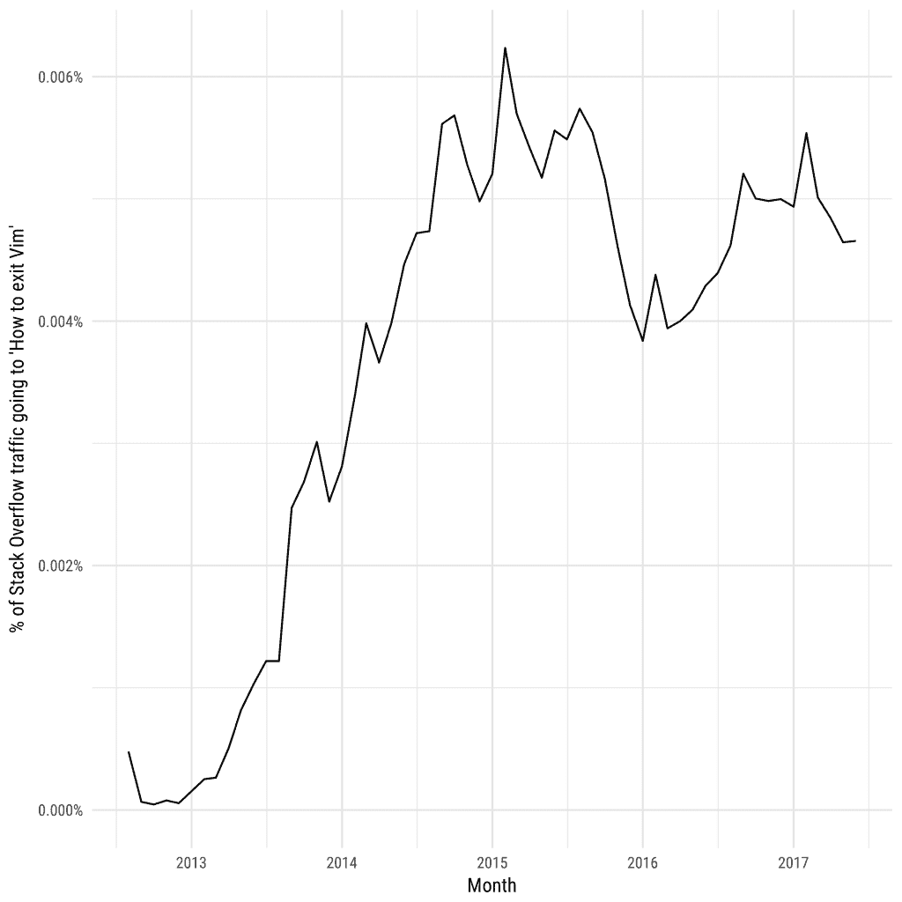
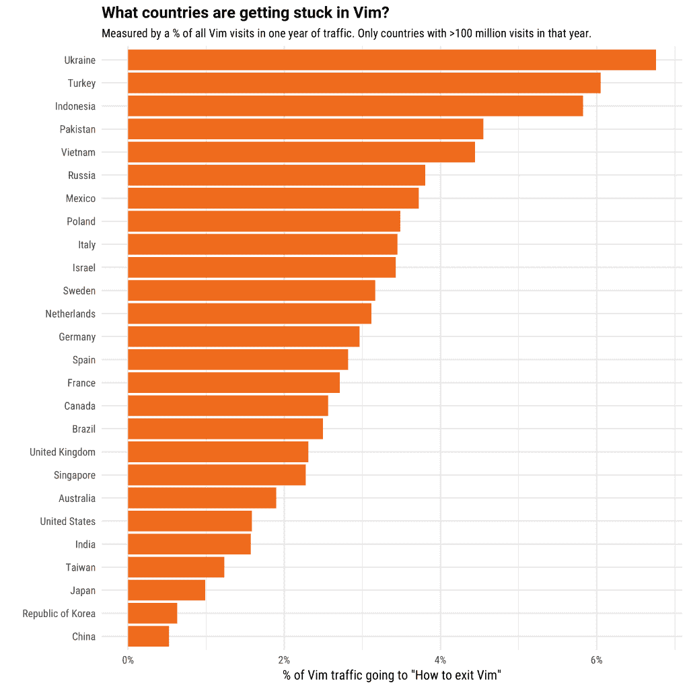
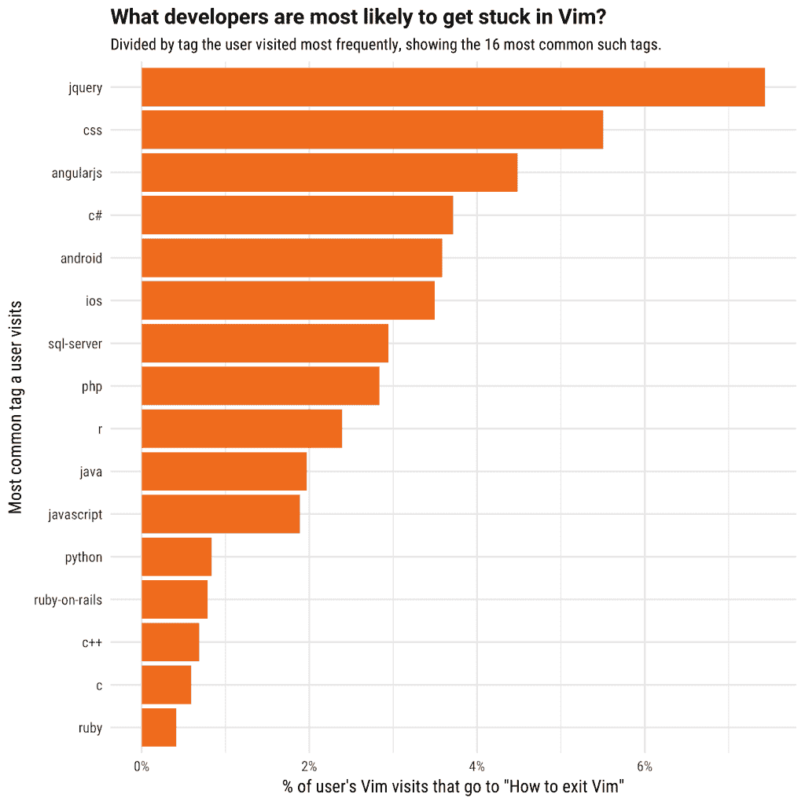

# 如何退出 Vim 编辑器-堆栈溢出博客

> 原文：<https://stackoverflow.blog/2017/05/23/stack-overflow-helping-one-million-developers-exit-vim/?utm_source=wanqu.co&utm_campaign=Wanqu+Daily&utm_medium=website>

今天早上，一个[流行的堆栈溢出问题](https://stackoverflow.com/questions/11828270/how-to-exit-the-vim-editor)达到了一个重要的里程碑:

你不是一个人，杰西。在这个问题提出后的五年里，已经有超过一百万的其他开发人员陷入了 Vim，如果没有一点帮助，他们是无法逃脱的。事实上，退出 Vim 编辑器的困难是开发人员之间的一个常见笑话。

有经验的 Vim 用户告诉我，这种声誉是不公平的，我确信他们是对的(甚至我在过去几年里已经掌握了诀窍)。我认为有两个原因很容易忘记如何退出 Vim:开发人员经常从 git 命令或其他他们不期望的情况中陷入 Vim，并且他们很少遇到它，以至于忘记他们上次是如何解决的。

为了纪念这个里程碑，我们决定看看围绕这个问题的数据。特别是，我们将尝试测量谁最有可能在 Vim 中陷入**而不是故意使用它，并检查这种平衡如何因国家和编程语言而异。**

### 有多少人一直在挣扎着退出 Vim？

在过去的一年里，[如何退出 Vim 编辑器](http://stackoverflow.com/questions/11828270/how-to-exit-the-vim-editor)已经占了大约. 005%的问题流量:也就是说，每 20000 次访问中就有一次出现堆栈溢出问题。这意味着在工作日交通高峰期，每小时大约有 80 人需要帮助才能走出维姆。

它所占的流量百分比是否会随着时间的推移而发生变化？也就是说，开发者已经开始学习自己退出 Vim 了吗？

看起来不像。这个问题是在 2012 年 8 月提出的，有几个月它的访问量很小。然后，在接下来的两年里，它开始增长，大概是因为更多的资源链接到了网上，它移动到了搜索引擎结果的顶部。在过去的两年里，情况相对稳定。当然，这并不一定意味着同样的人一次又一次地访问它；这可能代表相对较新的程序员第一次陷入 Vim。

### 国家间的差异

正如我们在[之前的一篇博文](https://stackoverflow.blog/2016/11/30/how-do-developers-in-new-york-san-francisco-london-and-bangalore-differ/)中看到的，我们可以使用堆栈溢出流量来了解很多关于开发者的地理分布情况。

让我们考虑一下这个问题在每个国家访问 Vim 的*人数中所占的百分比。在有大量经验丰富的 Vim 用户的国家，我们预计这个比例会很低。当它很高时，它表明许多用户在他们不期望的时候陷入了 Vim。*

看起来乌克兰、土耳其和印度尼西亚的开发者在 Vim 上陷得很深:这在他们的 Vim 问题中所占的比例比其他任何国家都大。相比之下，在中国、韩国和日本，回答这个问题的比例是这个问题的十分之一。这可能表明，当这些国家的开发人员进入 Vim 时，他们通常是有意这样做的，并且他们知道如何退出。

### 什么样的程序员会卡在 Vim 里？

不同编程语言的用户对 Vim 也可能有不同的体验。我们可以通过对每个用户的**主要编程技术**的“退出 Vim /总 Vim”百分比进行分层来研究这一点。

我们将根据他们最常访问的堆栈溢出标签来定义这一点。(例如，我最常访问的标签是 [R](https://stackoverflow.com/questions/tagged/r) :它占了我问题视图的 52%)。这不是一个完美的衡量标准，但它足够可靠，可以给出一种按语言细分的感觉。(在本次分析中，我们只考虑了访问该网站至少 100 次的注册用户)。

最有可能陷入 Vim 的开发人员是前端 web 开发人员:那些主要访问 JQuery、CSS 和 AngularJS 等标签的开发人员。紧随其后的是微软开发者(C#和 SQL Server)和移动端(Android 和 iOS)。这些开发人员通常使用 IDE (Visual Studio、Eclipse、Xcode 等)，而不是纯文本编辑器，因此他们更有可能“困在”Vim 中，而不是有意打开它。

最不可能陷入 Vim 的开发人员是那些用 C、C++、Python 和 Ruby 编程的人。这些语言对我来说很有意义:它们是低级语言和脚本语言的组合，通常用于纯文本编辑器而不是 IDE，所以它们有经验不用谷歌搜索就能避开它。

[T2】](https://stackoverflow.com/jobs?utm_source=so-owned&utm_medium=blog&utm_campaign=jobs2019&utm_content=headhunters)

### 结论

当我看到这个问题接近一百万次访问时，我很开心，但我也很自豪我为一个帮助如此多开发人员的网站工作并提供答案。你永远不知道你贡献的答案何时能帮助数百万人，无论是分享如何[撤销 git 提交](https://stackoverflow.com/questions/927358/how-to-undo-last-commits-in-git)还是如何[Python 中的 yield 关键字如何工作](https://stackoverflow.com/questions/231767/what-does-the-yield-keyword-do-in-python)。

如果你想贡献自己，我们鼓励你[加入世界上最大的开发者社区](https://stackoverflow.com/users/login?utm_source=so-owned&utm_medium=blog&utm_campaign=gen-blog&utm_content=blog-link)，无论是提问和回答问题、[获得下一份工作](https://stackoverflow.com/jobs/back-end-developer-jobs?utm_source=so-owned&utm_medium=blog&utm_campaign=dev-c4al&utm_content=c4al-link)，还是[通过开发者故事建立你的在线形象](https://stackoverflow.blog/2016/10/11/bye-bye-bullets-the-stack-overflow-developer-story-is-the-new-technical-resume/)。你也可以使用像[栈溢出趋势](https://insights.stackoverflow.com/trends?utm_source=so-owned&utm_medium=blog&utm_campaign=trends&utm_content=blog-link)这样的工具来了解我们的数据可以告诉你关于软件开发人员的更多信息。

无论如何，下一次你通过栈溢出来解决你的问题时，记住成千上万的用户定期地询问、回答、编辑和调节站点，使这一切成为可能。