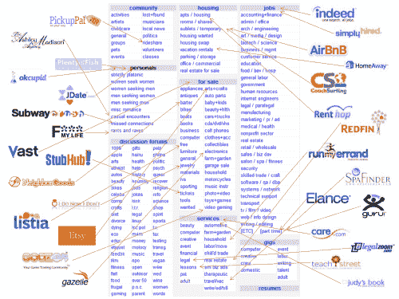

# @ttunguz 对 Excel 的拆分

> 原文：<http://tomtunguz.com/unbundling-of-excel/?utm_source=wanqu.co&utm_campaign=Wanqu+Daily&utm_medium=website>

[T2】](https://res.cloudinary.com/dzawgnnlr/image/upload/q_auto/f_auto/w_auto/spawn_of_craigslist.png)

2010 年 1 月，安德鲁·帕克写了一篇名为 Craigslist 之子的文章。安德鲁找出了那些通过分拆 Craigslist 建立业务的公司。度假租赁链接催生了 AirBnB 和 HomeAway。Etsy 控制着待售的工艺品。同样的分拆也是为了超越。

微软 Office 在全球拥有超过 10 亿用户。假设 Excel 的普及率为 33%，那么用户总数为 3 亿。就像消费者世界的 Craigslist 一样，Excel 成了几乎每个人在工作中完成工作的工具。

需要计算？Excel。任务清单怎么样？Excel。一个轻量级的 CRM 来管理客户怎么样？金融模式？项目管理的瀑布图？简单的仪表板/图表工具？供应商和买方之间的数据交换格式？用于在组织内移动数据的轻型 ETL 工具。这个清单还在继续。

对数百万人来说，Excel 是第一次接触到计算机处理数据、计算和共享结果的能力。Excel 的主要优势是其产品设计。Excel 支持简单的渐进式发现。用户的第一次体验通常是快速计算。然后可能添加几行，然后几个工作表。但是很快，采购人员可能会管理不同的报价来购买桌子。然后，他们可能会问如何自动化分析，在这种情况下，他们可以使用 VBA，Excel 的编程语言。然后是整个函数库，一个复杂的数据和分析工具包，图表。

Excel 在教育数亿人了解软件的力量方面做得非常出色。初创公司正在利用这一新的数据素养用户群，开发出单独的应用程序，用针对特定功能优化的专用工作流来取代 Excel。

Excel 的这种拆分主要发生在 SMB 细分市场的中型企业部分。当一家公司达到一定规模后，团队会成长和专业化，协作变得更加重要，控制也是如此。公司需求的这种演变为专用工作流软件取代以前的 Excel 用例创造了机会。

这些初创公司受益于快速的销售周期，因为专用工具相对于 Excel 的优势是明显且可量化的。在某些时候，Excel 工作流变得笨拙而繁重，软件购买者每天都感到痛苦。因此，如果一家新公司带着解决工作流程问题的工具打电话来，买家已经准备好，受过教育，有动力传递他们信用卡上的 16 位数字来解决问题。因此，这些公司非常适合销售周期非常短的内部销售模式。

我希望有一个所有 Excel 用例的列表，这样我就可以创建一个与 Andrew 的相似的图形，但不幸的是没有。然而，拆分 Excel 的机会是巨大的，并且是工作流软件的一个大趋势。