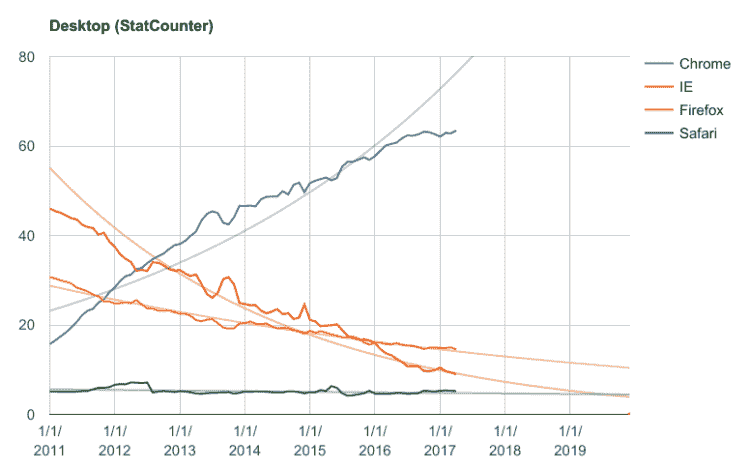

# Chrome 赢得| Andreas Gal

> 原文：<https://andreasgal.com/2017/05/25/chrome-won/?utm_source=wanqu.co&utm_campaign=Wanqu+Daily&utm_medium=website>

声明:*我在 Mozilla 工作了 7 年，是 Mozilla 的首席技术官，两年前离开，创办了一家嵌入式人工智能初创公司。*

两天前，Mozilla 发表了一篇博文,强调其努力让桌面 Firefox 浏览器再次具有竞争力。我曾经密切关注浏览器市场，但已经几年没有关注过了，所以我觉得是时候关注一些数据了:

上图显示了过去 6 年中 4 种主要浏览器在所有设备上的市场份额百分比。这些数据来自 StatCounter，你可以说这些数据在很多方面都有偏差，但在宏观层面上，可以肯定地说 Chrome 正在蚕食浏览器市场，除了 Safari，其他所有人都被抹杀了。

## 趋势

我尝试了几种不同的方法来绘制趋势线，指数拟合似乎效果最好。这与围绕创新爆炸式扩散和传统技术缓慢衰落的理论非常吻合。如果 6 年的趋势保持不变，IE 应该会在 2 到 3 年内死亡。不幸的是，Firefox 也好不到哪里去，它的市场份额只有 2-3%。对于 IE 和 Firefox 来说，这些低市场份额数字进一步加速了下滑，因为网络作者不会测试市场份额小的浏览器。破碎的内容使用户切换浏览器，从而导致更多的用户离开。恶性循环。

Chrome 和 Safari 不如 IE 和 Firefox 适合。对 Chrome 的解释很可能是市场份额太大，Chrome 已经没有用户可以收购了。有些人被困在不支持 Chrome 的旧操作系统上。Safari 最近的增长低于其趋势，很可能是因为 iOS 设备增长放缓。

## 台式机市场份额

纵观所有设备，移动和桌面市场份额混为一谈，这可能会产生误导。Safari/iOS 在手机上占主导地位，而在桌面上，Safari 的份额非常小。反过来，Firefox 在手机上基本不存在。所以让我们只看台式机的数量。

[T2】](https://docs.google.com/spreadsheets/u/1/d/1obh-hqABFarXjkwrd1nZXBNnOhZP2mezyA5B5eY1JIc/pubchart?oid=2031649123&format=interactive)

不幸的是，桌面地图也没有预测 IE 和 Firefox 的不同命运。整体台式电脑市场略有增长(大部分销售是替换电脑，但也增加了新用户)。尽管市场不断扩大，IE 和 Firefox 都在不可持续地下滑。

## 添加用户？

Eric 在博文中提到 Firefox 去年增加了用户。在此期间，Firefox 的相对市场份额从 16%下降到 14.85%。相比之下，Safari 桌面相对平淡，这可能意味着 Safari 的市场份额跟上了 PC/笔记本电脑市场的(缓慢)增长。两种可能的理论是 Eric 在他的博客文章中说浏览器安装被添加了。人们经常在一台新机器上重新安装浏览器，这可以被称为“添加用户”，但这通常是以旧机器被废弃为代价的。尽管相对市场份额急剧下降，但由于 PC/笔记本电脑市场的增长，绝对日活跃用户数也可能确实增加了。Firefox ADUs 不是公开的，所以很难说。

从这些图表来看，很明显 Firefox 不会有任何发展。这意味着受人尊敬的福克斯将会存在很多很多年，尽管市场份额在不断减少。不幸的是，这也意味着扭转局面几乎是不可能的。

大约 3 年前，随着首席执行官的转变，Mozilla 进行了一次重大的战略转移，重新将精力集中在 Firefox 上，从而转移到桌面上。2014 年之前，Mozilla 斥巨资打造了一款手机操作系统，与 Android 竞争:Firefox 操作系统。我启动了 Firefox OS 项目，并将其规模化。虽然我们大出风头，卖出了几百万台设备，但最终我们还是有点晚了，没能赶上 Android 的爆炸式增长。Mozilla 构建 Firefox OS 的战略理念经常被误解。Mozilla 的创始使命是通过构建浏览器来构建网络。手机彻底打乱了这个任务。在移动浏览器上的相关性要小得多——第三方移动浏览器更是如此。在移动浏览器上是脸书和推特应用的一个特征，而不是一个产品。为了影响手机上的网络，Mozilla 必须以网络为核心建立一整套体系。构建移动浏览器(Firefox Android)或类似浏览器的应用程序(Firefox Focus)不太可能获得有意义的用例份额。Android 版 Firefox 和 Firefox Focus 的市场份额都接近 0%。

2014 年的战略转移，回到 Firefox，以及随之回到桌面，对 Mozilla 来说意义重大。正如 Eric 在他的文章中所描述的，在过去的几年里，Firefox 桌面版投入了大量令人惊叹的技术工作。专注于桌面的团队扩大了，专注于移动的工作减少了。今天的 Firefox 桌面在许多领域与 Chrome 桌面在技术上具有竞争力，甚至在某些方面优于 Chrome。不幸的是，看看图表，这些对市场趋势都没有任何影响。浏览器是一种商品。它们看起来几乎一样，感觉也一样。所有的浏览器都工作得很好，稍微快一点或者使用稍微少一点的内存不太可能动摇用户。如果连负责 Mozilla 营销团队的埃里克都像他在第一句话中提到的那样每天都在使用 Chrome，那么几乎 65%的桌面用户都在做同样的事情就不足为奇了。

## 这对网络意味着什么？

我在 2011 年开始使用 Firefox OS，因为那时我已经确信桌面和浏览器已经死亡。不会马上——6 年后的今天，这两种技术仍然存在——但这两种技术都是传统技术，不会对未来产生特别大的影响。我不认为会有一场新的浏览器大战，Firefox 或其他一些竞争对手会从 Chrome 重新夺取市场份额。这就像在 2017 年推出一匹新的改良马。我们现在都开车了。有些人仍然使用马，马也有它的价值，但是当涉及到交通工具时，技术已经向前发展了。

如果谷歌拥有 Chrome，这是否意味着谷歌拥有网络？不，绝对不行。浏览器是互联网最初几十年的样子。手机颠覆了网络，但网络拥抱了手机，如今大多数应用的核心击败了大量的 JavaScript 和 HTTPS 以及 REST。未来的网络看起来又会完全不同。大部分会幸存下来，而其中的一部分会被破坏。我离开了 Mozilla，因为我很好奇一旦网络主要由设备组成，而不是桌面和手机，它会是什么样子。在 [Silk](http://silklabs.com) 我们创建了一个[物联网平台](https://github.com/silklabs/silk)围绕 JavaScript 等开放网络技术构建，我们通过在设备中嵌入人工智能而不是将一切都发送到云，围绕民主化数据所有权做了大量工作。

因此，虽然谷歌赢得了浏览器大战，但他们还没有赢得网络。坚持交通运输的比喻:谷歌制造了世界上最好的马，他们显然赢得了这场赛马。我只是不认为这场比赛对未来有多大影响。

*更新:在 HackerNews 的帖子[中有很多好的评论。](https://andreasgal.com/2017/05/25/chrome-won/)我最喜欢的是这个:[“Mozilla 赢得了浏览器大战。Firefox 输掉了浏览器大战。但还有很多战争要打，我希望 Mozilla 能投入一场新的战争。”](https://news.ycombinator.com/item?id=14421381)完全同意。*

### 像这样:

像 装...

### *相关*