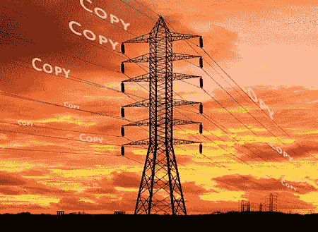

# 技术元素:比免费更好

> 原文：<http://kk.org/thetechnium/better-than-fre/?utm_source=wanqu.co&utm_campaign=Wanqu+Daily&utm_medium=website>

【翻译:[白俄罗斯语](https://web.archive.org/web/20100929144340/http://www.moneyaisle.com/worldwide/better-than-be)，[中文](https://web.archive.org/web/20081209061435/http://tuxfans.com/2008/02/05/154/)，[爱沙尼亚语](http://www.besteonderdelen.nl/blog/?p=10116)，[法语](http://www.biologeek.com/journal/index.php/mieux-que-gratuit-le-business-model-reinvente)，[德语](https://web.archive.org/web/20090830181408/http://bewegliche-lettern.de/2009/08/kevin-kelly-besser-als-kostenlos-better-than-free/)，[意大利语](https://web.archive.org/web/20140106104959/http://www.internazionale.it/come-fare-soldi-gratis/)，[日语](http://memo7.sblo.jp/article/12121626.html)，[波兰语](https://web.archive.org/web/20150715070233/http://cheap.de/science/lepiej-niz-bezplatny)，[葡萄牙语](http://midiascopio.blogspot.com/2010/07/melhor-que-gratis.html)，[俄语](https://web.archive.org/web/20120203080743/http://howtosell.ru/2008/04/22/luchshe-chem-besplatno/)，[西班牙语](http://www.uncafelitoalasonce.com/mejor-que-gratis/)，[土耳其语](http://kozmostansesler.blogspot.com/2009/02/bedavadan-daha-cazip.html)

互联网是一台复印机。在最基本的层面上，它复制了我们骑在上面时的每一个动作，每一个角色，每一个想法。为了将信息从互联网的一个角落发送到另一个角落，通信协议要求整个信息在途中被复制几次。IT 公司通过出售促进这种无休止复制的设备赚了很多钱。任何计算机产生的每一点数据都会被拷贝到某个地方。因此，数字经济是在复制的河流上运行的。与机器时代的大规模生产复制品不同，这些复制品不仅便宜，而且免费。

我们的数字通信网络已经被设计成副本尽可能少摩擦地流动。事实上，拷贝流动如此自由，我们可以把互联网想象成一个超级分发系统，一旦拷贝被引入，它将永远在网络中流动，就像超导电线中的电流一样。我们在现实生活中看到了这方面的证据。任何可以被复制的东西一旦接触到互联网，就会被复制，而且这些副本永远不会离开。即使是一只狗也知道一旦东西在网上流传，你就无法抹去它。

这个超级分配系统已经成为我们经济和财富的基础。数据、想法和媒体的即时复制支撑着我们经济中的所有主要经济部门，特别是那些与出口相关的部门——也就是说，那些美国具有竞争优势的行业。我们的财富坐落在一个不断杂乱复制的巨大装置上。

然而，这个经济体的上一轮财富是建立在出售珍贵拷贝的基础上的，因此免费拷贝的自由流动往往会破坏现有的秩序。如果我们最大努力的复制品是免费的，我们如何继续下去？简单地说，一个人如何通过出售免费拷贝赚钱？

我有答案了。我可以这样说，最简单的方式是:

当副本超级丰富时，它们就变得一文不值了。

当副本超级丰富时，不能被复制的东西就变得稀缺而有价值。

当副本免费时，你需要出售不可复制的东西。

嗯，什么是不能复制的？

有许多品质是无法复制的。考虑“信任”信任是无法复制的。你不能购买它。信任必须通过时间来赢得。它无法下载。或者是伪造的。或者是伪造的(至少长期如此)。如果其他条件相同，你会更喜欢和你信任的人打交道。因此，信任是一种无形的东西，在一个充满拷贝的世界里，它的价值越来越大。

有许多类似于信任的其他品质是难以复制的，因此在这个网络经济中变得很有价值。我认为检验它们的最好方法不是从生产者、制造商或创造者的角度，而是从使用者的角度。我们可以从一个简单的用户问题开始:我们为什么要为任何可以免费得到的东西付费？当任何人购买他们可以免费获得的某个版本时，他们购买的是什么？

从我对网络经济的研究中，我大致看到了八类无形价值，当我们为一些本可以免费的东西付费时，我们就会购买这些无形价值。

真正意义上，这是比免费更好的八件事。八个不可复制的值。我称之为“世代”一种*生成性*价值是一种必须被产生、成长、培养、滋养的品质或属性。一个有生殖能力的东西是不能被复制、克隆、伪造、复制、仿造或再造的。它是随着时间的推移在原地独特地产生的。在数字领域，生成性给免费拷贝增加了价值，因此是可以出售的东西。

**八** **生财** **总比免费的好**

你迟早可以找到你想要的任何东西的免费副本，但是在它发布的那一刻——或者更好的是，由它的创造者制作——就把它送到你的收件箱，是一种可生成的资产。许多人会在首映之夜去电影院看电影，在那里他们会花一大笔钱去看一部电影，这部电影稍后会通过租赁或下载免费或几乎免费提供。精装书因其直接性而获得溢价，伪装成更硬的封面。同样的商品，排在第一位的人往往要求额外的价格。作为一种可销售的品质，即时性有许多层次，包括获得测试版。粉丝被带入生成过程本身。测试版本经常被贬低，因为它们不完整，但它们也拥有可以出售的生成性品质。即时性是一个相对的术语，这就是为什么它是生成性的。它必须适合产品和观众。博客与电影或汽车有着不同的时间观念。但是即时性可以在任何媒体中找到。

个性化——一个普通版本的音乐会录音可能是免费的，但是如果你想要一个经过调整的副本，在你特定的客厅里听起来很完美——就像是在你的房间里预先录制的一样——你可能愿意花很多钱。一本书的免费拷贝可以由出版商定制编辑，以反映你以前的阅读背景。你购买的免费电影可能会被删减，以反映你想要的等级(没有暴力，脏话没问题)。阿司匹林是免费的，但根据你的 DNA 量身定制的阿司匹林非常昂贵。正如许多人指出的，个性化需要创作者和消费者、艺术家和粉丝、生产者和用户之间的持续对话。它是深度生成的，因为它是迭代的和耗时的。你不能复制一段关系所代表的个性化。营销人员称之为“粘性”,因为这意味着关系双方都被这种生成性资产所束缚(投资),不愿转换和重新开始。

**解读** —正如老笑话所说:软件，免费。手册一万美元。但这不是玩笑。一些知名公司，如 Red Hat、Apache 和其他公司就是这样谋生的。他们为自由软件提供付费支持。代码的副本，仅仅是一点点，是免费的——只有通过支持和指导，才变得对你有价值。我怀疑很多遗传信息会走这条路。现在复制你的 DNA 非常昂贵，但很快就不会了。事实上，很快制药公司就会付钱给你来获取你的基因序列。因此，你的序列拷贝将是免费的，但解释它的含义、你能做什么以及如何使用它——可以说是你的基因手册——将是昂贵的。

**真实性** —你也许可以免费获得一个关键的软件应用程序，但即使你不需要手册，你也可能希望确保它没有错误、可靠且有保证。你会为真实性付出代价的。《感恩而死》的各种版本数不胜数。从乐队本身购买正版将确保你得到你想要的。或者它确实是由死者表演的。艺术家们处理这个问题已经很久了。照片和石版画等图形复制品通常带有艺术家的真迹印章——签名——以提高复制品的价格。数字水印和其他签名技术不能作为拷贝保护方案(拷贝是超导液体，记得吗？)但它们可以为那些在乎的人提供真实性的生成质量。

可及性(Accessibility)——所有权通常很糟糕。你必须保持你的东西整洁、最新，如果是数字资料，还要备份。在这个移动的世界里，你必须随身携带。许多人，包括我在内，都乐于通过订阅它们让别人来照管我们的“财产”。我们将向 Acme Digital Warehouse 付费，让它在我们想要的时间和地点为我们提供世界上任何音乐曲调，以及任何电影、照片(我们的或其他摄影师的)。书籍和博客也是如此。Acme 备份一切，支付创作者，并交付我们的愿望。我们可以从手机、掌上电脑、笔记本电脑、大屏幕上随时随地啜饮。随着时间的推移，如果我们想要维护它、备份它、不断添加它、组织它，这些资料中的大部分将会免费提供，这一事实将会越来越没有吸引力。

**具体化** —数字拷贝的核心是没有主体。你可以免费拷贝一部作品，然后把它放在屏幕上。但也许你想在大屏幕上看高清版？也许是 3D 的？pdf 很好，但有时将同样的文字印在明亮的白色棉纸上，用皮革装订起来会更美味。感觉真好。和其他 35 个人呆在一个房间里玩你最喜欢的(免费)游戏怎么样？更伟大的体现是无止境的。当然，今天的高清——可能会吸引持票者去大影院——明天可能会迁移到你的家庭影院，但总会有消费者不会拥有的新的疯狂的显示技术。激光投影，全息显示，全息甲板本身！没有什么比用真实的身体现场表演更能体现音乐了。音乐是免费的；身体表现昂贵。这个公式不仅迅速成为音乐家的常用公式，甚至成为作家的常用公式。这本书是免费的；身体上的交谈是昂贵的。

赞助人——我相信观众想要付钱给创作者。粉丝们喜欢用他们欣赏的信物来奖励艺术家、音乐家、作家之类的人，因为这可以让他们联系起来。但他们只会在非常容易做到的情况下支付合理的金额，并且他们确信这笔钱会直接惠及创作者。电台司令最近高调试验让粉丝们支付任何他们想要的免费版本，这很好地说明了赞助的力量。欣赏者和艺术家之间难以捉摸、无形的联系是有价值的。在电台司令的例子中，每次下载大约是 5 美元。还有很多其他的例子，观众付费仅仅是因为感觉好。

可发现性(find ability)——由于先前的生成品质存在于创造性的数字作品中，可发现性是在许多作品的聚合中出现在更高层次的资产。零价格无助于直接吸引人们对作品的注意，事实上有时可能会阻碍它。但是不管它的价格如何，一件作品除非被人看到，否则就没有价值；未发现的杰作毫无价值。当有数百万本书，数百万首歌，数百万部电影，数百万个应用程序，数百万个需要我们关注的东西——而且大部分是免费的——被发现是有价值的。

亚马逊和网飞等大型聚合网站部分靠帮助观众找到他们喜欢的作品谋生。它们带来了“长尾”现象的好消息，我们都知道，这种现象将小众观众与小众作品联系起来。但可悲的是，长尾理论只对大型聚合网站和更大的中级聚合网站如出版商、工作室和唱片公司是好消息。“长尾”对创作者本身来说只是不冷不热的消息。但是由于可发现性只能发生在系统层面，创作者需要聚合器。这就是为什么出版商、工作室和标签(PSL)永远不会消失。分发拷贝时不需要它们(互联网机器会这样做)。更确切地说，需要 PSL 来将用户的注意力重新分配到作品上。PSL 从大量的可能性中发现、培养和提炼他们认为粉丝会与之联系的创作者的作品。其他中间媒介，如评论家和评论者也能引导注意力。爱好者依靠这种多层次的发现能力，从无数的作品中发现有价值的作品。发现人才可以赚钱(间接为创意人员赚钱)。多年来，纸质出版物《电视指南》赚的钱比它所“指导”的三大电视网的总和还要多。该杂志引导观众去观看那周电视上的好节目。值得注意的是，这些东西对观众是免费的。毫无疑问，除了大型聚合器之外，在免费的世界里，许多 PDL 将通过出售 find ability——以及其他的可生成性来赚钱。

这八种品质需要一套新的技能。免费拷贝世界的成功并不是来自于发行的技巧，因为天空中伟大的拷贝机器会处理好这一点。围绕知识产权和版权的法律技能也不再非常有用。囤积和稀缺的技能也是如此。相反，这些新的八代人需要理解富足如何孕育了一种分享的心态，慷慨是一种商业模式，培养和培育不能用鼠标点击来复制的品质是多么重要。

简而言之，在这个网络经济中，金钱并不遵循复制品的路径。相反，它遵循注意力的路径，而注意力有它自己的回路。

细心的读者会注意到一个明显的缺失。关于广告，我什么也没说。广告被广泛认为是免费悖论的解决方案，几乎是唯一的解决方案。我见过的大多数解决免费问题的建议都涉及到某种程度的广告。我认为广告只是吸引注意力的途径之一，从长远来看，它们只是通过出售免费软件赚钱的新途径的一部分。

但那是后话了。

在广告的泡沫层下面，这八个世代将为无处不在的免费拷贝提供价值，并使它们值得为之做广告。这些代名词适用于所有的数字拷贝，但也适用于任何拷贝的边际成本接近零的拷贝。(见我关于[技术想要免费](https://kk.org/thetechnium/archives/2007/11/technology_want.php)的随笔。)甚至材料行业也发现复制的成本接近于零，因此它们的行为也将类似于数字拷贝。地图刚刚跨过那个门槛。遗传学即将。小玩意和小电器(比如手机)正在向那个方向下滑。药品已经在那里了，但是他们不想让任何人知道。制造一颗药丸不需要任何成本。我们为药品的真实性和即时性付费。总有一天我们会为个性化付费。

维护生成文件比在工厂里复制副本要困难得多。还有很多东西要学。很多事情要弄清楚。如果你有，给我写信。