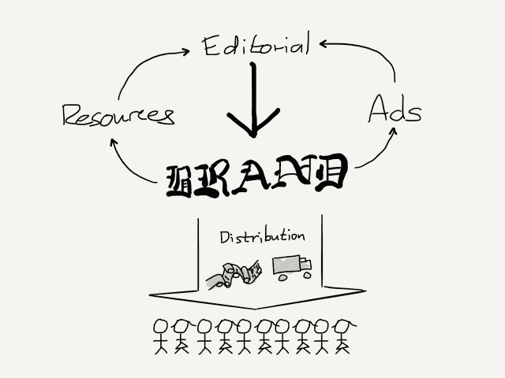
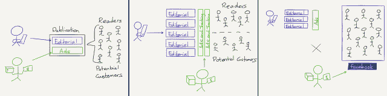
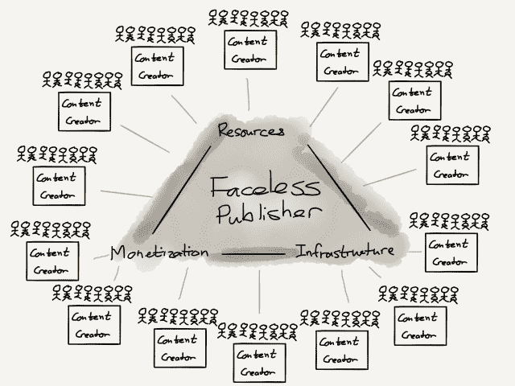

# 匿名出版商——本·汤普森的策略

> 原文：<https://stratechery.com/2017/the-faceless-publisher/?utm_source=wanqu.co&utm_campaign=Wanqu+Daily&utm_medium=website>

当我第一次为(学生)报纸工作时，出版商的工作对我来说似乎很奇怪；就我和我的编辑同事而言，出版人就是主编，我们把他视为老板，偶尔会在喝多了几杯后抱怨，通常会断言他(在这种情况下)有点令人讨厌。

当然，这种态度是印刷的奢侈品:无论在办公室的另一边发生了什么，都不会对(在我们看来)每天产生新鲜内容的英勇努力产生任何影响。我们在办公室里呆到深夜，写作、编辑、设计第二天早上会神奇地出现在报摊上的报纸，而出版商和他的团队都在家睡觉。

这个故事的寓意是显而易见的:出版商代表了报纸的商业一面，互联网的作用是使编辑的工作和影响变得更容易，而出版商的工作和影响变得难以估量，这在很大程度上是因为出版商的许多工作变得过时了；然而，付出代价的是编辑部。

#### 出版商所做的工作

在印刷时代，出版商提供了多种连锁功能，使报纸成为令人难以置信的业务:

*   品牌:一个出版商有一个品牌，确切地说，是出版物的名字；这是读者的主要接触点，无论他们对国家新闻、地方新闻、体育还是有趣的版面感兴趣。
*   创收:大多数出版商通过两种方式获得收入:一部分收入来自订阅，其销售、管理和支持由专职人员负责；大部分收入来自广告，广告有自己的专门团队。
*   人力资源:编辑人员可以自由地写信和抱怨他们的出版商，因为他们工作生活中的其他一切都得到了照顾，从工资到差旅费到办公用品。

将这些功能联系在一起的是发行:出版商拥有印刷机和送货卡车，再加上他们已经建立的读者群和广告关系，使大多数报纸在他们的地理区域内对读者*和*广告商*和*作家形成了有效的垄断(或寡头垄断):

[T2】](https://i0.wp.com/stratechery.com/wp-content/uploads/2017/05/stratechery-Year-One-264.png?ssl=1)

这些功能中的每一个都支持另一个:品牌推动了收入的产生，这为实现品牌承诺的社论支付了费用，所有这些都是通过拥有发行来支撑的。

#### 出版业的螺旋式下降

这种模式已经土崩瓦解，这已经不是什么新闻了，尤其是在这个博客上。最明显的罪魁祸首是，在互联网上，分发，特别是文本和图像，实际上是免费的，这意味着广告商有了新的渠道:首先是跨出版商大规模运营的广告网络，越来越多的脸书和谷歌提供了直接触及个人的权力。

[T2】](https://stratechery.com/2015/popping-the-publishing-bubble/)

我在《戳破出版泡沫》一书中写到了这一进展，出版商相互交织的功能解释了随之而来的螺旋式下降:收入减少，用于高质量新闻报道的资金减少(追逐点击的动力增加)，这意味着[品牌贬值](https://stratechery.com/2015/why-web-pages-suck/)，这意味着读者减少，从而导致钱更少。

让这种螺旋式下降变得尤其具有破坏性的是，正如广告转移所证明的那样，报纸并非存在于真空中。读者可以阅读任何报纸，或纯数字出版商，甚至个人博客。此外，正如社交媒体让广告商有可能瞄准个人一样，它也让每个人都成为内容创作者，将自己的媒体与其他人推至相同的订阅源:品牌根本不重要，重要的是内容，或者在少数例外情况下，个人作者，他们中的许多人积累了大量自己的追随者；一个突出的例子是美国体育记者比尔·西蒙斯。

#### Vox 媒体+振铃器

两年前，我在《格兰特和出版业的(令人惊讶的)未来》中写了关于西蒙斯的文章，并指出媒体实体需要整体考虑货币化问题:

> 太多关于货币化和出版业未来的辩论已经人为地将自己限制在文本货币化上。在现实世界中，这种限制是有道理的:一家在印刷机和送货卡车上投入巨资的企业，除了将产品和商业模式结合在一起之外，别无选择，但现在一切——文本、视频、音频文件，你能想到的——都是 1 和 0，那么将一个人的思维局限于这些 1 和 0 的特定配置有什么意义呢？
> 
> 事实上，从长远来看，很有可能目前的出版状态——一方面是广告驱动的大规模，另一方面是收入数字低甚至成本更低的个人商店——最终将成为一种异常。专注于质量的出版物将利用捆绑经济来收集“明星”,并通过订阅(不太可能)或替代媒体形式的某种组合将其货币化。上述媒体形式，如播客，很难独立发展，但同样，这也是为什么它们非常适合写作，这对增长来说是完美的，但对盈利来说是可怕的。

我的粗略计算估计，西蒙斯的 Ringer 播客网络可能会产生数百万美元的收入，在今年早些时候接受 Recode 采访时，西蒙斯证实了这一点，他声称播客的收入不仅可以弥补创建播客的成本，还可以弥补网站的成本，至少在理论上可以创造播客听众。

尽管如此，考虑到西蒙斯的野心，如果该网站不仅仅是一个成本中心，那肯定会更好，这使得该公司最近的声明特别有趣。摘自《纽约时报》:

> 比尔·西蒙斯创建的体育和文化网站 Ringer 将很快托管在 Vox Media 的平台上，但根据周二宣布的合作伙伴关系，该网站将保持编辑独立性。前 ESPN 名人西蒙斯将保留 Ringer 的所有权，但 Vox 将出售该网站的广告，并分享收入。Ringer 将离开它目前在 Medium 上的家，自 2016 年 6 月开始以来一直在那里托管。
> 
> Vox 首席执行官吉姆·班克夫(Jim Bankoff)在电话采访中表示，这种合作是该公司的首次合作，将使其能够向广告商提供更多产品。西蒙斯先生在一份声明中说:“这种合作关系使我们能够保持独立，同时利用 Vox Media 擅长的两个方面:销售和技术。我们希望在未来几年致力于创造高质量的内容，尽我们所能进行创新，建立我们的品牌，并将 Ringer 发展成为一家多媒体企业。”

西蒙斯从这笔交易中获得的好处是完全正确的:不用建立重复的技术和广告销售基础设施，Ringer 可以简单地使用 Vox Media 的。这对于技术来说不太重要(尽管 Vox 坚持认为 Chorus 是一个有意义的差异化因素)，但对于广告来说非常重要。这不仅仅是为广告销售建立基础设施的费用；最重要的一点是:没有大规模的广告，几乎不可能与谷歌和脸书竞争广告收入。

毫无疑问，西蒙斯是那种许多广告商乐意在旁边做广告的作家(除了 Squarespace 和 Casper 床垫等常见的主流品牌之外，他的播客还有一系列令人印象深刻的品牌名称)；问题是，当谈到购买广告的投资回报时，“投资”——尤其是时间——与“回报”一样重要:一个希望直接在优质媒体上做广告的品牌，更有可能与 Vox Media 及其庞大的网站打交道，而不是与 Ringer 这样的网站进行相对较小的交易。

事实上，互联网对编辑和广告影响的分歧——前者正在变得分散，后者正在变得巩固——解释了为什么在我看来，对 Vox Media 的影响是这笔交易更重要的收获。

#### Vox 媒体的优势

迄今为止，Vox Media 一直是一家相对传统的出版商，尽管它的表现优于大多数出版商:该公司建立了强大的品牌，吸引了可以通过广告货币化的受众，这些收入与风险资本一起，被注入了令人印象深刻的编辑产品，从而建立了该公司的品牌。

然而，Ringer 不是 Vox 媒体品牌:它是 Simmons 的品牌，他在声明中强调了这一点，这对 Vox 来说是个好消息。社论的问题在于，虽然受众规模扩大了，但制作却没有:内容仍然必须在持续的基础上创作，这意味着可变成本很高。

不过，基础设施是可以扩展的:Vox Media 对其所有网站使用相同的底层技术，这正是你所期望的，因为软件可以无限复制。重要的是，同样的原则也适用于广告:一个销售团队可以在任意数量的网站上销售广告，印象越多越好。假设 Ringer 最终不是一个局外人，而是许多类似交易中的第一个，那么这意味着 Vox Media 比以前更有增长潜力，只要它只专注于将其拥有和运营的内容货币化。

#### 未来的出版商

这笔交易预示的新模式如下所示:

[T2】](https://i0.wp.com/stratechery.com/wp-content/uploads/2017/05/stratechery-Year-One-265.png?ssl=1)

在这种模式中，最有效、最具扩展性的出版商是匿名的:在社交媒体的推动下，原子化的内容创作者建立自己的品牌，发展自己的受众；与此同时，发行商在背后建立规模，跨越基础设施、货币化，甚至人力资源类型的功能。最后这一点使得匿名出版商不仅仅是一个广告网络，更重要的是，我怀疑最大的影响不仅仅是广告。

本月早些时候，我写了一篇关于本地新闻的未来的文章，我认为这将需要相对较小的基于订阅的出版物。如果有一个匿名的出版商提供技术，包括订阅和客户支持能力，以及经营企业带来的所有其他可重复的细节，这些出版物将更加可行。出版商仍然重要，但重要的是可以扩展并作为服务提供，而不需要绑定到品牌和特定的内容集。

我怀疑这是互联网出版最后阶段的一部分:免费分发破坏了编辑和出版之间的联系，并将他们推向相反的方向——一边是原子化，另一边是大规模的大规模。现在，同样的现实使一种新的模式成为可能:大量小型出版物由实体支持，这些实体更关心建立可行的业务，而不是拥有令人难忘的名字。

*披露:我之前曾在 Vox Media 拥有的 [Code Media](https://www.recode.net/2017/3/20/14960622/video-watch-ben-thompson-founder-author-stratechery-newsletter-subscription-code-media) 会议上发言，之前也是[比尔·西蒙斯播客](https://soundcloud.com/the-bill-simmons-podcast/ep-179-the-battle-for-tech-supremacy-with-ben-thompson)的嘉宾；这两次露面我都没有得到金钱上的补偿*

### *相关*