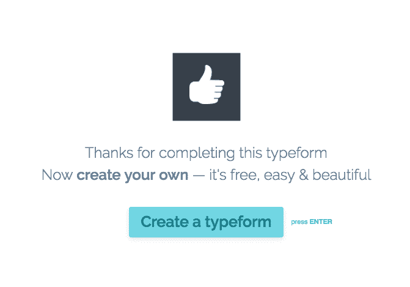

# 采访 Typeform - Pierre Lechelle 的 Pedro Magriç

> 原文：<https://www.pierrelechelle.com/interview-pedro-magrico-typeform?utm_source=wanqu.co&utm_campaign=Wanqu+Daily&utm_medium=website>

几个月前，我要去巴塞罗那度周末。我决定早点去那里完成一些工作，并会见一些有趣的人。

我给几个人发了电子邮件，令人惊讶的是佩德罗·马格里奥回复了。当时我正在研究成长，尤其是成长团队。佩德罗给我带来了很多真知灼见，所以我们决定一起接受采访。

对于那些不了解佩德罗的人来说:他从一开始就在 [Typeform](https://www.typeform.com/) 工作。他开始从事市场营销工作，后来成为增长主管。他对 Typeform 爆炸性增长的作用不应该被忽视！

佩德罗对成长型团队有一个非常有趣的观点，并从组织的角度解释了他们是如何进行实验的。继续读下去！

你如何定义增长&与营销&产品相比如何？

增长是对已经在起作用的事物进行扩展。它不是关于 *建造* 新东西，或者让现有的东西更好。这就是产品。

产品关注创造价值，增长关注让更多人尽可能经常地体验价值。 所以，如果你有一个蹩脚的产品，你不想发展它，是吗？🙂

这就是为什么产品和产品与市场的匹配总是第一位的。    营销与增长非常相似，因为它也是通过认知让你的业务增长，并最终导致和注册销售转化。不同之处在于，增长比营销使用更多的工具和规则——它更量化，更具实验性，而且是以产品为导向的。

这是以产品为导向的，因为如今产品本身往往比传统营销计划更能有效地推动增长(如病毒式传播、推荐)，尤其是在早期。这就是为什么我们看到了像“增长黑客”这样的现象出现。

可以说增长是产品和营销的混合体。

**你是如何开始“成长”的？(你的营销角色是如何演变成“成长”角色的？)**

我加入 Typeform 时是一名营销人员。我们之所以成为“增长”，是因为在早期，我们看到我们的产品天生就是病毒式的，为了优化这种病毒式传播，我们需要工程和产品来应对我们看到的优化机会。所以我们变成了产品增长。

我们最终也在增长部组建了一个营销团队。我们称之为营销增长。我们这样做是因为产品来来去去，但品牌永存。因此，今天我们的营销团队全力以赴，致力于建立意识和思想领导力，在人们心中创造一个能引起共鸣的品牌。

你是 Typeforms 的第一批员工之一，公司经历了哪些不同的阶段？你是否在不同阶段看到了不同的增长动力？

我在我们大约 10 个人的时候加入了。今天我们超过 160 人。规模带来了一系列全新的问题和挑战，而这些问题和挑战在你是一家 10 人公司时是不会有的。最大的挑战是沟通，让每个人都步调一致，步调一致。你开始需要流程和新的决策方式，因为很难达成共识。但是你也不想要太多这种东西，因为你想保持敏捷。你想成为一个健康的企业，但你不想成为“公司”。我们仍在寻找平衡。

就实际的增长驱动力而言，病毒式增长是我们最强的，现在依然如此。一开始，它是关于漏斗顶端的病毒式传播和获得尽可能多的注册。然后，我们发现 onboarding 规模相当大，但这仍在优化病毒式传播，因为归根结底，这是让更多人创建和共享类型表单的另一种方式，这为我们的病毒循环注入了更多燃料:更多类型表单=更多人看到我们的品牌=更多人对产品感兴趣=更多人创建类型表单。

最近，我们一直在尝试定价和包装，就纯商业财务而言，这是我们发现的最大杠杆。

你的职责是什么？随着时间的推移，这是如何演变的？

你可以想象，从一开始我就不得不扮演许多角色。在早期，这一切都是关于寻找最大的增长机会和快速行动，这样你就可以快速学习和迭代。然后，是关于扩展团队:首先是产品和工程方面(我们称之为产品增长)，然后是营销方面(营销增长)。渐渐地，我变得越来越少动手。我今天的工作与以前大不相同——我的工作是培养员工、提供指导、制定下一步战略、集思广益解决方案，并让自己有时间帮助执行。

**你是如何“跑成长”的？你有成长团队吗？**

是的，直到 3 个月前。我们在营销增长和产品增长之间有大约 20 个人。

现在情况有些变化，我不再有直接向我汇报的团队了。我们做出这一改变有几个原因:

当你有一个名为“成长”的团队时，它向其他人发出信号，他们不需要担心业务的增长，因为有一个团队来做这件事。这可不好。

2)在产品增长方面，与核心产品团队有很多重叠，地盘之争开始频繁发生。产品增长和核心产品增长越来越相互分离。相对于代码质量、基础设施和长期项目，我们更倾向于业务度量和实验。核心产品的情况正好相反。这是不健康的，不应该有“我们”和“他们”，实验、度量和基础设施是每个人都应该关心的东西，而不仅仅是一个团队。

因此，今天我们将核心产品和产品增长团队合并为一个有凝聚力的组织。我作为产品增长负责人与产品负责人一起工作，并与产品 API 负责人一起领导由 8 名产品负责人组成的产品团队。营销团队现在由 [桑卡·沙欣](https://www.linkedin.com/in/sancarsahin) 领导，他是我非常幸运聘用的人，自从他一年多前加入以来，他一直在帮助我们将营销提升到一个全新的水平。

你发现的教育每个人成长的最有力的东西是什么？

如果你的产品是垃圾，就不要试图发展你的产品: )要验证你的产品不是垃圾，就要衡量产品的市场适合度。一种方法是看看你的保持曲线，看看它是否在某一点变平。如果你没有足够的牵引力来衡量它，客户发展调查是一个很好的替代选择( [我们有一个方便的模板](https://www.typeform.com/examples/surveys/customer-development-survey-template/) )。你想看到人们对你的产品大喊大叫，而你甚至没有问它。

你会对想在成长中开始职业生涯的人说些什么？

非常适合成长角色的人非常善于分析(好奇事情为什么会发生)、富有创造力(能想出多种可能的解决问题的方法)并且是强有力的企业家(他们经常希望有一天自己能开一家公司)。所以在这些方面发展自己，然后尽可能多的阅读关于数字营销和产品管理的书籍。

## 结论

皮埃尔又回来了。感谢佩德罗回答这些问题。想知道更多关于他的事吗？去看看他在 LinkedIn 和 Twitter 上的简介。

很高兴看到像 Typeform 这样的公司能够在大多数公司可以管理的范围之外扩展“增长”。成长是一项新的运动，在 160 人及以上的团队中很少实施。Typeform 就是一个很好的例子！

我必须承认，“成长团队”的想法起初似乎很有趣，但在做了研究之后，它不再真正有意义了。即使在 20-30 人的团队中，成长也与太多学科重叠(主要是营销和产品)。

这种重叠造成了摩擦和政治，因为团队没有相同的目标，也没有相同的工作方式。这意味着[建立一个成长团队是困难的](https://www.pierrelechelle.com/growth-process-failures)。

Typeform 找到了一个创新的解决方案，将“成长”直接嵌入到产品团队中。这是一个聪明的解决方案。这使他们能够平衡增长与其他优先事项，避免浪费能源的内部政治。

为了解决这些问题，你做了些什么？你有成长团队吗？

## 皮埃尔·莱谢尔

## 订阅时事通讯

## 热门帖子