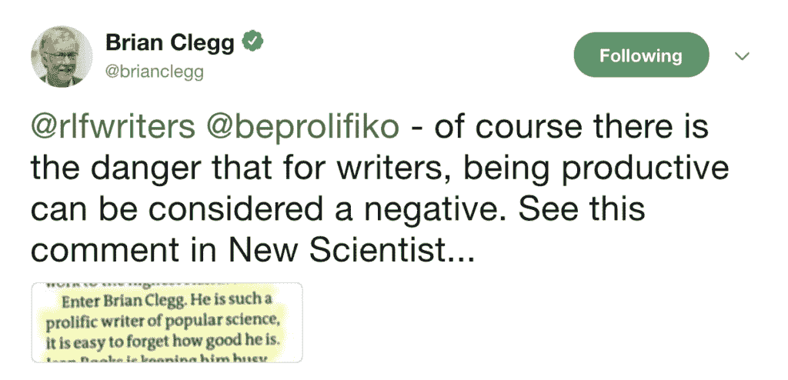

# 不要试图“创新”,而是要多产

> 原文：<http://prolifiko.com/prolific/?utm_source=wanqu.co&utm_campaign=Wanqu+Daily&utm_medium=website>

[Chris Smith](https://prolifiko.com/author/chris/ "Posts by Chris Smith")

克里斯是 Prolifiko 的联合创始人，写作生产力教练，作家和内容顾问。

<nav class="dtb-single-post-nav">[*‹* Previous

##### 为什么每个作家都需要一个“加减等号”](https://prolifiko.com/plus-minus-equals/) [Next *›*

##### 研究表明，坚持不懈是有回报的，因为你最好的时刻还在后头](https://prolifiko.com/persistence-pays-because-your-best-is-yet-to-come/) </nav>

在某些圈子里，身为一个多产作家是被嘲笑的。有些人认为在质量和数量之间有一个平衡。要做真正“伟大的工作”——你不能做太多。但是科学不同意。大多数世界上最优秀的作家、创意者和创新者也是非常多产、高产的人。

他们不害怕在人们面前展示自己的作品，他们愿意适应和改变。他们拥有卡罗尔·德韦克博士所说的“成长心态”——他们愿意学习，乐于接受新想法。在之前，我们已经写过德韦克的作品。

以布莱恩·克莱格(Brian Clegg)为例，他是 33 本畅销科普书籍和 24 本商业书籍的著名作者。但是当他发布他的新书时，这位*新科学家*在一篇评论中写道:“布莱恩·克莱格是如此多产的科学书籍作家，人们很容易忘记他有多优秀。”他们不是在开玩笑(T2 新科学家 T3 从不开玩笑)。

## 多产，有创造力

作家兼思想家亚当·格兰特在他的书 [*Originals*](https://www.amazon.co.uk/Originals-How-Non-conformists-Change-World/dp/0753556979/ref=sr_1_1?ie=UTF8&qid=1473850071&sr=8-1&keywords=originals) 中，思考了成为一个有创造力的激进分子需要具备的条件，并得出结论:高产和多产是一个超级重要的部分。

他介绍了心理学家迪恩·西蒙顿教授的工作，他多年来一直在研究创造性生产力。在他工作的早期，他发现了高创造力的人的两件事。首先，他们很难知道自己的作品何时会成功或失败，其次，是他们的多产能力(他们确实有这种能力)使他们具有独创性，而不是他们与生俱来的天赋。

西蒙顿写道:“一般来说，有创造力的天才在他们的领域里并不比他们的同龄人在质量上更好，他们只是产生了更多的作品，这给了他们更多的变化和更高的原创机会。”

> 如果你想成为原创者，你能做的最重要的事情就是做大量的工作。做大量的工作
> 
> 这部美国生活和连续剧的制片人伊拉·格拉斯。

**> >阅读更多:[小步快走](https://prolifiko.com/small-steps/)**

## “完美瘫痪”

但有时，人们害怕“把自己放在那里”带来的拒绝，而是选择隐藏自己的工作。

其他时候，作家(是的，尤其是作家……)认为找到一本书或*讲述一个故事*是他们的个人使命，而不是从事多个项目并抛弃想法——这导致了一种“完美麻痹”，阻碍了人们的发展并导致创作停滞。

格兰特写道:“许多人无法实现原创，因为他们开发了一两个想法，然后痴迷地提炼它们，试图达到某种完美。”

西蒙顿发现，高度原创的人在完成最大工作量的同时，也做出了最能改变世界的作品，而不是花费数年时间对同一件作品进行微调。他们当时并不知道这些。

他发现“命中”的次数与“失误”的次数成正比。

## 非常多产

例如，西蒙顿引用了发明家托马斯·爱迪生的工作，他一生中积累了令人难以置信的 2300 项专利。

他发现在同一年，爱迪生申请了灯泡和电话的专利(肯定都成功了)，他还申请了 100 多项其他发明的专利，包括气动笔(部分失误)、会说话的洋娃娃(肯定失误)和幽灵探测仪(足够了)。

十有八九，爱迪生从未有意从事他认为会彻底失败的工作。他可能在他的灵异设备上投入了和电影摄影机一样多的精力(电影摄影机也是他发明的)。他只是不停地把东西放在世界上，直到他成功了。作家也是一样。

虽然很难相信莎士比亚写了什么无用的东西，但我们不要忘记他写了近 40 部戏剧和 150 多首十四行诗。你能说出它们的名字吗？此外，像亚历山大·大仲马这样的作家可能会因为写了《三个火枪手》和《T2》而闻名于世，但我们要记住，他一生一共写了 277 部小说——在他的职业生涯中，每年有六部。显然，并不是每本书都有相同的大众吸引力。

格兰特引用斯坦福大学教授罗伯特·萨顿的话，他写道:“原创思想家会提出奇怪的突变、死胡同和彻底失败的想法。这种成本是值得的，因为它们也产生了更多的想法——尤其是新颖的想法。”

> *“更好地判断我们的想法的最好方法是收集反馈。把你的许多想法放在那里，看看哪些被你的观众称赞和采纳。”*T3】
> 
> *原作*的作者亚当·格兰特。

**> >多读:** [**努力当作家不会让你一个，多产会**](https://prolifiko.com/why-being-prolific-makes-you-a-better-writer/)

## 保持创意不断涌现

那么，我们从这一切中学到了什么？主要是，创意天才不是天生的创意天才。

当然，天赋是有作用的，但是写作、研究和发明的过程——*成为高产者(*——帮助你在你的领域变得更好，更有独创性。

说了这么多，多产并不能给你一个马虎的借口，开始脱口而出不完整的想法——那只会惹恼除了你妈妈以外的所有人。你的工作仍然需要尽你所能做到最好。

但这确实意味着，你不应该在第一次尝试时就止步不前——无论是因为他们对你的评价过高还是过低——因为那些最初的想法总是最传统的。

正如格兰特所说，“数量是通向质量的最可预测的途径”，所以只有把你最好的想法公之于众，并不断地在此基础上发展，你才能真正发展。

你根本不应该成为决定哪些想法会成功或失败的人——所以你最好继续努力，直到你的听众让你知道。

## 如何通过多产变得优秀:

1.  永远不要把高产等同于低水平的创造性。一些世界上最伟大的艺术家、作家和思想家都是非常多产的人。
2.  众所周知，创意人员不知道他们的工作何时有价值(或没有价值),所以不要担心你的工作有多好，只要把它展示给你的观众，他们就会告诉你。
3.  别纠结了！不要没完没了地检查你想法的骨头，如果你这样做，你就有经历“完美瘫痪”的危险。但是，虽然你不应该过度分析，你应该总是…
4.  ..做你能做的最好的工作。不要把半生不熟的软弱想法放在那里，除非你只对你妈妈的意见感到满意(这非常好，亲爱的)。
5.  记住——最初的想法总是最传统的。为了获得真正原创和激进的东西，继续挖掘，继续创作。