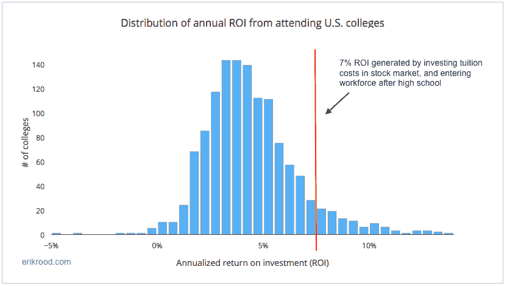

# 大学投资回报率

> 原文：<http://erikrood.com/Posts/college_roi_.html?utm_source=wanqu.co&utm_campaign=Wanqu+Daily&utm_medium=website>

### 平均而言，放弃大学而选择工作+投资学费会带来更高的回报

* * *

大学显然很贵，但这仍然是明智的投资吗？

我们都听说过大学变得多么昂贵，以及围绕其在不断变化的就业市场中的价值的大量批评。当然，在探索大学选择时，除了金钱上的好处之外，还有许多好处应该被考虑，但出于这篇文章的目的，我将限制范围，纯粹评估上大学的经济效益。

上大学的主要经济利益是大学毕业生比高中毕业生的收入差距；Payscale 提供了 20 年的投资回报(ROI)数据。该网站比较了美国大约 1250 所 4 年制和 5 年制教育机构的高中毕业生的工资中位数。

下面我将比较大学的投资回报率和高中毕业后参加工作，但将大学学费投入股市(以标准普尔 500 为代表)所产生的回报。

**选项 A——跳过大学，进入职场，投资你省下的学费**

比方说，我们跳过大学，把省下来的学费投入股市。标准普尔 500(我们的股市指标)已从 1993 年初的约 435 点升至 2017 年初的约 2260 点。这代表了 520%的回报率，相当于 24 年的年化回报率为 **~7.1%** 。请注意，我们的投资回报是 24 年，而不是大学的 20 年，因为我们可以在高中毕业时进行投资，并立即实现回报。

**选项 B——上大学，支付学费，毕业后获得更高的收入水平**

在这里，我们将像往常一样上大学，并了解美国各大学的平均投资回报率。使用我们上面提到的 Payscale ROI 数据，并对毕业率进行标准化(ROI *毕业率=预期 ROI)，有经济援助的平均年化 ROI 为 **~4.5%** (中位数为 4.1%)。

**胜利者？**

如图所示，平均而言，放弃大学费用，将这笔钱投资于股票，并开始工作，将产生比上大学高得多的回报。下面你可以看到美国大学的投资回报率分布，以及我们的“选项 A”比较点。

**几个额外的统计数据:**

*   Payscale 上列出的约 1250 所大学中，只有 **~10%** 所产生的平均投资回报率高于前述大学和投资所产生的 7.1%。换句话说，一个计划上大学的学生在进入劳动力市场并将学费投入股市的 90%的时间里会产生更高的回报。
*   如果我们去掉经济资助，只有 **~2.5%** 的大学比我们的“跳过大学投资股市”选项产生更好的投资回报率！

***脚注/免责声明:**

*   当然，贷方不会给一个人大笔贷款让他跳过大学，把学费投入股市，这只是一个假设的场景。
*   人们可以将每所学校的本科生人数纳入 Payscale 提供的投资回报率，以提高整个群体的平均水平。(我并不认为列出的所有学校都有本科生人数)。
*   回报因学校和专业不同差异很大。如果你正试图从经济角度决定是否上大学，我建议你仔细考虑你的学校选择、专业、潜在的经济资助，以及从所述专业的学校毕业并获得学位的能力。如上所述，还有**许多**额外的(非财务)因素需要考虑。
*   我上过大学，会推荐它。