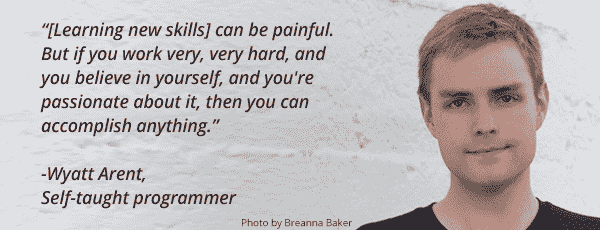

# 开放式课程如何改变学生生活的故事

> 原文：<http://mailchi.mp/mit/how-ocw-transformed-a-learners-life?utm_source=wanqu.co&utm_campaign=Wanqu+Daily&utm_medium=website>

| 

&#124;  &#124;
&#124;  &#124;
&#124; 

&#124; 

&#124; 

&#124; 

OCW 的各位朋友，

这么多人来 OCW，用这么多方式来使用它。我想和你分享 OCW 如何帮助 Wyatt Arent 改变他的生活。Wyatt 在弗吉尼亚州一个非常传统的家庭中长大，这个家庭不支持他对科学技术的兴趣。他的父母不赞成他对未来的梦想，拒绝支付他的大学学费。怀亚特意识到自己的前景越来越暗淡，在获得普通教育文凭后不久就离开了家。他一度无家可归，尽最大努力勉强度日。他在公共图书馆呆了很长时间，在那里他发现他可以满足自己强烈的学习欲望。他阅读了大量关于计算机编程的书籍，这是他毕生的兴趣之一。他在 YouTube 上发现了一些开放式课程的视频——一个关于算法的 Eric Demaine 讲座和一个关于计算机科学数学的 Tom Leighton 讲座。他看到这些视频是开放式课程网站上更大的课程网站的一部分:6.046 算法导论和 6.042J 计算机科学数学。怀亚特告诉我们，这两门课程“帮助巩固了我已经知道的一点点东西，但它们也建立在我知识严重不足的关键领域上。”

**在现实世界中做程序员**

他能够找到程序员的工作，但他知道他需要更深入地学习编程。

*“我意识到我真的需要把我的理论知识固化，因为，作为一个自学成才的程序员，我知道自己有局限性。编程有一些基本的方面，如果你理解它们，并能批判性地思考它们，你就能更有效地评估你试图执行的是什么。然后你可以专注于创造更高质量的东西”*

<u>使用 OCW 帮助 Wyatt 对编程背后的理论有了更深的理解，并帮助他填补了他自己构建的课程中的空白。</u>

**申请谷歌**

感觉更有信心了，他把目标定得很高。他开始怀疑自己是否能在谷歌工作。怀亚特申请了。在采访中，他提到了自己曾经修过的开放式课程。采访者对他的奉献精神印象深刻。他们说，这显示了个性。尽管没有大学毕业，怀亚特还是得到了这份工作。现在他有幸每天与许多非常聪明的人一起工作并向他们学习。我希望怀亚特的故事能像激励我们一样激励你。请 [今天捐款给 OCW](https://crowdfund.mit.edu/project/6629?utm_source=ocw&utm_medium=enews&utm_campaign=2017spring&utm_content=flw3nd)让其他像怀亚特一样聪明的学习者可以继续利用 OCW 改善生活。

[捐款无论多少](https://crowdfund.mit.edu/project/6629?utm_source=ocw&utm_medium=enews&utm_campaign=2017spring&utm_content=flw3nd) 【大还是小，都有影响！如果您已经在本次活动中捐款，感谢您帮助我们更接近我们的目标！

Cecilia d ' Oliveira
数字学习副院长
麻省理工学院开放课件

附:也请鼓励你的朋友、同事和家人 [在这次活动中支持 OCW](https://crowdfund.mit.edu/project/6629?utm_source=ocw&utm_medium=enews&utm_campaign=2017spring&utm_content=flw3nd) 。 &#124;

 &#124;

 &#124;

 &#124;
&#124;  &#124;

 |