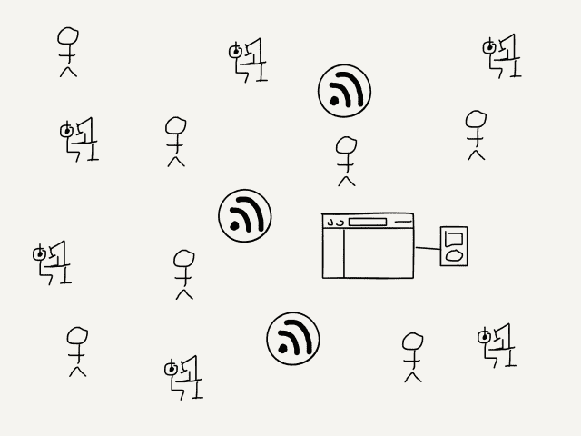
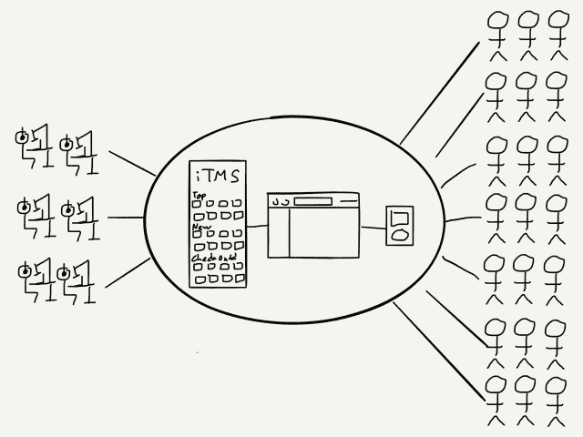

# 播客、分析和集中化——本·汤普森的策略

> 原文：<https://stratechery.com/2017/podcasts-analytics-and-centralization/?utm_source=wanqu.co&utm_campaign=Wanqu+Daily&utm_medium=website>

在 WWDC 的最后一天，有一场关于播客的会议，其中包含了一些新兴产业的重大新闻。然而，在进入具体的公告之前，会议本身值得分析一下，特别是苹果播客业务经理詹姆斯·博格斯的开场白:

> 首先，我们想谈谈我们对现代播客的看法。长格式和音频。我们对娱乐性、告知性和启发性的情节性内容感到兴奋。我们很兴奋，我们的许多用户也很兴奋。

我接着抄写了博格斯演讲中接下来的 500 个左右的单词，包括下载量、目录大小和覆盖范围的各种统计数据；由媒体和广播机构、公共媒体和独立机构组织的苹果“合作伙伴”列表；甚至在我意识到博格斯永远不会真正说出“[苹果]如何看待现代播客”之前，我就开始阅读博格斯对《崛起与消失》和《规模大师》等个人播客的评论/推广我不会让你看文字记录的——请相信我，我说那里什么也没有。

尽管如此，这本身就很说明问题；博格斯的演讲完美地反映了播客今天的状态:苹果是一个重要的部分，即使他们真的与正在发生的事情没有任何关系(但自然地，他们很乐意邀功)。

#### 播客的简史

第一个现代播客可能是戴夫·维纳在 2003 年创造的[，尽管它不被称为“播客”:那是本·哈默斯利在 2004 年](http://www.econtentmag.com/Articles/ArticleReader.aspx?ArticleID=13515)创造的[，灵感来自苹果的 iPod。然而，虽然媒体有一个名字，但“行业”在很大程度上是蛮荒的西部:分散的播客创作者、播客收集者(下载播客的软件)和播客听众，通过口头传播找到彼此。](https://www.theguardian.com/media/2004/feb/12/broadcasting.digitalmedia)

[T2】](https://i0.wp.com/stratechery.com/wp-content/uploads/2017/06/stratechery-Year-One-267.png?ssl=1)

一年后，苹果采取了行动，巩固了他们目前作为行业意外大猩猩的地位:iTunes 4.9 包括了对播客的支持，最重要的是，iTunes 音乐商店创建了一个目录(苹果过去没有——现在仍然没有——托管播客文件本身)。播客的前景完全改变了:

[T2】](https://i0.wp.com/stratechery.com/wp-content/uploads/2017/06/stratechery-Year-One-268.png?ssl=1)

集中化在一个又一个行业出现是有原因的:每个人都受益，至少在短期内。从用户开始:在 iTunes 4.9 之前，订阅和收听播客是一个多步骤的过程，其中大多数步骤都非常模糊，除了最忠实的听众之外，对所有人来说都是有效的障碍。

*   查找播客
*   找个捕鼠人
*   将播客提要的 URL 复制到播客收集器中
*   将音频文件从 podcatcher 复制到 iTunes
*   将音频文件同步到 iPod
*   听播客
*   下次同步时从 iPod 中删除播客

iTunes 4.9 让这变得简单多了:

*   在 iTunes Store 中找到一个播客，然后点按“订阅”
*   同步您的 iPod
*   听

详述这种简化可能看起来很学究气，但有一点是肯定的:这对播客创作者来说也是最重要的改进。是的，iTunes 音乐商店提供了一个重要的新发现机制，但对绝大多数潜在听众来说，是用户体验的巨大改善让播客更值得一试。集中式平台胜出是因为它们让用户的操作变得更容易；制片人愿意追随。

然而，有趣的是，除了最初的版本(显然是为了销售更多的 iPods)，苹果基本上没有涉足这个市场，只有一个重要的例外:2012 年，该公司在 App Store 发布了一个独立的 iOS 播客应用程序，2014 年，该应用程序内置于 iOS 8。在这一点上，默认的力量发挥了作用:根据去年秋天发布的 IAB 播客广告指标指南，苹果播客应用程序在所有操作系统的所有播客播放器中占了大约 50%的份额(iTunes 占了大约 10%)。 [1](#fn1-2628 "For what it’s worth, Exponent has a much different profile: Apple Podcasts has about 13% share, while <a href="https://overcast.fm/">Overcast</a> leads the way with 26% share, followed by (surprisingly!) Mobile Safari with 23%")

#### 播客行业

不清楚第一个播客广告是什么时候录制的；一个合适的猜测是本周 Tech 第 67 集，录制于 2006 年 9 月 3 日(主题:“谷歌 CEO 在苹果董事会的位置是否预示着 Sun 的合并？”).赞助商出奇的熟悉——Visa(“更安全，更划算。生活需要签证。”)，一周后戴尔也加入了。

然而，在接下来的几年里，典型的播客赞助商有点不那么有名了——当然，除非你是一个经常收听播客的人，在这种情况下，你很快就会记住这些品牌:Squarespace、Audible、Casper 床垫、蓝色围裙和最近最受欢迎的内衣(因为谁不想听到主持人为内衣代言呢！).像 Visa 或戴尔这样的公司少之又少:FiveThirtyEight 的一项研究表明，品牌广告客户不到广告阅读量的 5%。

原因很简单:对于播客来说，既没有数据也没有规模。数据部分是显而易见的:虽然播客可以(自己)报告下载数量，但没有人知道播客是否被播放，或者广告是否被跳过。比例更微妙:播客既太小又太大。他们太小了，很难大规模购买广告(而且几乎没有质量控制，即使是像 Midroll 这样的集中式广告销售者)；他们太大了，因为听众可能位于世界的任何地方，在任何时间收听，不可能为了测量广告效果而进行调查。

这就是为什么绝大多数播客广告客户实际上非常相似:几乎所有都是基于交易发起的订阅服务。“交易发起”部分意味着有一个离散点，客户可以在这个点上表明他们从哪里听说了该产品，通常是通过一个特殊的 URL，而“基于订阅”部分意味着这些产品正在评估其相对于预期终身价值的营销支出。换句话说，发现播客广告有价值的唯一产品是那些期望以可衡量的方式转化听众的产品*和*从中赚到大量的钱，证明这些争论是合理的。 [2](#fn2-2628 "This shows why Casper mattresses are the exception that proves the rule: mattresses are not a subscription service, but they are much more expensive than most products bought online, which achieves the same effect as far as lifetime value is concerned")

其结果是，从货币化的角度来看，这个行业看起来很像 iTunes 4.9 之前的播客；有一些小企业需要建立，但整个行业发展缓慢。

#### 苹果播客分析

这是苹果实际发布的背景。杰森·斯内尔在[六色](https://sixcolors.com/post/2017/06/apple-makes-major-podcast-updates/)有过很好的总结:

> 苹果播客订阅规范的新扩展将允许播客定义各个季节，并解释一集是预告片、完整集还是额外内容。这些扩展将被播客应用程序读取，并用于以比当前更线性的方式更丰富的方式呈现播客…
> 
> 今天会议的另一个大新闻是给播客们的(大概也是给播客广告商的):苹果公司正在开放播客的集内分析。在很大程度上，播客们只知道一集的 MP3 文件何时被下载。除此之外，我们真的不知道是否有人听一集，或者他们听了多长时间——只有应用程序才能确定。苹果今天表示，它将使用应用程序中的(匿名)数据向播客显示有多少人在听，以及人们在应用程序中停止或跳过的位置。这有可能极大地改变我们对有多少人真正听一个节目，有多少人跳过广告，以及人们放弃之前播客可以运行多久的看法。

新的扩展是一个很好的补充，苹果可以通过这种方式增强用户体验，使每个人受益。正如您所料，我对有关分析的新闻特别感兴趣。问题解决了，对吧？还是问题造成的？当广告商意识到所有人都跳过他们的广告时会发生什么？

#### 广告商:不是白痴

事实上，我预计这些分析至少在短期内影响很小。首先，各种迹象表明，分析将只对播客发布者开放，尽管广告商肯定会推动分享。然而，更确切地说，所有当前的播客广告客户都确切地知道他们得到了什么:X 数量的播客广告导致 Y 数量的转换，从而产生 Z 数量的终身价值。

事实上，与许多人似乎相信的相反，广告商，无论他们利用播客，脸书，谷歌，还是像广播或电视这样的老派格式，都不是白痴，盲目地把钱扔在墙上，模糊地希望它会增加收入，永远容易被震惊，震惊！他们的广告被忽视了。特别是在数字格式的情况下，广告商相当老练，根据众所周知的投资回报率计算做出广告决策。播客无疑就是如此:更精确地知道有多少广告被跳过，丝毫不会改变对当前播客广告客户数量的计算。

更多的数据所做的是为更多不同类型的广告商打开大门，而不仅仅是主导这个领域的订阅服务。尤其是品牌广告商，他们更担心接触到有保证数量的潜在客户，而不是直接追踪转化率，苹果的分析将帮助播客在这方面讲述一个更有说服力的故事。

然而，事实上，苹果提出的分析还远远不够:广告商仍然不知道他们在联系谁，也不知道他们在哪里，尽管品牌广告商可能不期望跟踪购买，但也没有人愿意把钱扔在风中。有效地测量像品牌提升这样的事情的调查问题和以前一样尖锐，而且不值得花大力气去做一堆相对较小的媒体购买，而且没有质量控制。

#### 苹果的机会

然而，这就是苹果的中央集权角色如此吸引人的原因。记住，网络被认为是广告的荒地，直到谷歌提供了一个聚集用户并可以卖给广告商的中心点。同样，移动被认为比(桌面)网络更难赚钱，直到脸书提供了一个聚集用户并可以卖给广告商的中心点。我预计播客行业也会出现类似的情况:如果没有集中化和聚合，这个行业仍将是网络托管和内衣的天下，唯一能做到这一点的实体是苹果。

人们可以想象播客集中聚合器的业务大概会是什么样子:

*   集中式聚合器可能会向播客创作者提供托管服务，这不仅是为了保护用户体验和获得更好的分析(包括通过其他应用程序的下载)，也是为了动态插入广告。那些广告也可以被目前不值得广告商花费精力的小型播客获得。
*   广告商将获得他们自己的分析仪表板，更重要的是，有机会在足够大的受众群中购买更大规模的广告，使其物有所值。理想情况下，至少从他们的角度来看，他们实际上也能够有针对性地购买广告。
*   至少在理论上，用户将从更广泛的内容中受益，这是因为整个行业的收入增长。

已经有公司在尝试这样做了:我写了 E.W. Scripps 的 Midroll 和他们去年收购的播客播放器 Stitcher。问题是，Stitcher 只有大约 5%的听众，真正的市场力量来自用户/听众的所有权，而不是生产者/播客。苹果拥有这种所有权，因此也拥有这种权力；问题是他们会使用它吗？

最保险的答案肯定是“不”。iAd，苹果之前建立广告业务的努力，[惨败](https://stratechery.com/2016/apple-scales-back-iads-the-apple-news-mess/)，从那以后苹果反广告的言论只会加深。这不仅是形象方面的问题，也是文化方面的问题:苹果似乎不太可能愿意付出必要的努力来建立一个真正的广告业务，考虑到即使在最好的情况下，这样的业务相对于公司的其他业务来说可能是多么小，这是可以理解的。 [4](#fn4-2628 "It’s Google’s challenge in building a real hardware business in reverse")

可以肯定的是，如果苹果拒绝抓住这个机会，它将会被许多人庆祝，尤其是那些在当前生态系统中表现良好的人。播客无疑比没有播客更开放，无论是发行还是盈利都没有真正的看门人。然而，这就是为什么钱这么少:看门人是赚钱的人，虽然播客可能会继续增长，但如果没有一个更活跃的苹果，钱会跟着来，这绝不是不可避免的。

*披露:[指数](http://exponent.fm)，我和[詹姆士·奥尔沃斯](https://twitter.com/jamesallworth)主持的播客，确实有一个(单一)赞助商；这项赞助的收入只占 Stratechery 总收入的很小一部分，不影响本文的观点*

### *相关*