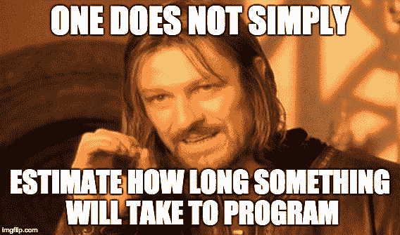
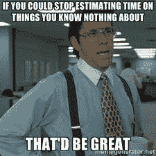
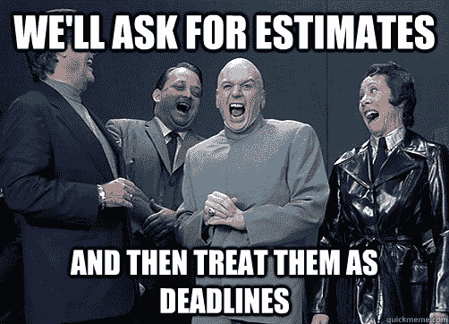
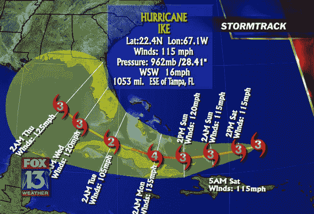

# 软件评估的 5 个法则|博客

> 原文：<http://ardalis.com/5-laws-of-software-estimates?utm_source=wanqu.co&utm_campaign=Wanqu+Daily&utm_medium=website>

评估通常是软件开发中不可避免的弊端。不幸的是，人们倾向于认为编写新软件就像盖房子或修理汽车一样，因此相关的承包商或机械师应该完全有能力在客户批准工作之前对要做的工作提供可靠的估计。建筑承包商和汽车修理工很容易做到这一点，他们通常使用已知的材料，以已知的方式建造已知的东西。你的汽车保险公司已经知道你可能需要修理汽车的任何东西(更不用说你的汽车型号的所有东西)需要多长时间和零件的价格。然而，对于定制软件，大量的系统都是从零开始构建的，通常它是如何组装的，它最终是如何工作的，以及当它完成时它到底应该做什么都是移动的目标。通常在旅程开始时，你不知道你将走哪条路，也不知道目的地，所以很难知道你什么时候会结束。

我意识到评估是定制软件开发中的一个难题，我当然不会声称自己是产生准确评估的最佳人选。然而，我已经确定了我认为普遍(或几乎)正确的估计的某些方面。在典型的互联网点击诱饵风格中，我将这些(软件)估算的“法则”称为(“你不会相信接下来会发生什么！”):

## 估算第一定律:估算是浪费

花在评估上的时间是没有花在交付价值上的时间。当涉及到开发人员必须完成工作的时间时，这是一个零和游戏——如果评估被紧急请求并打断了开发人员完成工作的时间，情况会更糟。如果你的开发人员平均每周花费 2-4 个小时在评估上，假设他们在其他时间都是高效的，那就是 5-10%的生产力损失。如果有问题的开发人员是兼职的，或者只能用他们工作周的一部分时间写软件，那就更糟了。

几年前，微软的一个部门能够将团队生产力提高 150%以上，而不需要任何新的资源或改变团队执行软件工程任务的方式(设计、编码、测试等)。主要的变化在于何时以及如何评估任务。具有讽刺意味的是，这种评估大部分是应管理层的要求进行的，为了寻求更大的透明度并希望深入了解如何提高团队的生产力，他们制定了要求频繁和及时评估的政策(新的请求需要在 48 小时内进行评估)。尽管这些估计仅仅是 rom(粗略的数量级)，但是它们需要的努力和它们造成的干扰破坏了团队的整体生产力。在[这份微软白皮书](http://images.itrevolution.cimg/kanbans/From_Worst_to_Best_in_9_Months_Final_1_3-aw.pdf)或大卫·安德森的书[看板](http://amzn.to/1P7qpI0)中了解更多关于这个项目的信息(在我的 Pluralsight 课程中了解更多关于看板的信息，[看板基础](https://www.pluralsight.com/courses/kanban-fundamentals))。

更多阅读:[估计都是废物](/estimates-are-waste/)

## 估算第二定律:估算是不可转让的

软件评估是不可替代的，主要是团队成员不可替代这一事实的推论。这意味着一个人的估计不能用来预测另一个人完成一项任务可能需要多长时间。

比不得不完成团队中另一个开发人员编写的评估更糟糕的是，由于销售人员的动机是赢得销售，而不是交付现实的评估，所以不得不遵守截止日期。

当评估者和实现者有相似的经验水平时，评估的可移植性会得到明显的提高，当他们在同一个团队中一起工作时，这种情况会更加明显。一些技术，如[规划扑克](https://en.wikipedia.org/wiki/Planning_poker)，在评估任务时会尝试引入整个团队的经验，确保评估不会错过只有一些团队成员知道的关键考虑事项，或者他们被编写得好像最快的编码员会被分配每个任务。这有助于产生更有可能准确的估计或估计范围(不确定性是估计的一部分——参见下面的第三定律),但它是通过将花费在估计上的时间乘以整个团队的规模来实现的。

阅读更多:[估价不可转让](/estimates-are-non-transferable/)

## 第三估计定律:估计是错误的

估计并不是承诺。这些都是猜测，一般来说，范围越大，估计的活动越遥远，潜在的误差就越大。这就是所谓的[不确定圆锥](http://www.construx.com/Thought_Leadership/Books/The_Cone_of_Uncertainty/)。

一个人试图预测的未来，可能的路径会延伸得更远

当估计错误时，没有人会感到惊讶；当他们是正确的 T2 时，他们应该感到惊讶。如果估算总是准确的，他们就会被称为*精确者*。

因为更小更直接的任务比更大或更长远的任务更能准确地估计，所以把任务分成小块是有意义的。理想情况下，用户可以与之交互和测试的单个子功能应该是衡量进展的单位，当这些被构建为[垂直切片](http://deviq.com/vertical-slices/)时，就有可能从客户或产品所有者那里获得关于新开发功能的快速反馈。[排队论](https://en.wikipedia.org/wiki/Queueing_theory)还表明，当系统中的工作规模较小且一致时，吞吐量会增加，这进一步支持将事情分解为合理的较小且一致的工作项。

工作越接近完成，对单个工作项和项目的估计就越准确。最准确的估计，就像最准确的天气预报一样，告诉你昨天发生了什么，而不是未来会发生什么。

更多阅读:[估计错了](/estimates-are-wrong/)

## 第四估计定律:估计是暂时的

估计是易腐的。它们的保质期相对较短。在项目开始之前，开发人员可能最初估计某个特性需要一周的时间来开发。项目进行了三个月，学习和决定了很多东西，同样的功能现在可能需要几个小时，或者一个月，或者可能由于优先级或方向的改变而从项目中完全删除。在任何情况下，估计值都是很小的，甚至可能是负值，因为自创建以来，已经发生了很多潜在的变化。

为了解决这个问题，一些团队和开发方法建议定期重新评估产品 backlog 中的所有项目。然而，虽然这确实解决了估算的易腐性，但它往往会加剧估算第一定律所确定的浪费。您是愿意让您的团队对同一个待定项进行六次评估，而实际上却从未开始工作，还是愿意他们每周都交付另一个特性？同样，请参阅上面引用的微软白皮书，了解重复评估对整个团队生产力的影响的经验证据。

我们从估算的第三定律中知道，估算越晚越准确(并且越接近实际完成的工作)。因此，合理地推迟估算的时间越长，做出估算的时候就可能越准确。这与精益软件开发的延迟决策直到最后负责任的时刻(T1)的原则紧密相关。评估也应该在最后负责任的时刻进行，以确保最高的准确性和最少的重复需求。在某些情况下,“估计”实际上可以在工作完成后进行*，这时它可以 100%准确(几乎零成本！).*

 *更多阅读:[估计是临时的](/estimates-are-temporary/)

## 第五估计定律:估计是必要的

尽管有前四个估计定律，但估计通常是必要的。在不了解成本和时间的情况下，企业无法决定是否构建软件。服务公司经常必须提供评估，作为他们构建应用程序或赢得项目的任何提议的一部分。仅仅因为上述定律是正确的，并不神奇地意味着估计可以消失( [#NoEstimates](https://twitter.com/hashtag/noestimates) )。然而，如果参与的每个人，从客户到项目经理到销售团队到开发人员，都了解定制软件评估的这些事实，那么就可以更好地管理期望和花费在评估上的时间。

值得记住的是古德哈特定律:“当一个衡量标准成为目标时，它就不再是一个好的衡量标准。”如果需要准确的估计，它们不应被用作承诺或最后期限。如果他们将被用作目标，他们将被修改(阅读下面的评论或在 [reddit](https://www.reddit.com/r/programming/comments/3u7w9g/the_5_laws_of_software_estimates/) 上的例子)。

更多阅读:[估计是必须的](/estimates-are-necessary/)

## 摘要

这些是我的软件评估的 5 个法则。它们适用于我参与的几乎每一个定制软件项目，从开发人员到架构师到销售人员再到客户。没有免费的午餐这样的东西，在使评估成为软件开发过程的核心之前，应该考虑评估的实际成本。一旦为要批准的项目进行了充分的高级评估和 ROI 分析，额外的工作评估可能不会像更快速地交付要完成的实际工作那样交付更多的价值。

像往常一样，呆伯特有一些关于估算主题的很棒的漫画:

最后，如果你已经读到这里，并且对软件开发感兴趣，你可能想看看 [2016 年软件工艺挂历，现在可以在亚马逊](http://amzn.to/1PZ0gtg)上买到。

[更新发布在介质](https://medium.com/@ardalis/the-5-laws-of-software-estimates-fd13af46000b#.siynvp7y5)上，meme gifs 较少。

如果你想要一个软件项目的可靠评估，并且你很难从你的开发人员/团队那里得到，请记住这句话(来源不明——我从 Ron Jeffries 那里听到的，但他没有注明):“你找不到知道这需要多长时间的人，但你可能会找到对你撒谎的人。”

本质上:你越难得到一个估计，当你最终得到时，它就越有可能不是非常准确。*