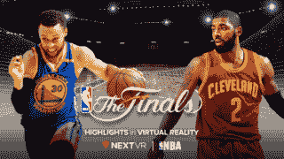
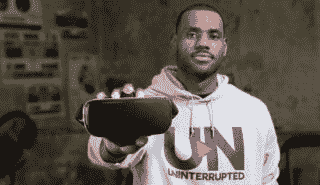
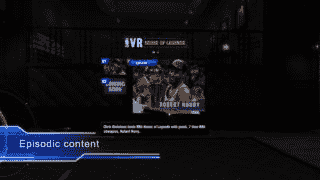
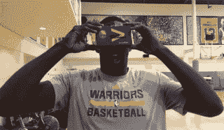
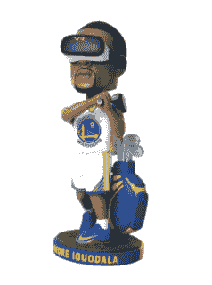

# NBA 虚拟现实战略的内幕

> 原文：<http://www.alistdaily.com/media/inside-the-nbas-virtual-reality-strategy/?utm_source=wanqu.co&utm_campaign=Wanqu+Daily&utm_medium=website>

除非你有美联储的备用钥匙，否则 NBA 球场边的座位几乎总是留给富人和名人。Jay-Z、Drake、Rihanna、Jack Nicholson、James Goldstein 和其余的百分之一的人每晚坐在沙发上提醒你这一点。

因为世界上大多数人的银行账户里没有逗号，他们将在标准的二维电视上连续第三次观看勇士队和骑士队争夺 NBA 总决赛，因为上个月的声明说你没有其他选择。

但是由于虚拟现实的身临其境，篮球迷现在只需戴上耳机，就可以进入斯蒂芬·库里的杀手跨界车或勒布朗·詹姆斯的货运列车的触手可及的 T2。

NBA 与 NextVR 合作，通过在每场总决赛比赛后发布点播 VR 集锦视频包，为球迷带来球场边的视角。是的，这当然和在那里不一样，但这是在[扣动座位上的扳机](http://www.mercurynews.com/2017/05/30/nba-finals-ticket-prices-in-oakland-still-going-up/)然后破产之前的下一个最好的事情。

宣布的交易是 NBA 不断增长的第一个赛季的一部分，因为他们继续在虚拟现实领域进行营销快攻。该联盟在 2015 年享受了一个分水岭时刻,当时他们成为了第一个通过虚拟现实直播的美国主要体育赛事，并从那时起一直在发展壮大。早在 10 月份篮球日历开始之前，NBA 天才联盟通过[获得](http://www.nextvr.com/nbanews)与 NextVR 的多年合作伙伴关系，每周在 VR 中直播一场比赛。

[NBA 全球](https://www.linkedin.com/in/jeff-marsilio-11215418/)[媒体](https://www.alistdaily.com/glossary/media/)副总裁杰夫·马西里奥告诉*alistadaily*这是营销策略的一部分，其核心是围绕虚拟现实直播发展，并通过高价值的场外富媒体内容带来篮球体验。

LeBron James

“我们对虚拟现实的进步以及它对球迷体验的乐观和兴奋印象深刻，”Marsilio 说，他负责 NBA 国内数字媒体业务的战略和业务发展。“去年夏天，我们做出决定，如果我们要继续在虚拟现实中推进 NBA 体验，我们需要做出更大的承诺。像我们一直在做的那样做一次性实验是不够的。我们将需要致力于与一个合作伙伴合作，并致力于游戏的时间表，以确保每次我们做一个游戏，体验都会变得更好。”

NBA 现在正在与 NextVR 合作制作这些游戏——总共 25 次播放，所有 30 支球队至少一次 NextVR 是一家直播和点播虚拟现实节目的供应商，专门从事音乐会、体育赛事和颁奖典礼，他们的目标是从 215 个国家和 49 种语言中发展这款游戏。在全球 1.55 亿游戏核心粉丝中，[不到百分之一的人真正在竞技场体验过游戏，因此融入技术变得更加必要，以保持粉丝的参与。](http://www.marketing-interactive.com/nbas-cmos-slam-dunk-marketing/)

“我们在 NextVR 上所做的确实是迈向未来的下一步，最终我有充分的理由相信每一款游戏都将在 VR 中制作。我不认为它会很快取代电视或手机。这将是添加剂——无论如何在短期内,”Marsilio 说。“这将是人们体验游戏的另一种方式。这将是最身临其境的方式。VR 会成为第三种选择。但我确实认为未来即将到来，而且很快就会到来。”

在今年的全明星周末之后——为此 NBA [发布了](https://www.facebook.com/nba/videos/10155085840198463/)一个 Oculus 的 360°视频体验——联盟向除中国以外的整个世界推出了虚拟现实。Marsilio 表示，国际扩张机会是他们开始在虚拟现实领域扎根的主要原因之一，他们已经开始看到参与。但现在评估他的表现还为时过早，因为虚拟现实仍处于萌芽阶段，他们知道要进入这一阶段。

> [NBA 全明星周末 VR 预告](https://www.facebook.com/nba/videos/10155085840198463/)
> 
> 在 Oculus Rift 和 Gear VR 上的虚拟现实中了解 NBA 全明星周末的幕后情况！在 Oculus Video 免费观看完整影片。rift:https://www . oculus . com/experiences/rift/926562347437041/Gear VR:https://www.oculus.com/experiences/gear-vr/838122072929207/
> 
> 由 NBA 于 2017 年 4 月 20 日星期四发布

他说:“与传统的 2D 数字内容相比，这些数字并不算多。”。“但它总是在进步。我们直接在社交媒体上关注粉丝的反应，反响非常好。人们对此非常兴奋，并对产品的发展方向感到满意。我们最关注的是用户参与内容的时间有多长，以及他们有多喜欢它。我们利用每一场比赛作为改善转播的机会，但我们也期待着休赛期，在那里我们可以做出更多的步骤变化，更重大的变化。”

该联盟将在整个夏天尝试新的想法、制作技巧和技术——比如让粉丝起床并在体验中走动[——以便重新推出更新的产品。他们也将](https://www.sporttechie.com/future-nba-fans-can-watch-games-virtually-friends-physically-walk-around-arena-vr/)[寻求在 2K 联赛](https://www.alistdaily.com/digital/inside-nbas-2k-sports-esports-partnership/)中利用虚拟现实与电子竞技——但这仍处于探索阶段。

“VR 的根源肯定是在视频游戏中，或者至少有很多视频游戏的兴趣和与 VR 的重叠，有很多与视频游戏观众和篮球观众的重叠。所以异花授粉有很大的潜力，”马西里奥说。“虚拟现实的圣杯不仅仅是向人们展示一些东西，而是给他们与它互动的能力。我们很有兴趣看看它会走向何方。”

*House of Legends*

与此同时，NBA 已经获得了合作伙伴关系和内容交易，以进一步加强他们在该领域的营销实力。今年早些时候，他们与谷歌和 Digital Domain 合作推出了《传奇之家》 ，这是一档虚拟现实脱口秀节目，通过给粉丝一种[的存在感](https://www.alistdaily.com/glossary/presence/)和进入 NBA 主题阁楼的机会，独特地重塑了形式。三月份，他们[宣布](Enhanced%20training%20for%20referees%20through%20technology,%20including%20virtual%20reality.)将通过虚拟现实技术训练裁判。去年，他们与 Oculus 合作制作了一部 NBA 总决赛纪录片。

“VR 内外的品牌都带着参与的兴趣来找我们。这是我们想成为虚拟现实领域领导者的原因之一。我们觉得我们可以帮助塑造行业的方向——当然是用我们的篮球经验——但真正的虚拟现实是完整的。“希望这将吸引更多的兴趣，更多的入境兴趣，它真的做到了。如果你愿意，我们可以从几个不同的角度来看虚拟现实。对我们来说，第一个也是最重要的是游戏本身。这就是我们的粉丝所要求的，也是 NextVR 合作伙伴关系如此重要的原因。在虚拟现实中讲故事可能会引人注目。我们还在讨论，随着 Oculus 的发展，我们将提供更多讲故事的体验。”

Warriors star Draymond Green

除了联盟和 NextVR 之外，像英特尔[这样的公司正在用 Voke](https://newsroom.intel.com/chip-shots/intel-expands-partnership-with-nba/?cid=em-elq-10819) 推动实况虚拟现实[，这是对他们](https://www.alistdaily.com/media/voke-reveals-nfl-virtual-reality-game-plan/)[收购 3D 技术](https://newsroom.intel.com/editorials/intel-targets-immersive-sports-opportunity/)和[与勒布朗詹姆斯的营销交易](http://www.espn.com.au/nba/story/_/id/19036468/lebron-james-partners-intel-appear-final-four-advertisement)的补充，以展示他们的 360 度回放技术。

巧合的是，总决赛参与者通过在营销策略中利用 VR，一直处于前沿技术的最前沿。你知道去年虚拟现实的使用在帮助勇士队登陆凯文·杜兰特的过程中发挥了作用吗？作为宣传日历的一部分，金州勇士队还[赠送了](http://www.nba.com/warriors/warriors-and-accenture-enhance-fan-experience-through-fannovate/)纸板虚拟现实观众和一个安德烈·伊瓜达拉和他的摇头娃娃[戴着虚拟现实耳机](http://www.sfchronicle.com/business/article/Warriors-showcase-VR-with-Andre-Iguodala-9806938.php)。勇士队的共同所有者彼得·古伯也是 NextVR 的投资者。

另一方面，骑士队之前已经与百威啤酒(Budweiser)合作开发虚拟现实体验，勒布朗凭借一部 12 分钟、 [Oculus 制作的电影](https://www.theverge.com/2015/12/25/10666020/lebron-james-virtual-reality-film-oculus-samsung-gear-vr)以及[处理三星虚拟现实](https://www.alistdaily.com/media/lebron-james-turning-entertainment-tour-de-force-into-hollywood-empire/)和 360 度*不间断*原创系列而跃入该领域。

“NBA 球员热爱虚拟现实。我们展示的玩家可能是最大的粉丝，”马西里奥说。“但是随着技术的发展，我们中的一些人变得更加愤世嫉俗。因此，我们对虚拟现实的未来更加谨慎。”

马西里奥提到的一些愤世嫉俗者包括查尔斯·巴克利，他告诉阿利斯泰尔说他不喜欢虚拟现实。

“听着伙计，我们需要担心我们的产品(在地板上)。我不想在虚拟现实里看。我不想看。第一，在我看来，这很奇怪。但有些人可能会喜欢，”巴克利说。“我没有使用很多技术。这可能更适合沙克，因为他使用了很多技术。我知道他看起来不聪明，但是他用了很多技术。。。。我是真正从梦之队开始的游戏成长的一部分。令人惊讶的是这些人在世界各地如此受欢迎。游戏没问题。游戏总会在某个时候成长。最重要的是产品。”

达拉斯小牛队的老板马克·库班也表达了同样的观点。[在去年接受*alistadaily*](https://www.alistdaily.com/strategy/mark-cubans-insights-future-vr/)采访时，*鲨鱼池*的明星也投资了该领域，他说“【虚拟现实】对我们的业务没有任何影响。整个“前排体验”不起作用，也不会起作用。我宁愿在比赛中坐在第一排，也不愿观看虚拟现实直播，我认为这种情况在很多很多年内都不会改变。。。。摄像机离能够以一种有意义的方式支持现场(节目)还有很长的路要走。”

Marsilio 表示，将会有一个关键时刻，每个人要么都有一个虚拟现实耳机，要么都知道有人有，因此可以尝试一下——这将是大规模采用的转折点的开始。

“虚拟现实的营销很棘手，因为如果不真正给某人一个虚拟现实耳机，很难描述或展示什么是虚拟现实体验。所以，这有点像营销和信息传递的挑战，”他说。“我们都对这种潜力感到非常兴奋，关键是要把它做好。”

*在推特上关注马努克·阿科皮扬*[*@马努克 _ 阿科皮扬*](https://twitter.com/Manouk_Akopyan)