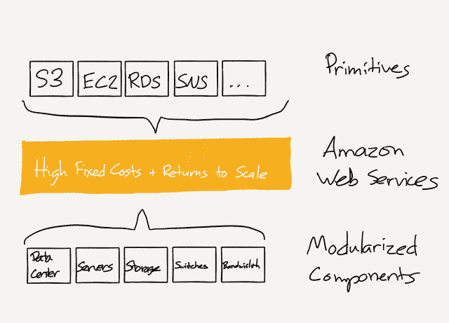
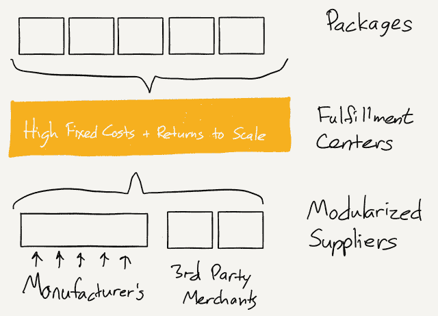
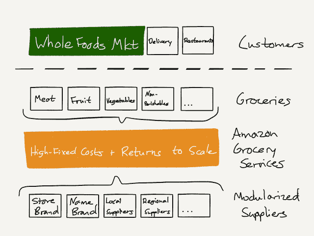

# 亚马逊的新客户——本·汤普森的战略

> 原文：<https://stratechery.com/2017/amazons-new-customer/?utm_source=wanqu.co&utm_campaign=Wanqu+Daily&utm_medium=website>

早在 2006 年，当 iPhone 还只是一个谣言时，Palm 的首席执行官 Ed Colligan 被问及他是否担心:

> “我们已经在这里学习和奋斗了几年，弄清楚如何制造一款像样的手机，”他说。“PC 行业的人不会就这么算出来的。他们不会就这么走进来。”如果史蒂夫·乔布斯的公司真的向市场推出了 iPod 手机会怎样？嗯，它可能会使用 WiFi 技术，可以通过苹果商店分销，而不是像威瑞森或 Cingular 这样的运营商，Colligan 推断。

亚马逊宣布以 137 亿美元收购全食超市后，我想起了这句话。毕竟，直到两年前的 T2，全食公司的创始人兼首席执行官约翰·麦基才预言杂货业将会是亚马逊的滑铁卢。尽管科利根的预测要糟糕得多——苹果只是让 Palm 公司灰飞烟灭，无法与之竞争——但麦基不得不称亚马逊的创始人兼首席执行官杰夫·贝索斯为“道德游戏的拿破仑，老板”。

然而，相似之处更深:科里根和麦基都犯了同样的分析错误:他们误解了对手的目标、战略和战术。在 Colligan 和 iPhone 的例子中，这一点特别容易理解:苹果的目标不是制造一部手机，而是制造一台更加个人化的电脑。他们的策略不是给手机增加功能，而是[把手机简化成一个应用](https://stratechery.com/2013/obsoletive/)；他们的策略不是复制运营商，而是[利用他们与客户的关系](https://stratechery.com/2014/apple-creates-leverage-future-apple-pay/)来获得他们的让步。

麦基的误解更微妙，也更深刻:虽然苹果手机可能是有史以来最成功的产品，但亚马逊和杰夫·贝索斯的目标是成为有史以来最具统治地位的公司。从那里开始，这次购买有各种各样的意义。

#### 亚马逊的目标

如果你不了解一个公司的目标，你怎么知道它的战略和战术会是什么？不幸的是，许多公司，尤其是最雄心勃勃的公司，并不像你希望的那样明确。以亚马逊为例，该公司在 1997 年的 S-1 中声明:

> 亚马逊的目标是成为领先的基于信息的产品和服务的在线零售商，最初的重点是书籍。

即使你意识到书籍只是第一步这一事实(当时大多数人都没有意识到)，也很难想象 Amazon.com 很快会变得无所不包；几年内，亚马逊更新的使命宣言[反映了该公司电子商务雄心的现实](https://web.archive.org/web/20030804040525/http://phx.corporate-ir.net/phoenix.zhtml?c=97664&p=irol-faq):

> 我们的愿景是成为地球上最以客户为中心的公司；建立一个地方，让人们可以找到并发现他们可能想在网上购买的任何东西。

“他们可能想在网上购买的任何东西”是相当宽泛的；几年后，亚马逊网络服务的出现表明它还不够广泛，几年前，亚马逊将其既定目标简化为第一条:*我们寻求成为地球上最以客户为中心的公司*。没有更多的界限，我不认为这是一个意外。正如我[几个月前在播客上所说](https://twitter.com/tommartin_ky/status/834799885975175170)，亚马逊的目标是从所有经济活动中分一杯羹。

这就是麦基所犯的错误:虽然他正确地理解亚马逊将尽一切可能在食品杂货领域获胜——这一类别占消费者支出的 20%——但他认为这一努力将仅限于电子商务。然而，电子商务是一种策略；的确，当谈到亚马逊目前的做法时，它甚至没有上升到战略。

#### 亚马逊的战略

正如你所料，考虑到像“从所有经济活动中抽成”这样大胆的目标，亚马逊有几种不同的策略。企业的关键是 AWS:如果在公共云上建立一个支持互联网的企业更好，如果所有的企业很快都将成为支持互联网的企业，那么 AWS 就很适合从所有的商业活动中分一杯羹。

在消费者方面，关键是质数。虽然亚马逊长期以来一直在零售领域奉行主导战略，即优越的成本(T2)和优越的选择(T3)，但仅靠这些因素很难建立可持续的差异化。毕竟，另一家零售商只需点击一下鼠标。

然而，这是 Prime 的优点:由于它的可靠性和便利性(两天发货，有时更快！)，再加上考虑沉没成本时人的易错性(你已经支付了 99 美元！)，为什么还要去别的地方找呢？凭借 Prime，亚马逊围绕消费品建立了一条强大的护城河，它不仅仅依赖于最低价格，因为 Prime 客户甚至懒得去核实。

然而，这就是为什么杂货是一个战略漏洞:它不仅是最大的零售类别，也是其他零售商获得 Prime 会员并提醒他们有替代品的最持久的机会。这就是亚马逊在这个领域如此坚定的原因:AmazonFresh 于十年前推出，与亚马逊的其他实验不同，它继续获得资金，以及其他传闻中的举措，如便利店和杂货店。亚马逊还没有找到正确的策略。

#### 亚马逊的战术

要理解为什么食品杂货如此具有挑战性，看看它们与亚马逊的第一款产品图书有何不同:

*   书籍的数量远远超过实体店，这意味着电子商务网站可以在选择上胜出；相比之下，就没有那么多的杂货了(一个典型的杂货店会有 30，000 到 50，000 个 SKU)
*   当你订购一本书时，你确切地知道你得到的是什么:亚马逊的一本书和当地书店的一本书是一样的；另一方面，食品杂货的质量不仅会因店而异，而且会因日而异，尤其是易腐商品
*   图书可以无限期存放在集中仓库；易腐食品只能储存有限的时间，并且在运输过程中质量会下降

麦基当然明白，这意味着亚马逊生鲜相对于实体杂货店也处于成本劣势:为了保持竞争力，亚马逊生鲜需要储备大量易腐商品；然而，只要亚马逊生鲜没有达到有意义的规模，大量易腐商品就会变质。此外，鉴于食品杂货固有的地方性，规模需要在城市而不是在国家的基础上实现。

食品杂货是一个完全不同的问题，需要一个完全不同的解决方案；然而，这项交易如此出色的地方在于，它以一种基本上亚马逊式的方式解决了这个问题。

#### 第一个也是最好的顾客

去年在《亚马逊税》中，我解释了公司的不同部门——比如 AWS 和 Prime——在概念层面上比你想象的更相似，而且这些概念根植于亚马逊本身的结构中。最好的例子是 AWS，它以“原语”的形式提供服务器功能，为开发人员提供最大的灵活性来构建: [1](#fn1-2634 "To be clear, AWS was not about selling extra capacity; it was new capability, and Amazon itself has slowly transitioned over time (as I understand it Amazon.com is still a hybrid) ")

> “原语”模型模块化了亚马逊的基础设施，有效地将原始数据中心组件转化为存储、计算、数据库等。这不仅可以由 Amazon 的内部团队临时使用，也可以由外部开发人员使用:
> 
> [T2】](https://stratechery.com/2016/the-amazon-tax/)
> 
> 中间的这个 AWS 层有几个关键特征:
> 
> *   AWS 有巨大的固定成本，但从规模经济中受益匪浅
> *   构建 AWS 的成本是合理的，因为亚马逊的电子商务业务是第一个也是最好的客户
> *   AWS 对“原语”的关注意味着它可以按原样出售给亚马逊以外的开发者，增加规模回报，并进一步深化 AWS 的护城河
> 
> 最后这一点是双赢的:开发者将可以获得企业级的计算资源，而无需预先投资；与此同时，亚马逊将获得更大规模的一系列产品，因为它们将是第一个也是最好的客户。

正如我在那篇文章中详述的，这个完全相同的框架适用于 Amazon.com:

> Prime 是一种超级体验，价格和选择都很优越，这也是一种规模效应。结果是这样一个企业:
> 
> [T2】](https://stratechery.com/2016/the-amazon-tax/)
> 
> 当然，这与 AWS 的结构相同，并且具有相似的特征:
> 
> *   电子商务分销有巨大的固定成本，但从规模经济中获益巨大
> *   扩建亚马逊履约中心的成本是合理的，因为第一个也是最好的客户是亚马逊的电子商务业务
> *   最后一点可能看起来很奇怪，但事实上亚马逊 40%的销售额(单位销售额)是由第三方商家售出的；大多数这些商家利用亚马逊履行，这意味着他们的商品存储在亚马逊的履行中心，并由 Prime 覆盖。这增加了亚马逊履行中心的规模回报，增加了 Prime 的价值，并加深了亚马逊的护城河

正如我在那篇文章中指出的，你可以看到物流领域类似努力的轮廓:亚马逊正在建立一个以自己为第一和最佳客户的配送网络；从长远来看，物流服务将作为一个平台被公开似乎是显而易见的。

然而，这正是亚马逊的杂货努力所缺少的:*没有第一最好的顾客*。如果没有这一点，再加上食品杂货的种种限制，亚马逊生鲜注定永远是次等规模的。

#### 全食超市:顾客，不是零售商

这是理解购买全食超市的关键:从外面看，亚马逊似乎是在收购一家零售商。然而，事实是，亚马逊正在购买一个*客户*——第一个也是最好的客户，将立即使其杂货努力规模化。

今天，所有进入全食超市的物流都是为了在实体货架上进货:整个运作是一体化的。我预计亚马逊在未来几年要做的是将全食超市的供应链转变为一个基于基本要素的服务架构:肉类、水果、蔬菜、烘焙食品、不易腐烂的食品(全食超市对商店品牌的过度依赖，我确信这对亚马逊非常有吸引力)。然而，让这笔巨额投资物有所值的是，将会有一个有保证的客户:全食超市。

[T2】](https://i0.wp.com/stratechery.com/wp-content/uploads/2017/06/stratechery-Year-One-270.png?ssl=1)

从长远来看，实体杂货店将只是亚马逊杂货服务的客户之一:显然，送货上门服务将是另一个客户，而且这将比 Instacart 这样的公司试图在全食超市目前的综合模式基础上更有效率。

不过，我怀疑亚马逊的野心不止于此:亚马逊杂货服务也将处于有利地位，开始供应餐馆，让亚马逊进入另一大块经济活动。这是 AWS 模式，也就是说这是亚马逊模式，但像 AWS 一样，盈利的关键是拥有一个最好的客户，能够利用大量必要的投资来建立服务。

* * *

我在开始时说过，麦基误解了亚马逊的目标、战略和战术，虽然这是事实，但更大的错误是误解了亚马逊本身:与全食不同，亚马逊没有成为杂货商的特别愿望，与传统智慧相反，该公司甚至不是零售商。亚马逊的核心是一个服务提供商，通过规模化来实现和保护。

事实上，从滑铁卢是一个有效类比的角度来看，亚马逊更类似于大英帝国，现在跨越经济各个方面的障碍少了一个。

### *相关*