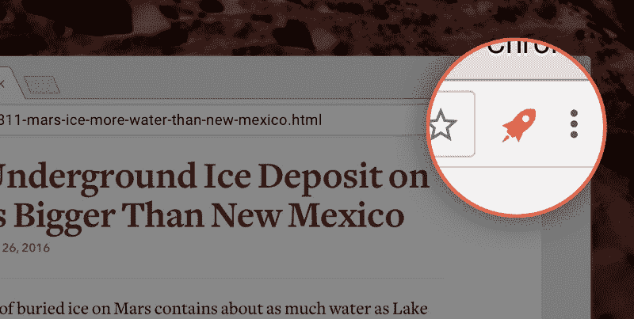

# 服务 3900 万个请求，每月 370 美元— Postlight —数字战略、设计和工程

> 原文：<https://trackchanges.postlight.com/serving-39-million-requests-for-370-month-or-how-we-reduced-our-hosting-costs-by-two-orders-of-edc30a9a88cd?utm_source=wanqu.co&utm_campaign=Wanqu+Daily&utm_medium=website>

当我去年作为一名工程师加入 Postlight 时，我的第一个任务是一个大任务:重写可读性解析器 API。对于那些不熟悉可读性解析器的人来说，它是驱动流行的可读性稍后再阅读应用程序的 API，以及 web 上的许多其他服务和应用程序。解析器 API 接受互联网上任何文章的链接，然后返回该文章的结构化表示形式— [从混乱的网络中提取内容](https://trackchanges.postlight.com/extracting-content-from-the-chaos-of-the-web-introducing-the-mercury-web-parser-e920a1db7f86)。(可读性和 Postlight 有什么关系？那是另外一个故事。)

重写的原因有三:

1.  随着时间的推移，开创性的可读性 API 已经变得陈旧和脆弱。解析的结果存储在一个数据库中，这意味着这个数据库已经增长到可以存储大量的互联网数据。几乎不可能执行稍微复杂的查询，这意味着我们对 API 的情况知之甚少。这也意味着，如果原始文章发生变化，API 的响应将不包含更新的结果。
2.  该服务最初是由不再在公司工作的人编写和维护的，像我这样的新工程师缺乏以任何重要方式更新或修复 API 所必需的领域知识。
3.  最后，也可能是最重要的，免费的可读性 API 每月花费公司大约 10，000 美元。

重写有几个目标:

1.  生成一个功能相当的库，它将返回与原始库相同或更好的结果。
2.  用一种 Postlight 工程师可以很容易做出贡献的语言写一些经过充分测试和可扩展的东西。
3.  减少每月 10，000 美元的成本。

对于语言，我们选择了 JavaScript。选择 JavaScript 意味着我们的新库在理论上可以在服务器和浏览器上运行。Postlight 的每个工程师都至少有一些网络经验，所以选择 JavaScript 也意味着几乎每个人都可以为 Mercury 做贡献。(可读性是用 Python 编写的，尽管许多 Postlight 工程师编写了漂亮的 Python，但它缺乏浏览器内的好处。)

最后，我们关注成本，这里的答案很简单。为了大幅降低我们的成本，我们选择了运行在 [AWS Lambda](https://aws.amazon.com/lambda/) 和 [API Gateway](https://aws.amazon.com/api-gateway/) 上的无服务器架构，使用[无服务器框架](http://serverless.com/)进行构建和部署。

去年十月，我们[发布了 Mercury Web 解析器](https://trackchanges.postlight.com/extracting-content-from-the-chaos-of-the-web-introducing-the-mercury-web-parser-e920a1db7f86)，结果令人震惊。我们的成本立即下降，今天，Mercury Web Parser 每月的运营成本约为 400 美元——大约比可读性 API 的运营成本低两个数量级。(当然，您的里程和需求会有所不同。我们以前的成本还包括数据库费用，在我们的无服务器设置中，我们选择放弃数据库费用，而是选择短期缓存。)

下面是我们如何做到这一点的分析。

### 第一步:不使用服务器

假设您可以在无服务器环境中满足您的服务需求，采用无服务器架构将显著降低大多数 API 的成本。我再说一遍:**简单地迁移到一个无服务器的环境对降低托管成本有着最大的影响。我们完成转换后，艰难的工作就完成了。我们极其昂贵的运营成本立刻缩水了两个数量级。但是，即使在最初的无服务器切换之后，仍然有削减成本的空间。**

如果你没有 Lambda 的任何使用经验，它的定价[会像这样分解](https://aws.amazon.com/lambda/pricing/):

> Lambda 免费层包括每月 100 万个免费请求和每月 400，000 GB 秒的计算时间。您为 Lambda 函数选择的内存大小决定了它们可以在自由层中运行多长时间。Lambda 免费层不会在您的 12 个月 AWS 免费层期限结束时自动过期，而是无限期提供给现有和新的 AWS 客户。

当你想优化 Lambda 的成本时，从上面可以看出最重要的一点(除了一个令人难以置信的事实，即一个每月短时间运行少于 100 万次的函数是无限免费的)是分配给你的函数的内存大小决定了运行你的函数的成本。该成本随着执行您的功能所需的时间成比例地增加或减少。

(注意:GB 秒是对分配给函数的每 GB 内存的函数执行时间的计算。例如，如果您调用函数一次，持续 3 秒钟，并且您已经为该函数分配了 1GB，那么您已经执行了 3GB 秒的计算时间。如果您将分配空间减少到 512MB，执行时间保持 3 秒，那么您的计算时间将减少一半，为 1.5GB 秒。)

这意味着你可以通过加快执行函数的时间，降低内存分配，或者两者兼而有之，来降低 Lambda 的开销。由于我们已经对自己的执行速度感觉良好，内存显然是第一步。

### 第二步:降低内存分配

Lambda 函数的内存分配范围从 128MB 到 1536MB。降低 Lambda 成本的过程很简单。递增地[减少你的无服务器配置](https://serverless.com/framework/docs/providers/aws/guide/functions#configuration)中的 `[memorySize](https://serverless.com/framework/docs/providers/aws/guide/functions#configuration)` [分配(如果你没有使用无服务器，你可以直接在你的 Lambda 仪表板中这样做)，部署，然后留意你的函数的延迟(这需要为你的函数设置一个 CloudWatch 仪表板，这是另一篇文章的主题)。如果我们的函数的延迟在几个小时后，然后一天，然后一个星期后没有明显的变化，我们会保持我们的变化，享受降低的成本。](https://serverless.com/framework/docs/providers/aws/guide/functions#configuration)

记住，每次你将函数的内存分配减半，你的 Lambda 开销也大致减半。例如，根据官方的 [Lambda 定价计算器](https://s3.amazonaws.com/lambda-tools/pricing-calculator.html)，100 万次调用(不包括免费层)，在 1GB 内存下平均运行 2 秒(不算快，也不算特别慢)，将花费 33.54 美元。如果是 512 兆，价格是 16.87 美元。256MB 相当于 8.54 美元。

对于 Mercury Web 解析器，我们目前在 256MB 上运行我们的函数，一切正常。

### 步骤 3:缓存 API 网关响应

如果对您的服务有意义，在 API Gateway 中缓存响应可以显著减少 Lambda 调用。例如，Mercury 用户经常要求相同文章的结果。我们每月支付大约 14 美元购买一个 0.5GB 的 API 网关缓存和 1 小时的 TTL。上个月，我们的 API 请求中有 52%(39 毫米中的 20.3 毫米)是由缓存提供的，这意味着不到一半(18.7 毫米请求)需要调用我们的 Lambda 函数。这 14 美元为我们每月节省了大约 240 美元的 Lambda 成本。

### 关于标度的一点注记

这可能并不明显，但是除了节省成本之外，无服务器架构还可以大大减少维护、配置和复杂性。我们的 API 可以使用相同的配置、缓存和部署方法为 1，000 个或 100，000，000 个请求提供服务。

此外，随着服务向外扩展以处理更多请求，成本不一定会增加那么多。请记住，超过一半的 API 请求可以从我们的缓存中得到服务。到目前为止，这个百分比只是随着 API 的使用越来越多而增加。

### 最终成本细目

经过上述所有优化后，我们当前运行 Mercury Web Parser API 的成本如下所示:

**API 网关:**

*   服务请求的成本: **$137** (收到的每百万个 API 调用 3.50 美元)
*   缓存: **$14**
*   传出数据: **$42** (以 0.09 美元/GB 的费率计算)

**λ**

*   请求成本: **$3**
*   计算成本: **$174** (平均每次调用 2.37 秒，内存分配为 256MB)

**总成本:370 美元**

### 看好无服务器

我们对无服务器架构的体验(特别是在 AWS 中使用无服务器框架)是令人难以置信的。我们已经将 Lambda 用于从解析 web 到编写 Slack 机器人的所有事情；从并行批量调整数十万张照片的大小到批量转码数十万个视频。

我们用得越多，我们就越有信心用无服务器的方法来解决许多以前需要服务器的问题。到目前为止，Mercury Web Parser 和它所支持的工具是对我们尽可能不使用服务器的决定的最好验证。

> 旁注:如果你想尝试一下无服务器，但又不想花一个小时来配置你的环境，试试我们的[无服务器样板](https://github.com/postlight/serverless-babel-starter)，它预装了现代的 JavaScript transpiling，一个明智的 linter，以及用[更漂亮的](https://github.com/prettier/prettier)来格式化代码。

Mercury Reader 是 Chrome 的扩展，提供更清晰的阅读体验

### 野外的 Mercury Web 解析器

在 Postlight，我们使用了 Mercury Web 解析器来增强:

*   水星 AMP 转换器，一个用一行代码就能让任何网站 Google AMP 就绪的工具。
*   [Mercury Reader](https://mercury.postlight.com/reader/) ，一个超过 100 万用户使用的 Chrome 扩展，只需点击一个按钮，就可以从文章中删除广告和干扰，只留下文本和图像，以便在任何网站上都能看到美丽的阅读视图。
*   彭博镜头(Chrome Lens)，一个 Chrome 扩展和 iOS 共享表单应用程序，为网络上的任何文章提供相关新闻、公司数据和个人信息。

我们还支持成千上万的开发人员，他们每天使用 Mercury 从网上的任何文章中提取结构化内容。正如我在开始时提到的，所有这些总计每月 3900 万个请求，而我们只需花费 370 美元。

每 100 万次请求只需不到 10 美元，而且可以轻松扩展。我们对这些数字非常满意。