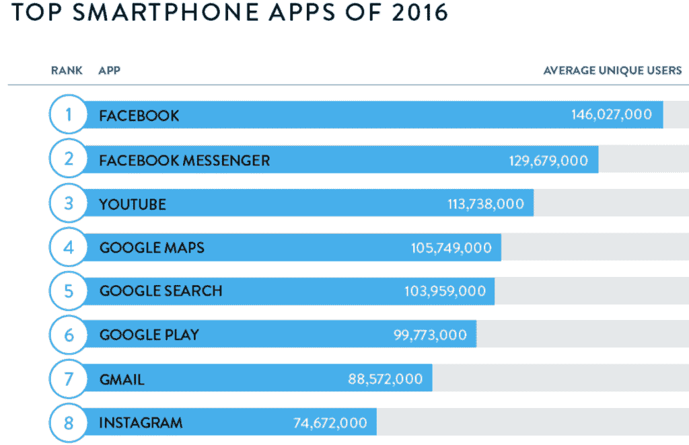
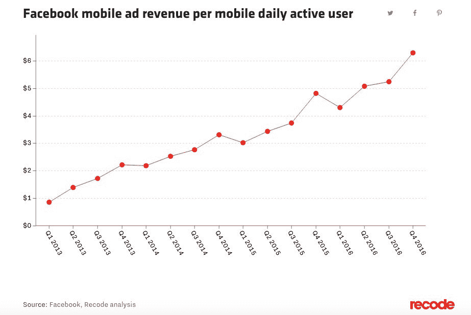
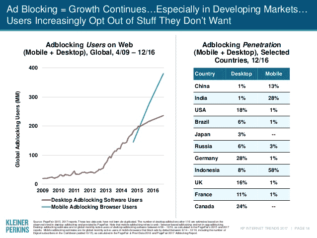
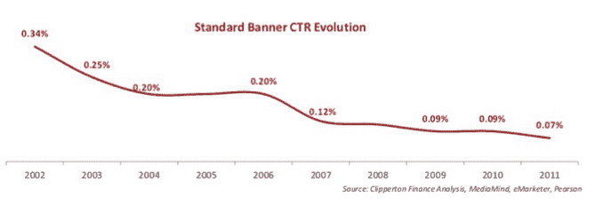
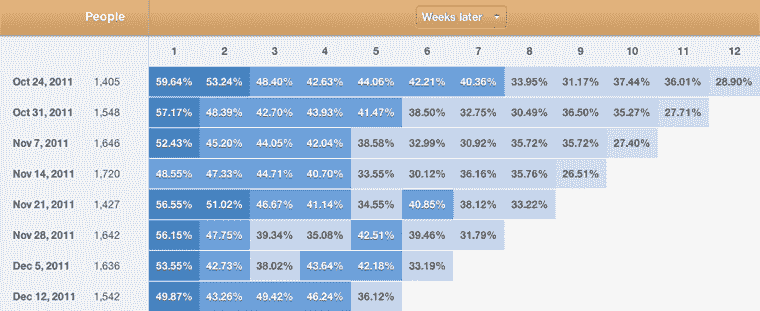
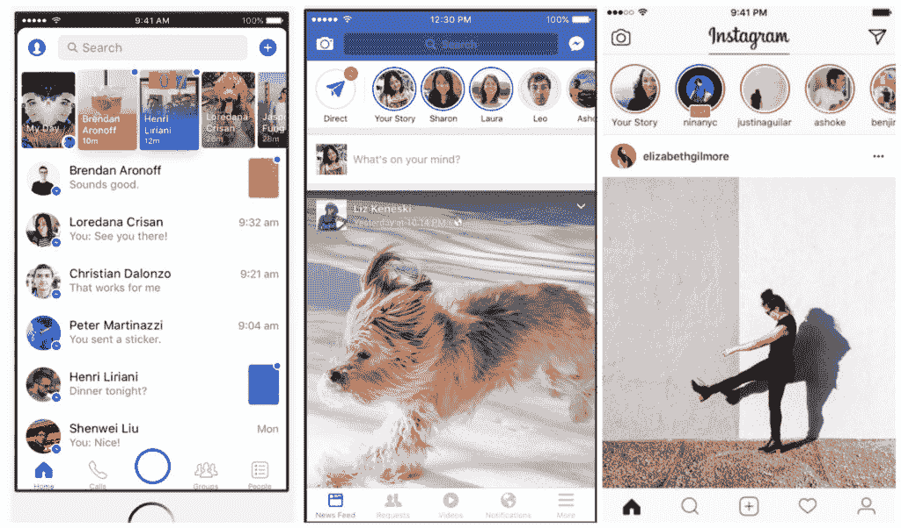

# 安德鲁森的激烈竞争、整合和饱和使得增长变得越来越困难

> 原文：<http://andrewchen.co/growth-is-getting-hard/?utm_source=wanqu.co&utm_campaign=Wanqu+Daily&utm_medium=website>

周期的终结
去年写得最好的论文之一是埃拉德·吉尔的《周期的终结》[？](http://blog.eladgil.com/2016/07/end-of-cycle.html)——参考我们最近的 2007-2017 年移动和网络软件运行，以及对投资、创业和企业家的影响。尽管他没有直接谈到这一点，但技术周期的结束对推出新产品、扩大现有产品类别具有重大意义，原因很简单:

开发新产品或者将现有产品转向新市场变得越来越困难

出现上述情况的原因是，目前有多种趋势阻碍了新产品的增长。这些趋势是由最大的玩家——谷歌/脸书等——以及设计/项目管理/数据/增长领域从业者的显著提升所推动的。

在这篇文章中，我们将探讨几个趋势，包括以下内容:

1.  移动平台整合
2.  付费频道的竞争
3.  横幅盲=糟糕的点击率
4.  高级工具
5.  更聪明、更快速的竞争对手
6.  与无聊竞争比与谷歌/脸书竞争更容易

这些趋势非常强大，对于理解为什么企业家/投资者突然开始进入许多新领域(基因组学、垂直起降汽车、加密货币、自治、物联网等)以寻找新机会至关重要。毕竟，如果你不能在现有市场发展，你很快就需要进入新的市场，正如 Elad 所描述的:

> 在一个周期的末尾，技术市场经常表现出的一个迹象是，获得融资的初创公司类型迅速多样化。例如，随着 90 年代末的互联网热潮(谷歌，雅虎！在 2000 年初和 2001 年，投资突然转向 P2P 和移动领域(在移动领域准备就绪之前)，然后在 2002 年至 2003 年，人们开始关注清洁技术、纳米技术等——从创业和投资回报的角度来看，这些行业显然最终都失败了。

纳米技术、清洁技术等是上一个周期，现在我们在谈论下一个周期。

**#1 移动平台整合** 与网络相比，新的谷歌/苹果应用程序双头垄断更集中、更封闭，也更不丰富(从增长的角度来看)——这意味着移动应用程序更加停滞不前，更难进入。应用程序商店的功能，如排名榜、“基本”应用程序包、经过编辑的“特色应用程序”部分，都有助于推动赢家通吃的移动生态系统。

难怪应用商店排名多年来一直僵化。脸书和谷歌现在控制了移动生态系统前 10 名应用的大部分:

*资料来源:尼尔森，2016 年 12 月*

如果你正在引入一个新的应用程序——无论是拆分一个更复杂的应用程序，还是启动一个新的创业公司——你如何打入这个市场？没有太多的有机机会。付费获取渠道也开始饱和。

**#2 付费频道的竞争** 付费收购是仍然可用的关键渠道之一，如果你能找到合适的高投资回报率的未开发观众群的话。这只有在价格没有被抬高，并且你没有面对太多相同广告库存的竞争时才有效。不幸的是，事实并非如此。

例如，让我们来看看脸书在过去几年中增加其每 DAU 收入的一些动态:

当然，这是由许多因素驱动的——相关性、针对性、广告单元参与度等。–但这也是因为脸书广告的竞争越来越激烈，广告客户数量的快速增长以及每用户收入的增加就是证明。2017 年，脸书平台上的广告客户超过 500 万，高于去年第三季度的 400 万和 2015 年的 200 万。在 Q1 2017 年财报电话会议上，脸书告诉投资者，尽管 Q1 2017 年的收益较 2016 年有大幅增长，但预计广告收入将接近饱和点。它目前有 20 亿用户，用户年增长率为 17%，它增加更多库存的能力取决于增加其用户群，或增加用户花在脸书上的时间。

**#3 横幅盲=糟糕的点击率**
此外，每个人都在变得更聪明，包括消费者。今天，大多数邀请系统不再像 10 年前那样具有新奇的价值或功效(Dropbox 的 give/get 在推出时是新奇的)，消费者的“横幅失明”远远超出了实际的展示广告，包括推荐系统和病毒式项目。

在玛丽·米克尔最新的《互联网趋势报告》中，她报告说，多达 1/3 的国家正在使用广告屏蔽，我们很快就会有 6 亿互联网用户群*无法通过广告接触到*:

这只是我几年前写的 2017 年版的垃圾点击率定律，其中我展示了一些统计数据，表明电子邮件营销的打开率正在下降:

…传统横幅广告的点击率似乎逐渐接近于零:

这些趋势令人不安，意味着这些渠道的每用户参与度越来越低，我们还没有找到令人惊叹的新渠道来取代它们。

**#4 高级工具——创造公平的竞争环境** 在广告变得越来越拥挤的同时，Mixpanel、Leanplum、Optimizely 等工具也越来越广泛地可用和被采用，这些工具缩小了公司在数据驱动方面的差距。

十年前，我们习惯于看注册用户总数。群组分析是一种复杂的方法，我们也没有 MAU、DAU 或其他更精细的指标。Mixpanel 的一个杀手锏是，它使得理解基于群组的保持变得很容易。过去，工程师、数据科学家需要真正的投入，并且知道如何能够创建这样的简单图表:

现在，它几乎是交钥匙工程。你可以从 Mixpanel(和其他人)那里得到这个图表。)几乎是免费的，只要你实现了你的分析跟踪。

在 B2B 领域，我们也看到了同样的现象。外呼曾经是辛苦的，手工的。今天，有许多销售工具使外向更容易获得(Mixmax、Outreach、insidesales.com 等)，这些工具自动化了部分过程，但也产生了更多的噪音和竞争。以前更需要人工、更高摩擦的任务，现在自动化了，更容易了，这就导致更多的人跳了进来。

结果就是让大家都变得更好。您和您的所有竞争对手都了解您/他们的获取和保留瓶颈。每个人都有平等的、数据驱动的机会来提高 LTV，因此可以在广告上花更多的钱。

**#5 更聪明更快速的竞争对手**
过去，创业公司可以指望他们的竞争对手又大又笨又慢。不再是了。我们都变得越来越聪明，越来越快，包括你的竞争对手。过去，你可以等上几年，竞争对手才会做出回应。现在，全世界的 Facebooks、Hubspots 和 Salesforces 都可以而且将会马上模仿你。

最著名的是，我们已经在他们的 Messenger、Instagram、Whatsapp 和核心产品中看到了脸书 fast follow Snap:

但这不仅仅发生在消费者身上:

*   Dropbox <>谷歌驱动
*   懈怠的微软团队
*   YesWare <> Hubspot 销售

…还有[更多的例子](https://hitenism.com/copycat-competitors-take-market/)。

与无聊竞争比与脸书+谷歌
竞争更容易当 App Store 刚推出时，竞争很容易:无聊。移动应用程序开发人员正在从简单的“空闲”活动中抽出时间，如排队、通勤等。但是今天，获得一个新的应用程序用户意味着从他们喜欢的现有应用程序中窃取用户的时间。

随着周期接近尾声，企业已经从非零和竞争转向零和竞争。

我们现在不是与无聊竞争，而是与硅谷的顶级科技公司竞争，这些公司已经拥有了你所有的用户(回到上面的第二点)。这也适用于消费化的工作场所，新进入者将竞相从 Slack、Dropbox 和其他受欢迎的应用程序中窃取用户的时间。这要困难得多，因为现有公司拥有非常棒的产品！和成熟的分销模式，以便在需要时做出响应。

**行业是如何发展的，作为回应**
上述趋势令新产品感到困扰，尤其是对初创公司而言。所有这 6 种趋势都很可怕，它们的出现是因为我们正处于一个周期的末尾。有各种各样的自然垄断趋势(如应用程序商店、广告平台等)，与增长和牵引力相关的一切都变得越来越难。

如果公司想留在移动/软件产品类别中，他们需要发展他们的战略。我将把更深入的讨论留到以后的文章中，但这里有一些对正在发生的事情的观察:

1.  更多资金转向有偿收购
2.  更深层次的货币化以打开渠道——尤其是付费渠道
3.  创建付费推荐计划以补充广告购买
4.  依靠大量数据来增强针对性的个性化功能
5.  试图通过解决难题/技术来深化差异化的产品

货币化、差异化和个性化似乎都在深化，以帮助开拓增长空间。这是通过解决更基本的客户问题来实现的——尤其是那些有助于为人们创造真正价值的问题——但也有助于开辟付费渠道，无论是广告、推荐还是促销。

在以后的文章中会有更多的讨论！

**PS. Get new updates/analysis on tech and startups**

我写一份高质量的每周时事通讯，报道硅谷发生的事情，关注创业、营销和移动领域。

在本网站链接的“内容”(包括帖子、播客、视频)中或在社交媒体和其他平台(统称为“内容分发渠道”)中发表的观点是我自己的，并不是 AH Capital Management、l . l . c .(“a16z”)或其各自附属公司的观点。AH 资本管理公司是一家在证券交易委员会注册的投资顾问公司。注册为投资顾问并不意味着任何特殊技能或培训。这些帖子不针对任何投资者或潜在投资者，也不构成出售或购买任何证券的要约，不得用于或依赖于评估任何投资的价值。

内容不应被解释为或以任何方式依赖于投资、法律、税务或其他建议。您应该向您自己的顾问咨询有关任何投资的法律、商业、税务和其他相关事宜。这些材料中表达的任何预测、估计、预测、目标、前景和/或观点可能会在不通知的情况下发生变化，并且可能与他人表达的观点不同或相反。此处提供的任何图表仅供参考，在做出任何投资决策时不应依赖。此处包含的某些信息来自第三方来源。虽然这些信息来自据信可靠的来源，但我并未独立核实这些信息，也未对这些信息的持久准确性或其在特定情况下的适当性做出任何陈述。该内容仅在所示日期有效。

在任何情况下，本网站或相关内容分销渠道上提供的任何帖子或其他信息都不应被解释为 a16z 人员发起、讨论或提及的任何集合投资工具中的任何证券或权益的购买或销售要约。也不应被理解为提供投资咨询服务的要约；投资 a16z 管理的集合投资工具的要约将单独提出，并且仅通过特定集合投资工具的保密要约文件提出，这些文件应完整阅读，并且仅提供给符合联邦证券法规定的特定资格的人。这些投资者被定义为合格投资者和合格购买者，通常被认为有能力评估潜在投资和财务事项的优点和风险。不能保证 a16z 的投资目标会实现或投资策略会成功。对 a16z 管理的投资工具的任何投资都包含很高的风险，包括损失全部投资金额的风险。提及、提及或描述的任何投资或投资组合公司并不代表 a16z 管理的所有投资工具，也不能保证这些投资将会盈利，也不能保证将来进行的其他投资会有类似的特征或结果。a16z 管理的基金所做的投资清单可在 https://a16z.com/investments/.获得。该清单不包括发行人未允许 a16z 公开披露的投资以及对公开交易的数字资产的未宣布投资。Andreessen Horowitz 投资、集合投资工具或投资策略的过去结果不一定代表未来结果。请参见[https://a16z.com/disclosures](https://a16z.com/disclosures)了解更多重要信息。