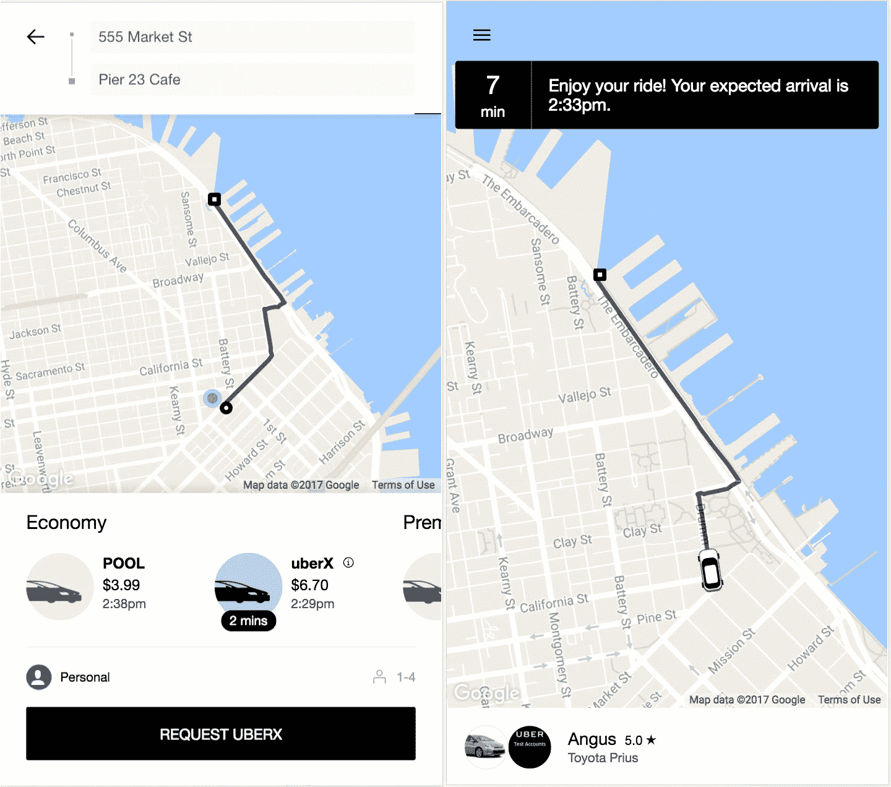
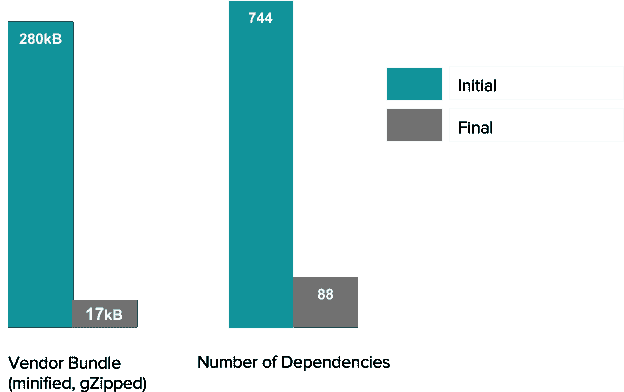

# 打造 m.uber:为全球市场设计高性能网络应用|优步博客

> 原文：<https://eng.uber.com/m-uber/?utm_source=wanqu.co&utm_campaign=Wanqu+Daily&utm_medium=website>

随着优步向新市场扩张，我们希望所有用户都能快速请求搭车，无论位置、网络速度和设备如何。考虑到这一点，我们重新构建了我们的 web 客户端，作为本地移动应用程序的可行替代方案。

兼容所有现代浏览器， [m.uber](https://m.uber.com) 在低端设备上为骑手提供类似 app 的体验，包括我们的原生客户端不支持的设备。该应用程序也很小——核心的乘车请求应用程序只有 50kB，即使在 2G 网络上也能快速加载。

在本文中，我们描述了我们如何构建 m.uber(发音为 moo-ber ),并探讨了在超轻量级 web 应用中实现原生应用体验的挑战。

m.uber mimics the native Uber app flow, allowing riders to specify their ride request and track driver location after being matched.

### 更小、更快:我们如何建造它

m.uber 是 ES2015+写的，用 [巴别塔](https://babeljs.io/) 进行 ES5 transpilation。最大的设计挑战是最小化客户端占用空间，同时保持本机应用程序的丰富体验。因此，当我们的传统架构利用 [React](https://facebook.github.io/react/) (带[Redux](http://redux.js.org/))和[Browserify](http://browserify.org/)进行模块绑定时，我们交换了[Preact](https://github.com/developit/preact)以获得其大小优势，并交换了 [Webpack 【T35 下面，我们将讨论我们如何应对应用架构中的这些和其他挑战:](https://webpack.github.io/)

#### 初始服务器渲染

在下载完所有核心 JavaScript 包之前，客户端无法开始呈现标记，因此 m.uber 通过在服务器上呈现 Preact 来响应初始浏览器请求。结果状态和标记作为字符串内联在服务器响应中，因此内容几乎可以立即加载。

#### 按需提供捆绑包

m.uber 的目标是让用户尽可能快地请求搭车，但我们的大部分 JavaScript 是用于辅助任务的:更新支付选项、检查行程进度或编辑设置。为了确保我们只提供我们需要的 JavaScript，我们使用 Webpack 进行代码分割。

我们使用一个*split page*函数，该函数返回包装在异步组件中的辅助包。例如，设置页面由下面的函数调用:

const async settings = split page(
{ load:()=>import('../../屏幕/设置)}
)；T11】

使用该函数，只有当async settings被父 render 方法有条件包含时，才会获取设置包。对于非常慢的连接，async settings将呈现“加载”模式，等待包提取完成。

#### 微型图书馆

即使在 2G 网络上，m.uber 的速度也很快，因此客户规模至关重要。我们的核心应用程序(允许您请求搭车的应用程序的基本部分)只有 50kB 的压缩版本，这意味着在典型的 2G (250kB/ <wbr> s，300 毫秒延迟)网络上的交互时间只有三秒。下面，我们强调现在和 m.uber 项目开始时在供应商捆绑包大小和依赖项数量上的差异:

The m.uber vendor bundle size and number of dependencies are much smaller than when the project began.

##### 预先反应过度

考虑到大小，我们选择了 Preact (3kB GZip/minified)而不是 React (45kB)。Preact 几乎可以做 react 所做的一切(它不支持或合成事件),并添加了一些不错的反射功能。Preact 在回收组件和元素时有点过分热心([但是他们正在做](https://github.com/developit/preact/pull/664))，这意味着你可能不得不在你不期望的元素上定义键，但是在其他方面它很好地满足了我们的需求。

##### 最小依赖性

为了对抗依赖性膨胀，我们对客户端中使用的 npm 包进行了选择，使用了像这样的库，它们的模块只负责一个功能，没有依赖性。我们发现将昂贵的数据转换限制在服务器上是有意义的，这样就不需要下载像[Moment](https://github.com/moment/moment)这样较重的模块。为了识别依赖性膨胀的来源，我们大量使用了类似于[source-map-explorer](https://www.npmjs.com/package/source-map-explorer)的工具。

##### 条件特性集

m.uber 的使命是让任何地方的任何人都能够轻松请求搭车，并在设备和网络允许的情况下提供附加功能。我们使用window . performanceAPI检测首次交互的时间，并基于结果隐藏或加载交互式地图体验。对于网络性能无法检测的用户，地图也可以在设置页面中打开和关闭。

#### 极小T3】渲染T5调用

Preact(像 [React](https://facebook.github.io/react/) )在发生变化时使用 VDOM 生成新的标记，但这并不意味着调用render是免费的。为了 渲染 需要大量的 JavaScript 喋喋不休才能弄清楚什么都不需要发生。我们广泛使用【shouldcomponentwupdate】来尽量减少调用 渲染 。

#### 缓存

##### 服务人员

服务人员拦截 URL 请求，使网络和本地磁盘获取被自定义获取逻辑所取代，这通常利用浏览器的 [缓存 API](https://developer.mozilla.org/en-US/docs/Web/API/Cache) 。通过缓存初始 HTML 响应和 JavaScript 包，服务人员允许 m.uber 在间歇性网络中断的情况下继续提供内容。

服务人员还可以显著缩短装载时间。磁盘 I/O 性能因操作系统和设备而异，在许多情况下，即使从磁盘缓存中读取数据也是 [慢得令人沮丧](https://github.com/w3c/ServiceWorker/blob/master/implementation_considerations.md#racing-allowed) 。在支持服务人员的地方，所有重新获取的内容(包括 HTML)都直接来自浏览器缓存，使页面能够立即重新加载。

m.uber 客户端在每次构建后都会安装一个新的服务人员。因为 WebPack 生成动态包名，所以我们的构建过程会将新名称直接写入服务工作者模块。在安装时，我们缓存我们的核心 JavaScript 库，然后在获取 HTML 和辅助 JavaScript 包时缓存它们。

##### 本地存储

当我们需要缓存对服务人员来说太不稳定的响应数据时，我们将它保存到浏览器的本地存储中。m.uber 每隔几秒钟就轮询一次乘车状态；在本地存储中保存最新的状态数据意味着当骑手返回应用程序时，我们可以快速重新呈现他们的页面，而无需等待 API 的往返。由于我们的状态数据很小，并且存储的数据大小有限，所以存储更新快速可靠，并且我们最终发现我们不需要使用像[indexed db](https://en.wikipedia.org/wiki/Indexed_Database_API)这样的异步本地存储 API。

#### 造型

##### 电子管

样式被定义为每个组件中的 JavaScript 对象。当一个组件被渲染后，[Styletron](https://github.com/rtsao/styletron)从这些定义中动态生成样式表。将样式与组件放在一起，可以方便地拆分包和异步加载样式。不使用的 CSS 永远不会被加载。

Styletron 通过为每个独特的规则创建一个原子样式表来消除重复的样式声明，从而允许最小的 CSS 运行时间和 [最佳的呈现性能](https://github.com/necolas/react-native-web/tree/master/benchmarks) 。我们使用 Styletron 在 m.uber 上生成所有组件级的 CSS

##### SVGs

为了节省空间，我们尽可能对图标状图像使用 [SVG](https://en.wikipedia.org/wiki/Scalable_Vector_Graphics) 格式，并将它们内嵌在 渲染 方法中。对于调优，我们使用了[SVGO](https://github.com/svg/svgo)和手动优化来进一步缩短路径。有时，我们能够用基本形状替换折线，并且我们使用带有适当除数的视图框尺寸来避免路径中昂贵的小数。

这一策略对整体应用规模的影响是显著的；例如，我们将徽标大小从 7.4kB (png)减少到 500 字节(tuned SVG)。

##### Fonts

我们发现，通过明智地使用尺寸和颜色，我们能够完全消除定制字体，而不会严重影响视觉设计。

#### 错误处理

一个精益的技术栈并不总是有助于简单的错误诊断，所以我们添加了一些轻量级的工具来帮助，例如:

*   我们扩展了window . on error向服务器上的客户端错误报告器发布错误，而不是使用庞大的现成的错误监控库。
*   我们通过包装 Preact 的 render 和shouldComponentUpdate来短路递归生命周期方法错误。
*   在我们的设计中，由 CDN 托管的文件抛出的错误不会向 窗口提供有用的数据。然而，即使有这样的头文件，在异步事件期间抛出的错误也不能追溯到父模块，因此window . on error将被蒙在鼓里。我们包装了所有事件侦听器，以允许通过 try/catch 将错误传递给父模块。

### 接下来的步骤

通过与 m.uber 的合作，我们付出了很多努力，在一个高性能的包中创造了一种原生的、类似应用的体验，但我们还没有完成——仍然有很多改进的机会。在接下来的几个月里，我们计划发布更多的优化，包括:

*   通过让组件只接受图元和数组道具的平面集合，形式化一个最小化渲染调用的策略。这将允许我们使用react . pure component(它自动实现shouldcomponentwupdate)和render来专注于标记生成，而不是分支逻辑和其他无关的任务。视情况而定，将 API 响应转换为展平原语可以委托给服务器逻辑(参见 [规范](https://github.com/paularmstrong/normalizr) )和/或mapStateToProps)。
*   结合动作和减速器，使束分离更直观。
*   对所有请求使用 [HTTP/2](https://en.wikipedia.org/wiki/HTTP/2) ，并用推送通知替换轮询 API。

此外，我们正在将 m.uber 的基础设施抽象成一个开源架构，这将成为未来轻量级优步网络应用的基础——敬请关注即将发布的关于这一主题的文章。

*图片标题鸣谢:博茨瓦纳奥卡万戈三角洲的 Conor Myhrvold 拍摄的《树枝上的高性能猎豹》。*