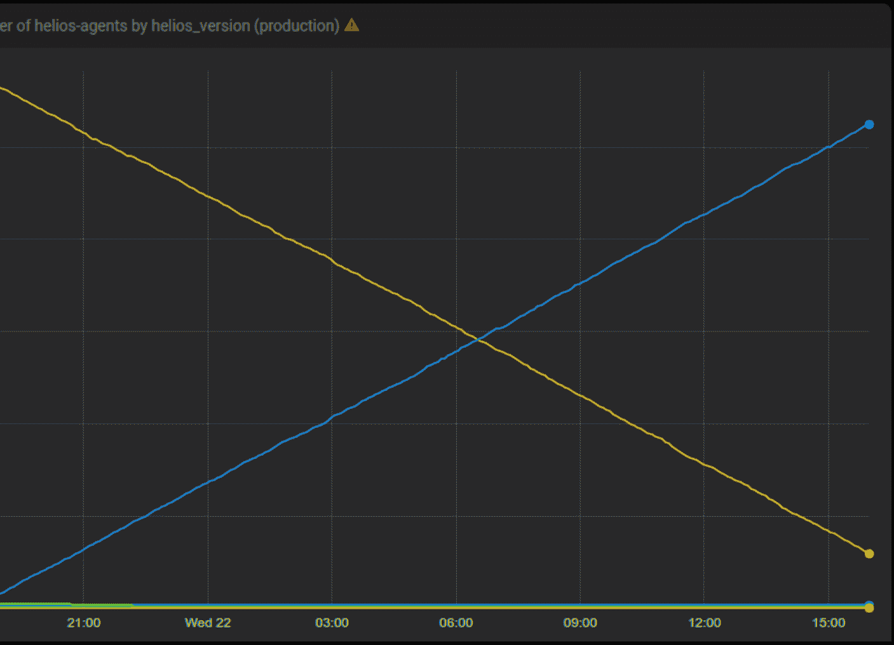

# 改善关键基础设施部署- Spotify 工程:Spotify 工程

> 原文：<https://labs.spotify.com/2017/06/22/improving-critical-infrastructure-rollouts/?utm_source=wanqu.co&utm_campaign=Wanqu+Daily&utm_medium=website>

# 改善关键基础设施的部署

2017 年 6 月 22 日 大卫夏 发布

Spotify 在 2014 年开始使用 Docker 和一些原型服务。自那以后，我们对它进行了多次升级和配置，几乎每次都会遇到一些通常难以检测和修复的问题。当 Docker 上运行的后端服务数量较少时，这些问题的影响很小。随着 Docker 应用的增长，错误的 Docker 变更的风险和影响也在增长，直到达到不可接受的程度。2016 年 10 月，我们部署了一个严重影响用户体验的糟糕配置更改。

在这一点上，我们回到了绘图板，并意识到我们需要一个新的解决方案，部署车队范围的基础设施变化逐渐和更多的控制。这是一个关于在 Spotify 上操作 Docker 如何启发我们建立一个服务的故事，该服务使我们能够更多地控制数千台服务器上基础设施变化的推出。

### 1.每次 Docker 升级都有问题

每次我们升级 Docker，我们都会遇到 Docker 变化和我们在其上运行的软件之间的倒退或不兼容。此外，这些问题变得更加难以解决，也更加有害。

我们在将 Docker 从 1.0.0 升级到 1.3.1 时遇到的两个错误很容易修复。Docker 改变了设置容器主机名的方式和处理 CMD 和入口点设置的方式。几天之内，我们为两个回归部署了[解决方案](https://github.com/spotify/helios/pull/295)。这是一个小事件。只有少数团队的构建管道被中断。下一次升级我们就没那么幸运了。

那是 2015 年夏天，我们刚刚完成从 1.3.1 到 1.6.2 的升级。我们认为海岸是安全的。过了一段时间，我们发现在这两个版本的 Docker 之间升级会产生孤立的容器——不受 Docker 守护进程管理的容器。这些容器依赖于它们原来的端口，这导致我们的 [Docker 编排工具 Helios](https://github.com/spotify/helios) 将流量路由到错误的容器。我们通过反复升级和降级 Docker 成功地重现了这个问题。根本原因是 Docker 没有干净地关闭，结果留下了孤立的进程。我们开始监控孤立的容器进程，并向上游提交了一个补丁给[给 Docker 更多的时间来干净地关闭](https://github.com/moby/moby/pull/13359)。这个 bug 比前两个更阴险，也更难修复。

去年 11 月，我们完成了从 1.6.2 到 1.12.1 的升级。一周后的 11 月 3 日，我们发现 1.12.1 有一个[错误，它会创建孤立的 docker-proxy](https://github.com/docker/docker/issues/25981) 进程。这阻止了容器运行，因为端口没有被释放。我们迅速解除了无法部署其服务的团队的封锁。我们还帮助他们将实例升级到 1.12.3。像之前的升级错误一样，这个错误很微妙，很难修复。

### 2.Docker 对 Spotify 后端的重要性增加了，Docker 问题的风险和影响也增加了。

Spotify 对 Docker 的采用始于 2014 年的一些原型服务。当时只有少数服务运行在数百个 docker 实例上。我们有足够的信心升级整个测试环境，等待一周，然后升级所有的产品。我们发现了几个 bug，但不严重。

与 2016 年 10 月从 1.6.2 升级到 1.12.1 相比。当时，我们有几千个 Docker 实例运行着关键任务服务，这些服务负责用户登录、交付事件，并使所有客户端能够与后端对话。升级 Docker 实例会导致该实例上运行的所有容器重新启动。我们必须逐步升级，以防止大量服务同时重启。同时重启接入点和用户登录等关键服务会给用户带来糟糕的体验，并导致颠覆下游服务的重新连接风暴。

截至 2017 年 2 月，生产中 80%的后端服务作为容器运行。因此，Docker 已经从一个实验品变成了 Spotify 后端基础设施的关键部分。我们的团队负责在成千上万台主机上运行和维护 Docker 守护程序。因此，我们必须比以往更加循序渐进地升级。

### 3.我们学会了为基础设施创建一个逐步推广的解决方案。

我们正在将 Docker 升级到 1.12.1，已经完成了 30%。然后在 10 月 14 日星期五，在试图修复一个小的竞争条件时，提供新的 Docker 实例，我们推出了一个坏的变化。这一事件揭示了我们的码头部署和整个船队的变化已经变得过于冒险。我们挤在一起挥洒墨水，创建了一个服务，让我们能够以更多的控制逐步展示基础设施的变化。

### 进入海啸

Tsunami 使我们能够对配置和基础设施组件进行无人值守的逐步部署。我们可以告诉 Tsunami“在两周内将 Docker 从版本 A 升级到版本 B。”海啸本质上是线性插值服务。延长部署时间可以提高可靠性。当问题只影响到舰队的一小部分时，我们可以检测出问题。

#### 海啸解决的问题

1.  我们 Docker 基础设施的规模和责任要求逐步升级。
2.  逐步升级限制了错误的影响，并给工程师时间来检测和报告问题。
3.  我们当前的设置使得仅仅通过升级我们自己服务上的 Docker 或测试其他服务的实例来检测所有升级问题变得不可能。我们需要在真正的生产服务上升级，这需要在所有后端服务的均匀分布选择上缓慢进行。

海啸中的主要概念是“变量”每个变量都有一个名称和配置，控制它可以有哪些值以及它如何随时间在值之间转换。我们让所有 Docker 实例查询 Tsunami，询问它们应该运行哪个版本的 Docker。Tsunami 只返回一个指示所需状态的平面 JSON 对象。这取决于客户端本身来实现期望的状态。

这导致了这种类型的推出。

*number of helios-agents by helios version*

海啸在 24 小时内向成千上万的主机推出新版本的 Helios。黄色是旧版本，蓝色是新版本。

拥有一个控制部署的集中服务使我们能够构建所有客户都可以“免费”获得的功能这些包括

1.  具有显示主机何时被告知运行系统服务的给定版本以及出于什么原因的审计日志。
2.  对给定角色中受基础架构更改影响的主机百分比有精确的逻辑，有下限或上限(例如，一个角色中有 30%的主机，但至少有一台主机)。
3.  监控机器上的服务水平目标，并在违反目标时自动终止推广。

我们用海啸来升级太阳神，码头工人和傀儡。Tsunami 还帮助我们进行触发服务重启的配置更改。我们希望在不久的将来开源海啸代码。如果这些问题让你感兴趣，我们有[很多机会](https://www.spotify.com/us/jobs/view/oUSi4fwS/)到[加入乐队](https://www.spotify.com/us/jobs/view/oomP4fwn/)。

标签:

[backend](https://engineering.atspotify.com/tag/backend/)