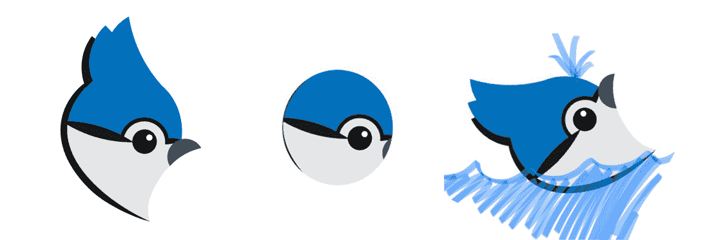

# 你的职业想成为什么——艾伦·派克

> 原文：<http://www.allenpike.com/2017/what-your-career-wants-to-be/?utm_source=wanqu.co&utm_campaign=Wanqu+Daily&utm_medium=website>

我们学习蓝牙，它工作了。

本周，我们发布了 Bluejay，这是一个简单的用于蓝牙硬件通信的 Swift 框架。这很有趣，但也很奇怪。你看，我们是偶然学会蓝牙的。

Bluejay 标志，由 Soroush Khanlou 和 Matthew Panzarino 混音。

四年前，一家公司联系了我们，寻找蓝牙应用的修复方法。我最初的反应是怀疑:我们设计和开发抛光的应用程序用户界面——我们对蓝牙了解多少？那不是我们*的事情*。尽管如此，我们还是抓住机会学习了一些新东西。

知道我们做到了。我们了解了人们在构建蓝牙应用程序时所犯的奇怪而奇妙的错误——首先是修复应用程序中现有的问题，然后是犯一些我们自己的错误。我们了解了后台恢复、固件更新以及调试无法重现的同步问题的乐趣。刚开始很烦。然后就好玩了。不久之后，我们发布了一款可以与真正的实时硬件对话的应用。实验完成了。

然后奇怪的事情开始发生。每次我与提到蓝牙的潜在客户交谈时，我都会说“哦，太好了，我们刚刚发布了一款蓝牙应用”，他们会把我们排在最前面。虽然我们可能会签署 50%的典型项目建议书，但突然间我们签署了 100%的蓝牙项目。没过多久，硬件创业公司就来敲我们的门了。我们的虚拟之门——敲我们实体之门的客户线索通常都是坏线索，并受到他们应得的勉强的礼貌对待。

说真的，有时人们只是随机出现并说，“嗯，是的…我有一个应用程序的想法，所以…”这需要我全身的加拿大精神来回应，“抱歉，我们这里不做想法，只做产品。再见！”

无论如何，通过走出我们的舒适区，我们学到了一项既受欢迎又令人愉快的技能。在我们意识到之前，我们从“那不是我的包，宝贝”变成了三分之一的项目都是那个包。现在我是一系列移动应用*和*开源蓝牙框架的产品经理。很奇怪但是很酷。

## 抓住潮流

有时候创造是关于精确的。苹果公司以极其严格的公差用铝加工出漂亮的产品。结构工程师不遗余力地确保桥梁能够经受住设计寿命的考验，准确定义桥梁的建造规格。

然而，更多时候，创造是关于灵活性的。这是关于你去适应和利用你所学到的东西。在与木材和其他天然材料打交道的人中有一句谚语:“它会告诉你它想成为什么。”你不能把一块浮木加工成超薄的 MacBook 外壳。忽视木材的纹理和性质，你只会浪费大量的潜力。虽然我认为它会成为有史以来最时髦的 MacBook，直到它灾难性地裂开。

我的观点是，建立一个事业，一个公司，或者一种生活就像处理一种天然材料。这是关于寻找机会，发现它想成为什么。像斯蒂芬·科维这样的圣贤告诫我们“开始时要想到目的”。这对于每日或每月的任务来说是很棒的，但是在我们的行业中，它会在职业生涯的规模上崩溃。20 年后，我们的世界将会大不相同。等我退休的时候，UI 会变成 VR，应用会变成脑波，[之类的会变成 florps](https://twitter.com/actioncookbook/status/684515262712967170) 。或许他们不会，但我们肯定不会做和现在一样的工作。

所以这是你定期安排的尝试新事物的提醒。你所做的伟大的事情可能不会来自于坚持你目前的大计划，而是来自于一千个小计划，抓住机会，并认识到哪些是有效的。

事实证明，蓝牙是有效的。谁知道呢？