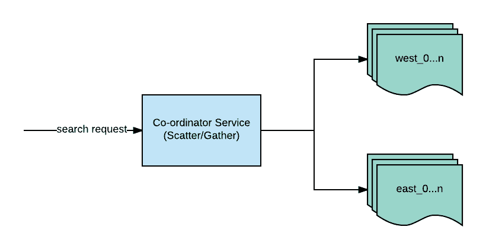
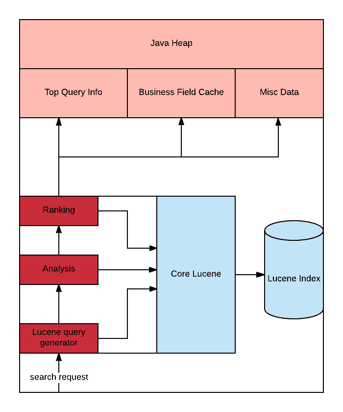
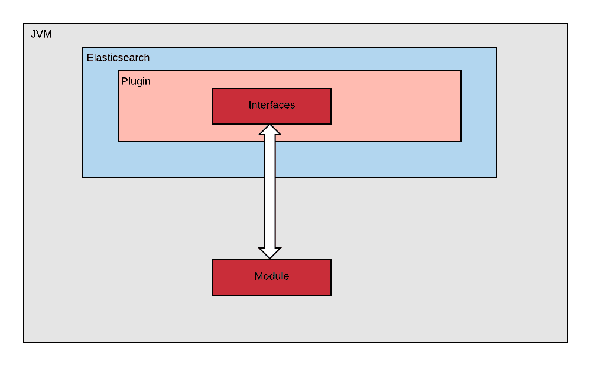
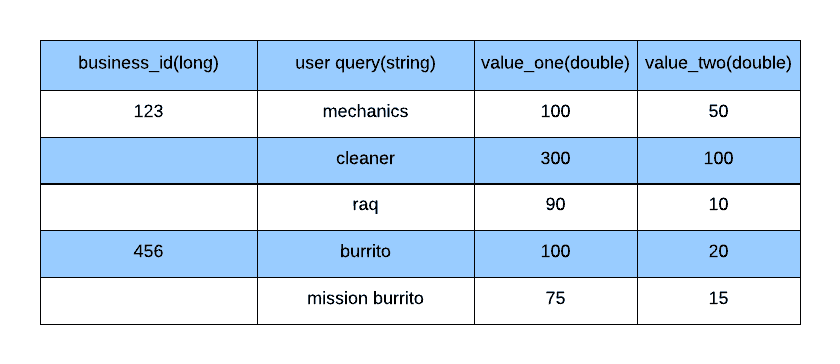
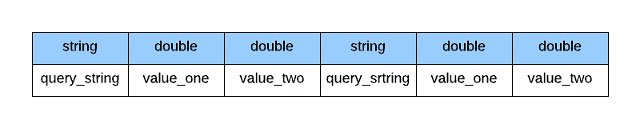
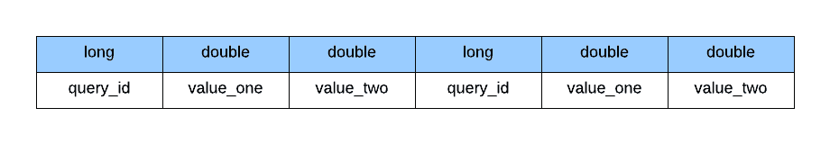

# 将 Yelp 的核心商业搜索转移到 Elasticsearch

> 原文：<https://engineeringblog.yelp.com/2017/06/moving-yelps-core-business-search-to-elasticsearch.html?utm_source=wanqu.co&utm_campaign=Wanqu+Daily&utm_medium=website>

虽然 Yelp 的新搜索引擎通常使用 Elasticsearch 作为后端，但 Yelp 的核心商业搜索使用自己的定制后端，直接建立在 Lucene 之上。该系统是 Yelp 仍在生产中部署的最老的系统之一。这个定制搜索引擎的一些特性是

*   分布式 Lucene 实例
*   主从架构
*   对各种语言的自定义文本分析支持
*   自定义业务排名主要依赖于使用业务功能(考虑业务属性，如评论、名称、营业时间、服务领域等。)
*   衍生 Yelp 分析数据，以提高搜索结果的质量；例如对企业最流行的查询

## 遗留系统的问题

### 对实时索引的次优支持

我们的遗留系统使用主从架构，其中主设备负责处理写操作(索引请求),从设备负责服务实时流量。主实例负责拍摄 Lucene 索引的快照并上传到 S3，这样从实例就可以定期下载并提供新数据。因此，在搜索时，查询提供的更新索引会有延迟。一些搜索特性，如预订和交易，不能承受这种延迟(几分钟)，需要立即提供索引数据(几秒钟内)。为了解决这个问题，我们不得不使用另一个实时商店 Elasticsearch，并与商业商店(传统搜索商店)并行查询它，这意味着应用服务需要基于这两个结果计算最终的搜索结果。随着我们的成长，这种方法不能很好地扩展，我们不得不处理在应用层合并和排序结果所产生的性能问题。

### 缓慢的代码推送

我们有一个庞大的开发团队，不断改进搜索结果的排名算法。我们最终会每天多次向底层搜索排名算法推送代码，而在传统系统中，每次代码推送都要花费几个小时。Yelp 的几乎所有微服务现在都使用 PaaSTA 作为部署工具。当时，legacy 系统可能是 Yelp 使用 PaaSTA 的最大的“微服务”。我们的数据太大了，以至于不得不进行[分片](https://en.wikipedia.org/wiki/Shard_(database_architecture))。我们使用了双层分片方法。

*   地理定位:我们根据企业的地理位置将它们分成独立的逻辑索引。例如，旧金山的一家企业可能与芝加哥的一家企业在不同的索引中，因为碎片可能会从该国的中部分裂出去。
*   微索引:我们进一步将每个地理索引拆分成多个“微索引”或“微索引”。为此，我们使用了一种简单的基于 mod 的方法。例如

```
business_id % n, where “n” is the number of microshards desired 
```

因此，我们最终的 lucene 索引应该是

```
<<geographical_shard>>_<<micro_shard>> 
```

每个 Lucene 索引支持的进程都有自己的服务实例。我们还必须考虑复制，以确保可用性。例如，每个 <geoshard>_ <microshard>会有多个称为“副本”的实例，以防止实例中断。这意味着我们有大量的服务实例，每个实例都需要一些时间来启动，因为每个实例都需要</microshard></geoshard>

*   从 S3 下载数十亿字节的数据
*   预热 Lucene 索引以预加载 Lucene 缓存
*   计算并将各种数据集加载到内存中
*   强制垃圾收集，因为启动创建了许多短暂的对象

每次代码推送都意味着我们必须循环工人，他们每次都必须经历这个过程。

### 无法完成某些功能工作

重新编制所有数据的索引非常耗时，这意味着添加一些新功能的成本会成倍增加。我们不能做这样的事情

*   快速迭代我们的分片算法。
*   对分析器进行迭代。我们开发了定制的基于语言的分析器来标记文本。像 Lucene 这样的搜索引擎在索引时使用特定的分析器(比如生成标记、过滤停用词),并且通常更喜欢在查询时使用相同的分析器，以便在倒排索引中找到标记化的查询字符串。改变分析器意味着重新索引整个语料库，所以我们通常试图在我们的分析代码库中远离优化。
*   索引附加字段以提高排名。企业属性是我们在搜索结果中对企业进行排名的主要信号之一。随着我们的商业数据越来越丰富，我们可以利用这些数据提高我们的排名。遗憾的是，我们不得不使用其他实时商店来查找这些业务属性，因为对我们的遗留系统进行更改是一场磨难。
*   相对于存储在辅助数据结构中的数据量，我们正在推动 JVM 堆的极限。我们有不能存储在 Lucene 索引上的自定义数据，但是需要这些数据来对企业进行排名(例如，存储每个企业最受欢迎的查询)。随着数据的增长，伸缩变得更加困难，因为这受到了 JVM 堆大小的限制。

在这一点上，我们开始相信遗留系统必须被彻底检查。那么新系统的设计会是怎样的呢？首先让我们看一下现有的系统，这样我们就知道在新系统中我们需要解决的挑战，而不引入任何回归。

## 遗留系统

### 传统业务搜索堆栈

### 

<small>传统业务搜索堆栈</small>

它从搜索请求进入协调器服务开始。该服务计算出要使用的相应地理分片(基于企业的物理位置),并将请求转发给适当的分片，在这个简化的例子中是 west 或 east。该请求将被广播到该地理分片内的所有微分片(用于水平缩放的第二层分片)。从 1 到 N 个微硬盘获得结果后，协调者将组合这些结果。

### 微硬盘(单一传统搜索节点)

让我们深入到单个节点，看看我们如何从查询到结果。

### 

<small>微硬盘</small>

搜索请求被转换成 Lucene 查询，然后被发送到 Lucene 索引。Lucene 根据指定的[收集器](https://lucene.apache.org/core/5_2_1/core/org/apache/lucene/search/Collector.html)返回结果流。人们可以把收集器看作是*排名器*，决定结果的顺序。这就是应用排序逻辑的地方。Yelp 的排名逻辑使用许多试探法来确定最终结果排名。这些启发包括查看某些业务相关数据

*   **业务字段缓存**:业务的前向索引(如业务属性)
*   **热门查询信息**:来自我们用户活动的数据
*   **杂项数据**:包括 Yelp 特有的数据，如 [Yelp 类别](https://www.yelp.com/developers/documentation/v3/all_category_list)

至此，我们已经准备好定义新系统的设计目标。

## 下一代商业搜索的目标

根据前面的章节，我们可以快速总结我们的一些高层次目标:

*   将应用程序逻辑与所使用的后端分离
*   更快的代码推送
*   易于存储定制数据和为搜索结果排名提供动力的前向索引(例如，上下文特定数据)
*   实时索引
*   与业务数据增长相关的线性性能可扩展性

我们研究了 Elasticsearch，它似乎为我们解决了一些现成的目标。

## 挑战

### 将应用程序逻辑与所使用的后端分离

排名代码不需要知道它运行在什么后端。因此，将这些代码从底层搜索后端存储中分离出来是有意义的。在我们的例子中，这是一个 Java 代码库，这意味着我们可以将其部署为一个 jar。更具体地说，我们必须能够在分布式搜索环境中运行我们的*排名 jar* 。Elasticsearch 提供了[插件](https://www.elastic.co/guide/en/elasticsearch/plugins/5.4/plugin-authors.html)支持，让我们可以做到这一点。我们小心地将我们的排名代码从 Elasticsearch 插件实现细节中分离出来。

### 

<small>将插件从评分罐中分离</small>

#### 接口

我们有两个主要定义，允许我们将排名代码从直接依赖底层 Elasticsearch 库中分离出来。因此，我们的排名代码都不依赖于 Elasticsearch(或 Lucene)，这让我们可以灵活地在任何其他后端运行这些排名代码。

<noscript><pre>public interface ScorerFactory { Scorer createScorer(Map&lt;String, Object&gt; params); } public interface Scorer { double score(Document document); } public interface Document { &lt;T&gt; T get(Class&lt;T&gt; clz, String field); } </pre></noscript>

*   *单据*接口被模块/排名代码用来查找业务属性。然而，分级代码不知道它的实现。文档的具体实现由 Elasticsearch 插件注入。
*   *计分器*接口由该模块实现。同样，它不依赖于 Elasticsearch。这个计分器由 elasticsearch 插件中的私有类加载器加载。

#### 组件

模块是排名代码，是搜索相关性逻辑的核心所在。这是一天中可能会多次推向生产的代码。这个 jar 部署在我们的 Elasticsearch 集群上，然后加载到 Elasticsearch 插件中。

#### 插件

[Elasticsearch 插件](https://github.com/elastic/elasticsearch/blob/ee802ad63c0f21d697a5095dd05dc6f94626ee4d/core/src/main/java/org/elasticsearch/script/ScriptContext.java)包含排名代码。这主要是与 Elasticsearch 相关的连接代码，它加载模块代码并委托给它对文档进行排序。

### 更快的推动

如前所述，我们每天推送代码多次，但每次推送都重新启动 Elasticsearch 对我们来说是不可行的。因为我们构建了与 Elasticsearch 本身分离的相关性模块，所以我们能够在不重启整个 Elasticsearch 集群的情况下重新加载它。

我们首先把排名罐上传到 S3。我们添加了一个在部署过程中调用的 Elasticsearch REST 端点，以便 Elasticsearch 插件可以重新加载指定的 jar。

<noscript><pre>public class YelpSearchRestAction extends BaseRestHandler { @Override protected RestChannelConsumer prepareRequest(RestRequest request, NodeClient client) { moduleLoader.loadModule(); //a. invoke re-loading of module.jar return channel -&gt; channel.sendResponse(new BytesRestResponse(RestStatus.OK, content)); } } </pre></noscript>

一旦这个端点被调用，它就通过一个私有的类装入器触发 module.jar 的装入，这个装入器从 module.jar 本身装入入口点顶级类

<noscript><pre>public final class ModuleLoader { public synchronized void loadModule(){ final Path modulePath = downloadModule(); //1\. download the module.jar createClassloaderAndLoadModule(modulePath); //2\. create classloader and use that to load the jar } private void createClassloaderAndLoadModule(final Path modulePath){ final URLClassLoader yelpySearchClassloader = new YelpSearchPrivateClassLoader( new URL[]{modulePath.toUri().toURL()}, this.getClass().getClassLoader() //3\. Create URLClassloader ); scorerFactory = Class.forName("com.yelp.search.module.YelpSearchScorerFactoryImpl", true, yelpySearchClassloader) .asSubclass(ScorerFactory.class) .getDeclaredConstructor(new Class[]{Environment.class}) .newInstance(environment); //4\. Create instance of ScorerFactory that return the Scorer } public Scorer createScorer(Map&lt;String, Object&gt; params) { return scorerFactory.createScorer(params); //5\. Scorer factory returning scorer, called once per query } } </pre></noscript>

1.  将模块 jar 下载到一个路径
2.  基于路径创建私有类加载器
3.  使用 module.jar 的 URL 创建 URLClassloader
4.  创建实现 ScorerFactory 的实例。注意 asSubclass 和传递参数环境的使用。环境是另一个接口，它提供模块代码所需的一些资源。
5.  ScorerFactory 有一个返回 Scorer 实例的 createScorer 方法

然后我们有 Elasticsearch 插件代码来调用重新加载的计分器

<noscript><pre>class YelpSearchNativeScriptFactory implements NativeScriptFactory { public ExecutableScript newScript(@Nullable Map&lt;String, Object&gt; params) { Scorer scorer = moduleLoader.createScorer(params)); return new ExecutableScriptImpl(scorer); //1\. Create elasticsearch executable script } } </pre></noscript>

1.  创建 elasticsearch 可执行脚本，并将其传递给我们之前“热加载”的 scorer 实例

<noscript><pre>class ExecutableScriptImpl extends AbstractDoubleSearchScript implements Document { public ExecutableScriptImpl(final Scorer scorer) { this.scorer = scorer; } public double runAsDouble() { return scorer.score(this); //1\. score this document } </pre></noscript>

1.  Elasticsearch 可执行脚本最后使用评分器对文档本身进行评分并通过。注意传入的“ *this* ”。这就是 elasticsearch 中的文档属性查找(也称为文档值查找)如何在 elasticsearch 插件中发生，而模块代码只需使用接口。

### 加载自定义数据

遗留系统的一个原始问题是，单个搜索节点的内存占用随着时间的推移越来越大；主要原因是我们在 JVM 堆上加载了大量辅助数据。使用 Elasticsearch，我们能够将这些内存中的数据结构卸载到 [doc 值](https://www.elastic.co/guide/en/elasticsearch/guide/master/docvalues.html)。我们必须确保我们的主机有足够的 RAM 可用，以便 Elasticsearch 在检索这些 doc 值时可以有效地利用磁盘缓存。

ScriptDocValues 适用于大多数类型的属性，比如 String、Long、Double 和 Boolean，但是我们也需要支持定制的数据格式。一些企业存储了与搜索分开计算的特定于上下文的数据。这个信号允许我们的搜索帮助提高一个企业的分数，例如基于过去历史的“给定其最受欢迎的查询，企业与搜索查询相关联的机会”。我们这样表示这个结构:

### 

<small>自定义数据格式</small>

如果我们想将每个企业的数据存储为一个 doc 值，就必须对其进行序列化

### 

<small>每个业务定制数据的序列化布局</small>

由于查询字符串的长度是任意的，会占用更多的空间，所以我们决定用正整数来表示它们。我们确定了一个长值单调递增的字符串。这允许我们通过使用 long 而不是 string 来节省空间，并将记录保持在固定的大小。

所以，假设我们有两个字符串，“餐馆”和“墨西哥餐馆”。我们的插件会将“餐馆”标识为 1，将“墨西哥餐馆”标识为 2。字符串本身将被替换为与查询相对应的长值，因此您将得到“1”和“2”。从而允许我们用固定长度的*来表示字符串。字节*。这使得我们更容易序列化和反序列化我们的查询相关数据。这是一个简化的例子，实际上我们需要根据语言存储字符串的分析形式，例如“餐馆”可以标记为英语中的“餐馆”。

现在，我们可以更改我们的数据结构，只存储 longs 和 doubles，因为字符串被它们的引用替换了:

### 

<small>每个业务固定长度条目的序列化布局</small>

每个企业的用户查询及其相关值可以表示为一个对象列表。

<noscript><pre>Class QueryContextInfo { private long queryId; private double valueOne; private double valueTwo; } </pre></noscript>

有了它，我们可以使用自定义序列化，在 Elasticsearch 中将一个企业的所有记录索引为二进制数据类型。

<noscript><pre>public static byte[] serialize(QueryContextInfo[] queryContextInfoRecords) { byte[] bytes = new byte[Integer.BYTES + (queryContextInfoRecords.length * (Long.BYTES + 2 * (Double.BYTES)))]; ByteBuffer.wrap(bytes, 0, Integer.BYTES).putInt(queryContextInfoRecords.length); int offset = Integer.BYTES; for (QueryContextInfo queryContextInfo : queryContextInfoRecords) { ByteBuffer.wrap(bytes, offset, Long.BYTES).putLong(queryContextInfo.getQueryId()); ByteBuffer.wrap(bytes, offset + Long.BYTES, Double.BYTES).putDouble(queryContextInfo.getValueOne()); ByteBuffer.wrap(bytes, offset + Long.BYTES + Double.BYTES, Double.BYTES).putDouble(queryContextInfo.getValueTwo()); offset += Long.BYTES + 2 * (Double.BYTES); } return bytes; } </pre></noscript>

出现的一个问题是使用 ScriptDocValues 查找二进制数据。我们向 Elasticsearch 提交了一个[补丁](https://github.com/elastic/elasticsearch/pull/21484)来支持这一点，允许你做如下事情:

<noscript><pre>List&lt;ByteBuffer&gt; queryContext = document.getList(ByteBuffer.class, "query_context");</pre></noscript>

一旦我们从 Elasticsearch 中读取了 ByteBuffer，我们就可以在序列化的 *QueryContextInfo[]* 中搜索我们想要的 query_id，例如用户发布的 query_id。query_id 上的匹配允许我们检索相应的数据值；即*查询上下文信息*的业务。

### 绩效学习

作为构建我们新系统的一部分，我们花了时间来确保它能超越我们的传统搜索系统。以下是我们在这一过程中学到的一些经验。

#### 找到你的瓶颈

Elasticsearch [Profile API](https://www.elastic.co/guide/en/elasticsearch/reference/5.1/search-profile.html) 是一种在查询中找到瓶颈的有用方法。

#### 评分是线性的，并且与分片成比例

在我们的例子中，评分是瓶颈，因为我们依赖许多特征来对结果进行排序。我们意识到，我们可以通过添加更多碎片来进行水平扩展，这意味着我们可以在查询时从 Elasticsearch 中获得更多并行性，因为每个碎片有更少的业务需要评分。进行此操作时要注意；没有神奇的数字，因为这取决于你的回忆规模和你的得分逻辑，以及其他因素。关于碎片数量的增加，性能的增长并不是无限的。我们不得不通过增加碎片和重新索引数据来找到我们的最佳点。

使用像 [jstack](http://docs.oracle.com/javase/7/docs/technotes/tools/share/jstack.html) 、 [jmap](http://docs.oracle.com/javase/7/docs/technotes/tools/share/jmap.html) 和 [jprofiler](https://www.ej-technologies.com/products/jprofiler/overview.html) 这样的 Java 工具让我们能够洞察代码中的热点(计算密集型组件)。例如，我们的二进制数据查找的第一个实现涉及将整个字节数组反序列化为一个 Java 对象列表，即 List <querycontextinfo>，然后线性搜索 query_id。我们发现这样做很慢，而且会导致对短命对象进行更多的垃圾收集，因为我们对每个查询的每个召回业务都是这样做的。</querycontextinfo>

我们通过对序列化的数据结构进行二分搜索法而不是反序列化来重新设计我们的算法。这允许我们快速搜索 query_id，如果它在这个企业的 blob 中的话。这也意味着我们不需要为将整个 blob 反序列化为 Java 对象而承担垃圾收集的成本。

## 结论

将 Yelp 的核心搜索转移到 Elasticsearch 是 Yelp 搜索团队近年来承担的更具挑战性的项目之一。由于就其可行性而言，这是一个技术上具有挑战性的项目，所以我们以快速失败模式迭代这个项目是很重要的。在每个短暂的迭代中，我们解决了高风险项目，如热代码加载、在 Elasticsearch 中支持定制数据的能力，以及 Elasticsearch 性能，这使我们对我们的方法充满信心，同时不会对未知事物投入太长时间。最终，该项目取得了成功，现在我们能够定期重新索引数据，并轻松地添加新字段，使我们能够以以前无法做到的方式改进我们的排名算法。我们的代码推送现在只需要几分钟，而不是几个小时。也许最重要的是，我们不需要维护一个难以理解的遗留系统，这使得找到了解并想学习 Elasticsearch 的开发人员变得更加容易。

[回到博客](/)