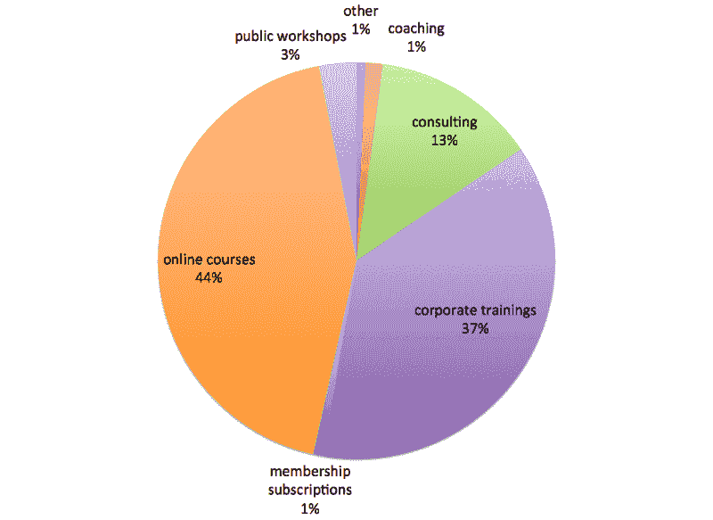
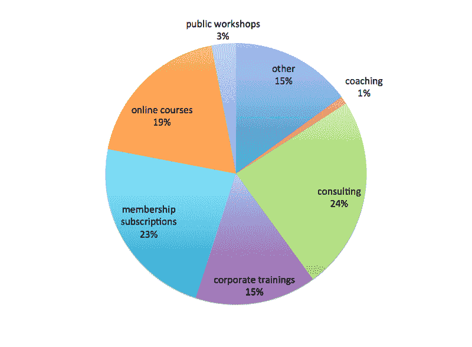
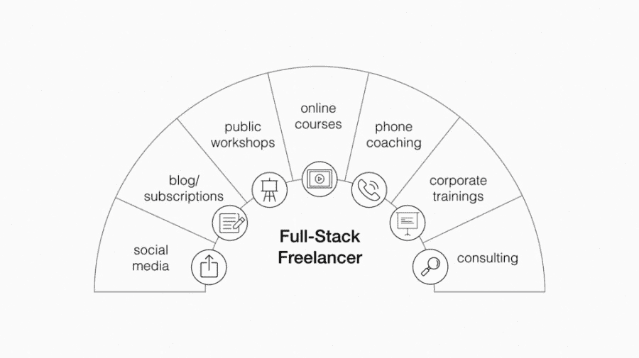

# 全栈自由职业者的崛起- Forte 实验室

> 原文：<https://praxis.fortelabs.co/the-rise-of-the-full-stack-freelancer-c14a375445d9?utm_source=wanqu.co&utm_campaign=Wanqu+Daily&utm_medium=website>

#### 现代工作的组合方法

在过去，做一名自由职业者意味着成为一名专家。

作为一名自由职业者，你获得足够收入的唯一方法是专注于一项单一的、高度货币化的技能。比如文案，编码，平面设计，摄影，新闻，或者语言翻译。

你必须能够独立完成这项技能，因为与其他人密切合作会有太多的摩擦。因此，矛盾的是，成为一名自由职业者传统上意味着让你的工作更可预测、更有条理，而不是更少。你只能通过让*的工作本身*更加死板和单调来让你的*生活方式*更加灵活。

这一直限制着能够持续成为自由职业者的人数。相对来说，很少有人有热情和强度去开发一项高度专业化的技能，也很少有人愿意花费数年时间孤立地部署这项技能。

但还有另一个更深层次的缺点:自由职业者总是暴露在自营职业的负面影响下(收入波动、没有安全网、没有福利、不断变化的市场需求)，同时又无法利用意想不到的正面影响。由于被迫坚持自己珍视的技能，他们很难转移到相关领域，赶上上升趋势，或接受新技能培训，因为任何这样的转移都会立即导致收入下降。

但我相信我们正在见证一种新型工作者的崛起:全栈自由职业者。

全栈自由职业者将技术视为机遇，而非威胁。他们利用软件即服务和在线平台来垂直集成“完整堆栈”的功能，而不是专注于一个狭窄的功能。这使得他们能够获得他们创造的更大比例的价值，而不是把它交给看门人和分配瓶颈。

全栈式自由职业者正通过利用硬币的另一面来应对一系列技术驱动的趋势——临时就业、日益加剧的全球化和自动化:技术最终变得足够强大、足够便宜、足够用户友好，足以由单个个人进行有效部署。

他们自由借贷——从科技初创公司、数字游牧者、生活方式设计师、独立承包商、共享和点对点经济——但将他们完全归入其中任何一个类别都不太正确。

这是因为全栈自由职业者管理的是收入流组合，而不是基于一套技能的 T2 工作。

这些可能包括产品和服务、线上和线下业务、数字和实体产品、主动和被动收入来源、现场和远程互动、个人贡献和团队协作，以及低利润和高利润、大规模生产和可定制、高风险和低风险、直接或间接货币化、短期和长期或以上的任何组合。

听起来不可能？不是的。但这需要一项我们几乎没有人受过教育的技能:投资组合思维。

### 组合思维

现在流行宣扬“深度工作”的普遍优越性。我们被建议锁定所有的分心和干扰，一次完全专注于一个项目，并优化长时间的专注。

这个建议没有错；只是限制。如果你想要的是尽你所能成为最好的员工，这是合适的。另一方面，如果你想成为一名经理，经营一家企业，开发副业项目，或者与他人合作，这是一个糟糕的建议。它没有给你任何投资组合。

组合思维认识到拥有多个并行项目为协同提供了许多机会。它们不必互相干扰和阻碍——它们实际上可以结合成比其各部分之和更大的东西。每一个都可以让其他的更容易，更有趣，更有利可图。

我的自由职业公司 Forte Labs 这个月已经 4 岁了，我将以它为例。我的作品集包含(按添加顺序排列)公共研讨会、自定进度的在线课程、企业培训、各种主题的咨询、一对一的绩效辅导以及我的博客的会员订阅。

以下是我过去 4 年的总收入来源明细:

<noscript>T3】</noscript>

这张饼状图掩盖了月与月、年与年之间的巨大差异，但要点很清楚:我的大部分收入来自两个来源，企业培训和在线课程。它们都是服务——培训和教学——我使用数字平台将它们产品化，使它们更具可扩展性和自动化。显然，它们对我的持续生存至关重要，因为它们让我可以半被动地赚钱(就在线课程而言)，而不必每次都从零开始(就企业培训而言)。

但是，当你看到我是如何度过时间的时候，描述我作为一家培训公司的工作感觉不太对:

<noscript>T3】</noscript>

这两个来源占我收入的 81%，只占我时间的 34%。我的第三大收入来源是咨询，它产生了 13%的收入，却占据了我 24%的时间。利润最低的来源——公共研讨会、会员订阅、辅导和其他——贡献了总收入的 6%,却消耗了我高达 42%的时间。

一种思考方式是，技术帮助我在一周的三天里产生足够的杠杆作用，我可以在没有直接回报的活动中投资整整两天。

乍一看，这个图表就像是多任务处理的缩影。如果我是一名员工，这意味着我把时间分配在了太多的优先事项上，因此没有发展自己的专长，而这正是我的金奖券。

但是作为一个全栈自由职业者，这个分布看起来刚刚好。

为了解释为什么，我们需要更仔细地看看使投资组合思维起作用的关键原则。

### 机会加成

投资组合思维利用了**机会主义加法**的原则:你可以在许多事情上花费时间，这些事情在适度的情况下会增加价值，但你做得越多，它们的回报就会迅速减少。

James Clear 用了一个也做演讲的作者的例子。写更少的书显然会对他获得演讲席位的能力产生负面影响。但是少说话也会伤害他。一年做几次这样的演讲，相对来说不费吹灰之力就能为他的底线增加几千美元。没有这些额外的钱，他可能不得不承担更多耗时的项目，留给他更少的时间来写作。

换句话说，偶尔的演讲约会不会让作者分心。他们是他能够将大量时间投入到深入写作的重要因素。

这似乎是一个孤立的例子。我想让你相信，这样的机会是无处不在的，任何愿意分散投资组合的人都可以得到。

例如，我发现纯咨询对我来说很难盈利。从一个新客户和一张白纸开始每个项目意味着巨大的启动成本，没有相应补偿的长时间探索和实验，以及似乎永远不会完成的挥之不去的项目。直接出售我的时间，这是太容易得到小钱的要求。更不用说每天把我最好的创意带到桌面上的难度了。

但是如果适度的话，比如说每季度一次，咨询工作是探索和学习的绝佳来源。最好的、最有原创性的想法，根本不是看博文、看书就能找到的。他们正从现实世界中构思、设计、生产和销售真实产品的混乱过程中脱颖而出。获得这种混乱但无价的学习需要一定程度的参与。如果我能在得到报酬的情况下做到这一点，那就更好了！

教练也是如此。如果我不得不做一名全职的表演教练，我将不得不降低我的每小时工资，直到我的日程排满，这样我就没有时间做其他项目了。但是偶尔这样做，它提供了一个深入了解某人生产力系统的宝贵机会。听到他们的经历和他们面临的独特问题，对我的共鸣中心来说就像一针肾上腺素。它帮助我走出自己的视角，进入别人的世界，在那里我总是惊讶地发现与自己不同的想法和信仰。

### 建立投资组合

可能不难相信这些活动中的每一项都是值得的，但是您可能想知道一个人怎么能维持这么多线程。

关键是要明白高端产品和服务，比如企业培训和高端在线课程，需要*长*的销售周期。它们不是人们一时冲动买的东西。客户必须了解你，理解你来自哪里，并且信任你。这需要一个丰富的互动过程，阅读你的作品，观看你的视频，查看你的社交媒体帖子，仔细阅读你的电子邮件简讯，并尝试你更实惠的产品。

在一个大公司里，大部分工作是由销售人员和营销人员完成的。他们可以致力于进行长时间的交谈，支付晚餐费用，发布免费内容营销，组织活动和演示。他们可以做所有这些，因为他们知道业务的另一部分——产品——会将他们的努力货币化。

作为一个全栈自由职业者，你必须自己*货币化这个销售过程*。如果这能让你更舒服的话，你可以称之为“关系构建序列”。你不能预先投入大量工作，只希望有一天会有回报。当然，你发布的一些内容应该是免费的。但是你越早开始收费，哪怕是 5 美元，你就会越快开始学习。付费顾客的话远比观众的话更有价值。

您从销售过程中获利和获取价值的不同方式是您的投资组合中的项目:

<noscript></noscript>

I’ll expand and fill out this visual in subsequent posts

社交媒体分享和免费博客文章是你的线索捕获，将人们带入你的观众群。它们也让你接触到你所处领域之外的更广阔的世界。

你的介绍性产品是你的资格和过滤系统，不仅能帮助你找到最忠实于你的信息的人，还能帮助你找到传达信息的最佳想法和形式。

优质服务是摇钱树，让您的时间发挥最大价值，并获得相应的报酬。

### 网络效应

可能不会立即显而易见的是，上面的模型不仅仅是一个单向漏斗——它是一个网络。给定的客户可以通过我的产品网络遵循多种可能的途径。每一个额外的服务都提供了另一个进入网络的入口，这增加了我可以服务的人群的数量和多样性。

但是，不仅仅是客户在网络中四处穿梭。信息和价值也是如此。

我经常从一份咨询工作中了解一个新的话题或趋势，这份工作为我几个月的写作提供了动力，增加了会员资格的价值。在公共研讨会上学到的引导技巧让我能够轻松地提供一个在线训练营，结合线上和线下的最佳形式。几乎每个教练客户都向我展示了一个我从未想到过的新策略，然后我可以把它打包，作为现实世界的实施建议在企业培训中分享。当然，当我知道每一次谈话都是把某人带入我的社交网络的机会时，各种各样的“无偿”活动突然变得有价值了，在那里我甚至无法预测他们会贡献什么价值。

所有这些都是来自我的经验的真实例子，它们都是**多功能**原则的例子——用一种方法完成多种目的。如果你只有一个产品，那么建立一个新网站的价值只会流向一个节点。如果你有 5 个产品，那么这个网站只需一次努力就能增加所有 5 个节点的价值。

因为我的投资组合是一个网络，它展示了**网络效应**:每增加一个产品都会增加所有其他产品的价值。为什么？因为与我的受众建立多接触点关系涉及到有形的品牌资产。我通过在不同的环境下，带着不同的目标与他们互动来建立信任。这种信任反过来使得推出新产品变得更加容易，因为更多的人愿意给新产品一个机会。

### 无限学习

正规学校教育用赤裸裸的术语框定了我们的职业选择:要么高度专业化，把所有鸡蛋放在一个篮子里，你希望并祈祷未来几年都有意义；或者赌一把自主创业，在极端条件下考验自己的应变能力和风险承受能力。

也许全栈自由职业最引人注目的方面是它提供了一个中间地带，可能是两个世界的最佳选择。它是务实的，认识到大多数人都是想要追求多样化兴趣的多面手。但它也是令人向往的，认识到你需要灵活性来利用意想不到的机会。

一个全栈式的自由职业者看不到一个非黑即白的自由人与工资奴隶的世界。他们非常愿意将全职工作作为他们投资组合中的一个项目，无论是暂时的还是长期的，因为他们知道这既不会定义他们，也不会限制他们。打破这一障碍，我们看到所有人都可以使用完整的堆栈。它只需要作为生产者，而不仅仅是消费者，与技术进行一定程度的接触。更重要的是，它需要你愿意朝着不确定和不舒服的领域发展你的投资组合，而不仅仅是朝着现有的优势发展。

我相信这实际上是工作组合方法的最深刻的好处:当涉及到个人成长、创造力和学习时，它从根本上是无限的。改变方向只是在你的投资组合中添加或删除一个项目，而不是进行戏剧性的、痛苦的职业改变。这提供了一种更深层次的可持续发展的可能性，甚至是一份高薪工作所不能提供的。

在接下来的文章中，我们将探索全栈自由职业的工作需要什么，并深入研究栈的组件。

* * *

**在 [Twitter](https://twitter.com/fortelabs/) 、[脸书](https://www.facebook.com/fortelabs/)、 [Instagram](https://www.instagram.com/fortelabsco/) 、 [LinkedIn](https://www.linkedin.com/in/tiagoforte/) 和 [YouTube](http://basb.io/youtube) 上关注我们关于生产力和构建第二个大脑的最新更新和见解。如果你准备好开始构建你的第二个大脑，[拿起这本书](https://www.buildingasecondbrain.com/book)，学习行之有效的方法来组织你的数字生活，释放你的创造潜能。**