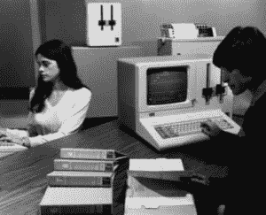
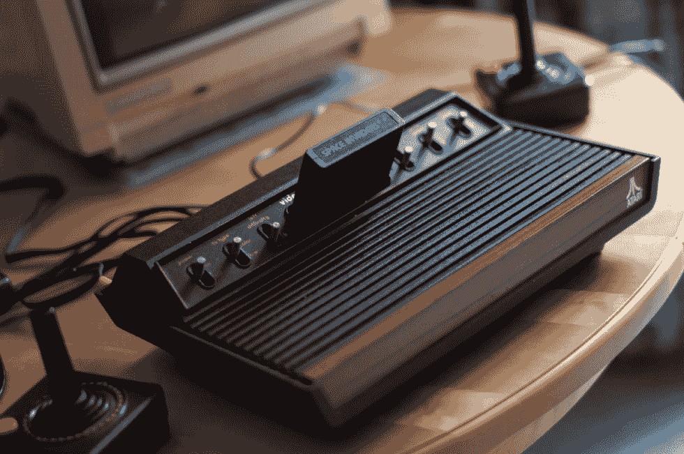
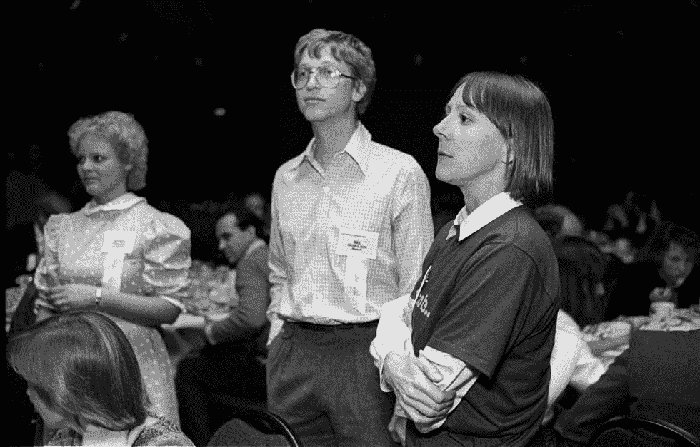

# IBM 个人电脑的完整历史，第一部分:世纪交易

> 原文：<https://arstechnica.com/gadgets/2017/06/ibm-pc-history-part-1/?utm_source=wanqu.co&utm_campaign=Wanqu+Daily&utm_medium=website>

***Nota bene:***

这是 8000 字的 IBM 个人电脑史诗般历史的第一部分。你可以找到

[part two of the story over here](https://arstechnica.co.uk/gadgets/2017/07/ibm-pc-history-part-2/)

。

有人可能会说 IBM PC 根本不是 IBM 的第一台 PC。1975 年 9 月，该公司推出了第一台“便携式”电脑 IBM 5100。(“便携”意味着它只有 55 磅重，你可以买一个特殊的旅行箱把它带在身边。)

从技术上讲，5100 不是微型计算机；它使用了 IBM 内部开发的处理器 PALM，这种处理器分布在整个电路板上，而不是放在一个微芯片里。然而，从最终用户的角度来看，这没什么区别；当然，如果不是微型计算机的话，它似乎也有资格成为个人计算机。这是一个独立的，图灵完整的，可编程的机器，不比一个手提箱大，有一个用于加载和保存程序的磁带机，一个键盘，一个 5 英寸的屏幕，所有这些都内置在 16K 或更多的 RAM 中。

让 5100 感觉与第一波个人电脑不同的是它的价格和它的推广目的。前者起价在 1 万美元左右，可以迅速攀升至 2 万美元区间。至于后者:IBM 将这台机器作为一个重要的工具，供现场工程师和偏远地区的类似人员使用，在那里他们无法使用 IBM 的大型机器，而不是作为娱乐、教育、黑客甚至办公室工作的任何东西。

最后一种系统至少在后来的两次概念迭代中有所改变，即 5110 和 5120，它们被宣传为适合办公室的系统，具有会计、数据库、甚至文字处理应用程序。尽管如此，价格仍然很高，实际上为这种办公室工作配备一台电脑需要将它连接到一个比机器本身更大的独立磁盘阵列，使系统看起来更像一台小型机，而不像一台 PC。

[Enlarge](https://cdn.arstechnica.net/wp-content/uploads/sites/3/2017/06/ibm-system-23-datamaster.jpg) /

来自 IBM 的存档照片显示了 System/23 Datamaster，可能还有一些大学生。

尽管它几乎从未被以这个名字提及，但它的官方名称是(向范·海伦道歉)IBM 5150，这是便携式计算机 5100 系列的延续，而不是一个全新的东西——尽管它没有共享它的老兄弟的架构。

1978 年 2 月，IBM 开始研制它的第一台微型计算机——但它仍然不是 IBM PC。这是一台名为 System/23 Datamaster 的机器。

Datamaster 再次为办公环境而设计，它是围绕 Intel 8085 微处理器构建的。它又大又重(95 磅)，价格仍在 10，000 美元左右，再加上它非常注重商业、保守的个性，继续让它感觉与 Apple II 等机器有质的不同。然而，从技术上讲，它是一台微型计算机。IBM 是一家庞大的公司，有着传说中迷宫般的官僚机构，这意味着项目有时可能需要非常长的时间才能完成。尽管 Datamaster 项目比 PC 项目早了两年，但实际上前者直到 1981 年 7 月才问世，正好赶上了 IBM PC 的发布，抢了它的风头。尽管如此，如果 IBM 的第一台微型计算机的问题出现在一个问答游戏中，这就是你的答案。

[Enlarge](https://cdn.arstechnica.net/wp-content/uploads/sites/3/2017/06/GettyImages-162192476.jpg) /

雅达利 VCS(2600)——信不信由你，它与 IBM 个人电脑的诞生有关。

罗比·谢泼德

## 好了，现在故事真正开始了

这台机器后来被称为

*real*

IBM 个人电脑始于雅达利。显然在雅达利 VCS 的突然出现后感觉很兴奋

*Space Invaders*

的普及和自己的第一台个人电脑的发布

[Atari 400 and 800](https://arstechnica.com/gadgets/2007/07/a-history-of-the-amiga-part-1/)

1980 年 7 月，他们向 IBM 董事长弗兰克·卡里提出一项建议:如果 IBM 希望拥有自己的个人电脑，雅达利将屈尊为他们制造。

Cary 并不像通常描述的那样是一个墨守成规的大型机制定者，他实际上是小系统的拥护者——即使“小系统”在 IBM 的上下文中通常意味着与外界完全不同的东西。卡里把这个建议交给了 IBM 的(数据)输入系统总监比尔·劳，他在佛罗里达州的博卡拉顿工作。洛又将此事提交给 IBM 的管理委员会，后者宣称这是“我们听过的最愚蠢的事情”(事实上，IBM 和雅达利是可以想象的最奇怪的一对。)但与此同时，每个人都知道，洛是奉董事长之命行事的，如果他们真的关心自己的事业，就不会轻易放弃他。因此，他们告诉 Lowe 组建一个团队，就 IBM 如何自己制造个人电脑提出一份详细的提案——并请在一个月内带着它回来。

Lowe 召集了一个 12 到 13 人的团队(消息来源不一)来起草提案。他无视 IBM 的所有传统，故意保持团队的小规模，管理结构的非正式化，希望能够捕捉到最初催生个人电脑的黑客魔力。他的日常项目经理唐·埃斯特里奇(Don Estridge)说，“如果你要和从车库起步的人竞争，你必须从车库起步。”

人们可能会认为，计算机行业的巨人 IBM 会杀入个人电脑市场。甚至当他们为自己用大胆、创造性和灵活性建立了这个新市场而沾沾自喜时，麻木的 IBM 也不希望与之匹敌，许多个人电脑玩家生活在一种对这种发展的无声恐惧中。然而，IBM 实际上决定成为一个好公民，看看已经存在的东西，并与那些建立了个人电脑市场的人交谈，以找出需要什么，理论上的 IBM 个人电脑可能适合哪里。

本着这种精神，软件开发主管杰克·萨姆斯(Jack Sams)建议他们与微软对话。对于一个 IBM 人来说，萨姆斯异乎寻常地了解个人电脑世界；他实际上曾强烈要求 IBM 从微软购买 Datamaster 的 BASIC，但被否决了，转而支持内部努力。“只是花了更长的时间和更多的成本，”他后来说。1980 年 7 月 21 日，萨姆斯打电话给比尔·盖茨，询问他(萨姆斯)是否能在第二天顺道拜访其西雅图办公室，就个人电脑进行一次友好的交谈。“不要太兴奋，也不要认为会有什么大事发生，”他说。

 

[放大](https://cdn.arstechnica.net/wp-content/uploads/sites/3/2017/06/GettyImages-136019350.jpg) /

这是比尔·盖茨在 1984 年，时年 29 岁。现在想象一下，在 1980 年，也就是我们的故事发生的那一年，这张照片的四年前，他看起来有多年轻。

Ann e . Yow-Dyson/Getty Images

盖茨和他的得力助手史蒂夫·鲍尔默(Steve Ballmer)是这家黑客公司中唯一受过商业教育的人，但他们都意识到这确实可能非常大。当萨姆斯带着两个公司类型的人来到这里，主要充当“证人”时，盖茨亲自出来迎接他们。(萨姆斯最初以为盖茨是办公室勤杂工，他的脸、体格和声音仍像 12 岁的孩子。)萨姆斯立即拿出了保密协议，这是 IBM 的标准操作程序。

“IBM 并没有让它变得容易，”盖茨后来回忆道。“你必须签署所有这些有趣的协议，这些协议在某种程度上说，IBM 可以做他们想做的任何事情，无论他们何时想做，无论他们感觉如何，都可以使用你的秘密。所以这需要一点信念。”尽管如此，他还是立即签了字。

萨姆斯想从盖茨那里了解一下个人电脑市场的总体情况，因为盖茨对这个市场非常熟悉。在这方面，盖茨只是他采访过的众多杰出人物之一。然而，他还有一个不可告人的动机:看看盖茨经营的是什么样的商店，试图了解微软是否是他的团队可以利用的资源。他印象非常深刻。

在与盖茨和其他人协商后，洛于 8 月 8 日提交了一份 IBM 应该制造的机器的提案。许多受欢迎的历史，如 PBS 的老纪录片 [*书呆子的胜利*](https://vimeo.com/124201377) ，给人的印象是 IBM 个人电脑只是在疯狂的匆忙中拼凑起来的。实际上，设计时考虑了很多。有两个非常有趣的方面。