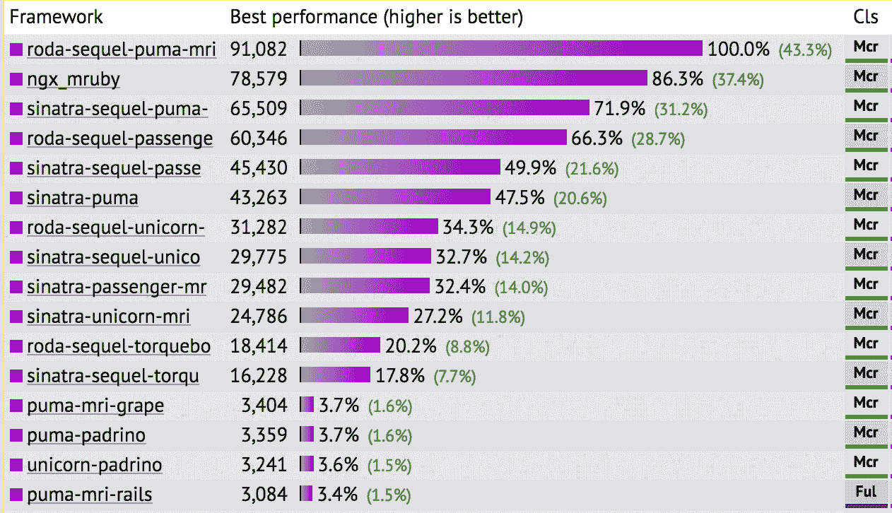
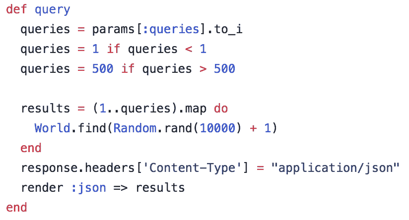
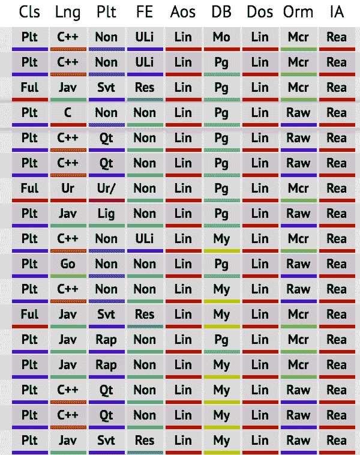

# Ruby 对于网络规模来说太慢了吗？

> 原文：<https://www.speedshop.co/2017/07/11/is-ruby-too-slow-for-web-scale.html?utm_source=wanqu.co&utm_campaign=Wanqu+Daily&utm_medium=website>

# Ruby 对于网络规模来说太慢了吗？

**总结:**为 web 选择一个新的 web 框架或编程语言，不知道该选哪个？你的决定是否应该考虑绩效？ *(3430 字/17 分钟)*

1 (好的，好的，我知道了。[贝特里奇头条定律](https://en.wikipedia.org/wiki/Betteridge%27s_law_of_headlines)。当然，Ruby 和 Rails 对于大型网站来说已经足够快了——Shopify 让它运行起来，而且它们是世界上最大的网站之一。但是有些人似乎真的认为 Rails“不够快”。这就是这篇文章的内容。) 1 好了好了，我知道了。[贝特里奇头条定律](https://en.wikipedia.org/wiki/Betteridge%27s_law_of_headlines)。当然，Ruby 和 Rails 对于大型网站来说已经足够快了——Shopify 让它运行起来，而且它们是世界上最大的网站之一。但是有些人似乎真的认为 Rails“不够快”。这就是这篇文章的内容。如何为一个新的网络应用选择一个框架或编程语言？

你几乎肯定需要一个，除非你正在做一些非常琐碎的事情。所有的 web 应用程序都有许多需要运行的样板文件:安全性、对象关系映射、模板和测试。那么你怎么知道选择哪一个呢？

这就是 Rails 是什么吧？嗯，你肯定不想挑一个*慢*的框架吧？那就不好了——我们想要一个*快*、*现代*、*轻量级*的 web 框架，而不是一些*重*、*老*、*慢*的 web 框架。沉重、陈旧、缓慢……就像路轨上的红宝石，对吗？Ruby on Rails 是过去 10 年里一体化 web 框架领域的王者，它不断受到更快、更敏捷、更轻便的竞争对手的攻击。Rails 是不再能竞争的恐龙吗？

我们可以查看一些基准来找出答案。毫无疑问，一个“快速”和“轻量级”的框架在基准测试中表现良好，而一个旧的、失败的框架表现不佳。

耶！Rails 烂透了！如果你看看像 [TechEmpower](https://www.techempower.com/benchmarks/) 这样的网站发布的性能指标评测，你会觉得 Ruby on Rails 不知何故已经无可救药了。续集作者杰雷米·埃文斯最近指出，在这些比较中，甚至其他 Ruby 框架也可能埋没 Rails。你看着这些基准测试会想:“哇，Sequel 比 ActiveRecord 和 Rails 快十倍！”

从狭义上说，你是对的。基准就像统计数据——很容易对错误的问题给出正确的答案，并让读者得出没有数据支持的结论。如果你看了这些基准测试后想:“如果我用 Sequel 和 Sinatra 重写我的 Rails 应用程序，它会比现在快十倍！”，你就错了。

而且，即使它*比*快，这有关系吗？**有没有速度够快的*网络应用？在为 web 应用程序选择 web 框架甚至编程语言时，性能到底有多重要？***

 *## 延迟和吞吐量

先说一些定义。

服务器就像漏斗:延迟是一个水分子通过漏斗需要多长时间，吞吐量是每秒钟有多少水通过漏斗。高延迟高吞吐量的服务器看起来像一个又长又宽的管子，而低延迟低吞吐量的服务器看起来像一个又短又宽、开口狭窄的圆盘。在服务器应用设计中，*延迟*和*吞吐量*为王。延迟是我们的服务器响应一个请求所花费的时间。*吞吐量*是指我们可以同时处理多少个请求，通常以响应/秒这样的单位来衡量。

web 应用程序的吞吐量通常由 CPU 和并行度决定——响应一个 web 请求需要多少个 CPU 周期，如何有效地使主机的所有 CPU 内核达到饱和？CPU 周期的数量由应用程序的域、框架和语言决定——复杂的应用程序需要更多的时间，像 Ruby 这样的动态语言比 C 或 Rust 这样的编译语言生成更多的 CPU 指令。有效地使用所有可用的 CPU 资源因语言而异——Go 的 goroutines、Elixir 的“进程”、像 Python 和 Ruby 那样绕过全局 VM 锁的多进程服务器、像 Node 那样的事件驱动架构或像 Java 那样的真正线程。

然而，等待时间更加重要。这是因为*延迟与吞吐量*成反比。如果我们将 web 应用程序的延迟减半，那么它的最大吞吐量就会翻倍。延迟也会影响最终用户的体验——500 毫秒的响应时间表现为用户必须花费额外的 500 毫秒来等待网页加载。

## 基准跳闸

TechEmpower 的服务器我们来看看 [TechEmpower web 框架基准测试](https://www.techempower.com/benchmarks/)。TechEmpower 测量六个合成工作台的延迟和最大吞吐量。这些基准测试运行在相当大的服务器上——它们有 4 个 CPU，每个 CPU 有 10 个内核和 20 个线程*(因此，总共有 40 个内核和 80 个超线程)。哦，对了，还有 528 GB 的内存。*

 *
基准测试的 Rails 实现一个更相关的基准测试是多查询基准测试。这非常简单——它对一个 SQL 数据库依次执行 20 个查询，然后返回结果。这是一个非常常见的 web 应用程序工作负载——我工作过的大多数 Rails 应用程序大致都是这样。当我们呈现模板时，我们执行一些 SQL 查询来获得填充模板的结果，并返回它。

在第 14 轮中，典型的 Rails 设置(puma-mri-rails)每秒钟只有大约 531 个请求。[洛达](https://github.com/jeremyevans/roda)，一个*极限*轻量级 Ruby web 框架，当与 Sequel 一起使用时，每秒钟大约有 7000 个请求，这取决于使用的 web 服务器。

那么这是否意味着 Rails 比洛达和 Sequel 慢 10 倍以上呢？在一台 80 核的机器上，每秒 531 个请求真的是 Ruby on Rails 的全部性能吗？

与洛达的设置相比，TechEmpower 的 Rails 设置是令人难以置信的缺陷。他们的 Puma 服务器被配置为只运行 8 个进程，而[洛达自动调优自己](https://github.com/TechEmpower/FrameworkBenchmarks/blob/master/frameworks/Ruby/roda-sequel/config/mri_puma.rb)，最终有大约 100 个进程。因此，Rails 基准测试最多使用了 15-20%的可用超线程，而洛达基准测试使用了所有的超线程。因此，对于 Rails 基准测试*来说，这是至少*5-8 倍的吞吐量损失。但这是可以修复的——tech empower 是开源的,[我们可以打开一个拉请求并修复这个](https://github.com/TechEmpower/FrameworkBenchmarks/pull/2850)，我们将在第 15 轮获得更好的结果。

让我们看一下另一个 TechEmpower 测量——平均请求延迟。关注请求延迟可以让所有的语言和框架在某种程度上更加平等，因为在处理单个请求时，像全局 VM 锁和其他并发特性这样的事情通常并不重要。 2 (并发特性一般会增加吞吐量，而不是减少延迟。) 2 并发特性一般会增加吞吐量，而不是减少延迟。在多查询数据库测试中，Puma 和 Rails 的时间是 129 毫秒。洛达/Sequel/Puma 堆栈的时钟为 31.3 毫秒。

现在，正如我所说的，与洛达设置相比，TechEmpower 上 Rails 的 Puma 设置差得令人难以置信，所以 Rails 可能仍然可以节省很多时间，但让我们接受它。这么说吧，Rails 在微框架或其他竞争平台(如 Phoenix)上给 web 应用程序的平均响应增加了 100 毫秒的延迟。(实际上，Phoenix 在这个测试上比 Rails 慢。[框架创建者对这个结果有争议，尽管](https://www.reddit.com/r/elixir/comments/48ke69/any_reason_why_elixirphoenix_did_so_badly_in/)，我不怀疑 Rails 基准测试也是如此。

## 电脑会变，但人不会变

计算机有趣的一点是，尽管它们变得越来越快，但像浆糊一样的人类却保持同样的速度。自从 20 世纪 60 年代以来，人们就开始研究人机交互的速度有多快*。你可以理解他们对此的兴趣，在那个时代，计算机只有房间那么大，计算需要几个小时而不是几微秒。如果计算机要走出主机和科学实验室，进入公共生活，它必须更快。但是*比*快多少呢？*

[雅各布·尼尔森 1993 年总结结果:](https://www.nngroup.com/articles/response-times-3-important-limits/)

雅各布·尼尔森。我很高兴这张照片的存在。

> 0.1 秒:限制用户感觉他们在 UI 中直接操作对象。(…)
> 
> 1 秒:限制用户感觉他们可以自由地浏览命令空间，而不必过度等待计算机。(…)
> 
> 10 秒:用户保持注意力在任务上的限制。(…)

你可以在这里阅读他的整篇文章。

### 在网络上，多快才算够快？

让我们假设我们的小 web 应用程序所做的只是返回一个没有 T2 的 HTML 响应。它只是一个带有默认浏览器样式的平面 HTML 文档。 3 (想象一下，如果有一个网站的风格比这个更无聊。) 3 想象一下，如果你会有一个网站的造型比这个更无聊。用户访问`www.oursite.com`并收到回复需要多长时间？

嗯，如果我们的用户和我们的服务器在同一个国家的台式电脑上，他们的数据包从他们的电脑传到我们的服务器需要 20 毫秒，再传回来需要 20 毫秒。这是一个*最好的情况场景*:如果他们在世界的另一边，这可能很容易是单程 100 毫秒。如果他们使用移动电话连接，我们说的是大约 300-400 毫秒。我家的 DSL 连接到大多数美国服务器的时间从 50-150 毫秒不等。

150 毫秒首字节时间？那是布兰特·兰博批准的。因此，如果我们首先已经获得了大约 40 毫秒的往返网络延迟，那么我们的用户能够察觉到在 1 毫秒或 100 毫秒内呈现响应的 web 应用程序中的差异吗？也就是说，一个应用程序总共需要 41 毫秒，另一个需要 141 毫秒。答案**是断然不会**。这两个应用程序对用户来说几乎是即时出现的。在网络条件最差的情况下，这种差异将完全消失。因此，微小的延迟差异(100 毫秒或更短，就像 web 框架之间的差异一样)只对提高吞吐量有影响。

### 您的服务器只是用户体验的一小部分

欢迎来到现代网络，婊子。现在是 2017 年，web 应用程序不再返回平面 HTML 文件。网站非常庞大，JavaScript 包延伸到兆字节大小，样式表放不下 10 台阿波罗导航计算机。那么，在这种环境下，响应时间不超过 1 毫秒的 web 应用程序能带来多大的不同呢？

几乎没有。现在一般网页渲染需要 5 秒。一些 JavaScript 单页应用程序在初始渲染时可能需要 12 秒或更长时间。

服务器响应时间只占用户加载网页并与之交互的实际体验的很小一部分——减少 99 毫秒的服务器响应时间并没有什么不同。

### 有一个天花板:网络应用不是视频游戏

在视频游戏世界里，速度很重要。更快的语言意味着每帧屏幕上更多的多边形。这真的没有上限-更多的多边形总是好的，所以更快的语言总是有助于增加模拟的保真度。 

Web 应用不是这样的。从根本上说，90%都是简单的 CRUD 应用。一种更快的语言不会为功能或特性带来更多的可能性，它只是采用了我们一直在渲染的相同的 HTML webform，并将其渲染速度加快了几毫秒。减少请求延迟的有用性有一个上限。

### Ruby 很慢，所以更多的 Ruby 更慢

[麦克佩汉](https://twitter.com/mperham/status/884126933255995392)。最终，Ruby 的大部分内部都归结为哈希表，所以… Ruby 不是一种快速的语言。因此，如果您执行得少一些，您将获得更快的基准测试结果。

像 Rails 这样的功能丰富的框架有大量的代码，并且对每个请求执行更多的代码，因为它们正在做更多的事情(T2)。

这看起来像是 101 级的东西，但同样，TechEmpower 和其他基准测试通常不会使特性的差异变得明显。在 TechEmpower 上，你得到的只是这个无法浏览的标签数组。

是的，这是一个易于理解的人类可以读懂的特征对比。在像 TechEmpower 这样的吞吐量微基准上，差异是以毫秒(甚至微秒)来度量的，你真正度量的是一个特定的语言运行时为响应一个特定的请求而生成多少 *CPU 指令*。由于在 TechEmpower 上没有真正的方法来比较框架之间的特性集，所有的框架都被放在一个“平等的基础”上，你会认为 Rails 是世界上最慢的 web 框架。

事实是 Rails 对每个请求做了很多 T2。只需创建一个新的 Rails 应用程序，并查看中间件堆栈(`rake middleware`)。这里有很多工作要做，每一个优秀的 web 应用程序都应该做这些工作(T4 ),但是许多框架(T5)不会为你做这些工作(T6 ),至少在默认情况下是这样。

### 性能比 CPU 或最大吞吐量更复杂

虽然在 TechEmpower 上 CPU 使用率是瓶颈，但在现实世界中，语言或框架的 CPU 性能几乎从来不是 web 应用程序性能的瓶颈。Web 应用程序的 I/O 负载相当大，尤其是当它们变得越来越复杂时。现代的 Rails 应用程序可能与三个或更多独立的数据库交互——它们的 SQL 数据库、后端作业处理器的 Redis 和缓存的 Memcache。通常，花费在与这些数据库交互上的时间会占响应时间的 25%或更多。

此外，作为一名 Ruby on Rails 性能顾问，我见过太多与框架或语言的 CPU 性能无关的应用程序部署问题:糟糕的服务器配置、内存泄漏或膨胀，或者缓存使用不当。不可思议的是，程序员似乎找到了一种完全降低他们应用程序性能的方法。

最后，大多数成熟的 web 应用程序在框架本身上花费了*最多*50%的执行时间，而在实际的应用程序代码和其他增加的依赖项上花费了更多的时间。这在 Ruby 中很容易看到——看一看 stacktrace，数一数有多少顶帧来自你的框架。不会很多。如果你的应用程序可以用同一种语言在一个更快的框架中重新编写，你最多可以将它的响应时间减半*。*

 *## 重写您的整个应用程序，每月节省 1，000 美元

我担心的是人们会如何处理 TechEmpower 等相对基准中提供的信息。他们回家后会在本周流行的框架或堆栈中重写他们的应用程序吗？或者，在为新的产品或服务选择堆栈时，人们会选择“更快”的堆栈而不是“更慢”的堆栈吗？

见鬼，Pinterest 在 Elixir 中重写了它的 Ads API，现在他们的响应时间不到一毫秒。当然，那只是*更好的*，对吗？

问题是，*为什么是*？正如我们已经确定的那样，最终用户体验没有区别。所以实际上只有两个理由选择一个框架:a)它更快，因此我将花费更少的服务器成本来托管它 b)它易于开发，并帮助我更快地发布高质量的特性。

让我们看一下服务器成本。

大多数 web 应用程序每秒处理的请求远低于 1000 个。我甚至可以说，大多数 web 应用程序开发人员受雇于一家整个 webapp 每秒处理的请求远低于 1000 个的公司。他们中的大多数人每分钟不到 1000 次请求。

假设您有一个 Rails 应用程序，它以 20，000 RPM(请求/分钟，或大约 300 req/秒)的速度运行，平均响应时间为 250 毫秒。对于一个大型成熟的 Rails 应用程序来说，这是一个非常普通的情况。这样一个应用程序需要大约 200 个 Puma 进程才能正常运行。这相当于 Heroku 上大约 12 个性能 L dynos，或 6000 美元/月。

现在，让我们说你重写它在凤凰城，节点，或任何你想要的一周的味道，并减少到 125 毫秒。在您从座位上跳起来之前，请记住，您不会将延迟降低到 12 毫秒或其他一些愚蠢的低量:您仍然会受到支持该应用程序的数据库的 I/O 的限制。

将应用程序的延迟减半意味着我们需要的服务器数量只有以前的一半。所以，恭喜你:你重写了你的应用程序(或者选择了你的框架)以节省 3000 美元/月。支持该应用程序的关系数据库上的负载不会改变，因此这些成本将保持不变。当您的应用程序大到足以达到 20，000 RPM 时，您将拥有六到五十名工程师，这取决于您应用程序的领域。一个软件工程师每月要花费公司至少 10，000 美元的员工福利和工资。所以我们选择我们的框架是基于每月节省三分之一的工程师？如果这个框架导致你的开发周期慢了甚至三分之一的神话人月，你已经*增加了*你的成本，而不是减少了。基于服务器成本选择 web 框架显然是一个傻瓜的游戏。

为什么大公司的货物崇拜工程实践每月几毫秒就能节省数万美元？你不是 Pinterest(或网飞，或……)，你有不同的问题，这没关系。

### 情况没有变得更糟

电脑并没有变慢。而[沃思定律](https://en.wikipedia.org/wiki/Wirth%27s_law) 4 (软件变得更慢比硬件变得更快。) 4 软件变得比硬件变得更快更慢。对于大多数终端用户应用程序来说，比如你的手机应用程序，这当然适用，但对于典型的网络应用程序来说，这并不适用。Ruby web 应用程序(以及任何 web 应用程序)将继续变得更快，因为硬件的缓慢发展将继续找到在一个时钟周期内插入更多 CPU 指令的方法，或者使这些时钟周期变得更快，或者将更多内核塞进一个芯片。

语言也没有变慢。Appfolio 的 Noah Gibbs 已经表明，Ruby 的每个次要版本都会减少大约 5-10%的平均响应时间。

## 让我们来谈谈幸福

业绩悲观论者一直是错的，并将继续错下去。[以 2007 年的这位先生为例](http://archive.oreilly.com/pub/post/multicore_hardware_and_the_fut.html):

> 无论什么实现成为下一个事实上的 Ruby 平台，有一点是明确的:人们对利用他们更新、更强大的多核系统感兴趣(正如最近 RailsConf 和 RubyConfs 中对 Erlang 的兴趣激增所显示的)。随着 Ruby 日益成为处理大量数据处理的解决方案的一部分，这种需求只会增加。

10 年后，通过 Puma 和 Unicorn 这样的网络服务器跨多核扩展仍然足够好。露比还没死。我对[提议的公会模式](http://olivierlacan.com/posts/concurrency-in-ruby-3-with-guilds/)所提供的可能性感到兴奋，但是在那之前语言是不可用的吗？没有。

我希望围绕 web 框架和编程语言的对话有所改变。有太多关于性能和并发性的谈论，而实际上利润空间很小，成本极低并且越来越低。语言不会仅仅因为它们的并发性或性能特性而消亡。

更好的对话，更有意义和影响的对话，是哪个框架**帮助我更快、更高质量、更快乐地编写软件**。我知道这个问题的答案对我来说是什么，也许对你来说答案是不同的。

### “多国语言者”和“新的热门词汇”

有一部分工程师永远不会乐于编写不在“新热点”之列的软件。工程师总是在寻找一个新的问题来解决，一些新的东西来学习——这很好！我从来没有联系过。纽约市 Ruby 会议 GORUCO 今年开始自称为“多语种会议”，演讲者日程安排主要是关于 Python、Elixir、Rust、React 和静态类型的演讲。会议组织者 Mike Dalessio 在博客上宣布了这一消息,读起来就像一块墓碑。

在这种“X 死了吗”的讨论中，基准测试经常被讨论。正如我希望我在上面展示的那样，真的没有基准可以证明任何语言或框架不适合编写 web 应用程序。性能不是问题。

相反，关于 web 应用程序的性能讨论大多是 FUD，由那些试图证明他们刚刚花在重写整个堆栈上的工程时间或者他们告诉管理层的事情是合理的，以便他们可以玩他们在黑客新闻上看到的最酷的新玩具。

程序员永远害怕职业过时。有些人害怕智力停滞——害怕他们会变成在后台办公室写 RPG 来维持一家卡车零件公司订单系统运行的脾气暴躁的老人。但是他们几乎都害怕失业。他们担心世界会从他们的特定堆栈中移走，使他们的薪水和工作处于危险之中。这些担心是真实的——但是让我们意识到，围绕“栈 X 死了吗？!"是出于对 web 应用的*恐惧*，而不是对 web 应用的*需求*的担忧。

## 乐趣和游戏

让我们明确一点——性能仍然很重要。大多数组织可以而且应该通过专注于加速其端点来节省服务器成本，特别慢的端点可能会影响客户体验[或底线](https://wpostats.com/tags/revenue/)，因此应该加速。我上面谈到的是*框架选择*对你的 web 应用程序的性能有多重要。

此外，我不是在嘲笑 TechEmpower。这是一个巨大的项目，他们依赖领域专家创建 PRs 来修复结果中的任何问题。在我看来，他们是真正的好人，不会试图推动议程或参与有利于任何特定堆栈的基准营销。

总之，JavaScript、Go、Elixir 和 Python 都很烂，写 Ruby:)不，当然不是——写你擅长的。如果你是一名 web 程序员，你可以根据人机工程学而不是性能来选择你的工具。

##### 分享:

***